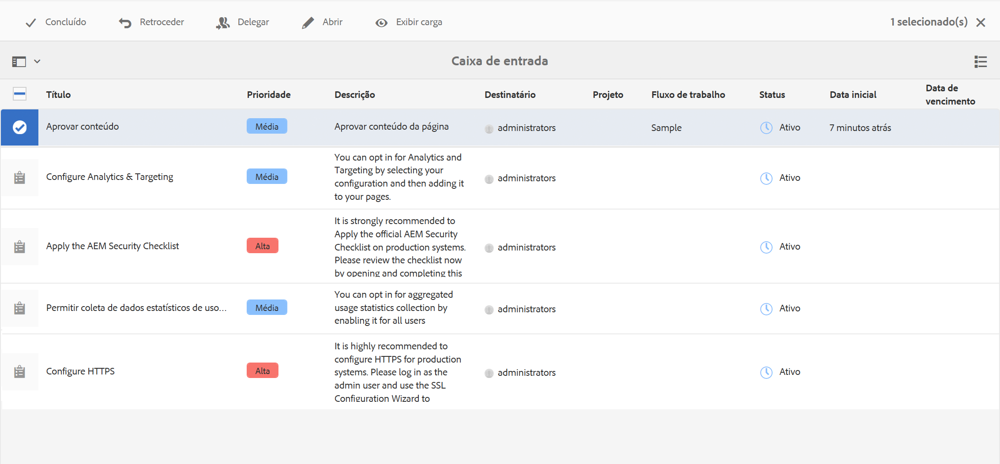
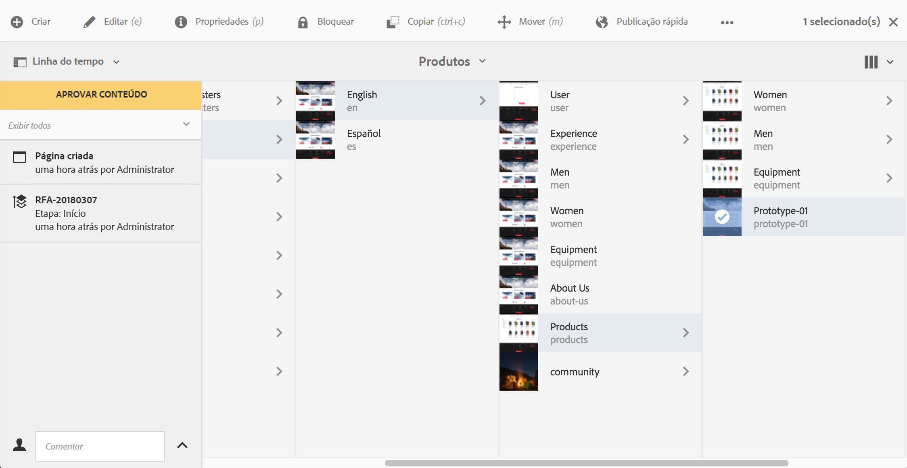
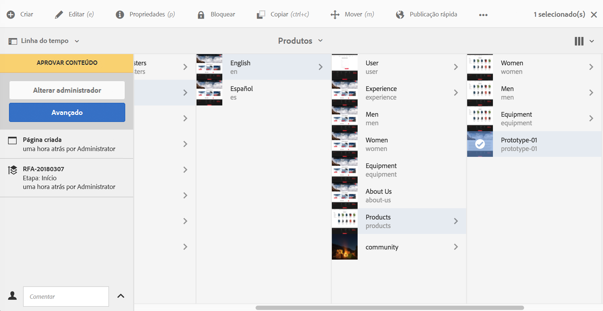
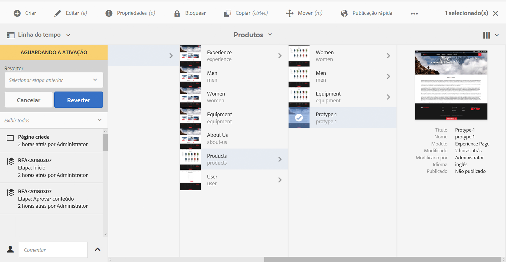
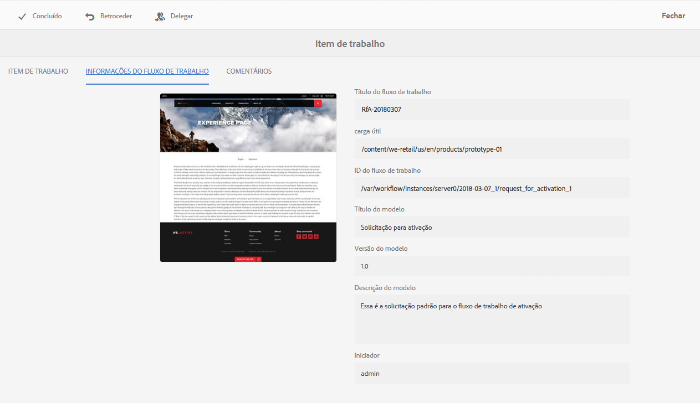

# Participar de fluxos de trabalho{#participating-in-workflows}

>[!CAUTION]
>
>AEM 6.4 chegou ao fim do suporte estendido e esta documentação não é mais atualizada. Para obter mais detalhes, consulte nossa [períodos de assistência técnica](https://helpx.adobe.com/br/support/programs/eol-matrix.html). Encontre as versões compatíveis [here](https://experienceleague.adobe.com/docs/).

Os fluxos de trabalho normalmente incluem etapas que exigem que uma pessoa execute uma atividade em uma página ou ativo. O fluxo de trabalho seleciona um usuário ou grupo para executar a atividade e atribui um item de trabalho a essa pessoa ou grupo. O usuário recebe uma notificação e pode executar a ação apropriada:

* [Visualizar notificações](#notifications-of-available-workflow-actions)
* [Concluir uma etapa do participante](#completing-a-participant-step)
* [Delegar uma etapa do participante](#delegating-a-participant-step)
* [Realizar um retrocesso em uma etapa do participante](#performing-step-back-on-a-participant-step)
* [Abrir um item de fluxo de trabalho para exibir detalhes (e realizar ações)](#opening-a-workflow-item-to-view-details-and-take-actions)
* [Visualizar a carga do fluxo de trabalho (vários recursos)](#viewing-the-workflow-payload-multiple-resources)

## Notificações de ações disponíveis do fluxo de trabalho {#notifications-of-available-workflow-actions}

Quando um item de trabalho é atribuído a você (por exemplo, **Aprovar conteúdo**), vários alertas e/ou notificações são exibidos:

* Seu [notificação](/help/sites-authoring/inbox.md) indicador (barra de ferramentas) será incrementado:

   

* O item será listado na sua [Caixa de entrada](/help/sites-authoring/inbox.md) de notificações:

   

* Quando você estiver usando o editor de páginas, a barra de status mostrará:

   * O nome dos fluxos de trabalho que estão sendo aplicados à página; por exemplo, Solicitação de ativação.
   * Quaisquer ações disponíveis para o usuário atual para a etapa atual do fluxo de trabalho; por exemplo, Concluir, Delegar, Exibir detalhes.
   * O número de fluxos de trabalho aos quais a página está sujeita. É possível:

      * use as setas para a esquerda/direita para navegar pelas informações de status dos vários fluxos de trabalho.
      * clique/toque no número real para abrir uma lista suspensa de todos os fluxos de trabalho aplicáveis e selecione o fluxo de trabalho que deseja exibir na barra de status.

   

   >[!NOTE]
   >
   >A barra de status é visível apenas para usuários com privilégios de fluxo de trabalho, por exemplo, os membros do grupo `workflow-users`.
   >
   >
   >As ações são mostradas quando o usuário atual está diretamente envolvido na etapa atual do fluxo de trabalho.

* When **Linha do tempo** estiver aberta para o recurso, a etapa do fluxo de trabalho será exibida. Ao clicar/tocar no banner de alerta, as ações disponíveis também serão exibidas:

   

### Conclusão de uma etapa do participante {#completing-a-participant-step}

Você pode concluir um item para permitir que o fluxo de trabalho avance para a próxima etapa.

Nesta ação, você pode indicar:

* **Próxima etapa**: O passo seguinte a dar; você pode selecionar em uma lista fornecida
* **Comentário**: se necessário

Você pode concluir uma etapa do participante em:

* [a Caixa de entrada](#completing-a-participant-step-inbox)
* [o Editor de páginas](#completing-a-participant-step-page-editor)
* [Linha do tempo](#completing-a-participant-step-timeline)
* when [abrir um item de fluxo de trabalho para exibir detalhes](#opening-a-workflow-item-to-view-details-and-take-actions).

#### Conclusão de uma etapa do participante - Caixa de entrada {#completing-a-participant-step-inbox}

Use o procedimento a seguir para concluir o item de trabalho:

1. Abra a **[Caixa de entrada do AEM](/help/sites-authoring/inbox.md)**.
1. Selecione o item do fluxo de trabalho no qual deseja executar uma ação (toque/clique na miniatura).
1. Selecione **Concluído** na barra de ferramentas.
1. A caixa de diálogo **Item de trabalho concluído** será aberta. Selecione a **Próxima etapa** no seletor suspenso e adicione um **Comentário**, se necessário.
1. Use **OK** para concluir a etapa (ou o botão **Cancelar** para cancelar a ação).

#### Conclusão de uma etapa do participante - Editor de páginas {#completing-a-participant-step-page-editor}

Use o procedimento a seguir para concluir o item de trabalho:

1. Abra o [página para edição](/help/sites-authoring/managing-pages.md#opening-a-page-for-editing).
1. Selecione **Concluído** na barra de status na parte superior.
1. A caixa de diálogo **Item de trabalho concluído** será aberta. Selecione a **Próxima etapa** no seletor suspenso e adicione um **Comentário**, se necessário.
1. Use **OK** para concluir a etapa (ou o botão **Cancelar** para cancelar a ação).

#### Conclusão de uma etapa do participante - Linha do tempo {#completing-a-participant-step-timeline}

Você também pode usar a linha do tempo para concluir e avançar uma etapa:

1. Selecione a página desejada e abra a **Linha do tempo** (ou abra a **Linha do tempo** e selecione a página):

   

1. Clique/toque no banner de alerta para mostrar as ações disponíveis. Selecionar **Avanço**:

   

1. Dependendo do fluxo de trabalho, você pode selecionar a próxima etapa:

   

1. Selecionar **Avanço** para confirmar a ação.

### Delegação de uma etapa do participante {#delegating-a-participant-step}

Se uma etapa tiver sido atribuída a você, mas por qualquer motivo você não puder realizar uma ação, poderá delegar a etapa a outro usuário ou grupo.

Os usuários que estão disponíveis para delegação dependem de quem recebeu o item de trabalho:

* Se o item de trabalho foi atribuído a um grupo, os membros do grupo estão disponíveis.
* Se o item de trabalho tiver sido atribuído a um grupo e depois delegado a um usuário, os membros desse grupo e esse usuário estarão disponíveis.
* Se o item de trabalho foi atribuído a um único usuário, ele não pode ser delegado.

Nesta ação, você pode indicar:

* **Usuário**: o usuário ao qual você deseja delegar; você pode selecionar em uma lista fornecida
* **Comentário**: se necessário

Você pode delegar uma etapa do participante em:

* [a Caixa de entrada](#delegating-a-participant-step-inbox)
* [o Editor de páginas](#delegating-a-participant-step-page-editor)
* [Linha do tempo](#delegating-a-participant-step-timeline)
* when [abrir um item de fluxo de trabalho para exibir detalhes](#opening-a-workflow-item-to-view-details-and-take-actions).

#### Delegação de uma etapa do participante - Caixa de entrada {#delegating-a-participant-step-inbox}

Use o procedimento a seguir para delegar um item de trabalho:

1. Abra a **[Caixa de entrada do AEM](/help/sites-authoring/inbox.md)**.
1. Selecione o item do fluxo de trabalho no qual deseja executar uma ação (toque/clique na miniatura).
1. Selecione **Delegar** na barra de ferramentas.
1. Uma caixa de diálogo será aberta. Especifique o **Usuário** no seletor suspenso (também pode ser um grupo) e adicione um **Comentário**, se necessário.
1. Use **OK** para concluir a etapa (ou o botão **Cancelar** para cancelar a ação).

#### Delegação de uma etapa do participante - Editor de páginas {#delegating-a-participant-step-page-editor}

Use o procedimento a seguir para delegar um item de trabalho:

1. Abra o [página para edição](/help/sites-authoring/managing-pages.md#opening-a-page-for-editing).
1. Selecione **Delegar** na barra de status na parte superior.
1. Uma caixa de diálogo será aberta. Especifique o **Usuário** no seletor suspenso (também pode ser um grupo) e adicione um **Comentário**, se necessário.
1. Use **OK** para concluir a etapa (ou o botão **Cancelar** para cancelar a ação).

#### Delegação de uma etapa do participante - Linha do tempo {#delegating-a-participant-step-timeline}

Você também pode usar a linha do tempo para delegar e/ou atribuir uma etapa:

1. Selecione a página desejada e abra a **Linha do tempo** (ou abra a **Linha do tempo** e selecione a página).
1. Clique/toque no banner de alerta para mostrar as ações disponíveis. Selecionar **Alterar Destinatário**:

   

1. Especifique um novo destinatário:

   

1. Selecione **Atribuir** para confirmar a ação.

### Retroceder em uma etapa do participante {#performing-step-back-on-a-participant-step}

Se você descobrir que uma etapa, ou uma série de etapas, precisa ser repetida, é possível retroceder. Isso permite selecionar uma etapa, que ocorreu anteriormente no fluxo de trabalho, para reprocessamento. O workflow retorna à etapa especificada e prossegue a partir daí.

Nesta ação, você pode indicar:

* **Etapa anterior**: O degrau a devolver; você pode selecionar em uma lista fornecida
* **Comentário**: se necessário

Você pode executar um retrocesso em uma etapa do participante a partir de:

* [a Caixa de entrada](#performing-step-back-on-a-participant-step-inbox)
* [o Editor de páginas](#performing-step-back-on-a-participant-step-page-editor)
* [Linha do tempo](#performing-step-back-on-a-participant-step-timeline)
* when [abrir um item de fluxo de trabalho para exibir detalhes](#opening-a-workflow-item-to-view-details-and-take-actions).

#### Retroceder em uma etapa do participante - Caixa de entrada {#performing-step-back-on-a-participant-step-inbox}

Use o procedimento a seguir para retroceder:

1. Abra a **[Caixa de entrada do AEM](/help/sites-authoring/inbox.md)**.
1. Selecione o item do fluxo de trabalho no qual deseja executar uma ação (toque/clique na miniatura).
1. Selecione **Retroceder** para abrir a caixa de diálogo.

1. Especifique a **Etapa anterior** e adicione um **Comentário**, se necessário.
1. Use **OK** para concluir a etapa (ou o botão **Cancelar** para cancelar a ação).

#### Retroceder em uma etapa do participante - Editor de páginas {#performing-step-back-on-a-participant-step-page-editor}

Use o procedimento a seguir para retroceder:

1. Abra o [página para edição](/help/sites-authoring/managing-pages.md#opening-a-page-for-editing).
1. Selecione **Retroceder** na barra de status na parte superior.
1. Especifique a **Etapa anterior** e adicione um **Comentário**, se necessário.
1. Use **OK** para concluir a etapa (ou o botão **Cancelar** para cancelar a ação).

#### Retroceder em uma etapa do participante - Linha do tempo {#performing-step-back-on-a-participant-step-timeline}

Também é possível usar a linha do tempo para reverter (etapa) para uma etapa anterior:

1. Selecione a página desejada e abra a **Linha do tempo** (ou abra a **Linha do tempo** e selecione a página).
1. Clique/toque no banner de alerta para mostrar as ações disponíveis. Selecionar **Reverter**:

   

1. Especifique a etapa para a qual o fluxo de trabalho deve retornar:

   

1. Selecione **Reverter** para confirmar a ação.

### Abrir um item de fluxo de trabalho para exibir detalhes (e realizar ações) {#opening-a-workflow-item-to-view-details-and-take-actions}

Visualize detalhes do item de trabalho do fluxo de trabalho e execute as ações apropriadas.

Os detalhes do workflow são mostrados nas guias e as ações apropriadas estão disponíveis na barra de ferramentas:

* Guia **ITEM DE TRABALHO:**

   

* **INFORMAÇÕES DO FLUXO DE TRABALHO**

   

   If [Estágios do Fluxo de Trabalho](/help/sites-developing/workflows.md#workflow-stages) tiverem sido configurados para o modelo, você poderá visualizar o progresso de acordo com estes:

   

* **COMENTÁRIOS**

   

Você pode abrir os detalhes do item de trabalho nos seguintes locais:

* [a Caixa de entrada](#performing-step-back-on-a-participant-step-inbox)
* [o Editor de páginas](#performing-step-back-on-a-participant-step-page-editor)

#### Abrir detalhes do fluxo de trabalho - Caixa de entrada {#opening-workflow-details-inbox}

Para abrir um item de fluxo de trabalho e exibir os detalhes:

1. Abra a **[Caixa de entrada do AEM](/help/sites-authoring/inbox.md)**.
1. Selecione o item do fluxo de trabalho no qual deseja executar uma ação (toque/clique na miniatura).
1. Selecione **Abrir** para abrir as guias de informações.

1. Se necessário, selecione a ação apropriada, forneça os detalhes e confirme com **OK** (ou **Cancelar**).
1. Use **Salvar** ou **Cancelar** para sair.

#### Abrir detalhes do fluxo de trabalho - Editor de páginas {#opening-workflow-details-page-editor}

Para abrir um item de fluxo de trabalho e exibir os detalhes:

1. Abra o [página para edição](/help/sites-authoring/managing-pages.md#opening-a-page-for-editing).
1. Selecione **Exibir detalhes** na barra de status para abrir as guias de informações.

1. Se necessário, selecione a ação apropriada, forneça os detalhes e confirme com **OK** (ou **Cancelar**).
1. Use **Salvar** ou **Cancelar** para sair.

### Como visualizar a carga do fluxo de trabalho (vários recursos) {#viewing-the-workflow-payload-multiple-resources}

Você pode visualizar detalhes da carga associada à instância do workflow. Inicialmente, os recursos no pacote são mostrados, em seguida, é possível detalhar para mostrar as páginas individuais.

Para exibir a carga e os recursos da instância do workflow:

1. Abra a **[Caixa de entrada do AEM](/help/sites-authoring/inbox.md)**.
1. Selecione o item do fluxo de trabalho no qual deseja executar uma ação (toque/clique na miniatura).
1. Selecione **Exibir carga** na barra de ferramentas para abrir a caixa de diálogo.

   Como um pacote de fluxo de trabalho é simplesmente uma coleção de ponteiros para caminhos no repositório, você pode adicionar/remover/modificar as entradas aqui para ajustar o que é referenciado pelo pacote de fluxo de trabalho. Use o **Definição de Recurso** para adicionar novas entradas.

   

1. Os links podem ser usados para abrir as páginas individuais.
