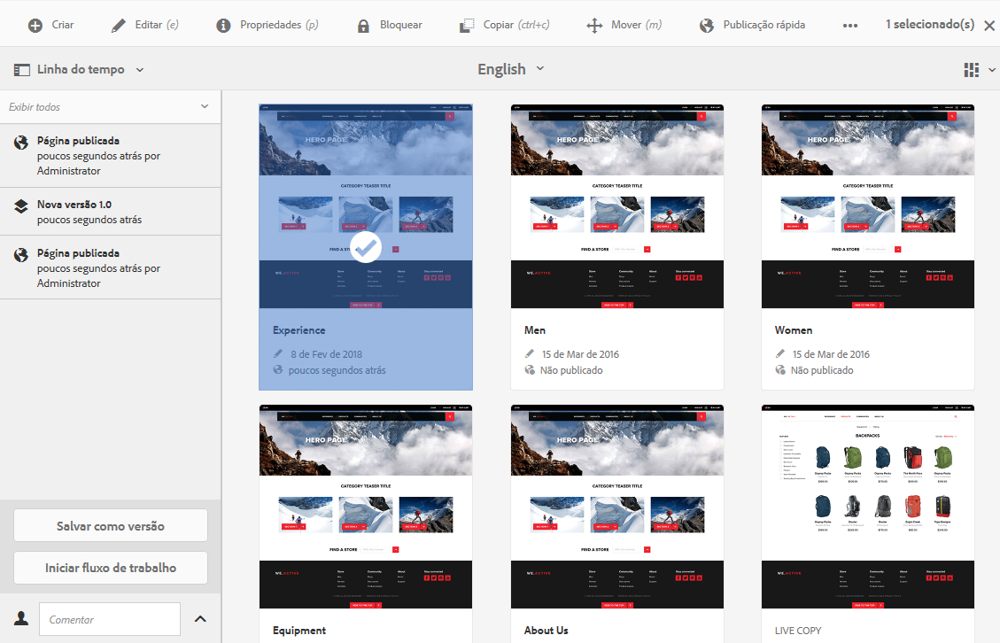
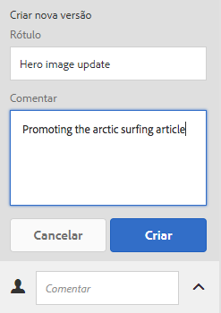
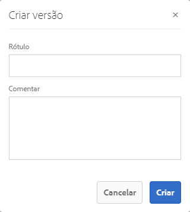
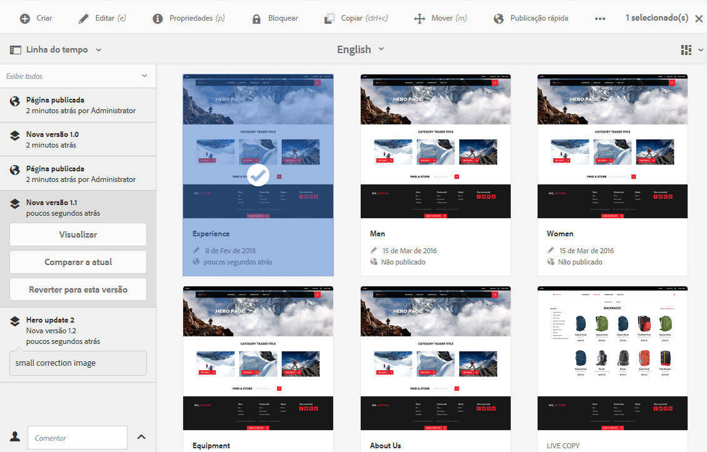
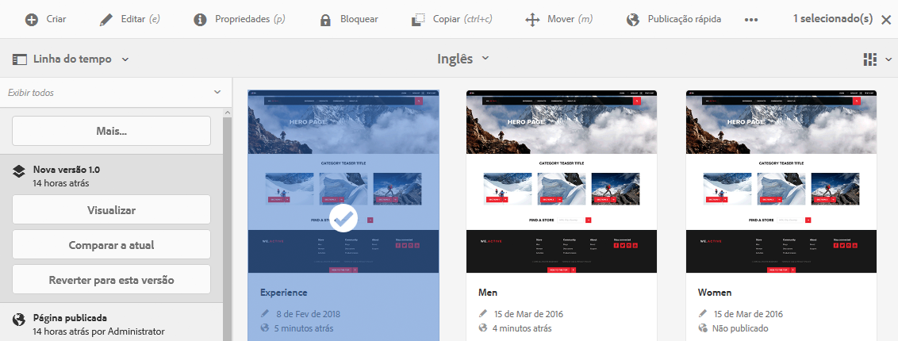
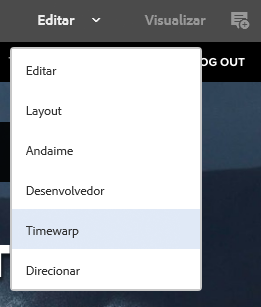
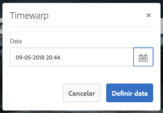
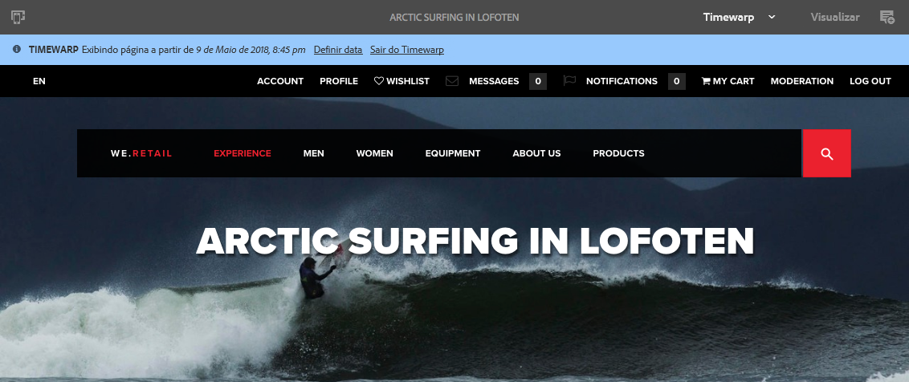

# Trabalhar com versões de páginas{#working-with-page-versions}

>[!CAUTION]
>
>AEM 6.4 chegou ao fim do suporte estendido e esta documentação não é mais atualizada. Para obter mais detalhes, consulte nossa [períodos de assistência técnica](https://helpx.adobe.com/br/support/programs/eol-matrix.html). Encontre as versões compatíveis [here](https://experienceleague.adobe.com/docs/).

O controle de versão cria um &quot;instantâneo&quot; de uma página em um ponto específico do tempo. Com o controle de versão, você pode executar as seguintes ações:

* Crie uma versão de uma página.
* Restaure uma página para uma versão anterior para desfazer uma alteração feita em uma página, por exemplo.
* Compare a versão atual de uma página com uma versão anterior, com diferenças no texto e nas imagens realçadas.

## Criar uma nova versão   {#creating-a-new-version}

É possível criar uma versão do recurso usando:

* o [Painel Linha do tempo](#creating-a-new-version-timeline)
* o [Criar](#creating-a-new-version-create-with-a-selected-resource) opção (quando um recurso é selecionado)

### Criar uma nova versão - Linha do tempo {#creating-a-new-version-timeline}

1. Navegue para mostrar a página para a qual você deseja criar uma versão.
1. Selecione a página no [modo de seleção](/help/sites-authoring/basic-handling.md#viewing-and-selecting-resources).
1. Abra o **Linha do tempo** coluna.
1. Clique/toque na seta ao lado do campo de comentário para revelar as opções:

   

1. Selecionar **Salvar como versão**.
1. Insira um **Rótulo** e **Comentário** se necessário.

   

1. Confirme a nova versão com a opção **Criar**.

   As informações na linha do tempo serão atualizadas para indicar a nova versão.

### Criar uma nova versão - Criar com um recurso selecionado {#creating-a-new-version-create-with-a-selected-resource}

1. Navegue para mostrar a página para a qual você deseja criar uma versão.
1. Selecione a página no [modo de seleção](/help/sites-authoring/basic-handling.md#viewing-and-selecting-resources).
1. Selecione o **Criar** na barra de ferramentas.
1. Uma caixa de diálogo será aberta. É possível inserir um **Rótulo** e um **Comentário**, se necessário:

   

1. Confirme a nova versão com a opção **Criar**.

   A linha do tempo será aberta com as informações atualizadas para indicar a nova versão.

## Reverter para uma versão da página {#reverting-to-a-page-version}

Após a criação de uma versão, você poderá reverter para a versão se necessário.

>[!NOTE]
>
>Ao restaurar uma página, a versão criada é parte da nova ramificação.
>
>Para ilustrar:
>
>* Crie versões de qualquer página.
>* Os nomes dos rótulos iniciais e do nó da versão serão 1.0, 1.1, 1.2 e assim por diante.
>* Restaurar a primeira versão; ou seja, 1.0.
>* Crie novas versões novamente.
>* Os rótulos e os nomes de nó gerados agora serão 1.0.0, 1.0.1, 1.0.2, etc.
>

Para reverter para uma versão anterior:

1. Navegue para mostrar a página para a qual você deseja reverter para uma versão anterior.
1. Selecione a página no [modo de seleção](/help/sites-authoring/basic-handling.md#viewing-and-selecting-resources).
1. Abra a coluna **Linha do tempo** e selecione **Mostrar tudo** ou **Versões**. As versões de página da página selecionada serão listadas.
1. Selecione a versão para a qual deseja reverter. As opções possíveis serão mostradas:

   

1. Selecionar **Reverter para esta versão**. A versão selecionada será restaurada e as informações na linha do tempo serão atualizadas.

## Visualização de uma versão   {#previewing-a-version}

Você pode visualizar uma versão específica:

1. Navegue para mostrar a página que deseja comparar.
1. Selecione a página no [modo de seleção](/help/sites-authoring/basic-handling.md#viewing-and-selecting-resources).
1. Abra a coluna **Linha do tempo** e selecione **Mostrar tudo** ou **Versões**.
1. As versões de página serão listadas. Selecione a versão que deseja visualizar:

   

1. Selecionar **Visualizar**. A página será exibida em uma nova guia.

   >[!CAUTION]
   >
   >Se uma página tiver sido movida, você não poderá mais executar uma visualização em nenhuma versão anterior à movimentação.
   >
   >Em caso de problemas com uma visualização, marque a opção [Linha do tempo](/help/sites-authoring/basic-handling.md#timeline) para que a página veja se a página foi movida.

## Comparar uma versão com a página atual {#comparing-a-version-with-current-page}

Para comparar uma versão anterior com a página atual:

1. Navegue para mostrar a página que deseja comparar.
1. Selecione a página no [modo de seleção](/help/sites-authoring/basic-handling.md#viewing-and-selecting-resources).
1. Abra a coluna **Linha do tempo** e selecione **Mostrar tudo** ou **Versões**.
1. As versões de página serão listadas. Selecione a versão que deseja comparar:

   

1. Selecionar **Comparar com Atual**. O [diff de página](/help/sites-authoring/page-diff.md) abrirá e exibirá as diferenças.

## Timewarp   {#timewarp}

O Timewarp é um recursos criado para simular o estado *publicado* de uma página em ocasiões específicas no passado.

O objetivo é permitir o rastreamento do site publicado no ponto selecionado no tempo. Isso usa as versões de página para determinar o estado do ambiente de publicação.

Para fazer isso:

* O sistema procura a versão da página que estava ativa no horário selecionado.
* Isso significa que a versão mostrada foi criada/ativada *before* o ponto no tempo selecionado no Timewarp.
* Ao navegar para uma página que foi excluída, isso também será renderizado - desde que as versões antigas da página ainda estejam disponíveis no repositório.
* Se nenhuma versão publicada for encontrada, o Timewarp reverterá para o estado atual da página no ambiente de criação (o objetivo é evitar um erro de página/404, que poderia impedir a navegação).

### Uso do Timewarp {#using-timewarp}

O Timewarp é um [modo](/help/sites-authoring/author-environment-tools.md#page-modes) do editor de páginas. Para iniciá-lo, basta alterá-lo como você faria com qualquer outro modo.

1. Inicie o editor da página em que deseja iniciar o Timewarp e selecione **Timewarp** na seleção de modo.

   

1. Na caixa de diálogo, defina uma data e hora de destino e clique ou toque em **Definir data**. Se você não selecionar uma hora, a hora atual será padrão.

   

1. A página é exibida com base na data definida. O modo Timewarp é indicado por meio da barra de status azul na parte superior da janela. Use os links na barra de status para selecionar uma nova data de destino ou sair do modo Timewarp.

   

### Limitações do Timewarp

O Timewarp se esforça ao máximo para reproduzir uma página em um ponto selecionado no tempo. No entanto, devido às complexidades da criação contínua de conteúdo no AEM, isso nem sempre é possível. Essas limitações devem ser levadas em conta ao usar o Timewarp.

* **O Timewarp funciona com base nas páginas publicadas** - o Timewarp só funcionará totalmente se você tiver publicado a página anteriormente. Caso contrário, o Timewarp mostrará a página atual no ambiente de criação.
* **O Timewarp usa versões de página** - se você navegar para uma página que foi removida/excluída do repositório, ela será renderizada corretamente se ainda houver versões antigas disponíveis no repositório.
* **As versões removidas afetam o Timewarp** - se as versões forem removidas do repositório, o Timewarp não poderá mostrar a exibição correta.
* **O Timewarp é somente leitura** - não é possível editar a versão antiga da página. Ela só está disponível para exibição. Se você deseja restaurar a versão mais antiga, é necessário fazer isso manualmente usando restaurar.
* **O Timewarp é baseado apenas no conteúdo da página** - se os elementos (como código, css, ativos/imagens, etc) para renderização do site forem alterados, a exibição será diferente da original, pois esses itens não têm controle de versão no repositório.

>[!CAUTION]
>
>O Timewarp foi projetado como uma ferramenta para auxiliar os autores a compreender e criar seu conteúdo. Ele não se destina a ser um registro de auditoria ou a fins legais.
