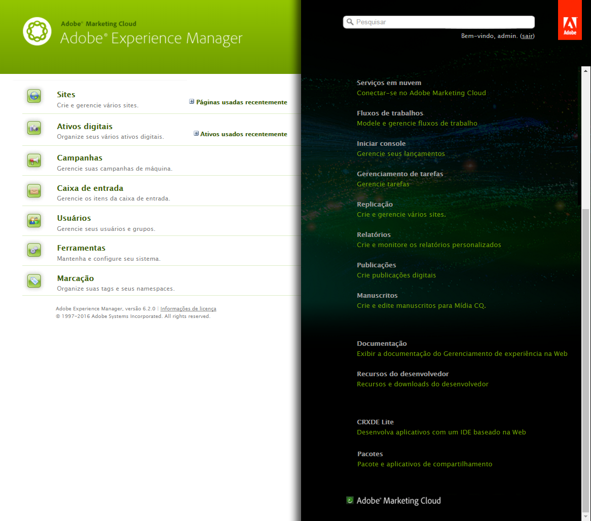
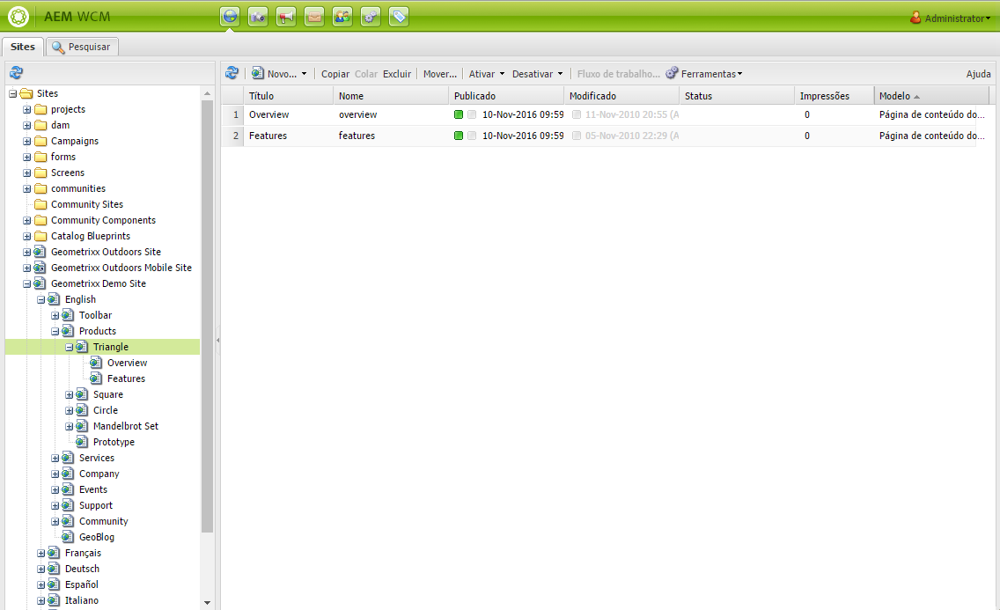
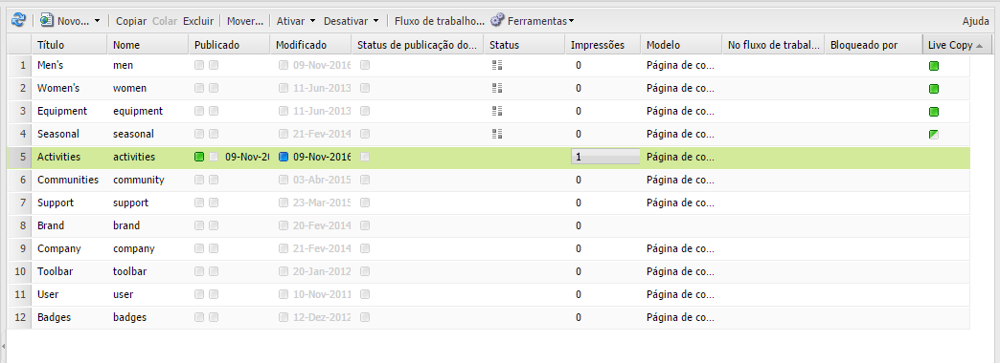
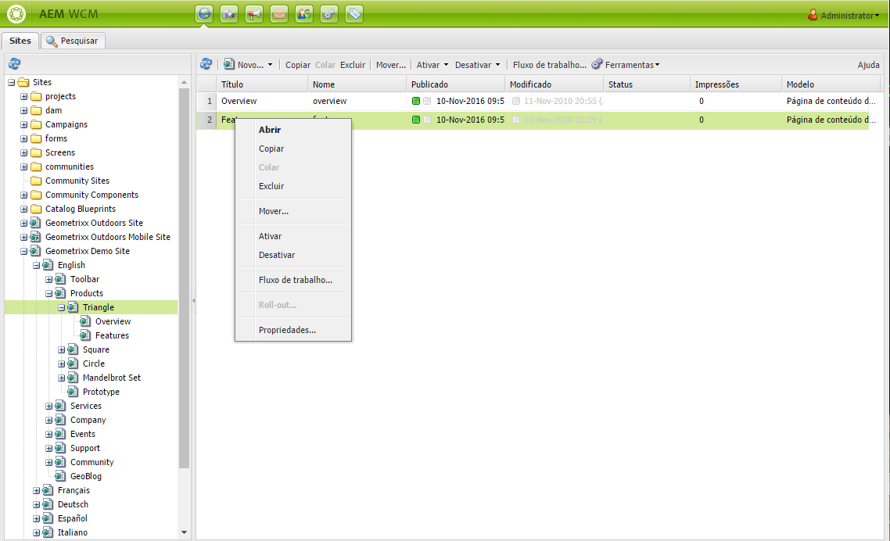

# Manuseio básico{#basic-handling}

>[!NOTE]
>
>* Esta página foi projetada para apresentar uma visão geral do manuseio básico ao usar um ambiente de criação com o AEM. Usa o console **Sites** como base.
   >
   >
* Algumas funcionalidades não estão disponíveis em todos os consoles, e/ou a funcionalidade adicional está disponível em alguns consoles. Informações específicas sobre os consoles individuais e o recurso relacionado serão abordadas com mais detalhes em outras páginas.
>* Os atalhos de teclado estão disponíveis em todo o AEM. Principalmente ao [usar páginas de console](/help/sites-classic-ui-authoring/author-env-keyboard-shortcuts.md) e [edição](/help/sites-classic-ui-authoring/classic-page-author-keyboard-shortcuts.md).

>

## A tela de boas-vindas {#the-welcome-screen}

A interface clássica fornece uma seleção de consoles,usando mecanismos bem conhecidos para navegação e inicialização de ações, como clique, duplo clique e [menus de contexto](#context-menus).

Ao efetuar o logon, a tela de Boas-vindas será exibida, isso fornece uma lista de links para os consoles e serviços:

## Consoles {#consoles}

Os consoles principais são:

<table> 
 <tbody> 
  <tr> 
   <td><strong>Console</strong></td> 
   <td><strong>Propósito</strong></td> 
  </tr> 
  <tr> 
   <td><strong>Bem-vindo</strong></td> 
   <td>Fornece uma visão geral e acesso direto (via links) para a funcionalidade principal do AEM.</td> 
  </tr> 
  <tr> 
   <td><strong>Ativos digitais</strong>  </td> 
   <td>Esse consoles permitem importar e <a href="/help/sites-classic-ui-authoring/classicui-assets.md">gerenciar ativos digitais</a> como imagens, vídeos, documentos e arquivos de áudio. Esses ativos podem ser usados por um site em execução na mesma instância do AEM. </td> 
  </tr> 
  <tr> 
   <td><strong>Lançamentos</strong></td> 
   <td>Ajuda a gerenciar suas <a href="/help/sites-classic-ui-authoring/classic-launches.md">inicializações</a>; esses itens permitem desenvolver o conteúdo de uma versão futura de uma ou mais páginas ativadas pela Web.  <i>Observação: Na interface habilitada para toque, grande parte da mesma funcionalidade está disponível no console Sites, junto com o painel Referências.</i> <i>Se necessário, esse console estará disponível no console Ferramentas; selecione Operações, em seguida, Inicializações.</i></td> 
  </tr> 
  <tr> 
   <td><strong>Caixa de entrada </strong></td> 
   <td>Em muitos casos, há algumas pessoas envolvidas em subtarefas de um fluxo de trabalho e cada uma delas deve executar sua etapa antes de entregar o trabalho para a próxima pessoa. A Caixa de entrada permite visualizar as notificações relacionadas a essas tarefas. Consulte <a href="/help/sites-administering/workflows.md">Trabalhar com fluxos de trabalho</a>.   </td> 
  </tr> 
  <tr> 
   <td><strong>Marcação com tags</strong></td> 
   <td>Os consoles Marcação permitem administrar as tags. As tags são nomes curtos ou frases que podem ser usadas para classificar e anotar partes de um conteúdo, o que facilita sua localização e organização. Para obter mais informações, consulte <a href="/help/sites-classic-ui-authoring/classic-feature-tags.md">Usar e gerenciar tags</a>.</td> 
  </tr> 
  <tr> 
   <td><strong>Ferramentas</strong></td> 
   <td>Os consoles <a href="/help/sites-administering/tools-consoles.md">Ferramentas</a> fornecem acesso a uma série de ferramentas e consoles especializados que ajudam a administrar seus sites, ativos digitais e outros aspectos do seu repositório de conteúdo.</td> 
  </tr> 
  <tr> 
   <td><strong>Usuários</strong></td> 
   <td>Esses consoles permitem gerenciar os direitos de acesso de usuários e grupos. Para obter informações detalhadas, consulte <a href="/help/sites-administering/security.md">Administração e segurança do usuário</a>.  </td> 
  </tr> 
  <tr> 
   <td><strong>Sites</strong></td> 
   <td>O console Sites/Websites permite <a href="/help/sites-classic-ui-authoring/classic-page-author.md">criar, exibir e gerenciar os sites</a> em execução na sua instância do AEM. Por meio desses consoles, você pode criar, copiar, mover e excluir páginas de site, iniciar fluxos de trabalho e ativar (publicar) páginas. Também é possível abrir uma página para edição.  </td> 
  </tr> 
  <tr> 
   <td><strong>Fluxos de trabalhos</strong></td> 
   <td>Um fluxo de trabalho é uma série definida de etapas que descrevem o processo de executar uma tarefa. Em muitos casos, há algumas pessoas envolvidas em uma tarefa e cada uma delas deve executar sua etapa antes de entregar o trabalho para a próxima pessoa. O console Fluxo de trabalho permite a você criar modelos de fluxo de trabalho e gerenciar a execução de instâncias de fluxo de trabalho. Consulte <a href="/help/sites-administering/workflows.md">Trabalhar com fluxos de trabalho</a>.  </td> 
  </tr> 
 </tbody> 
</table>

O console **Sites** fornece dois painéis para você navegar e gerenciar suas páginas:

* Painel esquerdo

   Isso mostra a estrutura em árvore de seus sites e as páginas nesses sites.

   Também mostra informações sobre outros aspectos ou o AEM, inclusive projetos, blueprints e ativos.

* Painel direito

   Isso mostra as páginas (no local selecionado no painel esquerdo) e pode ser usado para executar ações.

Desse ponto, você pode [gerenciar suas páginas](/help/sites-authoring/managing-pages.md) usando a barra de ferramentas, um menu de contexto ou abrindo uma página para obter mais ações.

>[!NOTE]
>
>O manuseio básico é igual em todos os consoles. Esta seção enfatiza o console **Websites**, pois ele é o principal console usado durante a criação.

## Acessar ajuda {#accessing-help}

Em vários consoles (por exemplo, Sites) também há um botão **Ajuda** disponível, que abrirá o Compartilhamento de pacotes ou o site da documentação.

Ao editar uma página, o [sidekick também tem um botão para acessar a opção de ajuda](/help/sites-classic-ui-authoring/classic-page-author-env-tools.md#accessing-help).

## Navegar com o console Websites {#navigating-with-the-websites-console}

O console **Websites** lista suas páginas de conteúdo em uma estrutura em árvore (painel esquerdo). Para facilitar a navegação, as seções da estrutura em árvore podem ser expandidas (+) ou recolhidas (-), conforme necessário:

* Um único clique no nome da página (no painel esquerdo) vai:

   * Listar como páginas filho no painel direito
   * Expandir a estrutura no painel esquerdo.

      Por questões de desempenho, essa ação depende do número de nós secundários. Com uma instalação padrão, esse método de expansão funciona quando há `30` ou menos nós secundários. 

* Um clique duplo no nome da página (painel esquerdo) também expandirá a árvore, mas se a página estiver aberta ao mesmo tempo, esse efeito não será tão óbvio.

>[!NOTE]
>
>Esse valor padrão (`30`) pode ser alterado por console nas configurações específicas do seu aplicativo do widget siteadmin:
>
>No nó siteadmin:
>
>Defina o valor da propriedade:\
>`treeAutoExpandMax`\
>em:\
>`/apps/wcm/core/content/siteadmin`
>
>Ou globalmente no tema:\
>Defina o valor de:\
>`TREE_AUTOEXPAND_MAX`\
>em:\
>`/apps/cq/ui/widgets/themes/default/widgets/wcm/SiteAdmin.js`
>
>Consulte [SiteAdmin na API do widget CQ](https://helpx.adobe.com/experience-manager/6-4/sites/developing/using/reference-materials/widgets-api/index.html?class=CQ.wcm.SiteAdmin) para obter mais detalhes.

## Informações da página no console do website {#page-information-on-the-websites-console}

O painel direito do console **Sites** fornece uma exibição de lista com informações sobre as páginas:

Os seguintes itens estão disponíveis; um subconjunto desses campos é mostrado como padrão:

<table> 
 <tbody> 
  <tr> 
   <td><strong>Coluna</strong></td> 
   <td><strong>Descrição</strong></td> 
  </tr> 
  <tr> 
   <td>Miniatura </td> 
   <td>Mostra uma miniatura da página.</td> 
  </tr> 
  <tr> 
   <td>Título</td> 
   <td>O título exibido na página</td> 
  </tr> 
  <tr> 
   <td>Nome</td> 
   <td>O nome ao qual o AEM se refere na página</td> 
  </tr> 
  <tr> 
   <td>Publicado</td> 
   <td>Indica se a página foi publicada e fornece a data e a hora de publicação.</td> 
  </tr> 
  <tr> 
   <td>Modificado</td> 
   <td>Indica se a página foi modificada e fornece a data e a hora de modificação. Para salvar qualquer modificação, você deve ativar a página.</td> 
  </tr> 
  <tr> 
   <td>Publicação do Scene7</td> 
   <td>Indica se a página foi publicada no Scene7.  </td> 
  </tr> 
  <tr> 
   <td>Status</td> 
   <td>Indica o status atual da página, por exemplo, se ela faz parte de um fluxo de trabalho ou cópia ativa, ou se está bloqueada no momento.</td> 
  </tr> 
  <tr> 
   <td>Impressões</td> 
   <td>Mostra a atividade em uma página em número de ocorrências.</td> 
  </tr> 
  <tr> 
   <td>Modelo</td> 
   <td>Indica o modelo em que uma página se baseia.</td> 
  </tr> 
  <tr> 
   <td>No fluxo de trabalho</td> 
   <td>Indica quando a página está em um fluxo de trabalho.</td> 
  </tr> 
  <tr> 
   <td>Bloqueado por</td> 
   <td>Mostra quando uma página foi bloqueada e a conta do usuário que a bloqueou.</td> 
  </tr> 
  <tr> 
   <td>Live Copy </td> 
   <td>Indica quando a página faz parte de uma cópia online.</td> 
  </tr> 
 </tbody> 
</table>

>[!NOTE]
>
>Para selecionar as colunas visíveis, passe o mouse sobre um título de coluna. Um menu suspenso será mostrado, nele é possível usar a opção **Colunas**.

As cores ao lado das páginas nas colunas **Publicado** e **Modificado** indicam os status da publicação:

| **Coluna** | **Cor** | **Descrição** |
|---|---|---|
| Publicado | Verde | A publicação foi bem-sucedida. O conteúdo foi publicado. |
| Publicado | Amarelo | A publicação está pendente. A confirmação da publicação ainda não foi recebida pelo sistema. |
| Publicado | Vermelho | A publicação falhou. Não há conexão com a instância de publicação. Isso também pode significar que o conteúdo foi desativado. |
| Publicado | *blank* | Essa página nunca foi publicada. |
| Modificado | Azul | A página foi modificada desde a última publicação. |
| Modificado | *blank* | Essa página nunca foi modificada ou não foi modificada desde a última publicação. |

## Context Menus {#context-menus}

A interface de usuário clássica usa mecanismos bem conhecidos para navegação e inicialização de ações, incluindo clique e duplo clique. Dependendo da situação atual, uma gama de menus de contexto (geralmente abertos com o botão direito do mouse) também estará disponível:

