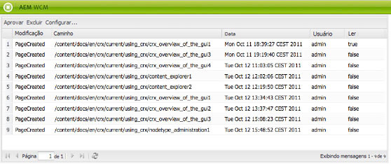
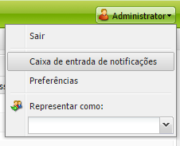
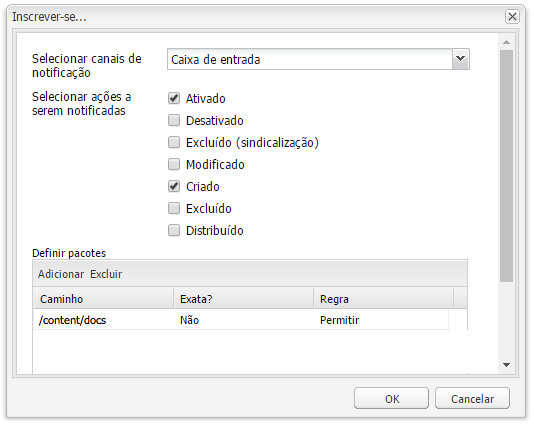
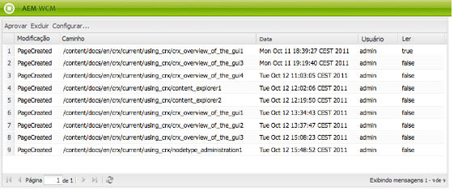

# Sua caixa de entrada{#your-inbox}

>[!CAUTION]
>
>AEM 6.4 chegou ao fim do suporte estendido e esta documentação não é mais atualizada. Para obter mais detalhes, consulte nossa [períodos de assistência técnica](https://helpx.adobe.com/br/support/programs/eol-matrix.html). Encontre as versões compatíveis [here](https://experienceleague.adobe.com/docs/).

Você pode receber notificações de várias áreas de AEM, como notificações sobre itens de trabalho ou tarefas que representam ações que você precisa executar no conteúdo da página.

Você recebe essas notificações em duas caixas de entrada, que são separadas pelo tipo de notificações:

* Uma caixa de entrada onde é possível visualizar as notificações recebidas como resultado das assinaturas é descrita na seção a seguir.
* Uma caixa de entrada especializada para itens de fluxo de trabalho é descrita na seção [Participar de fluxos de trabalho](/help/sites-classic-ui-authoring/classic-workflows-participating.md) documento.

## Como visualizar suas notificações {#viewing-your-notifications}

Para exibir suas notificações:

1. Abra a caixa de entrada de notificação: no **Sites** , clique no botão do usuário no canto superior direito e selecione **Caixa de entrada de notificações**.

   

   >[!NOTE]
   >
   >Você também pode acessar o console diretamente no navegador; por exemplo:
   >
   >` https://<host>:<port>/libs/wcm/core/content/inbox.html`

1. Suas notificações serão listadas. Você pode executar ações conforme necessário:

   * [Assinatura de notificações](#subscribing-to-notifications)
   * [Processamento de notificações](#processing-your-notifications)

   

## Assinatura de notificações {#subscribing-to-notifications}

Para assinar notificações:

1. Abra a caixa de entrada de notificação: no **Sites** , clique no botão do usuário no canto superior direito e selecione **Caixa de entrada de notificações**.

   

   >[!NOTE]
   >
   >Você também pode acessar o console diretamente no navegador; por exemplo:
   >
   >`https://<host>:<port>/libs/wcm/core/content/inbox.html`

1. Clique em **Configurar...** no canto superior esquerdo para abrir a caixa de diálogo de configuração.

   

1. Selecione o canal de notificação:

   * **Caixa de entrada**: as notificações serão exibidas na sua caixa de entrada de AEM.
   * **Email**: as notificações serão enviadas por email para o endereço definido no seu perfil de usuário.

   >[!NOTE]
   >
   >Algumas configurações precisam ser definidas para serem notificadas por email. Também é possível personalizar o modelo de email ou adicionar um modelo de email para um novo idioma. Consulte [Configuração de notificação por email](/help/sites-administering/notification.md#configuringemailnotification) para configurar notificações por email no AEM.

1. Selecione as ações de página para as quais será notificado:

   * Ativado: quando uma página é ativada.
   * Desativado: quando uma página é desativada.
   * Excluído (sindicalização): quando uma página é excluída-replicada, ou seja, quando uma ação de exclusão executada em uma página é replicada.

      Quando uma página é excluída ou movida, uma ação de exclusão é replicada automaticamente: a página é excluída na instância de origem em que a ação de exclusão foi executada e na instância de destino definida pelos agentes de replicação.

   * Modificado: quando uma página tiver sido modificada.
   * Criado: quando uma página tiver sido criada.
   * Excluído: quando uma página tiver sido excluída por meio da ação de exclusão de página.
   * Implantado: quando uma página é distribuída.

1. Defina os caminhos das páginas para as quais você será notificado:

   * Clique em **Adicionar** para adicionar uma nova linha à tabela.
   * Clique no botão **Caminho** célula da tabela e insira o caminho, por exemplo `/content/docs`.
   * Para ser notificado sobre todas as páginas pertencentes à subárvore, defina **Exata?** para **Não**.

      Para ser notificado somente sobre ações na página definidas pelo caminho, defina **Exata?** para **Sim**.

   * Para permitir a regra, defina **Regra** para **Permitir**. Se estiver definido como **Negar**, a regra é negada, mas não removida, e pode ser permitida depois.

   Para remover uma definição, selecione a linha clicando em uma célula de tabela e clique em **Excluir**.

1. Clique em **OK** para salvar a configuração.

## Processamento de notificações {#processing-your-notifications}

Se você tiver optado por receber notificações na caixa de entrada do AEM, a caixa de entrada preencherá as notificações. Você pode [visualizar suas notificações](#viewing-your-notifications) em seguida, selecione as notificações necessárias para:

* Aprove-o clicando em **Aprovar**: o valor na variável **Ler** está definida como **true**.

* Exclua-a clicando em **Excluir**.

