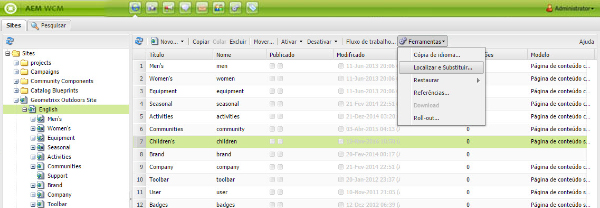

# Pesquisar{#search-features}

>[!CAUTION]
>
>AEM 6.4 chegou ao fim do suporte estendido e esta documentação não é mais atualizada. Para obter mais detalhes, consulte nossa [períodos de assistência técnica](https://helpx.adobe.com/br/support/programs/eol-matrix.html). Encontre as versões compatíveis [here](https://experienceleague.adobe.com/docs/).

O ambiente de criação do AEM fornece vários mecanismos de pesquisa de conteúdo, dependendo do tipo de recurso.

>[!NOTE]
>
>Fora do ambiente de criação, outros mecanismos também estão disponíveis para pesquisa, como o [Query Builder](/help/sites-developing/querybuilder-api.md) e [CRXDE Lite](/help/sites-developing/developing-with-crxde-lite.md).

## Noções básicas de pesquisa {#search-basics}

Para acessar o painel de pesquisa, clique no botão **Pesquisar** na parte superior do painel esquerdo do console adequado.

O painel de pesquisa permite pesquisar em todas as páginas do site. Ele contém campos e widgets para o seguinte:

* **Texto completo**: Procurar o texto especificado
* **Modificado após/antes**: Pesquisar apenas as páginas que foram alteradas entre as datas específicas
* **Modelo**: Pesquisar apenas as páginas com base no modelo especificado
* **Tags**: Pesquisar apenas as páginas com as tags especificadas

>[!NOTE]
>
>Quando sua instância estiver configurada para [Pesquisa de Lucene](/help/sites-deploying/queries-and-indexing.md) você pode usar o seguinte em **Texto completo**:
>
>* [Curingas](https://lucene.apache.org/core/5_3_1/queryparser/org/apache/lucene/queryparser/classic/package-summary.html#Wildcard_Searches)
>* [Operadores booleanos](https://lucene.apache.org/core/5_3_1/queryparser/org/apache/lucene/queryparser/classic/package-summary.html#Boolean_operators)
>
>* [Expressões regulares](https://lucene.apache.org/core/5_3_1/queryparser/org/apache/lucene/queryparser/classic/package-summary.html#Regexp_Searches)
>* [Agrupamento de campo](https://lucene.apache.org/core/5_3_1/queryparser/org/apache/lucene/queryparser/classic/package-summary.html#Field_Grouping)
>* [Promover](https://lucene.apache.org/core/5_3_1/queryparser/org/apache/lucene/queryparser/classic/package-summary.html#Boosting_a_Term)
>

Execute a pesquisa clicando em **Pesquisar** na parte inferior do painel. Clique em **Redefinir** para apagar os critérios de pesquisa.

## Filtro {#filter}

Em vários locais, um filtro pode ser definido (e limpo) para detalhar e refinar sua visualização:

## Localizar e substituir {#find-and-replace}

No **Sites** console a **Localizar e Substituir** A opção de menu permite procurar e substituir várias instâncias de uma sequência em uma seção do site.

1. Selecione a página raiz, ou pasta, onde deseja que a ação localizar e substituir ocorra.
1. Selecionar **Ferramentas** then **Localizar e Substituir**:

   

1. O **Localizar e Substituir** O faz o seguinte:

   * confirma o caminho raiz onde a ação localizar deve iniciar
   * define o termo a ser encontrado
   * define o termo que deve substituí-lo
   * indica se a pesquisa deve diferenciar maiúsculas de minúsculas
   * indica se apenas palavras inteiras devem ser encontradas (caso contrário, subsequências também são encontradas)

   Clicar **Visualizar** lista onde o termo foi encontrado. Você pode selecionar/desmarcar as instâncias específicas que serão substituídas:

   

1. Clique em **Substituir** para substituir efetivamente todas as instâncias. Você receberá uma solicitação para confirmar a ação.

O escopo padrão do servlet localizar e substituir abrange as seguintes propriedades:

* `jcr:title`
* `jcr:description`
* `jcr:text`
* `text`

O escopo pode ser alterado usando o Console de Gerenciamento da Web Apache Felix (por exemplo, em `http://localhost:4502/system/console/configMgr`). Selecionar `CQ WCM Find Replace Servlet (com.day.cq.wcm.core.impl.servlets.FindReplaceServlet)` e configure o escopo conforme necessário.

>[!NOTE]
>
>Em uma instalação padrão do AEM, a opção Localizar e substituir usa Lucene para a funcionalidade de pesquisa.
>
>Lucene indexa propriedades de sequência de até 16k de comprimento. As sequências que passarem disso não serão pesquisadas.
