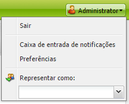
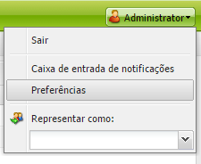
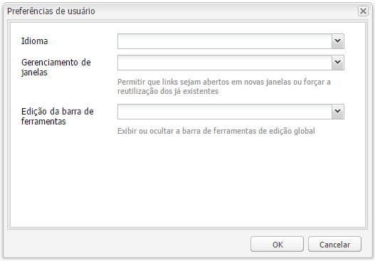

# Configurar o ambiente da sua conta{#configuring-your-account-environment}

O AEM fornece a capacidade de configurar a sua conta e determinados aspectos do ambiente de criação.

Usando as [configurações da conta](#account-settings) e [preferências do usuário](#user-preferences) as opções e preferências a seguir podem ser definidas:

* **Barra de ferramentas de edição** Seleciona se deseja ter a barra de ferramentas de edição global. Esta barra de ferramentas, que é mostrada na parte superior da janela do navegador, oferece 
**Botões Copiar**, **Recortar**, **Colar** e **Excluir** para usar com os componentes de parágrafo naquela página:

   * Mostrar quando necessário (Padrão)
   * Sempre mostrar
   * Manter oculto

* **Representar como** Com a funcionalidade [Representar como,](/help/sites-administering/security.md#impersonating-another-user) um usuário pode trabalhar em nome de outro usuário.

* **Idioma** O idioma a ser usado para a interface do ambiente de criação. Selecione o idioma desejado na lista disponível.

* **Gerenciamento de janelas** Selecione:

   * Várias janelas (padrão): As páginas serão abertas em uma nova janela.
   * Janela única: As páginas serão abertas na janela atual.

## Configurações da conta {#account-settings}

O ícone do usuário permite o acesso a várias das seguintes opções:

* Fazer logoff
* [Representar como](/help/sites-administering/security.md#impersonating-another-user)
* [Preferências de usuário](#user-preferences)
* [Caixa de entrada de notificações](/help/sites-classic-ui-authoring/author-env-inbox.md)

## Preferências do usuário {#user-preferences}

Cada usuário pode definir certas propriedades para si mesmo. Isso está disponível na caixa de diálogo **Preferências**, no canto superior direito dos consoles.

A caixa de diálogo oferece as seguintes opções:

