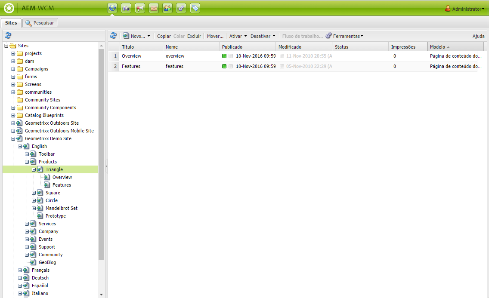

# Trabalhar com o ambiente de criação{#working-with-the-author-environment}

>[!CAUTION]
>
>AEM 6.4 chegou ao fim do suporte estendido e esta documentação não é mais atualizada. Para obter mais detalhes, consulte nossa [períodos de assistência técnica](https://helpx.adobe.com/br/support/programs/eol-matrix.html). Encontre as versões compatíveis [here](https://experienceleague.adobe.com/docs/).

>[!NOTE]
>
>A documentação a seguir foca na interface clássica. Para obter informações sobre a criação na interface do usuário moderna e habilitada para toque, consulte [documentação de criação padrão](/help/assets/assets.md).

O ambiente de criação permite executar tarefas relacionadas a:

* [Criação](/help/sites-authoring/author.md) (incluindo [criação de página](/help/sites-authoring/qg-page-authoring.md) e [gerenciamento de ativos](/help/assets/assets.md))

* [Administração](/help/sites-administering/administer-best-practices.md) tarefas necessárias ao gerar e manter o conteúdo em seu site

Duas interfaces gráficas de usuário são fornecidas para isso e elas podem ser acessadas por meio de qualquer navegador moderno:

1. IU Clássica

   * Essa interface do usuário sempre esteve disponível no AEM por muitos anos.
   * É predominantemente verde.
   * Ele foi projetado para uso em dispositivos de desktop.
   * Ele não é mais mantido.
   * A documentação a seguir foca nessa interface clássica. Para obter informações sobre a criação na interface do usuário moderna e baseada em toque, consulte [documentação de criação padrão](/help/sites-authoring/author.md).
   

1. Interface habilitada para toque

   * Esta é a interface de usuário moderna e padrão do AEM.
   * É predominantemente cinza, com uma interface limpa e plana.
   * Ele foi projetado para uso em dispositivos de toque e de desktop (otimizado para toque). No entanto, a aparência é a mesma em todos os dispositivos [visualizar e selecionar seus recursos](/help/sites-authoring/basic-handling.md) é ligeiramente diferente (toques versus cliques).
   * Consulte a [documentação de criação padrão](/help/sites-authoring/author.md) para obter mais detalhes sobre como criar usando a interface com base em toque. A documentação a seguir foca na interface clássica.

   * Desktop:
   

   * Dispositivos tablet (ou desktop com menos de 1024 pixels de largura):
   
