# Andaime{#scaffolding}

Por vezes, é necessário criar um grande conjunto de páginas que compartilham a mesma estrutura, mas têm conteúdo diferente. Na interface padrão do AEM, é necessário criar cada página, arrastar os componentes apropriados para a página e preencher cada um deles individualmente.

Com o scaffolding, é possível criar um formulário (um scaffold) com os campos que refletem a estrutura desejada para suas páginas e usar este formulário para criar facilmente as páginas com base nesta estrutura.

>[!NOTE]
>
>O scaffolding (na interface clássica) [respeita a herança MSM](#scaffolding-with-msm-inheritance).

## Como o scaffolding funciona {#how-scaffolding-works}

Os scaffolds são armazenados no console de **Ferramentas** do administrador do site.

* Abra o console de **Ferramentas** e clique em **Scaffolding da página padrão**.

* Em seguida, clique em **geometrixx**.
* Em **geometrixx**, você encontrará uma *página de scaffold* chamada **News**. Clique duas vezes para abrir essa página.

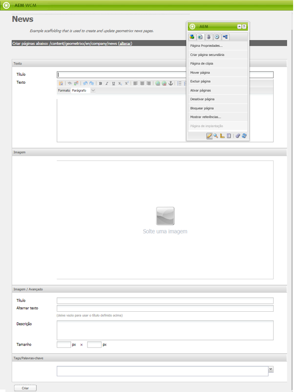

The scaffold consists of a form with a field for each piece of content that will make up the page to be created and four important parameters which are accessed through the **Page Properties** of the scaffold page.

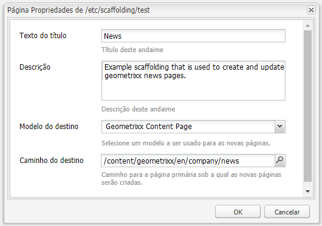

As propriedades de scaffolding de página são:

* **Texto do título:** esse é o nome da própria página de scaffolding. Neste exemplo, é chamado de “News”.
* **Descrição:** isso aparecerá abaixo do título na página de scaffolding.
* **Modelo de destino:** este é o modelo que o scaffold usará ao criar uma nova página. Neste exemplo, temos um modelo de *Página de conteúdo Geometrrixx*.

* **Caminho de destino:** este é o caminho da página principal abaixo, a partir da qual este scaffold criará novas páginas. In this example the path is */content/geometrixx/en/news*.

O corpo do scaffold é o formulário. Quando um usuário desejar criar uma página usando o scaffold, ele preenche o formulário e clica em *Criar*, na parte inferior. No exemplo **News** acima, o formulário apresenta os seguintes campos:

* **Título:** esse é o nome da página a ser criada. Este campo está sempre presente em cada scaffold.
* **Texto:** este campo corresponde a um Componente de texto na página resultante.
* **Imagem**: Esse campo corresponde a um Componente de imagem na página resultante.
* **Imagem/avançado**: **Título:** o título da imagem.

* **Imagem/avançado**: **Texto alternativo:** o texto alternativo da imagem.

* **Imagem/Avançado**: **Descrição**: A descrição da imagem.

* **Imagem/avançado**: **Tamanho:** o tamanho da imagem.

* **Tags/palavras-chave**: metadados a serem atribuídos a esta página. Este campo está sempre presente em cada scaffold.

## Criação de um scaffold {#creating-a-scaffold}

To create a new scaffold go to the **Tools** console, then **Default Page Scaffolding** and create a new page. A single page template type will be available, the *Scaffolding Template.*

*Vá para Propriedades **da**página da nova página e defina o Texto* do *título, a* Descrição *, o Modelo* do *Público alvo e o Caminho* do *Público alvo, conforme descrito acima.*

*Em seguida, é necessário definir a estrutura da página que este scaffold criará. Para fazer isso, vá para o modo de design na página do suporte. Um link será exibido, permitindo editar o scaffold no **editor de caixas de diálogo**.

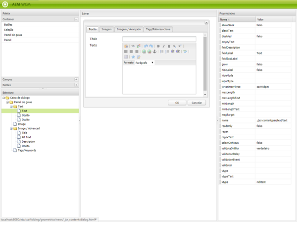

Usando o editor de diálogo, especifique as propriedades que serão criadas sempre que uma nova página for criada usando esse suporte.

A definição da caixa de diálogo para um scaffold funciona de maneira semelhante à de um componente (consulte [Componentes](/help/sites-developing/components.md)). No entanto, algumas diferenças importantes se aplicam:

* As definições da caixa de diálogo de componentes são renderizadas como caixas de diálogo normais (conforme mostrado no painel central do editor de caixas de diálogo, por exemplo), enquanto que as definições da caixa de diálogo de scaffold, embora apareçam como caixas de diálogo normais no editor, são renderizadas na página de scaffold como um formulário de scaffold (conforme mostrado no scaffold **News** acima).
* As caixas de diálogo de componente fornecem campos apenas para os valores necessários para definir o conteúdo de um componente específico. Uma caixa de diálogo de scaffold deve fornecer campos para cada propriedade em todos os parágrafos da página a ser criada.
* No caso de caixas de diálogo de componentes, o componente usado para renderizar o conteúdo especificado está implícito e, portanto, a propriedade `sling:resourceType` do parágrafo é preenchida automaticamente quando o parágrafo é criado. Com um scaffold, todas as informações que definem o conteúdo e o componente atribuído para um determinado parágrafo deve ser fornecidas pela própria caixa de diálogo. Nas caixas de diálogo de scaffold, essas informações devem ser fornecidas usando campos *Ocultos* para enviá-las o momento de criação da página.

É útil consultar o exemplo da caixa de diálogo de scaffold **News** no editor de caixas de diálogo para ver como isso funciona. Entre no modo de design na página de scaffold e clique no link do editor de caixas de diálogo.

Now, click on the dialog field **Dialog > Tab Panel > Text > Text**, like this:

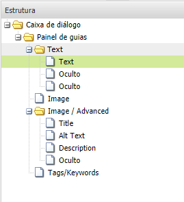

A lista de propriedades para esse campo será exibida no lado direito do editor de caixa de diálogo, da seguinte forma:

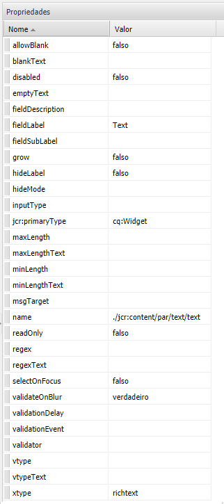

Observe a propriedade de nome desse campo. Ela tem o valor

./jcr:content/par/text/text

Esse é o nome da propriedade na qual o conteúdo deste campo será gravado quando o scaffold for usado para criar uma página. A propriedade é exibida como um caminho relativo do nó que representa a página a ser criada. Especifica o texto da propriedade, abaixo do texto do nó, que está abaixo do par de nós secundário do nó jcr:content, localizado abaixo do nó da página.

Isso define o local de armazenamento de conteúdo para o texto que será inserido neste campo. No entanto, também é necessário especificar duas ou mais características para esse conteúdo:

* O fato de que a sequência de caracteres que está sendo armazenada aqui deve ser interpretada como *rich text*, e
* qual componente deve ser usado para renderizar o conteúdo na página resultante.

Observe que, em uma caixa de diálogo de componentes normal, não seria necessário especificar essas informações porque estão implícitas no fato de que a caixa de diálogo já está vinculada a um componente específico.

Para especificar essas duas informações, use campos ocultos. Click on the first hidden field **Dialog > Tab Panel > Text > Hidden**, like this:

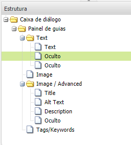

As propriedades desse campo oculto são as seguintes:

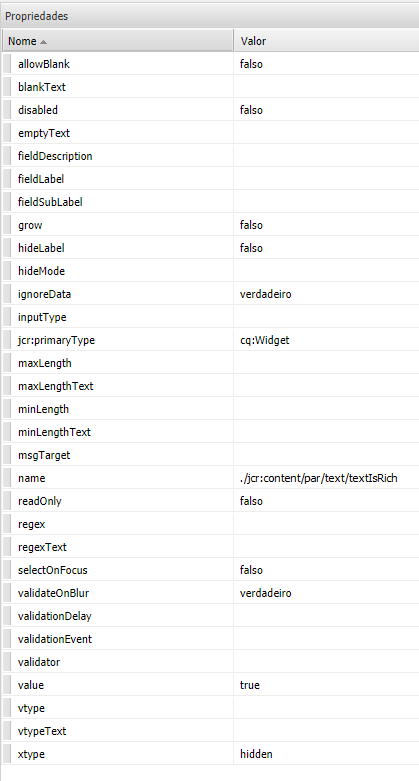

A propriedade nome desse campo oculto é

`./jcr:content/par/text/textIsRich`

This is a boolean property used to interpret the text string stored at `./jcr:content/par/text/text.`

Como sabemos que o texto deve ser interpretado como rich text, especificamos a propriedade `value` (valor) do campo como `true`.

>[!CAUTION]
>
>The dialog editor allows the user to change the values of *existing* properties in the dialog definition. Para adicionar uma nova propriedade, o usuário deve usar o [CRXDE Lite](/help/sites-developing/developing-with-crxde-lite.md). Por exemplo, quando um novo campo oculto é adicionado a uma definição de caixa de diálogo com o editor de caixa de diálogo, ele não tem uma propriedade *value* (ou seja, uma propriedade com o nome “value”). Se o campo oculto na pergunta exigir a definição de uma propriedade *value* padrão, essa propriedade deverá ser adicionada manualmente com uma das ferramentas de CRX. O valor não pode ser adicionado com o próprio editor de caixas de diálogo. No entanto, quando a propriedade estiver presente, seu valor poderá ser editado com o editor de caixa de diálogo.

O segundo campo oculto pode ser visualizado ao clicá-lo da seguinte maneira:

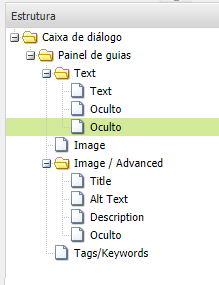

As propriedades desse campo oculto são as seguintes:

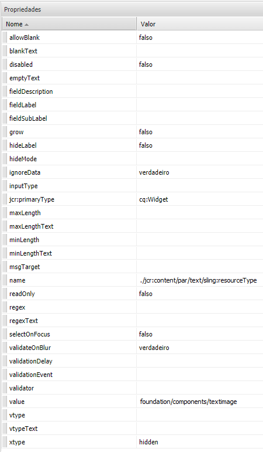

A propriedade nome desse campo oculto é

`./jcr:content/par/text/sling:resourceType`

e o valor fixo especificado para essa propriedade é

`foundation/components/textimage`

``Isso especifica que o componente a ser usado para renderizar o conteúdo de texto deste parágrafo é o componente de *Imagem de texto*. Using with the `isRichText` boolean specified in the other hidden field, the component can render the actual text string stored at `./jcr:content/par/text/text` in the desired way.

## Scaffolding com Herança MSM {#scaffolding-with-msm-inheritance}

Na interface clássica, o scaffolding é totalmente integrado com herança MSM (quando aplicável).

Quando você abre uma página no modo **Scaffolding** (usando o ícone na parte inferior do sidekick), todos os componentes sujeitos à herança serão indicados por:

* um símbolo de cadeado (para a maioria dos componentes; por exemplo, Texto e Título)
* uma máscara com o texto **Clique para cancelar a herança** (para componentes de Imagem)

Eles mostram que o componente não pode ser editado - até que a herança seja cancelada.

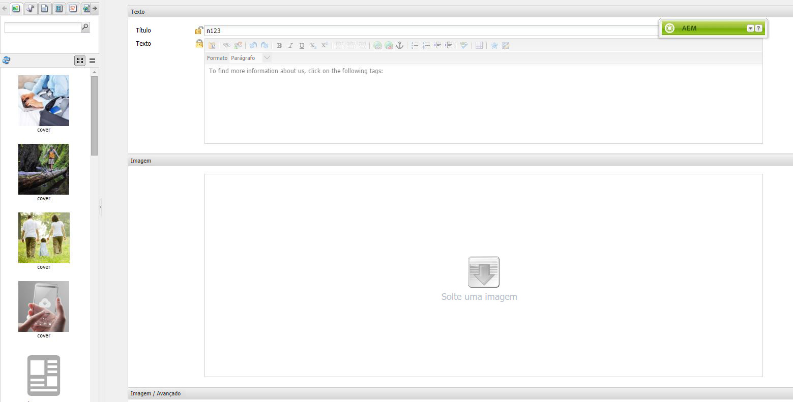

>[!NOTE]
>
>Isso é comparável aos [componentes herdados ao editar o conteúdo da página](/help/sites-authoring/editing-content.md#inheritedcomponentsclassicui).

Clicar no símbolo de cadeado ou no ícone de imagem permite interromper a herança:

* o símbolo será alterado para um cadeado aberto.
* uma vez que desbloqueado, será possível editar o conteúdo.

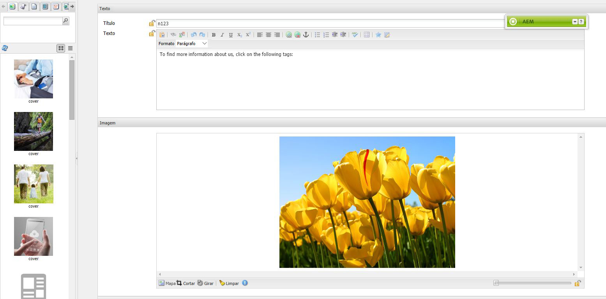

Depois de desbloquear, é possível restaurar a herança, clicando no símbolo de cadeado desbloqueado (essa ação descartará todas as alterações feitas).

>[!NOTE]
>
>If the inheritance is canceled at the page level (from the Livecopy tab of Page Properties) then all components will be editable in **Scaffolding** mode (they will be shown in unlocked state).

