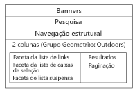

# Adding Search&amp;Promote features to your page {#adding-search-promote-features-to-your-page}

To integrate Search&amp;Promote capabilities in your web site, use the [!UICONTROL Search&amp;Promote] components to add the following features to your pages:

* Pesquisa por palavra-chave
* Página de resultados da pesquisa
* Refinamento da pesquisa
* Banners

Observe que é possível usar os recursos do Search&amp;Promote somente se o administrador do AEM tiver ativado eles. Consulte [Integração com o Adobe Search&amp;Promote](/help/sites-administering/search-and-promote.md).

Facetas são configuradas no servidor Search&amp;Promote, assim como as informações fornecidas por cada componente. A tabela a seguir fornece uma breve descrição de cada componente. As seções subsequentes fornecem informações detalhadas sobre seu uso.

<table> 
 <tbody> 
  <tr> 
   <th>componente do Search &amp; Promote</th> 
   <th>Descrição</th> 
  </tr> 
  <tr> 
   <td>Banners</td> 
   <td>Exibe anúncios em banners. Banners are selected based on data gathered through Search&amp;Promote.  </td> 
  </tr> 
  <tr> 
   <td>Navegações estruturais</td> 
   <td>Exibe a palavra-chave de pesquisa e a sequência de filtros que o usuário aplicou aos resultados da pesquisa.</td> 
  </tr> 
  <tr> 
   <td>Lista da caixa de seleção - Aspecto</td> 
   <td>Uma lista de caixas de seleção para selecionar aspectos para filtrar os resultados da pesquisa.</td> 
  </tr> 
  <tr> 
   <td>Faceta suspensa</td> 
   <td>Uma lista suspensa de aspectos para filtrar os resultados da pesquisa.</td> 
  </tr> 
  <tr> 
   <td>Aspecto da lista de links</td> 
   <td>Uma lista de links de facetas para filtrar os resultados da pesquisa.</td> 
  </tr> 
  <tr> 
   <td>Paginação</td> 
   <td>Controles para navegar pelas páginas dos resultados da pesquisa.</td> 
  </tr> 
  <tr> 
   <td>Resultados</td> 
   <td>Exibe os resultados de uma pesquisa por palavra-chave.</td> 
  </tr> 
  <tr> 
   <td>Pesquisar  </td> 
   <td>Adiciona um campo de pesquisa à página.</td> 
  </tr> 
 </tbody> 
</table>

## Criação da página de resultados da pesquisa {#creating-the-search-results-page}

Use o console Sites do WCM para criar uma página para mostrar resultados de pesquisas. Os resultados de uma pesquisa de qualquer componente de pesquisa poderão aparecer nessa página se ela usar o mesmo serviço Search&amp;Promote.

Os componentes que permitem aos usuários revisar os resultados da pesquisa são Resultados e Paginação. O componente **[!UICONTROL Resultados]** não possui propriedades configuráveis no modo de Edição ou Design.  O componente Resultados simplesmente lista os resultados da pesquisa, que fornecem links para outras páginas, e exibe o número de resultados para a palavra-chave de pesquisa.

O componente **[!UICONTROL Paginação]** permite que os usuários naveguem em várias páginas de resultados de pesquisa. O usuário pode ver o número de páginas, passar para a página seguinte ou anterior, selecionar uma página a ser aberta ou consolidar todos os resultados em uma página.

You can configure the following component properties in [!UICONTROL Edit] mode to control runtime behavior:

* **[!UICONTROL Ocultar página]** de resultado único - Selecione essa opção para ocultar os controles de navegação da página quando a pesquisa retornar uma única página de resultados.
* **[!UICONTROL Ocultar primeiro/último]** : selecione essa opção para impedir que os usuários pulem para a primeira ou a última página de resultados.
* **[!UICONTROL Ocultar anterior/próximo]** - Determina se os usuários podem navegar pelas páginas de resultados em relação à página atual.
* **[!UICONTROL Ocultar visualização para todos]** - Determina se o usuário pode consolidar todos os resultados da pesquisa em uma única página. Normalmente, fornecer dados paginados usa de maneira mais eficiente os recursos do servidor. Selecione essa opção para impedir a transferência de grandes conjuntos de dados em uma única mensagem de resposta.

## Ativação da filtragem de resultados por facetas {#enabling-the-filtering-of-results-by-facets}

Você pode permitir que os usuários filtrem os resultados da pesquisa por facetas. The **[!UICONTROL Checkbox List Facet]**, **[!UICONTROL Dropdown Facet]**, and **[!UICONTROL Link List Facet]** components enable users to select one or more facets for filtering. Ao usar esses componentes, você também deve incluir o componente **[!UICONTROL Caminhos de navegação]**. Caminhos de navegação indicam os filtros atuais que são usados.

The **[!UICONTROL Checkbox List Facet]**, **[!UICONTROL Dropdown Facet]**, and **[!UICONTROL Link List Facet]** components each have the following properties that you configure in **[!UICONTROL Edit]** mode:

* **[!UICONTROL Nome]** da faceta - o nome da faceta usada para filtros.

O componente **[!UICONTROL Face da lista da caixa de seleção]** exibe uma lista de facetas com uma caixa de seleção acompanhante. Use uma **[!UICONTROL Face da lista da caixa de seleção]** para que os usuários possam visualizar um subconjunto de resultados que incluem itens de várias facetas. Por exemplo, a facetaMarca é apropriada porque várias marcas fornecem o mesmo tipo de produto.

Uma caixa de seleção é exibida para cada faceta associada a um resultado de pesquisa. Quando um usuário marca uma caixa de seleção, a página é recarregada com um conjunto de resultados atualizado. Todas as caixas de seleção permanecem na página, para que os clientes possam adicionar ou remover facetas ao/do filtro a qualquer momento:

O componente **[!UICONTROL Faceta suspensa]** permite que os clientes selecionem um item de faceta de uma lista suspensa. Esse componente é útil quando você deseja que os clientes se concentrem em um único item de faceta de uma só vez. Por exemplo, a faceta Departamento é adequada para permitir que os clientes restrinjam pesquisas de produtos por sexo. John procura *jeans* e depois filtra no departamento masculino.

A lista suspensa é preenchida com as facetas associadas a todos os resultados da pesquisa. Ao selecionar um item na lista suspensa, a página é recarregada com um conjunto de resultados atualizado. Os itens na lista suspensa não são alterados, para que os clientes possam alternar entre facetas a qualquer momento.

O componente **[!UICONTROL Faceta da lista de links]** permite que os clientes reduzam progressivamente o foco em itens categorizados em vários membros de facetas ou facetas.

Os membros da faceta aparecem como uma lista de links. O texto de cada link é o nome de um membro de faceta associado aos resultados atuais da pesquisa. Quando um cliente clica em um link de faceta, a página é recarregada, e um subconjunto dos resultados da pesquisa é exibido. A lista de links é atualizada de acordo, permitindo um foco ainda mais estreito.

The links in the list also changes when a filter is applied from a different type of [!UICONTROL Search&amp;Promote] component. O uso de vários tipos de componentes de filtro pode fornecer combinações de filtros eficazes.

O componente **[!UICONTROL Caminhos de navegação]** permite que os clientes vejam os filtros atualmente aplicados aos resultados da pesquisa, na ordem em que foram aplicados. Os clientes podem clicar nos itens no caminho de navegação para reverter para essa combinação de filtros.

Você pode configurar as seguintes propriedades para Caminhos de navegação no modo de Edição, para personalizar a aparência do componente:

* **[!UICONTROL Delimitador]** - Defina o caractere ou a sequência de caracteres para agir como um delimitador entre cada navegação estrutural. O campo Delimitador aceita qualquer string de caractere como entrada. A configuração padrão é: &quot;>&quot; (sem as aspas)
* **[!UICONTROL Delimitador]** de Trailing - Defina um caractere ou uma string de caractere a ser exibida no final das Trilhas de navegação. O campo Delimitador de Trailing aceita qualquer string de caractere como entrada. A configuração padrão para isso é &quot;em branco&quot; (ou seja, nada é exibido no final da linha de navegação estrutural)

## Adição de caixas de pesquisa {#adding-search-boxes}

The **[!UICONTROL Search]** component enables customers to perform keyword searches. Adicione componentes Pesquisa a cada página na qual você deseja fornecer acesso para pesquisa.

Configure the following properties in **[!UICONTROL Edit]** mode to control runtime behavior:

* **[!UICONTROL Caminho]** da página de resultado - o caminho para a página que exibe os resultados da pesquisa.
* **[!UICONTROL Ativar Completar]** automaticamente - Selecione para fazer com que as palavras-chave de pesquisa sugeridas apareçam quando o cliente começar a digitar na caixa de pesquisa.

## Adição de banners {#adding-banners}

The **[!UICONTROL Banners]** component displays banner advertisements according to the customer&#39;s Search&amp;Promote searches. A lógica no servidor Search&amp;Promote determina o banner a ser exibido. Por exemplo, uma pesquisa por jeans pode fazer com que um banner de moda apareça. Filtrar no departamento masculino pode refinar ainda mais a escolha do banner.

The **[!UICONTROL Banners]** component provides one configurable property named **[!UICONTROL Banner Area]**. In **[!UICONTROL Edit]** mode, select one of the property values to specify how the banner appears. O serviço Search&amp;Promote determina a lista de valores que você pode selecionar.

## Exemplo de página de pesquisa do Search&amp;Promote {#example-search-promote-search-page}

Este diagrama mostra os componentes que são adicionados a uma página para criar a página de resultados do Search&amp;Promote totalmente funcional abaixo.

 exemplo de 

