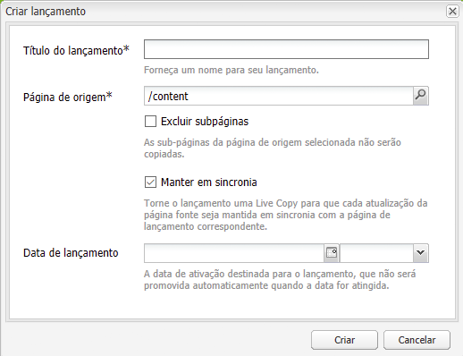

# Criação de inicializações{#creating-launches}

>[!CAUTION]
>
>AEM 6.4 chegou ao fim do suporte estendido e esta documentação não é mais atualizada. Para obter mais detalhes, consulte nossa [períodos de assistência técnica](https://helpx.adobe.com/br/support/programs/eol-matrix.html). Encontre as versões compatíveis [here](https://experienceleague.adobe.com/docs/).

Crie um lançamento para permitir a atualização de uma nova versão das páginas da Web existentes para ativação futura. Ao criar a inicialização, especifique um título e a página de origem:

* O título aparece no **Sidekick**, de onde os autores podem acessá-los para trabalhar com eles.
* As páginas filhas da página de origem são incluídas no lançamento por padrão. Você pode usar somente a página de origem, se desejar.
* Por padrão, [Live Copy](/help/sites-administering/msm.md) O atualiza automaticamente as páginas de lançamento conforme as páginas de origem são alteradas. Você pode especificar que uma cópia estática seja criada para evitar alterações automáticas.

Como opção, especifique a **Data de inicialização** (e a hora) para definir quando as páginas de inicialização devem ser promovidas e ativadas. No entanto, a **Data de inicialização** só funciona em combinação com o sinalizador **Pronto para produção** (consulte [Editar uma configuração de inicialização](/help/sites-classic-ui-authoring/classic-launches-editing.md#editing-a-launch-configuration)); para que as ações realmente ocorram automaticamente, ambas devem ser definidas.

## Criação de um lançamento {#creating-a-launch}

O procedimento a seguir cria um lançamento.

1. Abra a página de administração do site ([http://localhost:4502/siteadmin](http://localhost:4502/siteadmin)).
1. Clique em **Novo...** then **Novo lançamento...**.
1. No **Criar lançamento** , especifique valores para as seguintes propriedades:

   * **Título do lançamento**: O nome do Launch. O nome deve ser significativo para os autores.
   * **Página de origem**: O caminho para a página para a qual criar o lançamento. Por padrão, todas as páginas filhas são incluídas.
   * **Excluir subpáginas**: Selecione essa opção para criar o lançamento somente para a página de origem e não para as páginas secundárias. Por padrão, essa opção não está selecionada.
   * **Manter Sincronizado**: Selecione essa opção para atualizar automaticamente o conteúdo das páginas de lançamento quando as páginas de origem forem alteradas. Isso é feito fazendo com que o lançamento [live copy](/help/sites-administering/msm.md).
   * **Data da inicialização**: a data e a hora em que a cópia de inicialização deve ser ativada (dependendo do sinalizador de **Pronto para produção**; consulte [Inicializações - a ordem dos eventos](/help/sites-authoring/launches.md#launches-the-order-of-events)).

   

1. Clique em **Criar**.

## Exclusão de um lançamento {#deleting-a-launch}

Também é possível excluir um lançamento.

1. No [inicia o console](/help/sites-classic-ui-authoring/classic-launches.md), selecione o lançamento necessário.
1. Clique em **Excluir** - a confirmação é necessária:

   

   >[!CAUTION]
   >
   >Ao excluir lançamentos aninhados, você deve excluir os níveis inferiores primeiro.
