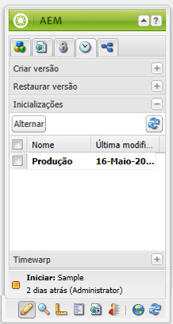

# Edição de inicializações{#editing-launches}

>[!CAUTION]
>
>AEM 6.4 chegou ao fim do suporte estendido e esta documentação não é mais atualizada. Para obter mais detalhes, consulte nossa [períodos de assistência técnica](https://helpx.adobe.com/br/support/programs/eol-matrix.html). Encontre as versões compatíveis [here](https://experienceleague.adobe.com/docs/).

## Editar páginas de lançamento {#editing-launch-pages}

Quando um lançamento é criado para uma página (ou um conjunto de páginas), é possível editar o conteúdo na cópia de lançamento da(s) página(s).

1. Abra a página para edição.
1. No Sidekick, selecione o **Controle de versão** e, em seguida, expanda a **Lançamentos** grupo. O título do lançamento que está sendo editado usa uma fonte em negrito.

   

1. Selecione o lançamento em que deseja trabalhar e clique em **Switch**.
1. Comece a editar.

   >[!NOTE]
   >
   >Você pode usar o **Página** guia do sidekick para executar ações como **Criar página secundária**, entre outros.

## Editar uma configuração do Launch {#editing-a-launch-configuration}

Depois de criar um lançamento, você pode alterar o nome do lançamento e a data do lançamento. Você também pode especificar uma imagem para associar ao lançamento.

1. Abra a página de administração de lançamentos ([http://localhost:4502/libs/launches/content/admin.html](http://localhost:4502/libs/launches/content/admin.html)).

1. Selecione o lançamento necessário e clique em **Editar** para abrir a caixa de diálogo:

   * No **Geral** , é possível editar:

      * **Título**
      * **Data de ativação**: equivale à data de lançamento
      * **Pronto para produção**

      Consulte [Lançamentos - a ordem dos eventos](/help/sites-authoring/launches.md#launches-the-order-of-events) para obter informações sobre a finalidade e interação desses campos.

   * No **Imagem** é possível fazer upload de um arquivo de imagem.

1. Clique em **Salvar**.

## Descobrindo o status de lançamento de uma página {#discovering-the-launch-status-of-a-page}

Quando você está editando um lançamento de uma página, as informações sobre o lançamento são exibidas na parte inferior do **Controle de versão** guia do Sidekick:

* O nome do lançamento.
* O tempo desde a última alteração.
* O usuário que realizou a última alteração.
* O status da variável **Pronto para produção** sinalizador (laranja=não definido; green=set).

