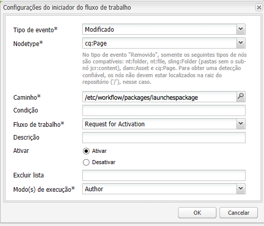

# Promoção de inicializações{#promoting-launches}

>[!CAUTION]
>
>AEM 6.4 chegou ao fim do suporte estendido e esta documentação não é mais atualizada. Para obter mais detalhes, consulte nossa [períodos de assistência técnica](https://helpx.adobe.com/br/support/programs/eol-matrix.html). Encontre as versões compatíveis [here](https://experienceleague.adobe.com/docs/).

É necessário promover páginas de lançamento para mover o conteúdo de volta para a fonte (produção) antes de publicar. Quando uma página de lançamento é promovida, a página correspondente das páginas de origem é substituída pelo conteúdo da página promovida. As seguintes opções estão disponíveis ao promover uma página de lançamento:

* Promover apenas a página atual ou todo o lançamento.
* Promover as páginas secundárias da página atual.
* Promover o lançamento completo ou apenas as páginas que foram alteradas.

## Promoção de páginas de lançamento {#promoting-launch-pages}

Para promover páginas, execute as seguintes etapas ao editar a página de lançamento que deseja promover:

1. No **Página** no Sidekick, clique em **Promover lançamento**.
1. Especifique as páginas para promover:

   * (Padrão) Para promover somente a página atual, selecione **Promover Alterações Na Página Para Versão De Produção**.
   * Para também promover as páginas secundárias da página atual, selecione **Incluir subpáginas**.
   * Para promover todas as páginas no lançamento, selecione **Promover O Launch Completo Para A Versão De Produção**.

1. Para adicionar páginas de produção a um pacote de fluxo de trabalho, selecione **Adicionar Ao Pacote De Fluxo De Trabalho** e selecione o pacote de fluxo de trabalho.
1. Clique em **Promover**.

## Processamento de Páginas promovidas usando o fluxo de trabalho do AEM {#processing-promoted-pages-using-aem-workflow}

Use modelos de fluxo de trabalho para executar o processamento em massa de páginas de Lançamentos promovidas:

1. Crie um pacote de fluxo de trabalho.
1. Quando os autores promovem páginas do Launch, eles as armazenam no pacote de fluxo de trabalho.
1. Inicie um modelo de fluxo de trabalho usando o pacote como carga útil.

Para iniciar um fluxo de trabalho automaticamente quando as páginas forem promovidas, [configurar um iniciador de fluxo de trabalho](/help/sites-administering/workflows-starting.md#workflows-launchers) para o nó do pacote.

Por exemplo, você pode gerar automaticamente solicitações de ativação de página quando os autores promovem páginas de Lançamentos. Configure um iniciador de fluxo de trabalho para iniciar o fluxo de trabalho Request Ativation quando o nó do pacote for modificado.

