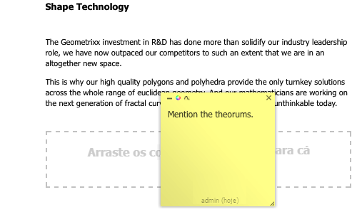

# Anotações ao editar uma página{#annotations-when-editing-a-page}

>[!CAUTION]
>
>AEM 6.4 chegou ao fim do suporte estendido e esta documentação não é mais atualizada. Para obter mais detalhes, consulte nossa [períodos de assistência técnica](https://helpx.adobe.com/br/support/programs/eol-matrix.html). Encontre as versões compatíveis [here](https://experienceleague.adobe.com/docs/).

Com frequência, a adição de conteúdo às páginas do seu site está sujeita a discussões antes da publicação efetiva. Para auxiliar nesse processo, muitos componentes diretamente relacionados ao conteúdo (em oposição, por exemplo, ao layout) permitem adicionar uma anotação.

Uma anotação coloca um marcador colorido/nota adesiva na página. A anotação permite a você (ou outros usuários) deixar comentários e/ou perguntas para outros autores/revisores.

>[!NOTE]
>
>A definição de um tipo de componente individual determina se é possível adicionar uma anotação (ou não) nas instâncias desse componente.

>[!NOTE]
>
>As anotações criadas na interface clássica também serão exibidas na interface otimizada para toque. No entanto, os rascunhos são específicos da interface do usuário e são mostrados somente na interface do usuário na qual foram criados.

>[!CAUTION]
>
>A exclusão de um recurso (por exemplo, parágrafo) exclui todas as anotações e rascunhos associados a ele; independentemente de sua posição na página como um todo.

>[!NOTE]
>
>Dependendo dos seus requisitos, também é possível desenvolver um fluxo de trabalho para enviar notificações quando anotações são adicionadas, atualizadas ou excluídas.

## Anotações {#annotations}

Dependendo do design do parágrafo, a anotação está disponível como uma opção no menu de contexto (geralmente, o botão direito do mouse quando sobre o parágrafo necessário) ou como um botão na barra de edição de parágrafo.

Em qualquer caso, selecione **Anotar**. Uma anotação adesiva colorida será aplicada ao parágrafo; você entrará imediatamente no modo Editar, o que lhe permitirá a adição direta de texto:

É possível mover a anotação para uma nova posição na página. Clique na área da borda superior e segure e arraste simultaneamente a anotação para a nova posição. Isso pode estar em qualquer lugar da página, embora geralmente seja significativo mantê-la conectada ao parágrafo de alguma forma.

As anotações (incluindo os rascunhos relacionados) também são incluídas em qualquer ação de cópia, recorte ou exclusão executada no parágrafo ao qual estão anexadas; para ações de cópia ou recorte, a posição da anotação (e rascunhos relacionados) mantém sua posição em relação ao parágrafo original.

O tamanho da anotação também pode ser aumentado ou diminuído ao arrastar o canto inferior direito.

Para fins de rastreamento, a linha de rodapé indicará o usuário que criou a anotação e a data. Os autores seguintes poderão editar a mesma anotação (o rodapé será atualizado) ou criar uma nova anotação para o mesmo parágrafo.

A confirmação será solicitada quando você optar por excluir a anotação (a exclusão da anotação também exclui qualquer rascunho associado a ela).

Os três ícones no canto superior esquerdo permitem minimizar a anotação (junto com os rascunhos relacionados), alterar a cor e adicionar rascunhos.

>[!NOTE]
>
>As anotações são visíveis apenas no modo de Edição do ambiente do autor.
>
>Elas não estão visíveis em um ambiente de publicação, nem nos modos Visualizar ou Design disponíveis em um ambiente de criação.

>[!NOTE]
>
>As anotações não podem ser adicionadas a uma página que foi bloqueada por outro usuário.

## Rascunhos de anotação {#annotation-sketches}

>[!NOTE]
>
>Os rascunhos não estão disponíveis no Internet Explorer, portanto:
>
>* o ícone não será exibido.
>* os rascunhos existentes, criados em outro navegador, não serão exibidos.
>

Os rascunhos são um recurso de anotações que permitem criar gráficos de linhas simples em qualquer lugar na janela do navegador (porção visível):

* O cursor se transformará em uma cruz quando você estiver no modo de rascunho. Você pode desenhar várias linhas distintas.
* A linha de rascunho reflete a cor da anotação e pode ser:

   * mão livre

      o modo padrão; termine soltando o botão do mouse.

   * reto:

      manter pressionado `ALT` e clique nos pontos de início e fim; termine com um clique duplo.

* Depois de sair do modo de rascunho, você pode clicar em uma linha de rascunho para selecionar esse rascunho.
* Para mover um rascunho, selecione-o e depois arraste-o para a posição desejada.
* Um rascunho se sobrepõe ao conteúdo. Isso significa que, nos 4 cantos do rascunho, não é possível clicar no parágrafo subjacente; por exemplo, se você precisar editar ou acessar um link. Se isso se tornar um problema (por exemplo, se houver um rascunho cobrindo uma área grande da página), minimize a anotação apropriada, pois isso também minimizará todos os rascunhos relacionados, fornecendo acesso à área subjacente.
* Para excluir um rascunho individual - selecione o rascunho necessário e pressione a tecla **Excluir** tecla (**fn**-**backspace** em uma MAC).

* Se você mover ou copiar um parágrafo, quaisquer anotações relacionadas e seus rascunhos também serão movidos ou copiados; a sua posição em relação ao parágrafo permanecerá a mesma.
* Se você excluir uma anotação, todos os rascunhos associados a ela também serão excluídos.
