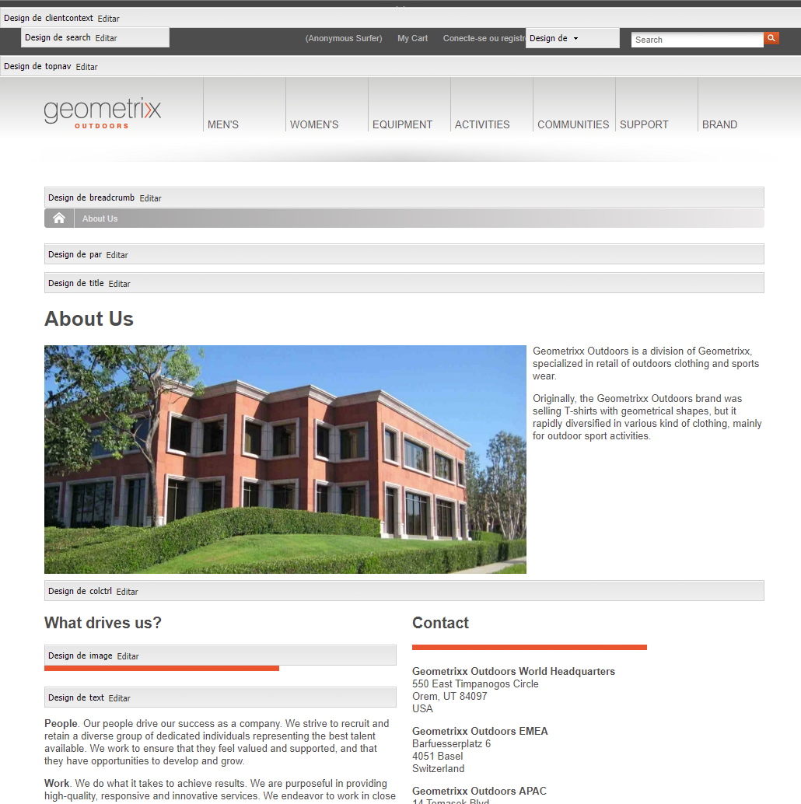
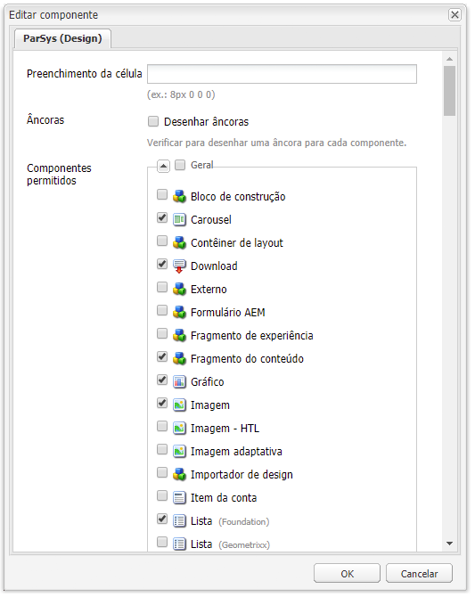
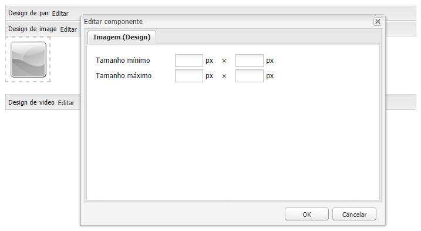

# Configuração de componentes no modo de design{#configuring-components-in-design-mode}

>[!CAUTION]
>
>AEM 6.4 chegou ao fim do suporte estendido e esta documentação não é mais atualizada. Para obter mais detalhes, consulte nossa [períodos de assistência técnica](https://helpx.adobe.com/br/support/programs/eol-matrix.html). Encontre as versões compatíveis [here](https://experienceleague.adobe.com/docs/).

Quando AEM instância é instalada e pronta para uso, uma seleção de componentes é disponibilizada imediatamente no sidekick.

Além disso, vários outros componentes também estão disponíveis. Você pode usar o Modo de design para [Ativar/desativar tais componentes](#enabledisablecomponentsusingdesignmode). Quando ativado e localizado na página, você pode usar o Modo de design para [configurar os aspectos do design do componente](#configuringcomponentsusingdesignmode) editando os parâmetros do atributo.

>[!NOTE]
>
>Deve-se ter cuidado ao editar esses componentes. As configurações de design muitas vezes são parte integrante do design de todo o site, por isso só devem ser alteradas por alguém com os privilégios adequados (e experiência), geralmente um administrador ou desenvolvedor. Consulte [Componentes de desenvolvimento](/help/sites-developing/components.md) para obter mais informações.

Na verdade, isso envolve adicionar ou remover os componentes permitidos no sistema de parágrafo da página. O sistema de parágrafo ( `parsys`) é um componente composto que contém todos os outros componentes de parágrafo. O sistema de parágrafo permite que os autores adicionem componentes de tipos diferentes a uma página, pois contêm todos os outros componentes de parágrafo. Cada tipo de parágrafo é representado como um componente.

Por exemplo, o conteúdo de uma página de produto pode conter um sistema de parágrafo com o seguinte:

* Uma imagem do produto (na forma de uma imagem ou de um parágrafo de imagem)
* A descrição do produto (como um parágrafo de texto)
* Uma tabela com dados técnicos (como parágrafo de tabela)
* Um formulário preenchido pelos usuários (como um formulário começa, um elemento de formulário e um parágrafo final de formulário)

>[!NOTE]
>
>Consulte [Componentes de desenvolvimento](/help/sites-developing/components.md#paragraphsystem) e [Diretrizes para usar modelos e componentes](/help/sites-developing/dev-guidelines-bestpractices.md#guidelines-for-using-templates-and-components) para obter mais informações sobre `parsys`.

## Ativar/desativar componentes {#enable-disable-components}

No modo Design, o sidekick é minimizado e você tem a possibilidade de configurar os componentes acessíveis para a criação:

1. Para entrar no modo Design, abra uma página para edição e use o ícone Sidekick:

   

1. Clique em **Editar** sobre o sistema de parágrafo (**Concepção do par**).

   

1. Uma caixa de diálogo será aberta, listando os grupos de componentes que são mostrados no Sidekick juntamente com os componentes individuais que eles contêm.

   Selecione conforme necessário para adicionar ou remover os componentes que estarão disponíveis no sidekick.

   

1. O Sidekick é minimizado no modo Design. Ao clicar na seta, você pode maximizar o Sidekick e retornar ao Modo de edição:

   

## Configuração do design de um componente {#configuring-the-design-of-a-component}

No modo Design, também é possível configurar atributos para os componentes individuais. Cada componente tem seus próprios parâmetros, o exemplo a seguir mostra o **Imagem** componente:

1. Para entrar no modo Design, abra uma página para edição e use o ícone Sidekick:

   

1. Você pode configurar o design dos componentes.

   Por exemplo, se você clicar em **Editar** no componente Imagem (**Design da imagem**) você pode configurar os parâmetros específicos do componente:

   

1. Clique em **OK** para salvar as alterações.

1. O Sidekick é minimizado no modo Design. Ao clicar na seta, você pode maximizar o Sidekick e retornar ao Modo de edição:

   
