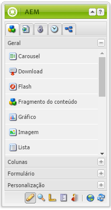
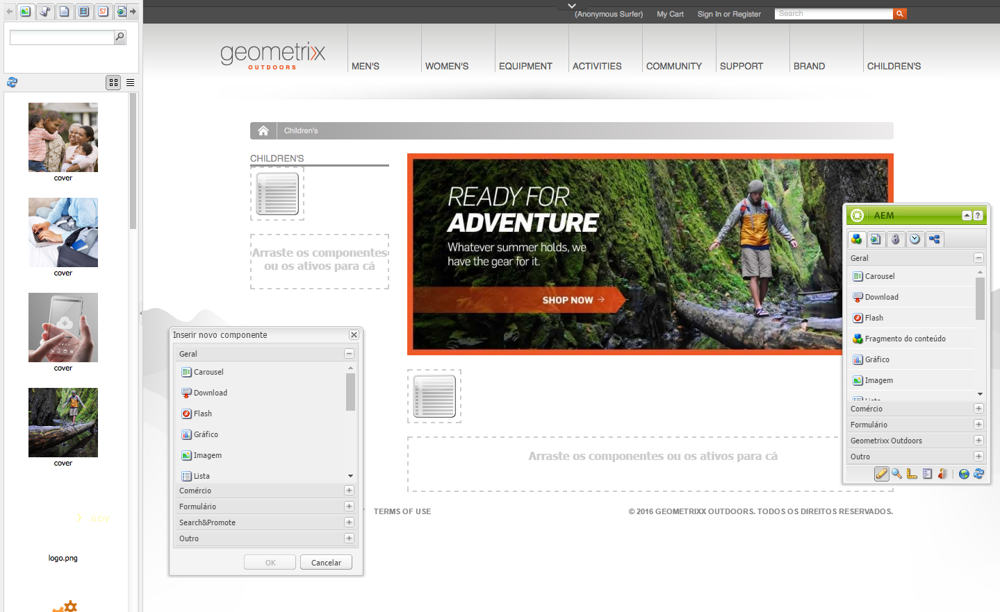
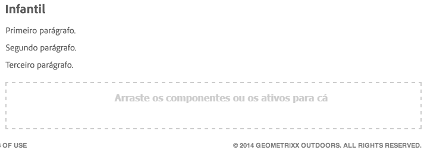
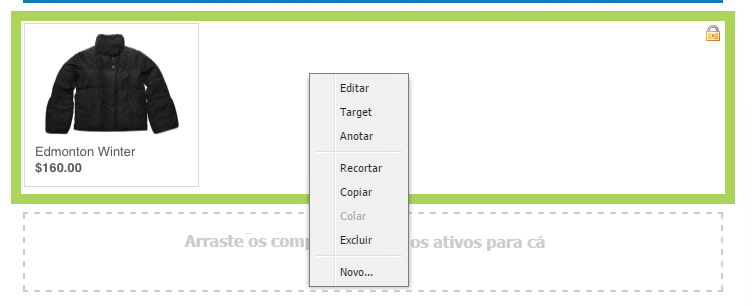
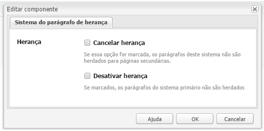
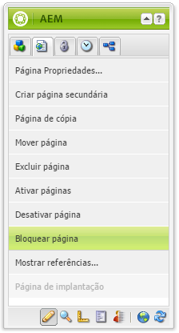

# Editar conteúdo da página{#editing-page-content}

Assim que a página for criada (nova ou como parte de um lançamento ou uma live copy), você pode editar o conteúdo para fazer as atualizações necessárias.

O conteúdo é adicionado usando componentes (adequados ao tipo de conteúdo) que podem ser arrastados para a página. Estes podem então ser editados no local, movidos ou excluídos. 

>[!NOTE]
>
>Sua conta precisa de [direitos de acesso apropriados](/help/sites-administering/security.md) e [permissões](/help/sites-administering/security.md#permissions) para editar as páginas; por exemplo, adicionar, editar ou apagar componentes, anotação, desbloqueio.
>
>Caso encontre algum problema, sugerimos que você entre em contato com o administrador do sistema.

## Sidekick {#sidekick}

O sidekick é uma ferramenta essencial durante a criação de páginas. Ele flutua durante a criação de uma página, de modo que esteja sempre visível.

Há várias guias e ícones disponíveis, incluindo:

* Componentes
* Página
* Info
* Versões
* Fluxo de trabalho
* Modos
* Andaime
* ClientContext
* Sites

Fornecem acesso a uma ampla seleção de funcionalidade; incluindo:

* [seleção de componentes](/help/sites-classic-ui-authoring/classic-page-author-env-tools.md#sidekick)
* [exibição de referências](/help/sites-classic-ui-authoring/classic-page-author-env-tools.md#showing-references)
* [acesso ao registro de auditoria](/help/sites-classic-ui-authoring/classic-page-author-env-tools.md#audit-log)
* [alternação de modos](/help/sites-classic-ui-authoring/classic-page-author-env-tools.md#page-modes)
* [criação](/help/sites-classic-ui-authoring/classic-page-author-work-with-versions.md#creating-a-new-version), [restauração](/help/sites-classic-ui-authoring/classic-page-author-work-with-versions.md#restoring-a-page-version-from-sidekick) e [comparação](/help/sites-classic-ui-authoring/classic-page-author-work-with-versions.md#comparing-with-a-previous-version) de versões

* [publicação](/help/sites-classic-ui-authoring/classic-page-author-publish-pages.md#publishing-a-page), [desfazer a publicação](/help/sites-classic-ui-authoring/classic-page-author-publish-pages.md#unpublishing-a-page) de uma página

* [edição das propriedades da página](/help/sites-classic-ui-authoring/classic-page-author-edit-page-properties.md)

* [scaffolding](/help/sites-authoring/scaffolding.md)

* [contexto de cliente](/help/sites-administering/client-context.md)

## Inserir um componente {#inserting-a-component}

### Inserir um componente {#inserting-a-component-1}

Após abrir a página, você pode começar a adicionar conteúdo. Você pode fazer isso adicionando componentes (também chamados de parágrafos).

Para inserir um novo componente:

1. Existem vários métodos de seleção do tipo de parágrafo que deseja inserir:

   * Clique duas vezes na área denominada **Arraste aqui os componentes ou ativos...** - a barra de ferramentas **Inserir um novo componente** abrirá. Selecione um componente e clique em **OK**.
   * Arraste um componente da barra de ferramentas flutuante (chamado sidekick) para inserir um novo parágrafo.
   * Clique com o botão direito do mouse em um parágrafo existente e selecione **Novo** - a barra de ferramentas Inserir um novo componente abrirá. Selecione um componente e clique em **OK**.

   

1. No sidekick e na barra de ferramentas **Inserir um novo componente** é possível visualizar uma lista dos componentes disponíveis (tipos parágrafo). Essas listas podem ser divididas em várias seções (por exemplo, geral, colunas, etc.), que podem ser expandidas quando necessário.

   Dependendo do seu ambiente de produção, essas escolhas podem ser diferentes. Para obter todos os detalhes sobre os componentes, consulte [Componentes padrão ](/help/sites-classic-ui-authoring/classic-page-author-default-components.md).

1. Insira o componente que deseja na página. Em seguida, clique duas vezes no parágrafo, uma janela é aberta e permite que você configure o parágrafo e adicione conteúdo.

### Inserir um componente usando o localizador de conteúdo  {#inserting-a-component-using-the-content-finder}

Você também pode adicionar um novo componente à página, arrastando um ativo do [Localizador de conteúdo](/help/sites-classic-ui-authoring/classic-page-author-env-tools.md#the-content-finder). Isto criará automaticamente um novo componente do tipo apropriado que contém o ativo.

Isso é válido para os seguintes tipos de ativos (alguns dependerão do sistema de página/parágrafo):

| Tipo de ativo | Tipo de componente resultante |
|---|---|
| Imagem | Imagem |
| Documento | Download |
| Produto | Produto |
| Vídeo | Flash |

>[!NOTE]
>
>Esse comportamento pode ser configurado para a instalação. Consulte [Configuração de um sistema de parágrafo para que a arrastar um ativo crie uma instância de componente](/help/sites-developing/developing-components.md#configuring-a-paragraph-system-so-that-dragging-an-asset-creates-a-component-instance) para obter mais detalhes.

Para criar um componente arrastando um dos tipos de ativos acima:

1. Certifique-se de que a página está no modo de [**edição**](/help/sites-classic-ui-authoring/classic-page-author-env-tools.md#page-modes).
1. Abra o [Localizador de conteúdo](/help/sites-classic-ui-authoring/classic-page-author-env-tools.md#the-content-finder).
1. Arraste o ativo para a posição desejada. O [placeholder do componente](#componentplaceholder) mostra onde o componente será posicionado.

   Um componente, apropriado para o tipo de ativo, será criado no local exigido, e ele conterá o ativo selecionado.

1. [Edite](#editmovecopypastedelete) o componente, se necessário.

## Edição de um componente (conteúdo e propriedades)  {#editing-a-component-content-and-properties}

Para editar um parágrafo existente, faça o seguinte:

* **Clique duas vezes** no parágrafo para abri-lo. Você vê a mesma janela visualizada ao criar o parágrafo com o conteúdo existente. Faça as alterações e clique em **OK**.

* **Clique com o botão direito do mouse no** parágrafo e clique em **Editar**.

* **Clique** duas vezes no parágrafo (um clique duplo lento) para entrar no modo de edição no local. Você poderá editar o texto diretamente na página, em vez de dentro de uma janela de diálogo. Neste modo, será fornecida uma barra de ferramentas no topo da página. Basta fazer as alterações e elas serão salvas automaticamente.

## Mover um componente {#moving-a-component}

Para mover um parágrafo:

>[!NOTE]
>
>Também é possível usar [Cortar e colar](#cut-copy-paste-a-component) para mover um componente.

1. Selecione o parágrafo a ser movido:

   

1. Arraste o parágrafo para o novo local - O AEM indica para onde o parágrafo pode ser movido com uma marca de seleção verde. Solte-o no local desejado.
1. Seu parágrafo foi movido:

   

## Excluir um componente {#deleting-a-component}

Para excluir um parágrafo:

1. Selecione o parágrafo e **clique com o botão direito do mouse**:

   

1. Selecione **Excluir** do menu. O WCM AEM solicita a confirmação de que você deseja excluir o parágrafo, já que esta ação não pode ser desfeita.
1. Clique em **OK**.

>[!NOTE]
>
>Caso tenha configurado as [Propriedades do usuário para exibir a barra de ferramentas de edição global,](/help/sites-classic-ui-authoring/author-env-user-props.md) também é possível executar determinadas ações nos parágrafos utilizando os botões **Copiar**, **Cortar**, **Colar**, **Excluir** disponíveis.\
>Vários [atalhos de teclado](/help/sites-classic-ui-authoring/classic-page-author-keyboard-shortcuts.md) também estão disponíveis.

## Cortar/Copiar/Colar um componente {#cut-copy-paste-a-component}

Como ao [Excluir um componente](#deleting-a-component), você pode usar o menu de contexto para copiar, cortar e/ou colar um componente

>[!NOTE]
>
>Caso tenha configurado as [Propriedades do usuário para exibir a barra de ferramentas de edição global,](/help/sites-classic-ui-authoring/author-env-user-props.md) também é possível executar determinadas ações nos parágrafos utilizando os botões **Copiar**, **Cortar**, **Colar**, **Excluir** disponíveis.
>
>Vários [atalhos de teclado](/help/sites-classic-ui-authoring/classic-page-author-keyboard-shortcuts.md) também estão disponíveis.

>[!NOTE]
>
>Os recusos de recortar, copiar e colar o conteúdo são suportados somente na mesma página.

## Componentes herdados {#inherited-components}

Componentes herdados podem ser o resultado de vários cenários, incluindo:

* [Gerenciamento de vários sites](/help/sites-administering/msm.md); também em combinação com o [scaffolding](/help/sites-classic-ui-authoring/classic-feature-scaffolding.md#scaffolding-with-msm-inheritance).

* [Lançamentos](/help/sites-classic-ui-authoring/classic-launches.md) (quando com base em live copy).
* Componentes específicos; por exemplo, o Sistema de parágrafo herdado no Geometrixx. 

Você pode cancelar (e depois reativar) a herança. Dependendo do componente, essa ação pode estar disponível em:

1. **Live Copy**

   Caso um componente seja parte de uma live-copy ou lançamento, o mesmo é indicado por um ícone de cadeado. Você pode clicar no cadeado para cancelar a herança.

   * O ícone de cadeado é apresentado quando o componente é selecionado, por exemplo:

   

   * O cadeado também é exibido na caixa de diálogo de componentes, por exemplo:

   

1. **Um sistema de parágrafo herdado**

   A caixa de diálogo de configuração. Por exemplo, o Sistema de parágrafo herdado no Geometrixx:

   

## Adicionar anotações {#adding-annotations}

[As anotações](/help/sites-classic-ui-authoring/classic-page-author-annotations.md) permitem que outros autores forneçam feedback sobre o seu conteúdo. Isso é usado frequentemente para fins de análise e validação.

## Visualizar páginas    {#previewing-pages}

Há dois ícones na borda inferior do sidekick que são importantes para a visualização das páginas:

* O ícone de lápis mostra que você está atualmente no modo de edição, onde é possível adicionar, modificar, mover ou excluir o conteúdo.

   

* O ícone de lupa permite que você selecione o modo de visualização onde a página é exibida, como será visualizada no ambiente de publicação (uma atualização de página às vezes é necessária):

   

   No modo de visualização o sidekick será reduzido, clique no ícone de seta para baixo para voltar ao modo de edição:

   

## Localizar e Substituir {#find-replace}

Para edições de maior escala de uma mesma frase, uma opção de menu **[Encontrar e substituir](/help/sites-classic-ui-authoring/author-env-search.md#find-and-replace)** permite que você procure e substitua várias instâncias de uma sequência em uma seção do site.

## Bloquear uma página {#locking-a-page}

O AEM permite bloquear uma página, de modo que ninguém mais possa modificar o conteúdo. Isso é útil quando você está fazendo diversas edições para uma página específica ou quando precisa congelar uma página por pouco tempo.

>[!CAUTION]
>
>O bloqueio de uma página deve ser usado com cuidado, pois só quem pode desbloquear uma página é a pessoa que fez o bloqueio (ou uma conta com privilégios de administrador).

Para bloquear uma página:

1. Na guia **Sites,** selecione a página que deseja bloquear.
1. Clique duas vezes na página para abri-la para edição.
1. Na guia **Página** do sidekick, selecione **Bloquear página**:

   

   Uma mensagem mostra que sua página está bloqueada para outros usuários. Além disso, no painel direito do console **Sites,** o WCM AEM exibe a página como bloqueada e indica qual usuário a bloqueou.

   

## Desbloquear uma página {#unlocking-a-page}

Para desbloquear uma página:

1. Na guia **Sites,** selecione a página que deseja desbloquear.
1. Clique duas vezes na página para abri-la.
1. Na guia **Página** do sidekick, selecione **Desbloquear página**.

## Desfazer e refazer edições de página {#undoing-and-redoing-page-edits}

Use os seguintes atalhos de teclado enquanto o quadro de conteúdo da página tiver foco:

* Desfazer: Ctrl + Z (Windows) ou Cmd + Z (Mac)
* Refazer: Ctrl + Y (Windows) ou Cmd + Y (Mac)

Ao desfazer ou refazer a remoção, adição, ou a transferência de um ou mais parágrafos, os destaques piscantes (comportamento padrão) indicam os pontos afetados.

>[!NOTE]
>
>Consulte [Desfazer e refazer edições de página - A teoria](#undoing-and-redoing-page-edits-the-theory) para obter todos os detalhes do que é possível fazer ao desfazer e refazer edições de página.

## Desfazer e refazer edições de página - a teoria {#undoing-and-redoing-page-edits-the-theory}

>[!NOTE]
>
>O administrador do sistema pode [configurar vários aspectos dos recursos desfazer/refazer](/help/sites-administering/config-undo.md) de acordo com os requisitos de sua ocorrência.

O AEM armazena um histórico de ações que você executa e a sequência executada. Assim, você desfaz várias ações na ordem executada. Em seguida, você pode usar o comando refazer para aplicar novamente uma ou mais ações.

Caso um elemento na página de conteúdo seja selecionado, o comando desfazer e refazer aplicam-se ao item selecionado, como um componente de texto.

O comportamento dos comandos desfazer e refazer é semelhante à de outros programas de software. Use os comandos para restaurar o estado recente da sua página Web, conforme você decide sobre o conteúdo. Por exemplo, caso mova um parágrafo de texto para um local diferente na página, você pode usar o comando desfazer para mover o parágrafo de volta. Se, em seguida, decidir mover novamente o parágrafo, use o comando refazer.

>[!NOTE]
>
>É possível:
>
>* refazer ações, contanto que não tenha feito uma edição de página desde que usou o comando desfazer.
>* desfazer um máximo de 20 ações de edição (configuração padrão).
>* use também os [atalhos de teclado](/help/sites-classic-ui-authoring/classic-page-author-keyboard-shortcuts.md) para desfazer e refazer.

>

Você pode usar os comandos desfazer e refazer para os seguintes tipos de alterações de páginas:

* Adicionar, editar, remover e mover parágrafos
* Edição no local do conteúdo do parágrafo
* Copiar, recortar e colar itens dentro de uma página
* Copiar, recortar e colar itens nas páginas
* Adicionar, remover e alterar arquivos e imagens
* Adicionar, remover e alterar anotações e rascunhos
* Alterações para o Scaffold
* Adicionar e remover referências
* Alterar os valores de propriedade nas caixas de diálogo do componente.

Os campos do formulário que formam a renderização dos componentes não são destinados a terem valores especificados durante a criação páginas. Portanto, os comandos desfazer e refazer não afetam as alterações feitas aos valores desses tipos de componentes. Por exemplo, não é possível desfazer a seleção de um valor em uma lista suspensa.

>[!NOTE]
>
>Permissões especiais são necessárias para desfazer e refazer as alterações nos arquivos e imagens. Além disso, o histórico do comando desfazer para as alterações nos arquivos e imagens dura, no mínimo, algumas horas. Entretanto, além desse tempo, desfazer as alterações não é garantido. O administrador pode fornecer permissões e alterar o tempo padrão de dez horas.

