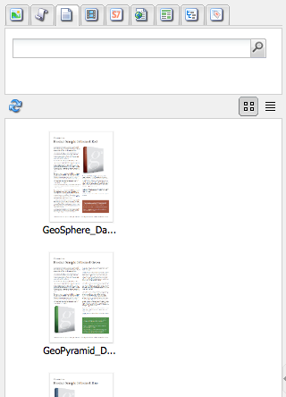

# Criação - o ambiente e as ferramentas{#authoring-the-environment-and-tools}

>[!CAUTION]
>
>AEM 6.4 chegou ao fim do suporte estendido e esta documentação não é mais atualizada. Para obter mais detalhes, consulte nossa [períodos de assistência técnica](https://helpx.adobe.com/br/support/programs/eol-matrix.html). Encontre as versões compatíveis [here](https://experienceleague.adobe.com/docs/).

O ambiente de criação do AEM fornece vários mecanismos para organização e edição de conteúdo. As ferramentas fornecidas são acessadas de vários consoles e editores de página.

## Administração do site {#site-administration}

O **Sites** O console permite gerenciar e navegar em seu site. Usando os dois painéis, a estrutura do seu site pode ser expandida e as ações executadas no elemento necessário:

## Editar o seu conteúdo da página {#editing-your-page-content}

Há um editor de página separado com a interface clássica, usando o localizador de conteúdo e o sidekick:

`http://localhost:4502/cf#/content/geometrixx/en/products/triangle.html`

## Acessar ajuda   {#accessing-help}

Vários **Ajuda** os recursos podem ser acessados diretamente do AEM:

Além de acessar [ajuda das barras de ferramentas do console](/help/sites-classic-ui-authoring/author-env-basic-handling.md#accessing-help), você também pode acessar a ajuda do sidekick (usando o ícone ) ao editar uma página:

Ou usando o **Ajuda** na caixa de diálogo Editar de componentes específicos; isso mostrará a ajuda sensível ao contexto.

## Sidekick {#sidekick}

O **Componentes** da guia do sidekick permite navegar pelos componentes disponíveis para adicioná-los à página atual. O grupo necessário pode ser expandido e, em seguida, um componente pode ser arrastado para o local desejado na página.

## O Localizador de conteúdo {#the-content-finder}

O Localizador de conteúdo é uma maneira rápida e fácil de localizar ativos e/ou conteúdo no repositório ao editar uma página.

Você pode usar o localizador de conteúdo para localizar uma gama de recursos. Quando apropriado, você pode arrastar um item e soltá-lo em um parágrafo na página:

* [Imagens](#finding-images)
* [Documentos](#finding-documents)
* [Filmes](#finding-movies)
* [Navegador Dynamic Media](/help/sites-administering/scene7.md#scene7contentbrowser)
* [Páginas](/help/sites-classic-ui-authoring/classic-page-author-env-tools.md#finding-pages)
* [Parágrafos](#referencing-paragraphs-from-other-pages)
* [Produtos](/help/sites-classic-ui-authoring/classic-page-author-env-tools.md#products)
* Ou para [navegar pelo site por estrutura de repositório](#the-content-finder)

Com todas as opções é possível [procurar itens específicos](#the-content-finder).

### Encontrar imagens {#finding-images}

Esta guia lista as imagens no repositório.

Após criar um parágrafo de Imagem na página, você pode arrastar um item e soltá-lo no parágrafo.

### Encontrar documentos {#finding-documents}

Esta guia lista os documentos no repositório.

Após criar um parágrafo de Download na página, você pode arrastar um item e soltá-lo no parágrafo.

### Encontrar filmes {#finding-movies}

Esta guia lista todos os filmes (por exemplo, itens de Flash) no repositório.

Após criar um parágrafo apropriado (por exemplo, Flash) na página, você pode arrastar um item e soltá-lo no parágrafo.

### Produtos {#products}

Esta guia lista os produtos. Após criar um parágrafo apropriado (por exemplo, Produto) na página, você pode arrastar um item e soltá-lo no parágrafo.

### Encontrando páginas {#finding-pages}

Esta guia mostra todas as páginas. Clique duas vezes em qualquer página para abri-la para edição.

### Referência a parágrafos de outras páginas {#referencing-paragraphs-from-other-pages}

Essa guia permite procurar outra página. Todos os parágrafos dessa página serão listados. Em seguida, você pode arrastar um parágrafo para a página atual, isso criará uma referência para o parágrafo original.

### Uso da visualização completa do repositório {#using-the-full-repository-view}

Esta guia mostra todos os recursos no repositório.

### Usar a pesquisa com o navegador de conteúdo {#using-search-with-the-content-browser}

Em todas as opções, você pode procurar itens específicos. As tags e os recursos que correspondem ao padrão de pesquisa são listados:

Também é possível usar curingas para pesquisa. Os curingas compatíveis são:

* `*` - corresponde a uma sequência de zero ou mais caracteres.

* `?` - corresponde a um único caractere.

>[!NOTE]
>
>Há uma pseudopropriedade &quot;name&quot; que deve ser usada para executar uma pesquisa curinga.

Por exemplo, se houver uma imagem disponível com o nome:

`ad-nmvtis.jpg`

os seguintes padrões de pesquisa o encontrarão (e qualquer outra imagem correspondente ao padrão):

* `name:*nmv*`
* `name:AD*` - o caractere correspondente é *not* diferencia maiúsculas de minúsculas.
* `name:ad?nm??is.*` - é possível usar qualquer número de curingas em um query.

>[!NOTE]
>
>Você também pode usar [SQL2](https://helpx.adobe.com/experience-manager/6-4/sites/developing/using/reference-materials/javadoc/org/apache/jackrabbit/commons/query/sql2/package-summary.html) pesquisar.

## Mostrando referências {#showing-references}

AEM permite visualizar quais páginas estão vinculadas à página em que você está trabalhando no momento.

Para mostrar referências de página diretas:

1. No sidekick, selecione o **Página** ícone de guia.

   

1. Selecionar **Mostrar referências...** AEM abre a janela Referências e exibe quais páginas se referem à página selecionada, incluindo seus caminhos.

   

Em determinadas situações, outras ações estão disponíveis no Sidekick, incluindo:

* [Lançamentos](/help/sites-classic-ui-authoring/classic-launches.md)
* [Live Copies](/help/sites-administering/msm.md)

* [Blueprint](/help/sites-administering/msm-best-practices.md)

Outras [relacionamentos entre páginas podem ser vistos no console Sites](/help/sites-classic-ui-authoring/author-env-basic-handling.md#page-information-on-the-websites-console).

## Log de auditoria {#audit-log}

O **Log de auditoria** pode ser acessada do **Informações** guia do sidekick. Ele lista as ações recentes executadas na página atual; por exemplo:

## Informações da página {#page-information}

O console Site também [fornece informações sobre o status atual da página](/help/sites-classic-ui-authoring/author-env-basic-handling.md#page-information-on-the-websites-console) como publicação, modificação, bloqueio, livecopy etc.

## Modos de página   {#page-modes}

Ao editar uma página com a interface clássica, há vários modos que podem ser acessados usando os ícones na parte inferior do sidekick:

A linha de ícones na parte inferior do Sidekick são usados para alternar os modos de trabalho com as páginas:

* [Editar](/help/sites-classic-ui-authoring/classic-page-author-edit-mode.md)

   Esse é o modo padrão e permite que você edite a página, adicionando ou excluindo componentes e fazendo outras alterações.

* [Visualização](/help/sites-classic-ui-authoring/classic-page-author-edit-content.md#previewing-pages)

   Esse modo permite visualizar a página como se ela estivesse aparecendo no site em sua forma final.

* [Design](/help/sites-classic-ui-authoring/classic-page-author-design-mode.md#main-pars-procedure-0)

   Nesse modo, você tem a possibilidade de editar o design da página configurando os componentes acessíveis.

>[!NOTE]
>
>Outras opções também estão disponíveis:
>
>* [Andaime](/help/sites-classic-ui-authoring/classic-feature-scaffolding.md)
>* [ClientContext](/help/sites-administering/client-context.md)
>* Sites - abrirá o console Sites.
>* Recarregar - atualizará a página.

## Atalhos de teclado {#keyboard-shortcuts}

Vários [atalhos de teclado](/help/sites-classic-ui-authoring/classic-page-author-keyboard-shortcuts.md) estão disponíveis.
