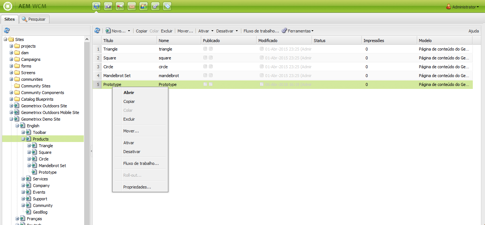
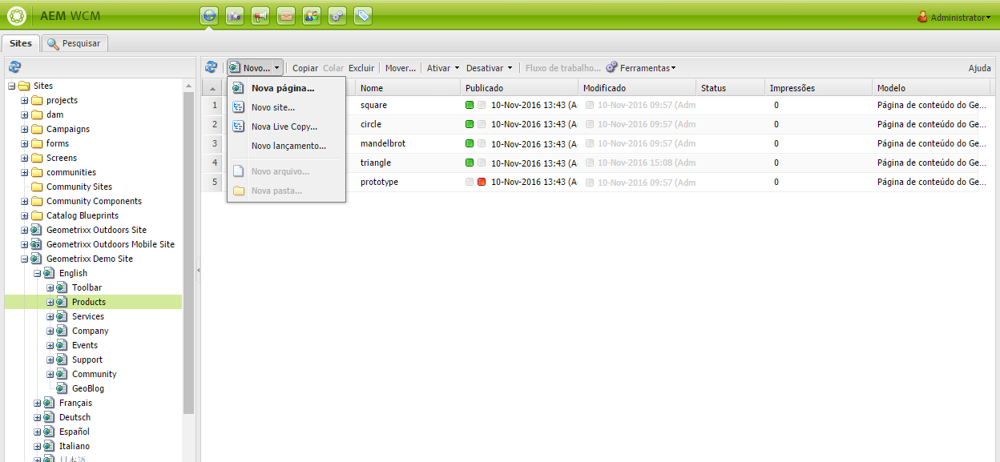
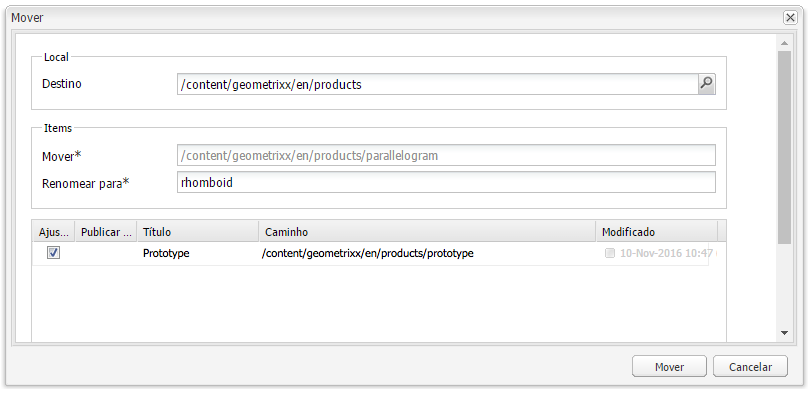

# Criar e organizar páginas{#creating-and-organizing-pages}

>[!CAUTION]
>
>AEM 6.4 chegou ao fim do suporte estendido e esta documentação não é mais atualizada. Para obter mais detalhes, consulte nossa [períodos de assistência técnica](https://helpx.adobe.com/br/support/programs/eol-matrix.html). Encontre as versões compatíveis [here](https://experienceleague.adobe.com/docs/).

Esta seção descreve como criar e gerenciar páginas com o Adobe Experience Manager (AEM) para que você possa [criar conteúdo](/help/sites-classic-ui-authoring/classic-page-author-edit-content.md) nessas páginas.

>[!NOTE]
>
>Sua conta precisa do [direitos de acesso apropriados](/help/sites-administering/security.md) e [permissões](/help/sites-administering/security.md#permissions) para realizar ações nas páginas, por exemplo, criar, copiar, mover, editar, excluir.
>
>Caso encontre algum problema, sugerimos que você entre em contato com o administrador do sistema.

## Organizar seu site {#organizing-your-website}

Como autor, você precisará organizar o site dentro do AEM. Isso envolve criar e nomear suas páginas de conteúdo para que:

* você pode encontrá-las facilmente no ambiente de criação
* os visitantes do seu site podem navegar facilmente por elas no ambiente de publicação

Você também pode usar [pastas](#creating-a-new-folder) para ajudar a organizar o seu conteúdo.

A estrutura de um site pode ser considerada como uma *estrutura de árvore* que armazena suas páginas de conteúdo. Os nomes dessas páginas de conteúdo são usadas para formar os URLs, enquanto o título é exibido quando o conteúdo da página é visualizado.

Apresenta-se a seguir um extrato do local de Geometrixx; onde, por exemplo, a variável `Triangle` será acessada:

* Ambiente de criação

   `http://localhost:4502/cf#/content/geometrixx/en/products/triangle.html`

* Ambiente de publicação

   `http://localhost:4503/content/geometrixx/en/products/triangle.html`

   Dependendo da configuração da sua instância, use o `/content` pode ser opcional no ambiente de publicação.

```xml
  /content
    /geometrixx
      /en
        /toolbar...
        /products
          /triangle
            /overview 
            /features
          /square...
          /circle...
          /...
        /...
      /fr...
      /de...
      /es...
      /...
    /...
```

Essa estrutura pode ser visualizada no console Sites, que você pode usar para [navegar pela estrutura de árvore](/help/sites-classic-ui-authoring/author-env-basic-handling.md#main-pars-text-15).



### Convenções de nomenclatura da página {#page-naming-conventions}

Ao criar uma nova página, existem dois campos principais:

* **[Título](#title)**:

   * O título é exibido ao usuário no console, na parte superior do conteúdo da página ao editar.
   * Esse campo é obrigatório.

* **[Nome](#name)**:

   * Usado para gerar o URI.
   * A entrada do usuário para este campo é opcional. Se não especificado, o nome é derivado do título.

Ao criar uma nova página, o AEM [validar o nome da página de acordo com as convenções](/help/sites-developing/naming-conventions.md) impostas pelo AEM e JCR.

A implementação e a lista de caracteres permitidos diferem ligeiramente de acordo com a interface do usuário (é mais extensa para a interface do usuário habilitada para toque), mas o mínimo permitido é:

* &#39;a&#39; a &#39;z&#39;
* &#39;A&#39; a &#39;Z&#39;
* &#39;0&#39; a &#39;9&#39;
* _ (sublinhado)
* `-` (hífen/sinal de menos)

Use apenas esses caracteres se quiser ter certeza de que eles serão aceitos/usados (se precisar de detalhes completos de todos os caracteres permitidos, consulte [as convenções de nomenclatura](/help/sites-developing/naming-conventions.md)).

#### Título {#title}

Quando você fornece apenas um **Título** de página ao criar uma nova página, o AEM deriva o **Nome** de página desta cadeia de caracteres e o valida[ de acordo com as convenções](/help/sites-developing/naming-conventions.md) impostas pelo AEM e JCR. Em ambas as interfaces de usuário do **Título** será aceito, mas o nome derivado terá os caracteres inválidos substituídos. Por exemplo:

| Título | Nome derivado |
|---|---|
| Schön | schoen.html |
| SC%&amp;&amp;ast;ç+ | sc---c-.html |

#### Nome {#name}

Quando você fornece um **Nome** de página ao criar uma nova página, o AEM valida[ esse nome de acordo com as convenções](/help/sites-developing/naming-conventions.md) impostas pelo AEM e JCR.

Na interface clássica, você **não é possível inserir caracteres inválidos** no **Nome** campo.

>[!NOTE]
>Na interface habilitada para toque, você **não é possível enviar caracteres inválidos** no **Nome** campo. Quando o AEM detecta caracteres inválidos, o campo é realçado e uma mensagem explicativa é exibida para indicar os caracteres que precisam ser removidos/substituídos.

>[!NOTE]
>
>Evite usar um código de duas letras, conforme definido por ISO-639-1, a menos que seja uma raiz de idioma.
>
>Consulte [Preparação de conteúdo para tradução](/help/sites-administering/tc-prep.md) para obter mais informações.

### Modelos {#templates}

Em AEM, um modelo especifica um tipo especializado de página. Um modelo será usado como a base para qualquer nova página que esteja sendo criada.

O modelo define a estrutura de uma página; incluindo uma imagem em miniatura e outras propriedades. Por exemplo, você pode ter modelos separados para páginas de produtos, mapas de sites e informações de contato. Os modelos são compostos de [componentes](#components).

AEM vem com vários modelos prontos para uso. Os modelos oferecidos dependem do site individual e as informações que precisam ser fornecidas (ao criar a nova página) dependem da interface do usuário que está sendo usada. Os campos principais são:

* **Título** O título exibido na página da Web resultante.

* **Nome** Usado ao nomear a página.

* **Modelo** Uma lista de modelos disponíveis para uso ao gerar a nova página.

### Componentes {#components}

Os componentes são os elementos fornecidos pelo AEM, desse modo, é possível adicionar tipos específicos de conteúdo. AEM vem com vários componentes prontos para uso que fornecem funcionalidade abrangente; estes incluem:

* Texto
* Imagem
* Slideshow
* Vídeo
* muito mais

Depois de criar e abrir uma página, você pode [adicionar conteúdo usando os componentes](/help/sites-classic-ui-authoring/classic-page-author-edit-content.md#insertinganewparagraph), disponíveis na [sidekick](/help/sites-classic-ui-authoring/classic-page-author-env-tools.md#sidekick).

## Gerenciamento de páginas {#managing-pages}

### Criar uma nova página {#creating-a-new-page}

A menos que todas as páginas tenham sido criadas antecipadamente para você, antes de começar a criar conteúdo, você deve criar uma página:

1. No **Sites** selecione o nível no qual deseja criar uma nova página.

   No exemplo a seguir, você está criando uma página no nível de **Produtos** - no painel esquerdo; o painel direito mostra as páginas que já existem no nível em **Produtos**.

   

1. No **Novo...** (clique na seta ao lado de **Novo...**), selecione **Nova página...**. O **Criar página** será aberta.

   Clicar **Novo...** atua também como um atalho para o **Nova página...** opção.

1. O **Criar página** permite:

   * Forneça uma **Título**; isso é exibido ao usuário.
   * Forneça uma **Nome**; isso é usado para gerar o URI. Se não for especificado, o nome será derivado do título.

      * Se você fornecer uma página **Nome** ao criar uma nova página, AEM [validar o nome de acordo com as convenções](/help/sites-developing/naming-conventions.md) impostas pelo AEM e JCR.
      * Na interface clássica, você **não é possível inserir caracteres inválidos** no **Nome** campo.
   * Clique no modelo que deseja usar para criar a nova página.

      O modelo é usado como a base para a nova página; por exemplo, para determinar o layout básico de uma página de conteúdo.
   >[!NOTE]
   >
   >Consulte [Convenções de nomenclatura da página](#page-naming-conventions).

   As informações mínimas necessárias para criar uma nova página são a variável **Título** e o modelo necessário.

   

   >[!NOTE]
   >
   >Se quiser usar caracteres unicode nos URLs, defina o Alias ( `sling:alias`propriedade ) ([propriedades da página](/help/sites-classic-ui-authoring/classic-page-author-edit-page-properties.md)).

1. Clique em **Criar** para criar a página. Você retorna ao **Sites** , onde é possível visualizar uma entrada para a nova página.

   O console fornece informações sobre a página (por exemplo, quando foi editada pela última vez e por quem), que é atualizada conforme necessário.

   >[!NOTE]
   >
   >Você também pode criar uma página quando estiver editando uma página existente. Usar **Criar página secundária **do **Página** do sidekick, criará uma nova página diretamente sob a página que está sendo editada.

### Abrir uma página para edição {#opening-a-page-for-editing}

Você pode abrir a página a ser [editado](/help/sites-classic-ui-authoring/classic-page-author-edit-content.md#editing-a-component-content-and-properties) por um dos vários métodos:

* De **Sites** , é possível **clique duas vezes** a entrada da página para abri-la para edição.

* De **Sites** , é possível **clique com o botão direito do mouse** (menu de contexto) o item da página, em seguida, selecione **Abrir** no menu .

* Depois de ter aberto uma página, você pode navegar para outras páginas dentro do site (para editá-las) clicando nos hiperlinks.

### Copiar e colar uma página      {#copying-and-pasting-a-page}

Ao copiar, você pode copiar:

* uma página única
* uma página junto com todas as subpáginas

1. No **Sites** selecione a página que deseja copiar.

   >[!NOTE]
   >
   >Nesse estágio, é irrelevante se você deseja copiar uma única página ou as subpáginas subjacentes.

1. Clique em **Copiar**.

1. Navegue até o novo local e clique em:

   * **Colar** - para colar a página junto com todas as subpáginas
   * **Shift + Colar** - para colar somente a página selecionada

   As páginas são coladas no novo local.

   >[!NOTE]
   >
   >O nome da página pode ser ajustado automaticamente se uma página existente já tiver o mesmo nome.

   >[!NOTE]
   >
   >Você também pode usar **Copiar página** do **Página** guia do sidekick. Isso abrirá uma caixa de diálogo onde você pode especificar o destino, etc.

### Mover ou renomear página {#moving-or-renaming-page}

>[!NOTE]
>
>A renomeação de uma página também está sujeita ao [Convenções de nomenclatura da página](#page-naming-conventions) ao especificar o nome da nova página.

O procedimento para mover ou renomear uma página é o mesmo. Com a mesma ação, é possível:

* mover uma página para um novo local
* renomear uma página no mesmo local
* mover uma página para um novo local e renomeá-la ao mesmo tempo

AEM oferece a funcionalidade de atualizar os links internos para a página que está sendo renomeada ou movida. Isso pode ser feito página por página para proporcionar flexibilidade total.

Para mover ou renomear uma página:

1. Existem vários métodos para acionar uma movimentação:

   * No **Sites** , clique para selecionar a página e selecione **Mover...**
   * No **Sites** , você também pode selecionar o item da página e **clique com o botão direito do mouse** e selecione **Mover...**
   * Ao editar uma página, você pode selecionar **Mover página** do **Página** guia do sidekick.

1. O **Mover** janela aberta; aqui você pode especificar um novo local, um novo nome para a página ou ambos.

   

   A página também lista todas as páginas que fazem referência à página que está sendo movida. Dependendo do status da página de referência, é possível ajustar esses links em e/ou republicar as páginas.

1. Preencha os seguintes campos, conforme apropriado:

   * **Destino**

      Use o mapa do site (disponível através do seletor suspenso) para selecionar o local para onde a página deve ser movida.

      Caso esteja apenas renomeando a página, ignore este campo.

   * **Mover**

      Especifique a página que será movida - isso geralmente é preenchido por padrão, dependendo de como e onde você iniciou a ação de mover.

   * **Renomear para**

      O rótulo da página atual é exibido por padrão. Especifique o novo rótulo de página, se necessário.

   * **Ajustar**

      Atualize os links na página listada que apontam para a página movida: por exemplo, se a página A tem links para a página B, o AEM ajusta os links na página A caso você mova a página B.

      Isso pode ser selecionado/desmarcado para cada página de referência individual.

   * **Publicar novamente**

      Republicar a página de referência; novamente, isso pode ser selecionado para cada página individual.
   >[!NOTE]
   >
   >Se a página já tiver sido ativada, movê-la automaticamente a desativará. Por padrão, ele será reativado quando a movimentação for concluída, mas isso pode ser alterado ao desmarcar a opção **Republicar** para a página no **Mover** janela.

1. Clique em **Mover**. A confirmação será necessária. Clique em **OK** para confirmar.

   >[!NOTE]
   >
   >O título da página não será atualizado.

### Excluir uma página {#deleting-a-page}

1. Você pode excluir uma página de vários locais:

   * No **Sites** , clique para selecionar a página, em seguida, clique com o botão direito do mouse e selecione **Excluir** no menu resultante.
   * No **Sites** , clique para selecionar a página e selecione **Excluir** no menu da barra de ferramentas.
   * No sidekick use a variável **Página** guia para selecionar **Excluir página** - isso exclui a página que está aberta no momento.

1. Após ter selecionado para excluir uma página, você deve confirmar a solicitação, pois a ação não pode ser desfeita.

   >[!NOTE]
   >
   >Após a exclusão, se a página tiver sido publicada, é possível restaurar a versão mais recente (ou uma específica), mas pode não ter exatamente o mesmo conteúdo que a sua última versão, caso outras modificações tenham sido feitas. Consulte [Como restaurar páginas](/help/sites-classic-ui-authoring/classic-page-author-work-with-versions.md#restoringpages) para obter mais detalhes.

>[!NOTE]
>
>Se uma página já estiver ativada, ela será desativada automaticamente antes da exclusão.

### Bloquear uma página   {#locking-a-page}

Você pode [bloquear/desbloquear uma página](/help/sites-classic-ui-authoring/classic-page-author-edit-content.md#locking-a-page) em um console ou ao editar uma página individual. Informações sobre se uma página está bloqueada também são mostradas em ambos os locais.

### Criação de uma nova pasta {#creating-a-new-folder}

>[!NOTE]
>
>As pastas também estão sujeitas ao [Convenções de nomenclatura da página](#page-naming-conventions) ao especificar o nome da nova pasta.

1. Abra o **Sites** e navegue até o local desejado.
1. No **Novo...** (clique na seta ao lado de **Novo...**), selecione **Nova pasta...**.
1. O **Criar pasta** será aberta. Aqui você pode inserir o **Nome** e o **Título**:

   

1. Selecione **Criar** para criar a pasta.
