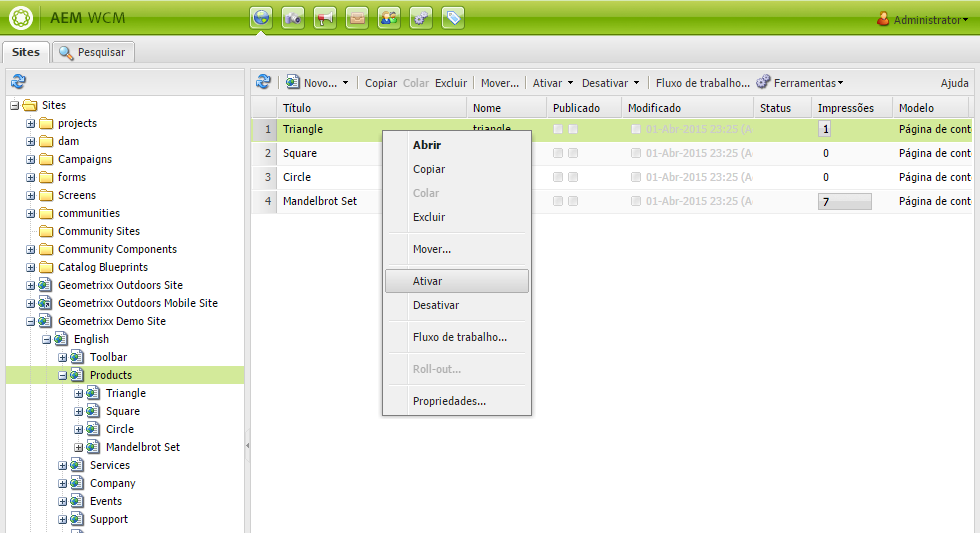
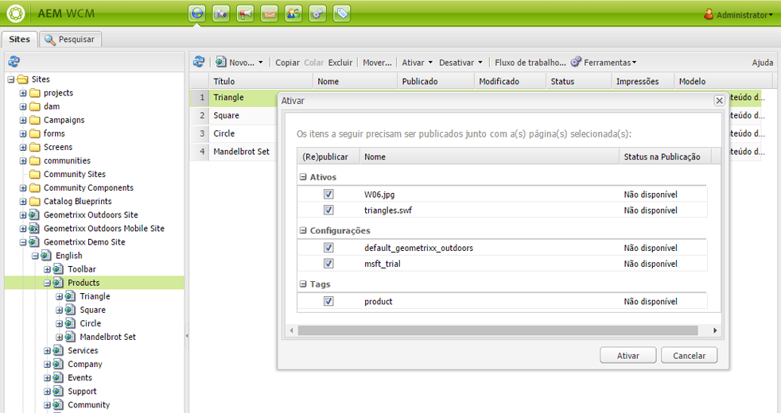
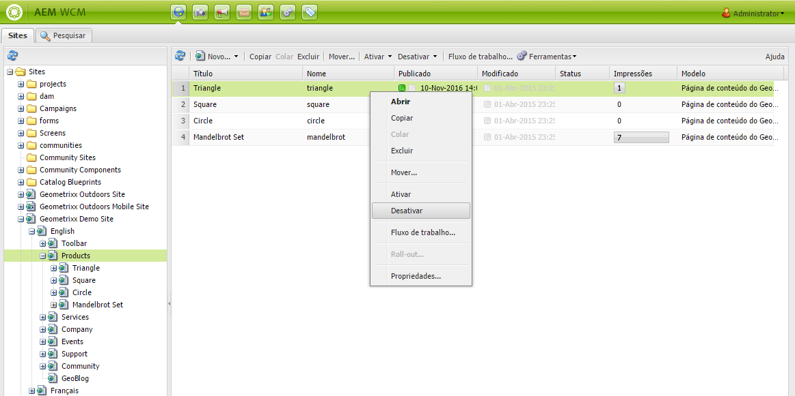
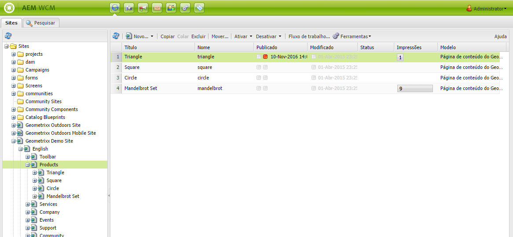
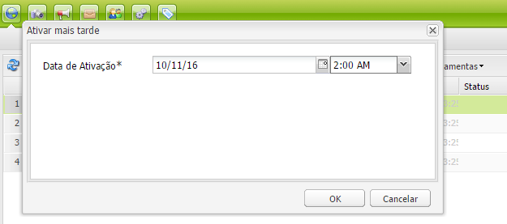
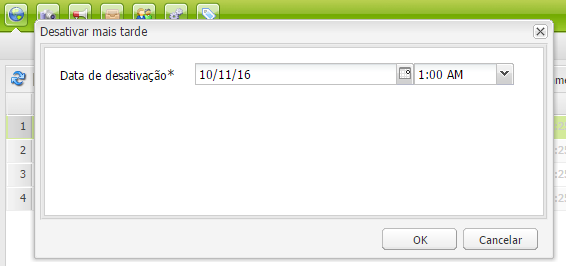
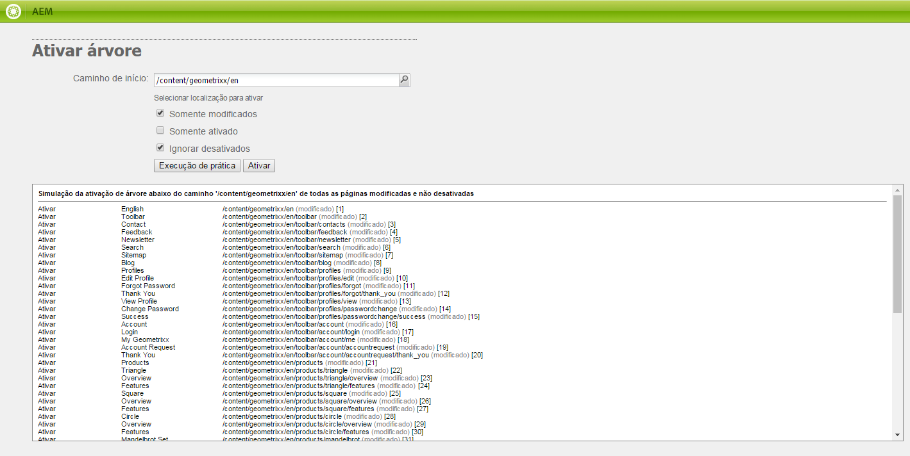

# Publicar páginas{#publishing-pages}

>[!CAUTION]
>
>AEM 6.4 chegou ao fim do suporte estendido e esta documentação não é mais atualizada. Para obter mais detalhes, consulte nossa [períodos de assistência técnica](https://helpx.adobe.com/br/support/programs/eol-matrix.html). Encontre as versões compatíveis [here](https://experienceleague.adobe.com/docs/).

Depois de criar e revisar seu conteúdo no ambiente de criação, o objetivo é disponibilizá-lo em seu site público (seu ambiente de publicação).

Isso é chamado de publicação de uma página. Quando você deseja remover uma página do ambiente de publicação, este é o processo de desfazer a publicação. Ao publicar e desfazer a publicação, a página permanece disponível no ambiente de criação para outras alterações até que você a exclua.

Você também pode publicar/desfazer a publicação de uma página imediatamente ou em uma data/hora predefinida posteriormente.

>[!NOTE]
>
>Certos termos relacionados à publicação podem ser confundidos:
>
>* **Publicar/Desfazer a publicação**
   >  Esses são os termos principais para as ações que tornam o conteúdo publicamente disponível no ambiente de publicação (ou não).
>
>* **Ativar / Desativar**
   >  Estes termos são sinônimos de publicar/desfazer a publicação.
>
>* **Replicar / Replicação**
   >  Esses são os termos técnicos que descrevem a movimentação de dados (por exemplo, conteúdo da página, arquivos, código, comentários do usuário) de um ambiente para outro, como ao publicar ou reverter a replicação de comentários do usuário.
>

>[!NOTE]
>
>Se você não tiver os privilégios necessários para publicar uma página específica:
>
>* Um fluxo de trabalho será acionado para notificar a pessoa apropriada de sua solicitação para publicação.
>* Uma mensagem será exibida (por um curto período) para notificá-lo sobre isso.
>

## Publicar uma página {#publishing-a-page}

Há dois métodos para ativar uma página:

* [do console Sites](#activating-a-page-from-the-websites-console)
* [do sidekick na própria página](#activating-a-page-from-sidekick)

>[!NOTE]
>
>Também é possível ativar uma subárvore de várias páginas usando [Ativar árvore](#howtoactivateacompletesectiontreeofyourwebsite) no console Ferramentas .

### Ativar uma página do console Sites {#activating-a-page-from-the-websites-console}

Você pode ativar páginas no console Sites. Depois de ter aberto uma página e modificado seu conteúdo, você volta ao console Sites :

1. No console Sites, selecione a página que deseja ativar.
1. Selecionar **Ativar**, no menu superior ou no suspenso, no item da página selecionada.

   Para ativar o conteúdo da página e todas as suas subpáginas, use o [**Ferramentas** console](/help/sites-classic-ui-authoring/classic-page-author-publish-pages.md#howtoactivateacompletesectiontreeofyourwebsite).

   

   >[!NOTE]
   >
   >Se necessário, o AEM solicita que você ative ou reative quaisquer ativos vinculados à página. Você pode marcar ou desmarcar as caixas de seleção para ativar esses ativos.

1. Se necessário, o AEM solicita que você ative ou reative quaisquer ativos vinculados à página. Você pode marcar ou desmarcar as caixas de seleção para ativar esses ativos.

   

1. AEM WCM ativa o conteúdo selecionado. A página ou páginas publicadas aparecem no [Console de sites](/help/sites-classic-ui-authoring/author-env-basic-handling.md#page-information-on-the-websites-console) (marcado em verde) com informações sobre quem ativou o conteúdo, bem como a data e a hora da ativação.

   

### Ativar uma página do Sidekick {#activating-a-page-from-sidekick}

Você também pode ativar uma página quando ela estiver aberta para edição.

Após ter aberto a página e modificado seu conteúdo, você:

1. Selecione o **Página** no Sidekick.
1. Clique em **Ativar página**.

   Uma mensagem é exibida na parte superior direita da janela, confirmando que a página foi ativada.

## Desfazer a publicação de uma página {#unpublishing-a-page}

Para remover uma página do ambiente de publicação, você desativa o conteúdo.

Para desativar uma página:

1. No console Sites, selecione a página que deseja desativar.
1. Selecionar **Desativar**, no menu superior ou no suspenso, no item da página selecionada. Você receberá uma solicitação para confirmar a exclusão.

   

1. Atualize o [Console de sites](/help/sites-classic-ui-authoring/author-env-basic-handling.md#page-information-on-the-websites-console) e o conteúdo é marcado em vermelho, indicando que não está mais publicado.

   

## Ativar/desativar mais tarde {#activate-deactivate-later}

### Ativar mais tarde {#activate-later}

Para agendar a ativação para um momento posterior:

1. No console Sites, acesse **Ativar** e selecione **Ativar mais tarde**.
1. Na caixa de diálogo que é aberta, forneça a data e hora para a ativação e clique em **OK**. Isso cria uma versão da página que é ativada no horário especificado.

   

A ativação posterior inicia um fluxo de trabalho para ativar esta versão de página no horário especificado. Por outro lado, a desativação mais tarde inicia um fluxo de trabalho para desativar esta versão de página em um horário específico.

Caso deseje cancelar essa ativação/desativação, acesse o [Console do fluxo de trabalho](/help/sites-administering/workflows-administering.md#main-pars-title-3-yjqslz-refd) para encerrar o fluxo de trabalho correspondente.

### Desativar mais tarde {#deactivate-later}

Para agendar a desativação para um momento posterior:

1. No console Sites, acesse **Desativar** e selecione **Desativar mais tarde**.

1. Na caixa de diálogo que é aberta, forneça a data e hora para a desativação e clique em **OK**.

   

**Desativação posterior** r inicia um fluxo de trabalho para desativar esta versão de página em um horário específico.

Caso deseje cancelar a desativação, acesse [Console do fluxo de trabalho](/help/sites-administering/workflows-administering.md#main-pars-title-3-yjqslz-refd) para encerrar o fluxo de trabalho correspondente.

## Ativação/Desativação Programada (Tempo Ligado/Desligado) {#scheduled-activation-deactivation-on-off-time}

Você pode agendar horários para publicar/desfazer a publicação de uma página usando o **Hora de ligar** e **Hora de desligar** que pode ser definido na variável [Propriedades da página](/help/sites-classic-ui-authoring/classic-page-author-edit-page-properties.md).

### Determinar o status de publicação da página - Interface clássica {#determining-page-publication-status-classic-ui}

O status pode ser visualizado na [Console de sites](/help/sites-classic-ui-authoring/author-env-basic-handling.md#page-information-on-the-websites-console). As cores indicam o status da publicação.

## Ativar uma seção completa (árvore) do seu site {#activating-a-complete-section-tree-of-your-website}

No **Sites** é possível ativar as páginas individuais. Ao entrar ou atualizar um número considerável de páginas de conteúdo - todas residentes na mesma página raiz - pode ser mais fácil ativar toda a árvore em uma ação. Também é possível executar um exercício de prática para emular uma ativação e destacar quais páginas foram ativadas.

1. Abra o **Ferramentas** ao selecioná-lo no **Welcome** e clique duas vezes em **Replicação** para abrir o console ( `http://localhost:4502/etc/replication.html`).

   

1. No **Replicação** , clique em **Ativar árvore**.

   A seguinte janela ( `http://localhost:4502/etc/replication/treeactivation.html`) será exibida.

   

1. Insira o **Caminho de início**. Isso especifica o caminho para a raiz da seção que você deseja ativar (publicar). Esta página e todas as páginas embaixo são consideradas para a ativação (ou usadas na emulação caso uma Execução de prática seja selecionada).
1. Ative os critérios de seleção conforme necessário:

   * **Somente modificados**: ativar apenas as páginas que foram modificadas.
   * **Somente ativados**: ativar apenas as páginas que (já) foram ativadas. Atua como uma forma de reativação.
   * **Ignorar desativado**: ignorar quaisquer páginas que tenham sido desativadas.

1. Selecione a ação que deseja executar:

   1. Selecionar **Execução de prática** se você deseja verificar quais páginas *will* ser ativada. Isso é apenas uma emulação, nenhuma página será ativada.
   1. Selecionar **Ativar** se desejar ativar as páginas.
