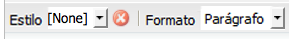
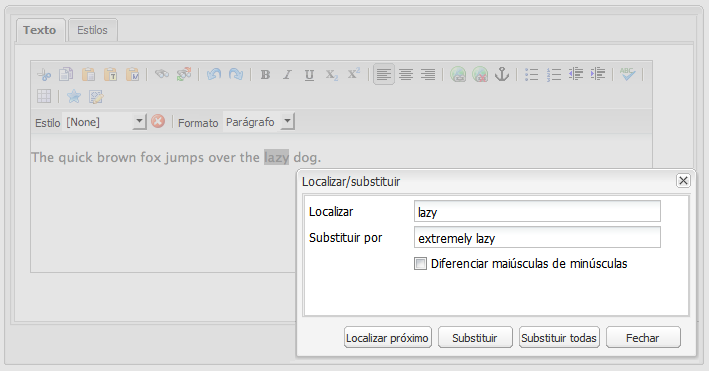
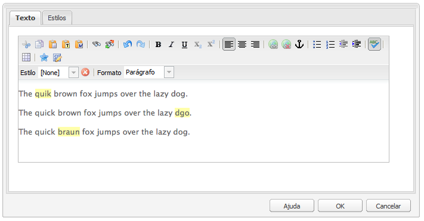
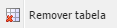

# Editor de rich text{#rich-text-editor}

>[!CAUTION]
>
>AEM 6.4 chegou ao fim do suporte estendido e esta documentação não é mais atualizada. Para obter mais detalhes, consulte nossa [períodos de assistência técnica](https://helpx.adobe.com/br/support/programs/eol-matrix.html). Encontre as versões compatíveis [here](https://experienceleague.adobe.com/docs/).

O Editor de Rich Text é um elemento básico fundamental para introduzir o conteúdo textual no AEM. É a base de vários componentes, incluindo:

* Texto
* Imagem de texto
* Tabela

## Editor de rich text {#rich-text-editor-2}

A caixa de diálogo de edição WYSIWYG oferece uma ampla variedade de funcionalidades:

>[!NOTE]
>
>Os recursos disponíveis podem ser configurados para projetos individuais, portanto, pode variar para sua instalação.

## Edição no local {#in-place-editing}

Além do diálogo baseado no modo de edição de Rich Text, o AEM também fornece o modo de edição no local, que permite a edição direta do texto da forma como é exibido no layout da página.

Clique duas vezes em um parágrafo (um clique duplo lento) para entrar no modo de edição no local (a borda do componente agora será laranja).

Você poderá editar o texto diretamente na página, em vez de dentro de uma janela de diálogo. Basta fazer as alterações e elas serão salvas automaticamente.

>[!NOTE]
>
>Se o localizador de conteúdo estiver aberto, uma barra de ferramentas com as opções de formatação do RTE será exibida na parte superior da guia (como acima).
>
>Se o localizador de conteúdo não estiver aberto, a barra de ferramentas não será exibida.

No momento, o modo de Edição no local está ativado para elementos de página gerados pela variável **Texto** e **Título** componentes.

>[!NOTE]
>
>O **Título** foi projetado para conter um texto curto sem quebras de linha. Ao editar um título no Modo de edição local, inserir uma quebra de linha abrirá um novo **Texto** componente abaixo do título.

## Recursos do Editor de Rich Text {#features-of-the-rich-text-editor}

O Editor de Rich Text fornece vários recursos, [depende da configuração](/help/sites-administering/rich-text-editor.md) do componente individual. Os recursos estão disponíveis para a interface otimizada para toque e clássica.

### Formatos básicos de caracteres {#basic-character-formats}

Aqui, é possível aplicar a formatação a caracteres selecionados (destacados); algumas opções também têm teclas de atalho:

* Negrito (Ctrl-B)
* Itálico (Ctrl-I)
* Sublinhado (Ctrl-U)
* Subscrito
* Sobrescrito

Todos operam como um botão de alternância, portanto, a reseleção removerá o formato.

### Estilos e formatos predefinidos {#predefined-styles-and-formats}

A instalação pode incluir estilos e formatos predefinidos. Eles estão disponíveis com a variável **Estilo** e **Formato** listas suspensas e podem ser aplicadas ao texto selecionado.

Um estilo pode ser aplicado a uma string específica (um estilo correlaciona-se a CSS):

Considerando que um formato é aplicado a todo o parágrafo do texto (um formato é baseado em HTML):

Um formato específico só pode ser alterado (o padrão é **Parágrafo**).

É possível remover um estilo; coloque o cursor dentro do texto ao qual o estilo foi aplicado e clique no ícone remover:

>[!CAUTION]
>
>Na verdade, não marque novamente qualquer texto ao qual o estilo foi aplicado ou o ícone será desativado.

### Cortar, Copiar, Colar {#cut-copy-paste}

As funções padrão de **Recortar** e **Copiar** estão disponíveis. Vários sabores de **Colar** são fornecidas para atender a formatos diferentes.

* Cortar (**Ctrl-X**)
* Copiar (**Ctrl-C**)
* Colar

   Esse é o mecanismo de colagem padrão (**Ctrl-V**) para o componente; quando instalado pronto para uso, é configurado para ser &quot;Colar do Word&quot;.

* Colar como texto

   Remove todos os estilos e a formatação para colar apenas o texto sem formatação.

* Colar do Word

   Isso cola o conteúdo como HTML (com alguma reformatação necessária).

### Desfazer, Refazer {#undo-redo}

AEM mantém um registro de suas últimas 50 ações no componente atual, mantidas em ordem cronológica. Essas ações podem ser desfeitas (e, em seguida, refeitas) em ordem rigorosa, se necessário.

>[!CAUTION]
>
>O histórico é mantido somente para a sessão de edição atual. Ele é reiniciado sempre que você abrir o componente para edição.

>[!NOTE]
>
>Cinquenta é o número padrão de tarefas. Isso pode ser diferente para sua instalação.

### Alinhamento {#alignment}

O texto pode ser alinhado à esquerda, ao centro ou à direita.

### Recuo {#indentation}

O recuo de um parágrafo pode ser aumentado ou diminuído. O parágrafo selecionado será recuado, qualquer novo texto inserido manterá o nível atual de recuo.

### Listas {#lists}

As listas com marcadores e numeradas podem ser criadas dentro do texto. Selecione o tipo de lista e comece a digitar ou destaque o texto a ser convertido. Em ambos os casos, um feed de linha iniciará um novo item da lista.

As listas aninhadas podem ser alcançadas pelo recuo de um ou mais itens da lista.

O estilo de uma lista pode ser alterado simplesmente posicionando o cursor dentro da lista, em seguida, selecionando o outro estilo. Uma sublista também pode ter um estilo diferente da lista que a contém. Isso pode ser aplicado quando a sublista tiver sido criada (por recuo).

### Links {#links}

Um link para um URL (dentro de seu site ou de um local externo) é gerado destacando o texto necessário e clicando no link **Hiperlink** ícone :

Uma caixa de diálogo permitirá que você especifique o URL de destino; também se ele deve ser aberto em uma nova janela.

É possível:

* digitar um URI diretamente
* usar o mapa do site para selecionar uma página em seu site
* digitar o URI e anexar a âncora de destino; por exemplo `www.TargetUri.org#AnchorName`
* inserir somente uma âncora (para fazer referência &quot;à página atual&quot;); por exemplo `#anchor`
* pesquise uma página no localizador de conteúdo, em seguida, arraste e solte o ícone da página na caixa de diálogo Hiperlink

>[!NOTE]
>
>O URI pode ser anexado a qualquer um dos protocolos configurados para sua instalação. Em uma instalação padrão, eles são `https://`, `ftp://`e `mailto:`. Os protocolos não configurados para sua instalação serão rejeitados e marcados como inválidos.

Para quebrar o link, coloque o cursor em qualquer lugar no texto do link e clique no link **Desvincular** ícone :

### Âncoras {#anchors}

Uma âncora pode ser criada em qualquer lugar no texto se você posicionar o cursor ou selecionar algum texto. Em seguida, clique no botão **Âncora** para abrir a caixa de diálogo.

Insira o nome da âncora e clique em **OK** para salvar.

A âncora é mostrada quando o componente está sendo editado e agora pode ser usada dentro de um destino para links.

### Localizar e substituir {#find-and-replace}

AEM fornece uma **Localizar** e **Substituir** (localizar e substituir).

Ambos têm um **Localizar próximo** botão para pesquisar o componente aberto do texto especificado. Você também pode especificar se precisa corresponder as letras maiúsculas e minúsculas.

A pesquisa sempre iniciará da posição atual do cursor dentro do texto. Quando o final do componente for atingido, uma mensagem vai informá-lo de que a próxima operação de pesquisa começará do início.

O **Substituir** permite **Localizar**, em seguida **Substituir** uma instância individual com o texto especificado, ou **Substituir tudo** no componente atual.

### Imagens {#images}

As imagens podem ser arrastadas do localizador de conteúdo para adicioná-las ao texto.

>[!NOTE]
>
>AEM também oferece componentes especializados para uma configuração de imagem mais detalhada. Por exemplo, a variável **Imagem** e **Imagem de texto** componentes estão disponíveis.

### Verificador ortográfico {#spelling-checker}

O verificador ortográfico verificará todo o texto no componente atual.

Quaisquer erros ortográficos serão destacados:

>[!NOTE]
>
>O verificador ortográfico operará no idioma do site, tirando a propriedade de idioma da subárvore ou extraindo o idioma do URL. Por exemplo, a variável `en` a ramificação será verificada para inglês e a ramificação `de` ramificação para alemão.

### Tabelas {#tables}

As tabelas estão disponíveis:

* Como **Tabela** componente

   

* No **Texto** componente

   

   >[!NOTE]
   >
   >Embora as tabelas estejam disponíveis no RTE, é recomendável usar o **Tabela** ao criar tabelas.

Em ambas as **Texto** e **Tabela** A funcionalidade da tabela de componentes está disponível por meio do menu de contexto (geralmente, o botão direito do mouse) clicado na tabela; por exemplo:

>[!NOTE]
>
>No **Tabela** , uma barra de ferramentas especializada também está disponível, incluindo várias funções padrão do editor de rich text, juntamente com um subconjunto de funções específicas de tabela.

As funções específicas da tabela são:

<table> 
 <tbody> 
  <tr> 
   <td><a href="#table-properties">Propriedades da tabela</a>  </td> 
  </tr> 
  <tr> 
   <td><a href="#cell-properties">Propriedades da célula  </a></td> 
  </tr> 
  <tr> 
   <td><a href="#add-or-delete-rows">Adicionar ou excluir linhas  </a></td> 
  </tr> 
  <tr> 
   <td><a href="#add-or-delete-columns">Adicionar ou excluir colunas  </a></td> 
  </tr> 
  <tr> 
   <td><a href="#selecting-entire-rows-or-columns">Selecionar linhas ou colunas inteiras  </a></td> 
  </tr> 
  <tr> 
   <td><a href="#merge-cells">Mesclar células  </a></td> 
  </tr> 
  <tr> 
   <td><a href="#split-cells">Dividir células  </a></td> 
  </tr> 
  <tr> 
   <td><a href="#creating-nested-tables">Tabelas aninhadas</a></td> 
  </tr> 
  <tr> 
   <td><a href="#remove-table">Remover tabela</a> </td> 
  </tr> 
 </tbody> 
</table>

#### Propriedades da tabela {#table-properties}

As propriedades básicas da tabela podem ser configuradas antes de clicar em **OK** para salvar:

* **Largura**

   A largura total da tabela.

* **Altura**

   A altura total da tabela.

* **Borda**

   O tamanho da borda da tabela.

* **Preenchimento da célula**

   Isso define o espaço em branco entre o conteúdo da célula e de suas bordas.

* **Espaçamento entre células**

   Isso define a distância entre as células.

>[!NOTE]
>
>**Largura**, **Altura** e certas propriedades da célula podem ser definidas em:
>
>* pixels
>* porcentagens

>[!CAUTION]
>
>O Adobe recomenda que você defina uma **Largura** para a sua mesa.

#### Propriedades da célula {#cell-properties}

As propriedades de uma célula específica, ou série de células, podem ser configuradas:

* **Largura**
* **Altura**
* **Alinhamento horizontal** - Esquerda, Central ou Direita
* **Alinhamento vertical** - Parte superior, meio, parte inferior ou linha de base
* **Tipo de célula** - Dados ou cabeçalho
* **Aplicar a:**
   * Célula única
   * Linha inteira
   * Toda a coluna

#### Adicionar ou excluir linhas {#add-or-delete-rows}

As linhas podem ser adicionadas acima ou abaixo da linha atual.

A linha atual também pode ser excluída.

#### Adicionar ou excluir colunas {#add-or-delete-columns}

As colunas podem ser adicionadas à esquerda ou à direita da coluna atual.

A coluna atual também pode ser excluída.

#### Selecionar linhas ou colunas inteiras {#selecting-entire-rows-or-columns}

Seleciona a linha ou a coluna atual inteira. As ações específicas (por exemplo, mesclar) ficam disponíveis.

#### Mesclar células {#merge-cells}

 

* Se você selecionou um grupo de células, é possível mesclá-las em uma.
* Se você tiver apenas uma célula selecionada, poderá mesclá-la com a célula à direita ou abaixo.

#### Dividir células {#split-cells}

Selecione uma única célula para dividi-la:

* Dividir uma célula horizontalmente gerará uma nova célula à direita da célula atual, dentro da coluna atual.
* Dividir uma célula verticalmente gerará uma nova célula abaixo da célula atual, mas dentro da linha atual.

#### Criação de tabelas aninhadas {#creating-nested-tables}

Criar uma tabela aninhada criará uma nova tabela autocontida na célula atual.

>[!NOTE]
>
>Alguns comportamentos adicionais dependem do navegador:
>
>* IE do Windows: Use o clique do botão do mouse principal + Ctrl (geralmente à esquerda) para selecionar várias células.
>* Firefox: Arraste o mouse para selecionar um intervalo de células.
>

#### Remover tabela {#remove-table}

Isso removerá a tabela de dentro do **Texto** componente.

### Caracteres especiais {#special-characters}

Caracteres especiais podem ser disponibilizados para o editor de rich text; elas podem variar de acordo com a sua instalação.

Use o mouse sobre o caractere para ver uma versão ampliada, em seguida, clique para que ele seja incluído no local atual no texto.

### Modo de edição de código-fonte {#source-editing-mode}

O modo de edição da fonte permite que você veja e edite o HTML subjacente do componente.

Assim, o texto:

Será a seguinte aparência no modo de origem (geralmente a fonte é muito maior, portanto, será necessário rolar):

>[!CAUTION]
>
>Ao sair do modo de origem, o AEM faz certas verificações de validação (por exemplo, garantindo que o texto está corretamente contido/aninhado em blocos). Isso pode resultar em alterações nas suas edições.
