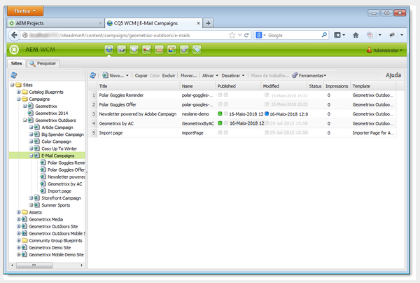
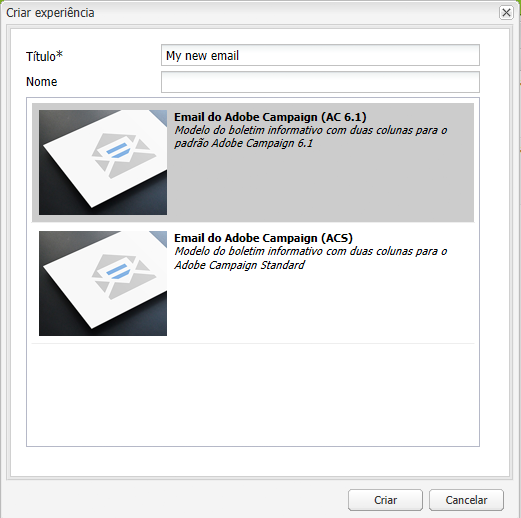
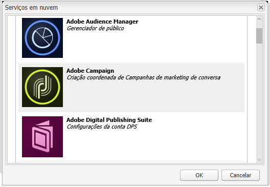
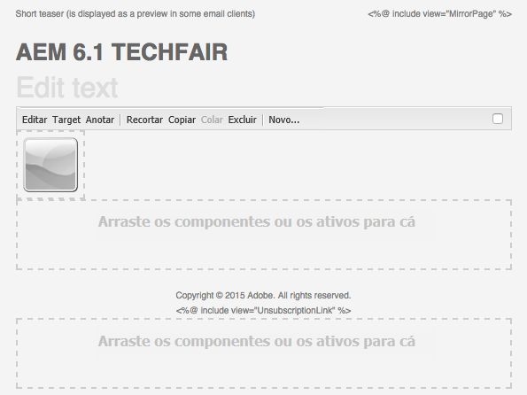
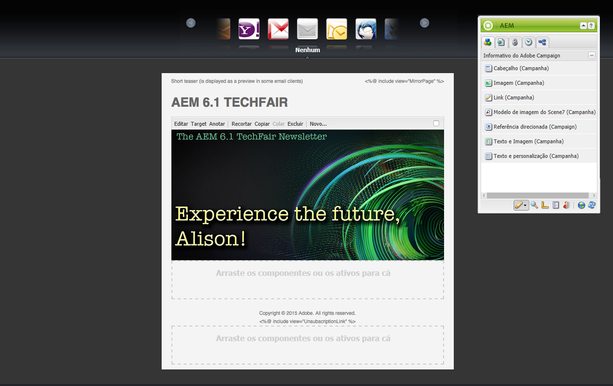
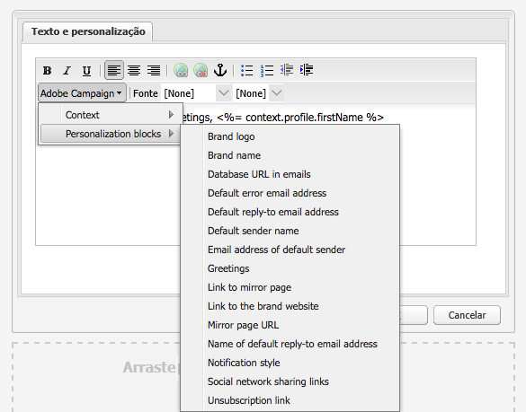
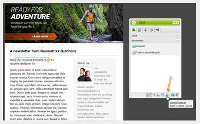
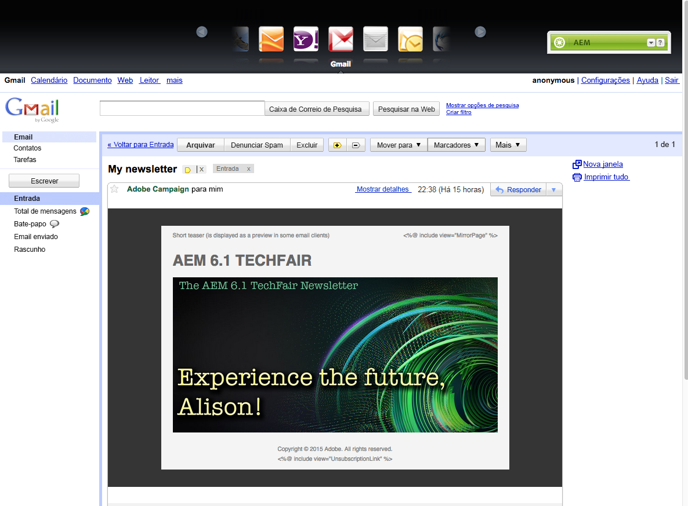
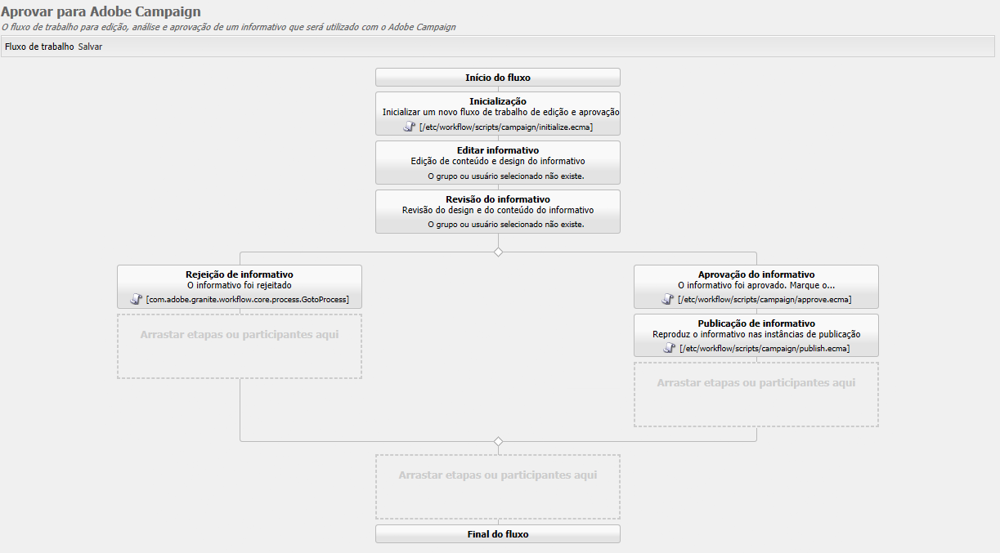
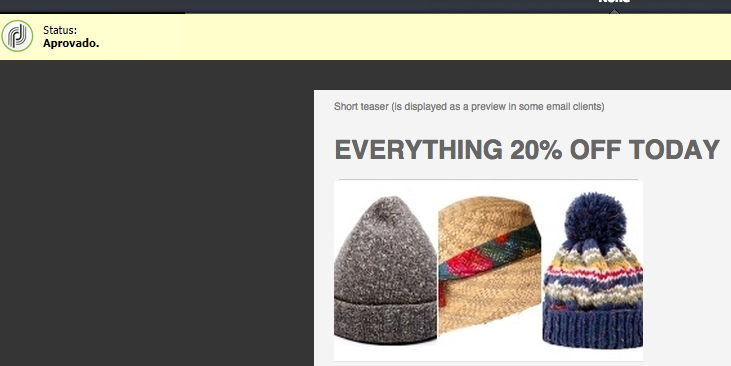

# Trabalhar com o Adobe Campaign 6.1 e o Adobe Campaign Standard{#working-with-adobe-campaign-and-adobe-campaign-standard}

>[!CAUTION]
>
>AEM 6.4 chegou ao fim do suporte estendido e esta documentação não é mais atualizada. Para obter mais detalhes, consulte nossa [períodos de assistência técnica](https://helpx.adobe.com/br/support/programs/eol-matrix.html). Encontre as versões compatíveis [here](https://experienceleague.adobe.com/docs/).

Você pode criar conteúdo de email no AEM e processá-lo em emails do Adobe Campaign. Para fazer isso, você deve:

1. Crie um novo informativo no AEM a partir de um modelo específico do Adobe Campaign.
1. Selecionar [um serviço Adobe Campaign](#selectingtheadobecampaigncloudservice) antes de editar o conteúdo para acessar toda a funcionalidade.
1. Edite o conteúdo.
1. Valide o conteúdo.

O conteúdo pode ser sincronizado com um delivery no Adobe Campaign. As instruções detalhadas estão descritas neste documento.

>[!NOTE]
>
>Antes de usar essa funcionalidade, você deve configurar AEM para integrar com [Adobe Campaign](/help/sites-administering/campaignonpremise.md) ou [Adobe Campaign Standard](/help/sites-administering/campaignstandard.md).

## Envio de conteúdo de email via Adobe Campaign {#sending-email-content-via-adobe-campaign}

Após configurar o AEM e o Adobe Campaign, você pode criar conteúdo de delivery de email diretamente no AEM e processá-lo no Adobe Campaign.

Ao criar o conteúdo do Adobe Campaign no AEM, você deve vincular a um serviço do Adobe Campaign antes de editar o conteúdo para acessar toda a funcionalidade.

Há dois casos possíveis:

* O conteúdo pode ser sincronizado com uma entrega do Adobe Campaign. Isso permite usar AEM conteúdo em um delivery.
* (Somente Adobe Campaign no local) O conteúdo pode ser enviado diretamente para o Adobe Campaign, que gera automaticamente um novo delivery de email. Esse modo tem limitações.

As instruções detalhadas estão descritas neste documento.

### Criação de novo conteúdo de email {#creating-new-email-content}

>[!NOTE]
>
>Ao adicionar modelos de email, adicione-os em **/content/campaign** para as disponibilizar.

1. Em AEM, selecione o **Sites** em seguida, navegue pelo explorador para encontrar onde suas campanhas de email são gerenciadas. No exemplo a seguir, o nó relacionado é **Sites** > **Campanhas** > **Geometrixx Outdoors** > **Campanhas de email**.

   >[!NOTE]
   >
   >[Amostras de email estão disponíveis somente no Geometrixx](/help/sites-developing/we-retail.md#weretail). Baixe o conteúdo de amostra do Geometrixx do Compartilhamento de pacotes.

   

1. Selecionar **Novo** > **Nova página** para criar novo conteúdo de email.
1. Selecione um dos modelos disponíveis específico do Adobe Campaign e preencha as propriedades gerais da página. Três templates estão disponíveis por padrão:

   * **Email do Adobe Campaign (AC 6.1)**: permite adicionar conteúdo a um template predefinido antes de enviá-lo para o Adobe Campaign 6.1 para entrega.
   * **Email do Adobe Campaign (ACS)**: permite adicionar conteúdo a um template predefinido antes de enviá-lo ao Adobe Campaign Standard para entrega.

   

1. Clique em **Criar** para criar seu email ou informativo.

### Selecionar o modelo e o serviço de nuvem do Adobe Campaign {#selecting-the-adobe-campaign-cloud-service-and-template}

Para fazer a integração com o Adobe Campaign, é necessário adicionar um serviço de nuvem do Adobe Campaign à página. Isso fornece acesso à personalização e a outras informações do Adobe Campaign.

Além disso, também pode ser necessário selecionar o modelo do Adobe Campaign, alterar o assunto e adicionar conteúdo de texto simples para os usuários que não visualizarão o email no HTML.

1. Selecione o **Página** no sidekick, em seguida, selecione **Propriedades da página.**
1. No **Serviços em nuvem** na janela pop-up , selecione **Adicionar Serviço** para adicionar o serviço Adobe Campaign e clique em **OK**.

   

1. Selecione a configuração que corresponde à instância do Adobe Campaign na lista suspensa e clique em **OK**.

   >[!NOTE]
   >
   >Certifique-se de tocar/clicar **OK** ou **Aplicar** após adicionar o serviço de nuvem. Isso habilita o **Adobe Campaign** para funcionar adequadamente.

1. Caso deseje aplicar um template específico de delivery de email (do Adobe Campaign), diferente do padrão **email** modelo, selecione **Propriedades da página** novamente. No **Adobe Campaign** , insira o nome interno do template do delivery de email na instância relacionada do Adobe Campaign.

   No Adobe Campaign Standard, o modelo é **Entrega com conteúdo AEM**. No Adobe Campaign 6.1, o modelo é **Delivery por email com conteúdo AEM**.

   Ao selecionar o modelo, o AEM ativa automaticamente a variável **Informativo do Adobe Campaign** componentes.

### Edição de conteúdo de email {#editing-email-content}

Você pode editar o conteúdo de email na interface do usuário clássica ou na interface do usuário otimizada para toque.

1. Insira o assunto e a versão de texto do email selecionando **Propriedades da página** > **Email** na caixa de ferramentas.

   

1. Edite o conteúdo do email adicionando os elementos desejados daqueles disponíveis no sidekick. Para fazer isso, arraste-os e solte-os. Em seguida, clique duas vezes no elemento que deseja editar.

   Por exemplo, é possível adicionar texto contendo campos de personalização.

   

   Consulte [Componentes do Adobe Campaign](/help/sites-classic-ui-authoring/classic-personalization-ac-components.md) para obter uma descrição dos componentes disponíveis para informativos/campanhas de email do Adobe Campaign.

   

### Inserção de personalização {#inserting-personalization}

Ao editar seu conteúdo, você pode inserir:

* Campos de contexto do Adobe Campaign. Esses são campos que você pode inserir no texto que serão adaptados de acordo com os dados do recipient (por exemplo, nome, sobrenome ou quaisquer dados da dimensão de destino).
* Blocos de personalização do Adobe Campaign. Esses são blocos de conteúdo predefinido que não estão relacionados aos dados do recipient, como um logotipo da marca ou um link para uma mirror page.

Consulte [Componentes do Adobe Campaign](/help/sites-classic-ui-authoring/classic-personalization-ac-components.md) para obter uma descrição completa dos componentes do Campaign.

>[!NOTE]
>
>* Somente os campos da Adobe Campaign **Perfis** targeting dimension são consideradas.
>* Ao visualizar propriedades de **Sites**, você não tem acesso aos campos de contexto do Adobe Campaign. Você pode acessá-los diretamente do email durante a edição.
>

1. Inserir um novo **Informativo** > **Texto e personalização (Campaign)** componente.
1. Abra o componente clicando duas vezes nele. O **Editar** tem uma funcionalidade que permite inserir os elementos de personalização.

   >[!NOTE]
   >
   >Os campos de contexto disponíveis correspondem à variável **Perfis** targeting dimension no Adobe Campaign.
   >
   >Consulte [Vincular uma página de AEM a um email do Adobe Campaign](/help/sites-classic-ui-authoring/classic-personalization-ac-campaign.md#linkinganaempagetoanadobecampaignemail).

   

1. Selecionar **Contexto do cliente** no sidekick para testar os campos de personalização usando os dados dos perfis de persona.

   

1. Uma janela é exibida e permite selecionar a persona desejada. Os campos de personalização são substituídos automaticamente pelos dados do perfil selecionado.

   

### Pré-visualização de um boletim informativo {#previewing-a-newsletter}

Você pode visualizar como o boletim informativo será exibido, bem como visualizar a personalização.

1. Abra o boletim informativo que deseja visualizar e clique em Visualizar (lupa) para reduzir o sidekick.
1. Clique em um dos ícones do cliente de email para ver a aparência do seu boletim informativo em cada cliente de email.

   

1. Expanda o sidekick para começar a editar novamente.

### Aprovar conteúdo em AEM {#approving-content-in-aem}

Após a conclusão do conteúdo, é possível iniciar o processo de aprovação. Vá para o **Fluxo de trabalho** da caixa de ferramentas e selecione o **Aprovar para Adobe Campaign** fluxo de trabalho.

Esse fluxo de trabalho pronto para uso tem duas etapas: revisão e aprovação, ou revisão e então rejeição. No entanto, esse workflow pode ser estendido e adaptado a um processo mais complexo.

Para aprovar o conteúdo para o Adobe Campaign, aplique o fluxo de trabalho selecionando **Fluxo de trabalho** no sidekick e selecionando **Aprovar para Adobe Campaign** e clique em **Iniciar fluxo de trabalho**. Analise as etapas e aprove o conteúdo. Também é possível rejeitar o conteúdo selecionando **Rejeitar** em vez de **Aprovar** na última etapa do fluxo de trabalho.

Depois que o conteúdo é aprovado, ele é exibido como aprovado no Adobe Campaign. O email pode ser enviado.

No Adobe Campaign Standard:

No Adobe Campaign 6.1:

>[!NOTE]
>
>O conteúdo não aprovado pode ser sincronizado com um delivery no Adobe Campaign, mas o delivery não pode ser executado. Somente o conteúdo aprovado pode ser enviado por meio de deliveries do Campaign.

## Vincular AEM com o Adobe Campaign Standard e o Adobe Campaign 6.1 {#linking-aem-with-adobe-campaign-standard-and-adobe-campaign}

>[!NOTE]
>
>Consulte [Vincular AEM com o Adobe Campaign Standard e o Adobe Campaign 6.1](/help/sites-authoring/campaign.md#linking-aem-with-adobe-campaign-standard-and-adobe-campaign-classic) under [Trabalhar com o Adobe Campaign 6.1 e o Adobe Campaign Standard](/help/sites-authoring/campaign.md) na documentação de criação padrão para obter detalhes.
