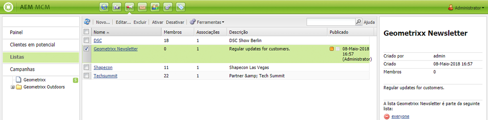
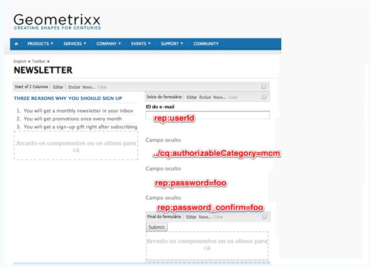
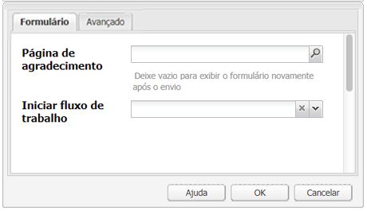
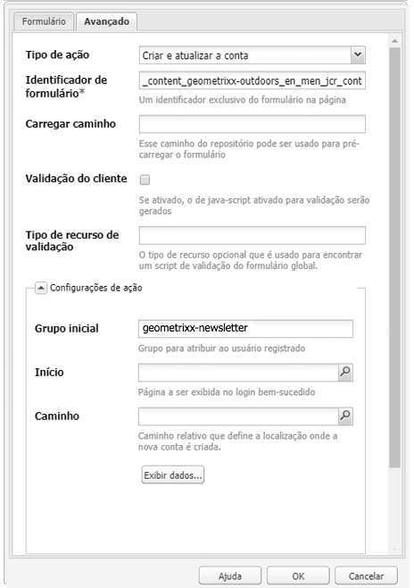
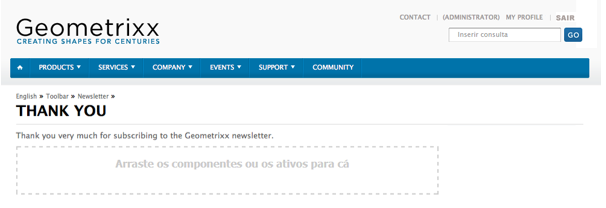
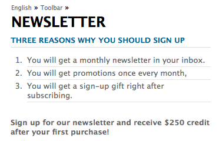

# Criação de uma página de aterrissagem de informativo eficaz{#creating-an-effective-newsletter-landing-page}

>[!CAUTION]
>
>AEM 6.4 chegou ao fim do suporte estendido e esta documentação não é mais atualizada. Para obter mais detalhes, consulte nossa [períodos de assistência técnica](https://helpx.adobe.com/br/support/programs/eol-matrix.html). Encontre as versões compatíveis [here](https://experienceleague.adobe.com/docs/).

Uma página de aterrissagem de informativo eficaz ajuda você a obter o maior número possível de pessoas para se inscrever no seu informativo (ou em outra campanha de marketing por email). Você pode usar as informações coletadas nas inscrições dos seus informativos para obter leads.

Para criar uma página de aterrissagem de informativo eficaz, você precisa fazer o seguinte:

1. Crie uma lista para o informativo para que as pessoas possam se inscrever nele.
1. Crie o formulário de inscrição. Ao fazer isso, adicione uma etapa de fluxo de trabalho que adicione automaticamente a pessoa que se inscrever no boletim informativo à lista de clientes potenciais.
1. Crie uma página de Confirmação que agradeça os usuários por se inscreverem e possivelmente forneça a eles uma promoção.
1. Adicione teasers.

>[!NOTE]
>
>O Adobe não planeja aprimorar mais esse recurso (Gerenciamento de leads e listas).\
>A recomendação é aproveitar [Adobe Campaign e sua integração AEM](/help/sites-administering/campaign.md).

## Criação de uma lista para o informativo {#creating-a-list-for-the-newsletter}

Crie uma lista, por exemplo, **Informativo do Geometrixx**, no MCM para o boletim informativo que as pessoas devem assinar. A criação de listas é descrita em [Criação de listas](/help/sites-classic-ui-authoring/classic-personalization-campaigns.md#creatingnewlists).

O exemplo a seguir mostra uma lista:

## Criar um formulário de inscrição {#create-a-sign-up-form}

Crie um formulário de registro de informativo que permita que os usuários se inscrevam em tags. O site de exemplo do Geometrixx fornece uma página de informativo na barra de ferramentas do Geometrixx, onde é possível criar seu formulário.

Para criar seu próprio formulário de informativo, consulte as informações sobre como criar formulários no [Documentação do Forms](/help/sites-authoring/default-components.md#form). O informativo usa as tags da biblioteca de tags. Para adicionar outras tags, consulte [Administração de tags](/help/sites-authoring/tags.md#tagadministration).

Os campos ocultos no exemplo a seguir fornecem a quantidade mínima de informações (e-mail); além disso, você pode adicionar mais campos posteriormente, mas isso afetará a taxa de conversão.

O exemplo a seguir é um formulário criado em http://localhost:4502/cf#/content/geometrixx/en/toolbar/newsletter.html.

1. Crie o formulário.

   

1. Clique em **Editar** no componente Formulário para configurar o formulário para ir para uma página de agradecimento (consulte [Criação de páginas de agradecimento](#creating-a-thank-you-page)).

   

1. Defina a ação Formulário (o que acontecerá quando você enviar o formulário) e configure o grupo para atribuir usuários registrados à lista criada anteriormente (por exemplo, geometrixx-informativo).

   

## Criação de uma página de agradecimento {#creating-a-thank-you-page}

Quando os usuários clicarem **Inscrever-se agora**, você deseja que uma página de agradecimento seja aberta automaticamente. Crie a página de agradecimento na página Informativo do Geometrixx. Depois de criar o Formulário de informativo, edite o componente Formulário e adicione o caminho à página de agradecimento.

O envio da solicitação leva o usuário a um **Obrigado** página em seguida, eles receberão um email. Esta página de agradecimento foi criada em /content/geometrixx/en/toolbar/newsletter/thank_you.

## Adicionar teasers {#adding-teasers}

Adicionar [teasers](/help/sites-classic-ui-authoring/classic-personalization-campaigns.md#teasers) para direcionar públicos-alvo específicos. Por exemplo, você pode adicionar teasers à página de agradecimento e à página de inscrição do informativo.

Para adicionar teasers para criar uma página de aterrissagem de informativo eficaz:

1. Crie um parágrafo de teaser para um presente de inscrição. Selecionar **First** como a estratégia e inclua um texto informando o brinde que receberão.

   

1. Crie um parágrafo de teaser para a página de agradecimento. Selecionar **First** como estratégia e incluir texto que indica que o presente está a caminho.

   

1. Crie uma campanha com os dois teasers: marque um com negócios e desmarque o outro.

## Envio de conteúdo para assinantes {#pushing-content-to-subscribers}

Encaminhe as alterações nas páginas pela funcionalidade Informativo no MCM. Em seguida, envie conteúdo atualizado aos assinantes.

Consulte [Envio de informativos](/help/sites-classic-ui-authoring/classic-personalization-campaigns.md#newsletters).
