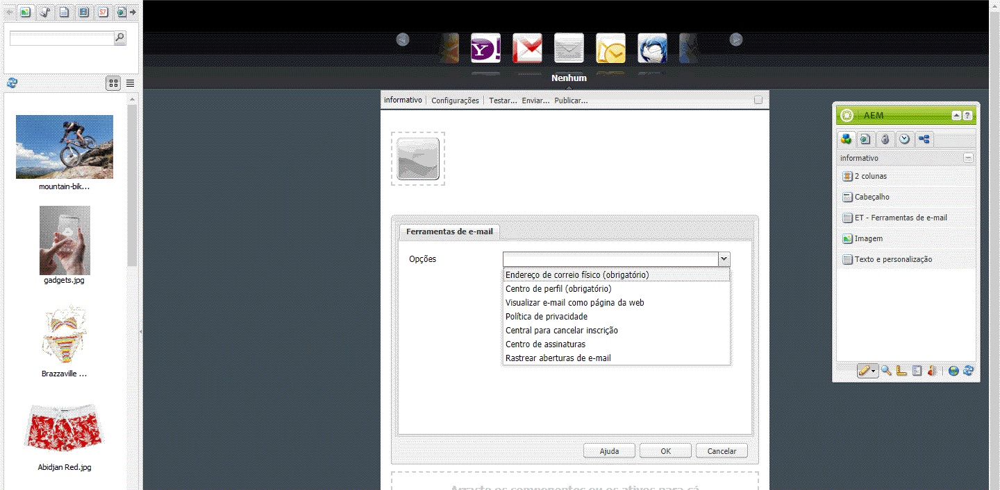
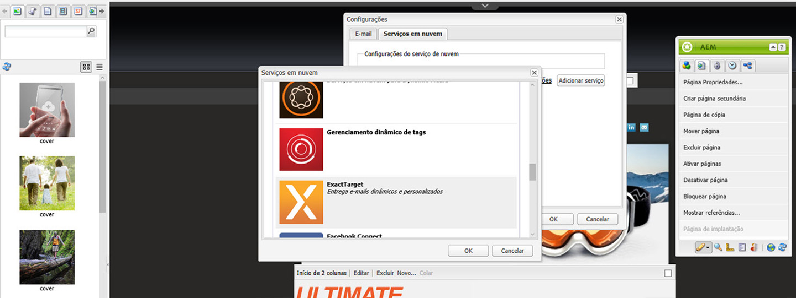

# Publicar um email em provedores de serviços de email{#publishing-an-email-to-email-service-providers}

É possível publicar informativos em serviços de email, como o ExactTarget e o Silverpop Engage. Este documento descreve como configurar o AEM para publicar um informativo nesses serviços de email.

>[!NOTE]
>
>Você precisa configurar o provedor de serviços antes de poder criar e publicar um email. Consulte [Configurando o ExactTarget](/help/sites-administering/exacttarget.md) e [Configurando o Silverpop Engage](/help/sites-administering/silverpop.md) para obter mais informações.

Para publicar seu email no provedor de serviços de email, você precisa realizar as seguintes etapas:

1. Criar um email.
1. Aplicar a configuração de Serviço de email ao email.
1. Publicar o email.

>[!NOTE]
>
>Se você atualizar provedores de email, fazer um teste de envio ou enviar um informativo, essas operações falharão se o informativo não for publicado primeiro na Instância de publicação ou se a Instância de publicação não estiver disponível. Publique o informativo e verifique se a Instância de publicação está ativa e em execução.

## Criação de um email {#creating-an-email}

Um e-mail ou boletim informativo que você deseja publicar em um serviço de e-mail pode ser criado em uma campanha usando o modelo **Geometrixx Newsletter**. Você também pode usar o modelo **Email do Geometrixx Outdoors**. Os exemplos de e-mail/boletim informativo baseados no modelo **E-mail do Geometrixx Outdoors** estão disponíveis em `https://<hostname>:<port>/cf#/content/campaigns/geometrixx-outdoors/e-mails.html`.

Para criar um novo email publicado no serviço de email configurado:

1. Vá para **Sites** e **Campanha**. Selecione uma campanha.
1. Clique em **Novo** para abrir a janela **Criar página**.
1. Insira o título e o nome e selecione o modelo **Informativo do Geometrixx** na lista de modelos disponíveis.
1. Clique em **Criar**.
1. Abra o email criado.
1. Alterne para o modo de design para selecionar os componentes que você deseja exibir no sidekick.
1. Alterne para o modo de edição e comece a adicionar conteúdo (texto, imagens, [ferramentas de email](#adding-exacttarget-email-tools-to-your-email), [variáveis de personalização](#adding-text-and-personalization-tool-to-your-e-mail) e assim por diante) ao seu email.

### Adicionar Ferramentas de email do ExactTarget ao seu email {#adding-exacttarget-email-tools-to-your-email}

>[!NOTE]
>
>Esta seção é específica para o serviço ExactTarget.

O componente **Ferramentas de email** para o ExactTarget pode adicionar mais funcionalidades de email ao seu email/informativo.

1. Abra um email que será publicado no ExactTarget.
1. Adicione o componente **ET - Ferramentas de email** à sua página usando o sidekick. Abra o componente no modo de edição.

   

1. Selecione uma opção no menu **Opções**:

<table> 
 <tbody> 
  <tr> 
   <td>Endereço de correio físico (obrigatório)</td> 
   <td>Este componente insere o endereço de correio físico da sua organização no seu email.</td> 
  </tr> 
  <tr> 
   <td>Centro de perfil (obrigatório)</td> 
   <td>O centro do perfil é uma página da Web na qual os assinantes podem digitar e manter as informações pessoais que você mantém sobre eles.</td> 
  </tr> 
  <tr> 
   <td>Visualizar e-mail como página da web</td> 
   <td>Esse componente permite que o usuário visualização o email como uma página da Web.</td> 
  </tr> 
  <tr> 
   <td>Política de privacidade</td> 
   <td>Este componente insere o link para sua política de privacidade no email.  </td> 
  </tr> 
  <tr> 
   <td>Central para cancelar inscrição</td> 
   <td>Dá ao usuário a opção de cancelar a inscrição da sua lista de correspondência.</td> 
  </tr> 
  <tr> 
   <td>Centro de assinaturas</td> 
   <td>Um centro de subscrições é uma página da Web na qual um assinante pode controlar as mensagens recebidas de sua organização.</td> 
  </tr> 
  <tr> 
   <td>Rastrear aberturas de e-mail</td> 
   <td>Um componente oculto que permite usar o recurso de rastreamento ExactTarget.  </td> 
  </tr> 
 </tbody> 
</table>

>[!NOTE]
>
>O menu suspenso **Opções** apenas será preenchido se a configuração do ExactTarget for aplicada ao email. Consulte [Aplicando configuração de serviço de email às configurações de email](#applying-e-mail-service-configuration-to-e-mail-settings) para obter mais informações.

1. Publique o email no ExactTarget.

   O email com as ferramentas de email está disponível para uso na conta configurada do ExactTarget.

>[!NOTE]
>
>* Os URLs nas ferramentas de email são substituídos (no email recebido) pelos valores reais somente quando um email é enviado usando **Enviar simples** ou **Enviar guiado**, mas não **Testar envio**.
   >
   >
* Duas das ferramentas de email são obrigatórias: **Endereço de correspondência físico (obrigatório)** e **Centro de perfil (obrigatório)**. Quando o email é publicado no ExactTarget, essas duas ferramentas de email são adicionadas à parte inferior de todas as mensagens por padrão.

>

### Adicionar a ferramenta Texto e personalização ao seu email  {#adding-text-and-personalization-tool-to-your-e-mail}

Você pode adicionar campos personalizados em um email, adicionando o componente **Texto e personalização** à página:

1. Abra o email que será publicado no seu serviço de email.
1. Para ativar o campo de personalização do seu serviço de email, adicione a configuração da estrutura ao configurar o serviço de email. Consulte [configurar o Silverpop Engage](/help/sites-administering/silverpop.md) e [configurar o Público alvo Exato](/help/sites-administering/exacttarget.md) para obter mais informações.
1. Adicione o componente **Texto e personalização** do sidekick. Esse componente faz parte do grupo de informativos. Abra esse componente no modo de edição.

   

1. Adicione o campo personalizado necessário ao texto, selecionando o campo no menu suspenso e clicando em **Inserir**.
1. Clique em **OK** para finalizar.

## Aplicação da configuração do serviço de email a configurações de email {#applying-e-mail-service-configuration-to-e-mail-settings}

Para aplicar sua configuração de serviço de email a um informativo:

1. Crie uma configuração de Serviço de email.
1. Abra seu email/informativo.
1. Abra as configurações de email/newsletter clicando em **Configurações** ou clicando em **Propriedades da página em** sidekick.
1. Clique em **Adicionar serviço** na guia **Serviços em nuvem**. Você verá a lista de serviços. Selecione a configuração necessária, **ExactTarget** ou **Silverpop**, na lista suspensa.

   

1. Clique em **OK**.

## Publicar emails no serviço de email {#publishing-emails-to-email-service}

Emails/informativos podem ser publicados no seu Serviço de email seguindo estas etapas:

1. Abra o email.
1. Antes de publicar um email, verifique se você aplicou a configuração correta ao seu email.
1. Clique em **Publicar**. Essa ação abre a janela **Publicar informativo no provedor de serviços de email.**
1. Preencha o campo **Nome do informativo**. O email/informativo é publicado no Provedor de serviços de email com esse nome. No caso de um nome de email não ser fornecido, o email é publicado usando o nome da página do informativo no AEM.
1. Clique em **Publicar**.

   

   Se o processo for bem-sucedido, o AEM confirmará que você pode visualizar o email no ExactTarget ou no Silverpop Engage.

   No caso do ExactTarget, o email publicado pode ter sido visualizado clicando em **Visualização Email publicado**. Isso leva você diretamente para o boletim publicado no ExactTarget ([https://members.exacttarget.com/](https://members.exacttarget.com/).).

>[!NOTE]
>
>Se um email/informativo for publicado com o mesmo nome de um email/informativo já publicado, o email/informativo anterior não será substituído. Em vez disso, um novo email/informativo será criado com o mesmo nome (porém, as IDs dos dois informativos serão diferentes).
>
>A publicação do email/informativo no Provedor de serviços de email também publica o email/informativo na instância de publicação do AEM.

### Atualização de um email publicado {#updating-a-published-e-mail}

O botão **Atualizar** na caixa de diálogo Publicar permite atualizar um boletim informativo já publicado em um Provedor de serviço de email. Caso o informativo ainda não tenha sido publicado, e você clicar no botão **Atualizar**, a mensagem **O informativo não está publicado** será exibida.

Para atualizar um email publicado:

1. Abra o email/informativo que foi publicado anteriormente em um provedor de serviços de email no qual você deseja publicar novamente depois de fazer alterações no email/informativo.
1. Clique em **Publicar**. A janela **Publicar newsletter no Provedor de serviço de email** é exibida. Clique em **Atualizar**.

   Para verificar se o email/boletim informativo foi atualizado no ExactTarget, clique em **Email publicado da Visualização**. Essa ação leva você ao email publicado no ExactTarget.

   Para verificar se o email/informativo foi atualizado no serviço de email Silverpop, acesse o site do Silverpop Engage.

