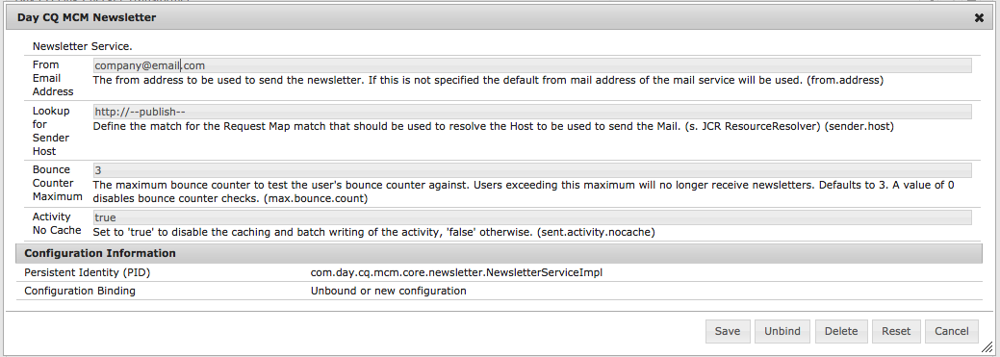

# Rastreamento de emails devolvidos{#tracking-bounced-emails}

>[!CAUTION]
>
>AEM 6.4 chegou ao fim do suporte estendido e esta documentação não é mais atualizada. Para obter mais detalhes, consulte nossa [períodos de assistência técnica](https://helpx.adobe.com/br/support/programs/eol-matrix.html). Encontre as versões compatíveis [here](https://experienceleague.adobe.com/docs/).

>[!NOTE]
>
>O Adobe não planeja aprimorar ainda mais o rastreamento de emails abertos/retornados enviados por AEM serviço SMTP.
>
>A recomendação é [aproveitar o Adobe Campaign e sua integração AEM](/help/sites-administering/campaign.md).

Quando você envia um informativo para muitos usuários, geralmente há alguns endereços de email inválidos na lista. O envio de informativos para esses endereços é devolvido. AEM é capaz de gerenciar essas rejeições e pode parar de enviar informativos para esses endereços depois que o contador de rejeição configurado for excedido. Por padrão, a taxa de rejeição é definida como 3, mas pode ser configurada.

Para configurar AEM para rastrear emails devolvidos, é necessário configurar AEM para pesquisar uma caixa de entrada existente na qual os emails devolvidos são recebidos (geralmente, esse é o endereço de email &quot;de&quot; especificado no local para envio do informativo). AEM pesquisa essa caixa de entrada e importa todos os emails abaixo do caminho especificado na configuração de pesquisa. Em seguida, um workflow é acionado para procurar os endereços de email devolvidos dentro dos usuários e atualiza o valor da propriedade bounceCounter do usuário. Depois que as rejeições máximas configuradas forem excedidas, o usuário será removido da lista de informativos.

## Configuração do importador de feed {#configuring-the-feed-importer}

O importador de feeds permite que você importe repetidamente conteúdo de fontes externas para seu repositório. Com essa configuração do importador de feed, o AEM verifica a caixa de entrada do remetente em busca de emails devolvidos.

Para configurar o importador de feeds para rastrear emails devolvidos:

1. Em **Ferramentas**, selecione o Importador de feed.

1. Clique em **Adicionar** para criar uma nova configuração.

   

1. Adicione uma nova configuração selecionando o tipo e adicionando informações ao URL de pesquisa para configurar o host e a porta. Além disso, é necessário adicionar alguns parâmetros específicos de email e protocolo à consulta de URL. Defina a configuração para pesquisar pelo menos uma vez por dia.

   Todas as configurações precisam de informações sobre o seguinte no URL de pesquisa:

   `username`: O nome de usuário a ser usado para conexão

   `password`: A senha a ser usada para conexão

   Além disso, dependendo do protocolo, você pode definir certas configurações.

   **Propriedades de configuração POP3:**

   `pop3.leave.on.server`: Define se as mensagens devem ou não ser deixadas no servidor. Defina como true para deixar mensagens no servidor; caso contrário, defina como false. O padrão é true.

   **Exemplos de POP3:**

   | pop3s://pop.gmail.com:995/INBOX?username=user&amp;password=secret | Usando pop3 sobre SSL para conexão com o GMail na porta 995 com usuário/segredo, deixando mensagens no servidor por padrão |
   |---|---|
   | pop3s://pop.gmail.com:995/INBOX?username=user&amp;password=secret&amp;pop3.leave.on.server=false | pop3s://pop.gmail.com:995/INBOX?username=user&amp;password=secret&amp;pop3.leave.on.server=false |

   **Propriedades de configuração IMAP:**

   Permite que você defina sinalizadores para procurar.

   `imap.flag.SEEN`: Defina false para mensagem nova/invisível, true para mensagens já lidas

   Consulte [https://java.sun.com/products/javamail/javadocs/javax/mail/Flags.Flag.html](https://java.sun.com/products/javamail/javadocs/javax/mail/Flags.Flag.html) para obter a lista completa de sinalizadores.

   **Exemplos de IMAP:**

   | imaps://imap.gmail.com:993/inbox?username=user&amp;password=secret | Usando IMAP por SSL para conexão com o GMail na porta 993 com usuário/segredo. Obter novas mensagens somente por padrão. |
   |---|---|
   | imaps://imap.gmail.com:993/inbox?username=user&amp;password=secret&amp;imap.flag.SEEN=true | Usando IMAP por SSL para conexão com o GMail 93 com usuário/segredo, recebendo apenas mensagens já vistas. |
   | imaps://imap.gmail.com:993/inbox?username=user&amp;password=secret&amp;imap.flag.SEEN=true&amp;imap.flag.SEEN=false | Usando IMAP por SSL para conexão com o GMail 93 com usuário/segredo, recebendo mensagens já lidas OU novas mensagens. |

1. Salve a configuração.

## Configuração do componente de serviço de boletim informativo {#configuring-the-newsletter-service-component}

Após configurar o importador de feed, é necessário configurar o endereço De e o contador de saltos.

Para configurar o serviço de boletim informativo:

1. No console OSGi em `<host>:<port>/system/console/configMgr` e navegue até **Informativo do MCM**.

1. Configure o serviço e salve as alterações quando terminar.

   

   As seguintes configurações podem ser definidas para ajustar o comportamento:

   | Máximo do contador de rejeição (max.bounce.count) | Define o número de rejeições até que um usuário seja omitido ao enviar um boletim informativo. Definir esse valor como 0 desativa a verificação de devolução completamente. |
   |---|---|
   | Atividade sem cache (sent.activity.nocache) | Define a configuração de cache a ser usada para a atividade enviada do boletim informativo |

   Depois de salvo, o serviço MCM do boletim informativo faz o seguinte:

   * Grava uma atividade no fluxo oculto de usuários após o envio bem-sucedido de um boletim informativo.
   * Grava uma atividade se uma rejeição for detectada e o contador de rejeição dos usuários for alterado.
