# Email Marketing{#e-mail-marketing}

>[!CAUTION]
>
>AEM 6.4 chegou ao fim do suporte estendido e esta documentação não é mais atualizada. Para obter mais detalhes, consulte nossa [períodos de assistência técnica](https://helpx.adobe.com/br/support/programs/eol-matrix.html). Encontre as versões compatíveis [here](https://experienceleague.adobe.com/docs/).

>[!NOTE]
>
>O Adobe não planeja aprimorar ainda mais os emails abertos/retornados enviados pelo serviço SMTP AEM.\
>A recomendação é [aproveitar o Adobe Campaign e sua integração AEM](/help/sites-administering/campaign.md).

O marketing por email (por exemplo, boletins informativos) é uma parte importante de qualquer campanha de marketing, pois você os usa para enviar conteúdo para seus leads. Em AEM, você pode criar informativos a partir de conteúdo AEM existente, bem como adicionar novo conteúdo, específico para os informativos.

Após sua criação, é possível enviar informativos para um grupo específico de usuários imediatamente ou em outro horário agendado (por meio do uso de um workflow). Além disso, os usuários podem assinar informativos no formato que escolherem.

Além disso, o AEM permite administrar a funcionalidade do boletim informativo, incluindo a manutenção de tópicos, o arquivamento de boletins informativos e a exibição de estatísticas do boletim informativo.

>[!NOTE]
>
>No Geometrixx, o modelo de boletim informativo abre automaticamente o editor de email. Você pode usar o editor de email em outros templates que deseja enviar emails, por exemplo, em convites. O editor de email é exibido sempre que uma página é herdada de **mcm/components/newsletter/page**.

Este documento descreve as noções básicas para a criação de informativos no AEM. Para obter informações mais detalhadas sobre como trabalhar com marketing por email, consulte os seguintes documentos:

* [Criação de uma página de aterrissagem de informativo eficaz](/help/sites-classic-ui-authoring/classic-personalization-campaigns-email-landingpage.md)
* [Gerenciamento de assinaturas](/help/sites-classic-ui-authoring/classic-personalization-campaigns-email-subscriptions.md)
* [Publicar um email em provedores de serviços de email](/help/sites-classic-ui-authoring/classic-personalization-campaigns-email-newsletters.md)
* [Rastreamento de emails devolvidos](/help/sites-classic-ui-authoring/classic-personalization-campaigns-email-tracking-bounces.md)

>[!NOTE]
>
>Se você atualizar provedores de email, fazer um teste de envio ou enviar um boletim informativo, essas operações falharão se o boletim informativo não for publicado primeiro na Instância de publicação ou se a Instância de publicação não estiver disponível. Certifique-se de publicar seu informativo e verificar se a instância de publicação está ativa e em execução.

## Criação de uma experiência de informativo {#creating-a-newsletter-experience}

>[!NOTE]
>
>As notificações por email precisam ser configuradas por meio da configuração osgi. Consulte [Configuração da notificação por email.](/help/sites-administering/notification.md)

1. Selecione sua nova campanha no painel esquerdo ou clique duas vezes no painel direito.

1. Selecione a exibição de lista, usando o ícone :

   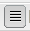

1. Clique em **Novo...**

   É possível especificar a variável **Título**, **Nome** e tipo de experiência a criar; neste caso, boletim informativo.

   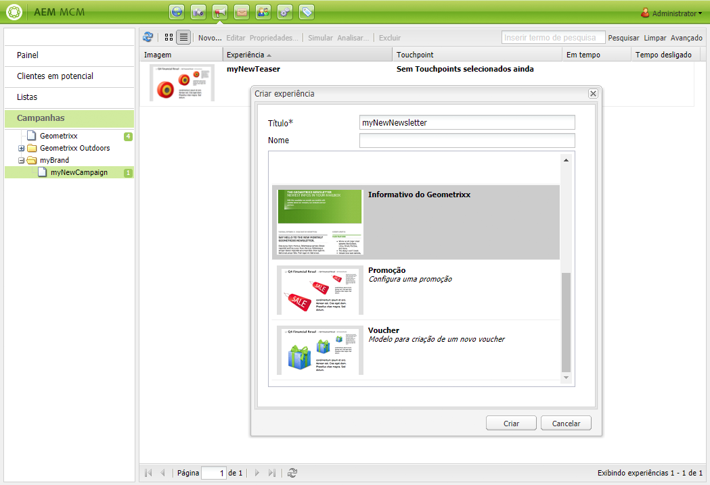

1. Clique em **Criar**.

1. Uma nova caixa de diálogo será aberta imediatamente. Aqui você pode inserir as propriedades do boletim informativo.

   O **Lista de destinatários padrão** é um campo obrigatório, pois forma o ponto de contato do boletim informativo (consulte [Trabalhar com listas](/help/sites-classic-ui-authoring/classic-personalization-campaigns.md#workingwithlists) para obter mais informações sobre listas).

   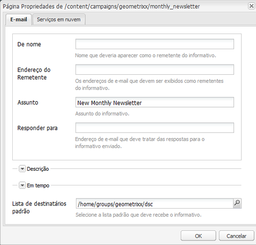

   * **De nome**

      Nome que deveria aparecer como o remetente do informativo.

   * **Endereço do Remetente**

      Os endereços de e-mail que devem ser exibidos como remetentes do informativo.

   * **Assunto**

      Assunto do informativo.

   * **Responder para**

      Endereço de e-mail que deve tratar das respostas para o informativo enviado.

   * **Descrição**

      Descrição do boletim informativo.

   * **Em tempo**

      A hora para enviar o boletim informativo.

   * **Lista de destinatários padrão**

      Lista padrão que deve receber o boletim informativo.
   Eles podem ser atualizados posteriormente a partir do **Propriedades...** caixa de diálogo.

1. Clique em **OK** para salvar.

## Adicionar conteúdo a informativos {#adding-content-to-newsletters}

Você pode adicionar conteúdo, incluindo conteúdo dinâmico, ao seu informativo como faria em qualquer componente AEM. No Geometrixx, o modelo de boletim informativo tem determinados componentes disponíveis para adicionar e modificar o conteúdo em boletins informativos.

1. No MCM, clique no botão **Campanhas** e clique duas vezes no boletim informativo ao qual deseja adicionar conteúdo ou editar. O boletim informativo é aberto.

1. Se os componentes não estiverem visíveis, vá para a Visualização de design e ative os componentes necessários (por exemplo, os componentes do Boletim informativo) antes de começar a editar.
1. Insira qualquer novo texto, imagens ou outros componentes, conforme apropriado. No exemplo do Geometrixx, 4 componentes estão disponíveis: Texto, Imagem, Cabeçalho e 2 Colunas. Seu informativo pode ter mais ou menos componentes, dependendo de como você o configurou.

   >[!NOTE]
   >
   >Personalize informativos usando variáveis. No informativo do Geometrixx, as variáveis estão disponíveis no componente Texto . Os valores das variáveis são herdados das informações no perfil do usuário.

   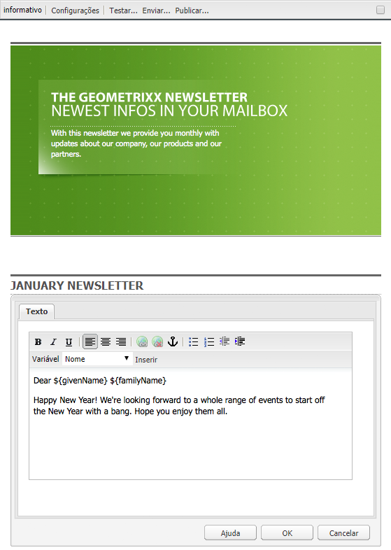

1. Para inserir variáveis, selecione a variável na lista e clique em **Inserir**. As variáveis são preenchidas a partir do Perfil.

## Personalização de informativos {#personalizing-newsletters}

Personalize informativos inserindo variáveis predefinidas no componente Texto dos informativos no Geometrixx. Os valores das variáveis são herdados das informações no perfil do usuário.

Você também pode simular como um boletim informativo é personalizado usando o contexto do cliente e carregando um perfil.

Para personalizar um boletim informativo e simular como será sua aparência:

1. No MCM, abra o boletim informativo cujas configurações você deseja personalizar.

1. Abra o componente de Texto que deseja personalizar.

1. Posicione o cursor onde deseja exibir a variável , selecione uma variável na lista suspensa e clique em **Inserir**. Faça isso para quantas variáveis forem necessárias e clique em **OK**.

   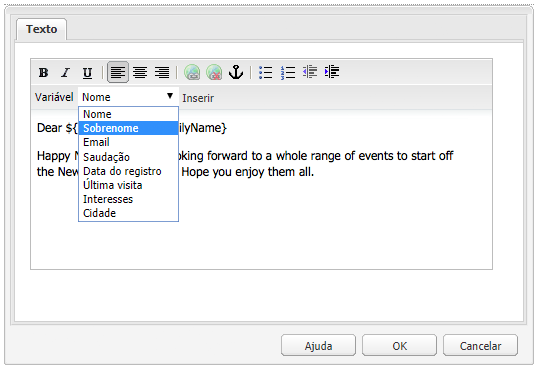

1. Para simular como a variável será exibida quando enviada, pressione CTRL+ALT+c para abrir o contexto do cliente e selecione **Carregar**. Selecione o usuário na lista cujo perfil você deseja carregar e clique em **OK**.

   As informações do perfil carregado preencheram as variáveis.

   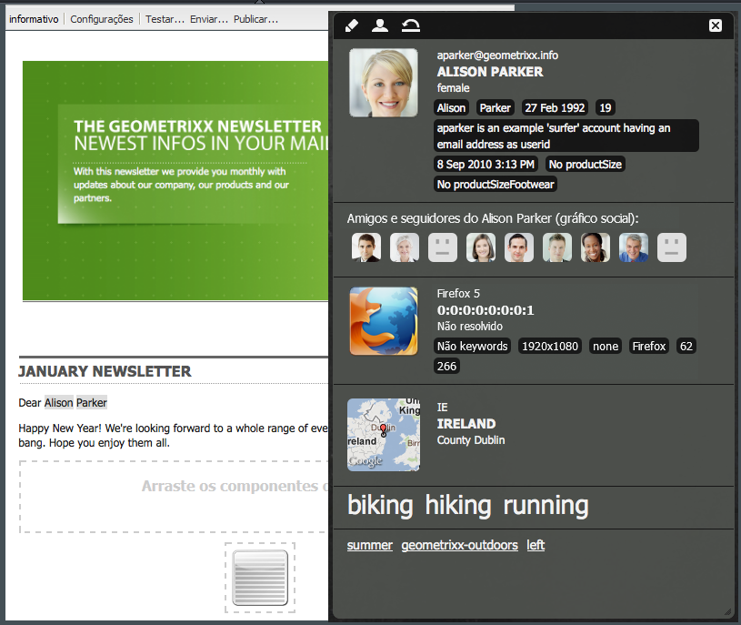

## Teste de informativos em diferentes clientes de email {#testing-newsletters-in-different-e-mail-clients}

>[!NOTE]
>
>Antes de enviar boletins informativos, verifique a configuração OSGi do Day CQ Link Externalizer em `http://localhost:4502/system/console/configMgr`.
>
>Por padrão, o valor do parâmetro é `localhost:4502` não é possível concluir a operação e se a porta para a instância em execução for alterada.

Alternar entre clientes de e-mail comuns para ver a forma como o informativo será exibido para seus clientes em potencial. Por padrão, seu boletim informativo é aberto com nenhum dos clientes de email selecionados.

Atualmente, você pode exibir informativos nos seguintes clientes de email:

* Email do Yahoo
* Gmail
* Hotmail
* Thunderbird
* Microsoft Outlook 2007
* Apple Mail

Para alternar entre clientes, clique no ícone correspondente para exibir o boletim informativo nesse cliente de email:

1. No MCM, abra o boletim informativo cujas configurações você deseja personalizar.

1. Clique em um cliente de email na barra superior para ver como o boletim informativo aparecerá nesse cliente.

   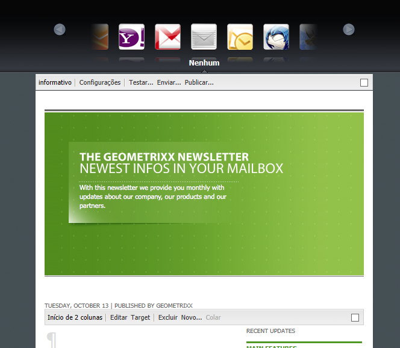

1. Repita essa etapa para qualquer cliente de email adicional que desejar visualizar.

   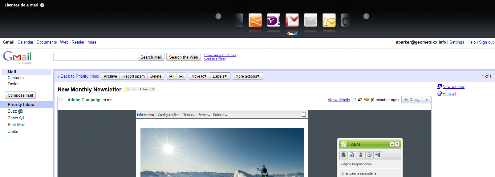

## Personalização das configurações do informativo {#customizing-newsletter-settings}

Embora somente usuários autorizados possam enviar um boletim informativo, você deve personalizar o seguinte:

* A linha de assunto, para que os usuários queiram abrir seu email e também para garantir que seu informativo não acabe marcado como spam.
* O endereço De, por exemplo noreply@geometrixx.com, para que os usuários recebam emails de um endereço especificado.

Para personalizar as configurações do boletim informativo:

1. No MCM, abra o boletim informativo cujas configurações você deseja personalizar.

   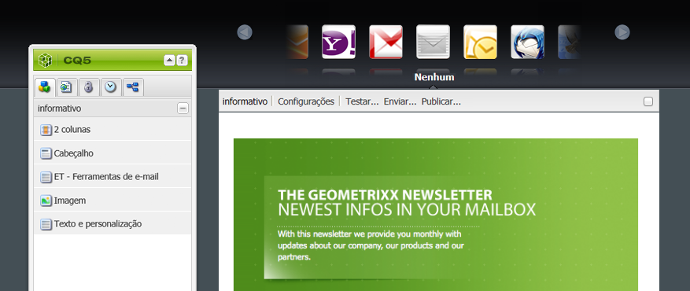

1. Na parte superior do boletim informativo, clique em **Configurações**.

   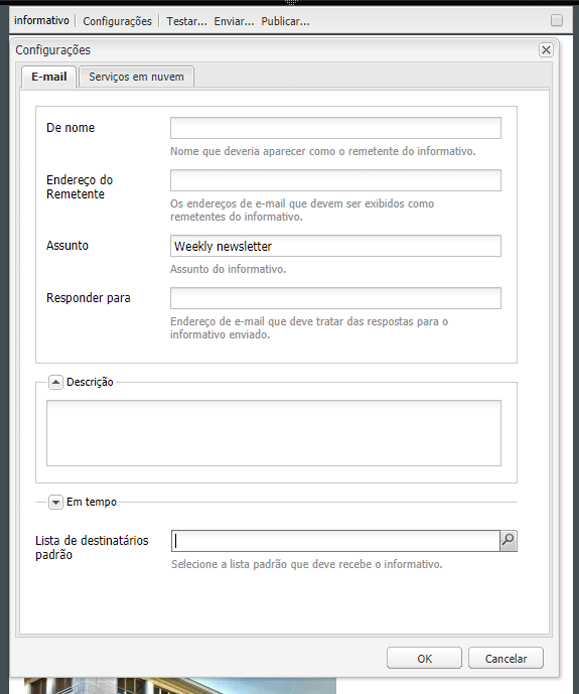

   1. Insira o **De** endereço de email
   1. Modifique o **Assunto** do correio eletrônico, se necessário.
   1. Selecione um **Lista de destinatários padrão** na lista suspensa.
   1. Clique em **OK**.

   Ao testar ou enviar o boletim informativo, os destinatários receberão emails com o endereço de email e assunto especificados.

## Teste de voo Boletins informativos {#flight-testing-newsletters}

Embora os testes de voo não sejam obrigatórios, antes de enviar um boletim informativo, você pode testá-lo para ter certeza de que ele aparece da maneira desejada.

Os testes de voo permitem que você faça o seguinte:

* Veja o informativo em [todos os clientes previstos](#testing-newsletters-in-different-e-mail-clients).
* Valide se o servidor de email está configurado corretamente.
* Determine se seu email está sendo sinalizado como spam. (Certifique-se de incluir na lista de recipients.)

>[!NOTE]
>
>Se você atualizar provedores de email, fazer um teste de envio ou enviar um boletim informativo, essas operações falharão se o boletim informativo não for publicado primeiro na Instância de publicação ou se a Instância de publicação não estiver disponível. Certifique-se de publicar seu informativo e verificar se a instância de publicação está ativa e em execução.

Para enviar boletins informativos de teste:

1. No MCM, abra o boletim informativo que deseja testar e enviar.

1. Na parte superior do boletim informativo, clique em **Teste** para testar antes de enviar.

   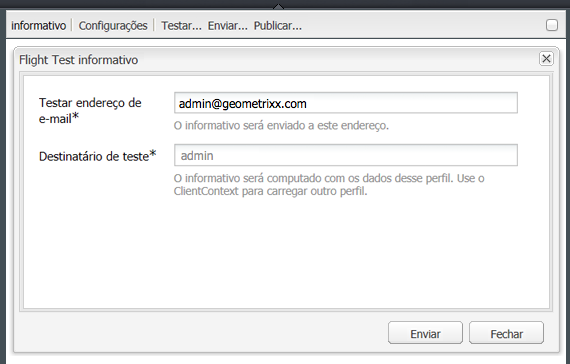

1. Digite o endereço de email de teste para onde deseja que o boletim informativo seja enviado e clique em **Enviar**. Se quiser alterar o perfil, carregue outro perfil no contexto do cliente. Para fazer isso, pressione CTRL+ALT+c e selecione Load and loading a profile.

## Envio de informativos {#sending-newsletters}

Você pode enviar um informativo do boletim informativo ou da lista. Ambos os procedimentos são descritos.

>[!NOTE]
>
>Antes de enviar boletins informativos, verifique a configuração OSGi do Day CQ Link Externalizer em `http://localhost:4502/system/console/configMgr`.
>
>Por padrão, o valor do parâmetro é `localhost:4502` não é possível concluir a operação e se a porta para a instância em execução for alterada.

>[!NOTE]
>
>Se você atualizar provedores de email, fazer um teste de envio ou enviar um boletim informativo, essas operações falharão se o boletim informativo não for publicado primeiro na Instância de publicação ou se a Instância de publicação não estiver disponível. Certifique-se de publicar seu informativo e verificar se a instância de publicação está ativa e em execução.

### Envio de informativos de uma campanha {#sending-newsletters-from-a-campaign}

Para enviar um informativo de dentro da campanha:

1. No MCM, abra o boletim informativo que deseja enviar.

   >[!NOTE]
   >
   >Antes de enviar, certifique-se de ter personalizado o assunto do seu boletim informativo e o endereço de email original por [personalizar suas configurações](#customizing-newsletter-settings).
   >
   >[Teste de voo](#flight-testing-newsletters) o boletim informativo antes de enviar é recomendado.

1. Na parte superior do boletim informativo, clique em **Enviar**. O assistente de boletim informativo é aberto.

1. Na lista de destinatários, selecione a lista que deseja que receba o boletim informativo e clique em **Próximo**.

   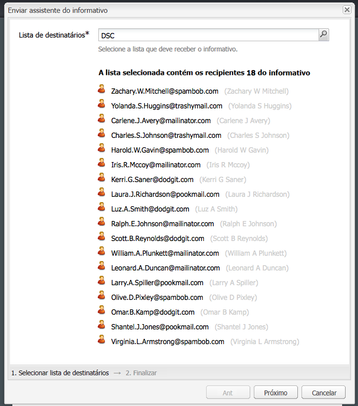

1. A conclusão da configuração é confirmada. Clique em **Enviar** para enviar o boletim informativo.

   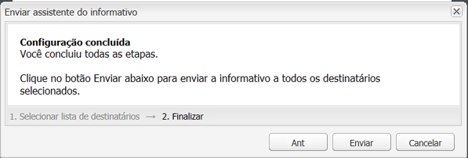

   >[!NOTE]
   >
   >Certifique-se de ser um dos destinatários para garantir que o boletim informativo seja recebido.

### Envio de informativos de uma lista {#sending-newsletters-from-a-list}

Para enviar um informativo de uma lista:

1. No MCM, clique em **Listas** no painel esquerdo.

   >[!NOTE]
   >
   >Antes de enviar, certifique-se de ter personalizado o assunto do seu boletim informativo e o endereço de email original por [personalizar suas configurações](#customizing-newsletter-settings). Não é possível testar um boletim informativo ao enviá-lo da lista; você pode [teste de voo](#flight-testing-newsletters) é enviado pelo boletim informativo.

1. Marque a caixa de seleção ao lado da lista de clientes potenciais para os quais deseja enviar um boletim informativo.

1. No **Ferramentas** selecione **Enviar informativo**. O **Enviar informativo** será aberta.

   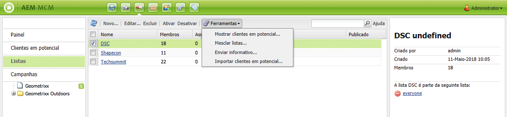

1. No **Informativo** , selecione o boletim informativo que deseja enviar e clique em **Próximo**.

   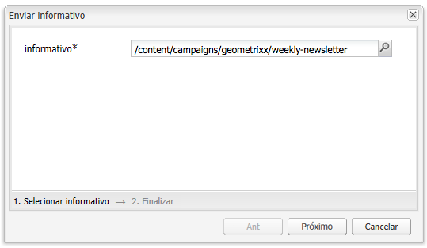

1. A conclusão da configuração é confirmada. Clique em **Enviar** para enviar o boletim informativo selecionado para a lista especificada de clientes potenciais.

   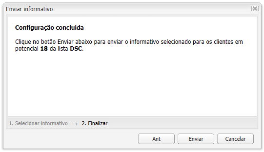

   Seu boletim informativo é enviado para os destinatários selecionados.

## Assinatura de um informativo {#subscribing-to-a-newsletter}

Esta seção descreve como assinar um boletim informativo.

### Assinatura de um informativo {#subscribing-to-a-newsletter-1}

Para assinar um informativo (usando o site do Geometrixx como exemplo):

1. Clique em **Sites** e navegue até a Geometrixx **Barra de ferramentas** e abra-o.

   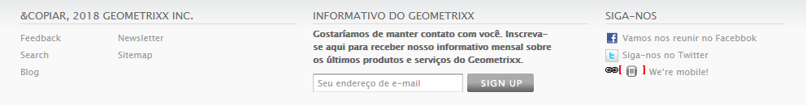

1. No informativo do Geometrixx **Inscrever-se** , digite seu endereço de email e clique em **Inscrever-se**. Agora você está inscrito no boletim informativo.
