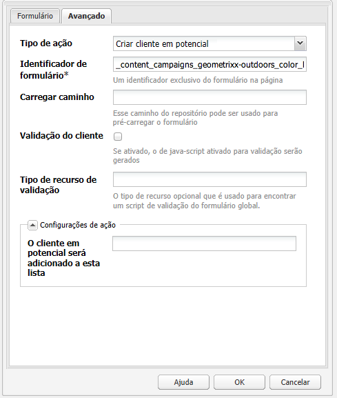

# Landing Pages{#landing-pages}

>[!CAUTION]
>
>AEM 6.4 chegou ao fim do suporte estendido e esta documentação não é mais atualizada. Para obter mais detalhes, consulte nossa [períodos de assistência técnica](https://helpx.adobe.com/br/support/programs/eol-matrix.html). Encontre as versões compatíveis [here](https://experienceleague.adobe.com/docs/).

O recurso de páginas de aterrissagem permite a importação rápida e fácil de um design e conteúdo diretamente em uma página AEM. Um desenvolvedor da Web pode preparar o HTML e ativos adicionais que podem ser importados como uma página inteira ou apenas como parte de uma página. A funcionalidade é útil para criar páginas de aterrissagem de marketing que estão ativas apenas por um tempo limitado e precisam ser criadas rapidamente.

Esta página descreve o seguinte:

* como são as páginas de aterrissagem no AEM incluindo os componentes disponíveis
* como criar uma landing page e importar um pacote de design
* como trabalhar com landing pages no AEM
* como configurar páginas de aterrissagem para dispositivos móveis

A preparação do pacote de design para importação é abordada em [Extensão e configuração do Importador de design](/help/sites-administering/extending-the-design-importer-for-landingpages.md). A integração com o Adobe Analytics é abordada em [Integração de páginas de aterrissagem com o Adobe Analytics.](/help/sites-administering/integrating-landing-pages-with-adobe-analytics.md)

## O que são páginas de aterrissagem? {#what-are-landing-pages}

Páginas de aterrissagem são sites de uma ou várias páginas que são o &quot;ponto de extremidade&quot; de uma campanha de marketing, por exemplo, com email, adwords/banners, redes sociais. Uma landing page pode servir a vários propósitos, mas todos têm uma coisa em comum: o visitante deve realizar uma tarefa e isso define o sucesso de uma landing page.

O recurso Páginas de aterrissagem no AEM permite que os profissionais de marketing trabalhem com designers da Web em agências ou equipes de criação internas para criar designs de página que podem ser facilmente importados para o AEM e ainda serem editáveis pelos profissionais de marketing e publicados de acordo com a mesma governança que o resto dos sites alimentados por AEM.

No AEM, você cria landing pages executando as seguintes etapas:

1. Crie uma página no AEM que contenha a tela de páginas de aterrissagem. AEM vem com uma amostra chamada **Página do importador**.

1. [Prepare o HTML e os ativos.](/help/sites-administering/extending-the-design-importer-for-landingpages.md)
1. Comprima os recursos em um arquivo ZIP referido aqui como Pacote de design.
1. Importe o pacote de design na página do importador.
1. Modifique e publique a página.

### Páginas de aterrissagem para desktop {#desktop-landing-pages}

Uma página de aterrissagem de amostra no AEM tem a seguinte aparência:

### Páginas de aterrissagem para dispositivos móveis {#mobile-landing-pages}

Uma página de aterrissagem também pode ter uma versão móvel da página. Para ter uma versão móvel separada da landing page, o design de importação deve ter dois arquivos html: *index.htm(l)* e *mobile.index.htm(l)*.

O procedimento de importação da página de aterrissagem é o mesmo de uma página de aterrissagem normal. O design da página de aterrissagem tem um arquivo html adicional correspondente à página de aterrissagem móvel. Este arquivo html também deve ter uma tela `div` com `id=cqcanvas` exatamente como o html da página de aterrissagem para desktop e suporta todos os componentes editáveis descritos para a página de aterrissagem para desktop.

A página de aterrissagem para dispositivos móveis é criada como uma página secundária da página de aterrissagem para desktop. Para abri-la, navegue até a página de aterrissagem em Sites e abra a página filho.

>[!NOTE]
>
>A página de aterrissagem para dispositivos móveis será excluída/desativada junto com a página de aterrissagem para desktop se ela for excluída ou desativada.

## Componentes da página de aterrissagem {#landing-page-components}

Para tornar editáveis as partes do HTML importado no AEM, é possível mapear o conteúdo no HTML de Landing pages para AEM componentes diretamente. O importador de design entende os seguintes componentes por padrão:

* Texto, para qualquer texto
* Título, para conteúdo em tags H1-6
* Imagem, para imagens que devem ser trocadas
* Chamar para ações:

   * Link Clickthrough
   * Vincular ao gráfico

* Formulário de lead para CTA, para capturar informações do usuário
* Sistema de parágrafo (Parsys), para permitir que qualquer componente seja adicionado ou que o componente acima seja convertido

Além disso, é possível estender isso e oferecer suporte a componentes personalizados. Esta seção descreve os componentes detalhadamente.

### Texto {#text}

O componente de Texto permite que você insira um bloco de texto usando um editor WYSIWYG. Consulte [Componente de texto](/help/sites-authoring/default-components.md#text) para obter mais informações.

Veja a seguir um exemplo de um componente de texto em uma página de aterrissagem:

### Título {#title}

O componente de título permite exibir um título e configurar o tamanho (h1-6). Consulte [Componente de título](/help/sites-authoring/default-components.md#title) para obter mais informações.

Veja a seguir um exemplo de um componente de título em uma página de aterrissagem:

### Imagem {#image}

O componente de imagem exibe uma imagem que você pode arrastar e soltar do Localizador de conteúdo ou clicar para fazer upload. Consulte [componente de imagem](/help/sites-authoring/default-components.md) para obter mais informações.

Veja a seguir um exemplo de um componente de imagem em uma página de aterrissagem:

### Chamada à ação (CTA) {#call-to-action-cta}

Um design de página de aterrissagem pode ter vários links; alguns deles podem ser usados como &quot;Chamadas à ação&quot;.

A chamada para a ação (CTA) é usada para fazer com que o visitante tome uma ação imediata na página de aterrissagem, como &quot;Inscreva-se agora&quot;, &quot;Visualize este vídeo&quot;, &quot;Somente tempo limitado&quot; e assim por diante.

* Link de Click-Through - Permite adicionar um link de texto que, quando clicado, leva o visitante para um URL de destino.
* Link gráfico - Permite adicionar uma imagem que, quando clicada, leva o visitante para um URL de destino.

Ambos os componentes CTA têm opções semelhantes. O Link de clickthrough tem opções adicionais de rich text. Os componentes são descritos detalhadamente nos parágrafos seguintes.

### Link Click Through {#click-through-link}

Esse componente de CTA pode ser usado para adicionar um link de texto na página de aterrissagem. Esse link pode ser clicado para levar o usuário ao URL de destino especificado nas propriedades do componente. Faz parte do grupo &quot;Call to Action&quot;.

**Rótulo** O texto que os usuários veem. Você pode modificar a formatação com o editor de rich text.

**URL de destino** Insira o URI que você deseja que os usuários visitem se clicarem no texto.

**Opções de renderização** Descreve as opções de renderização. Você pode selecionar entre as seguintes opções:

* Carregar página em uma nova janela de navegador
* Carregar página na janela atual
* Carregar página no quadro principal
* Cancelar todos os quadros e carregar a página na janela completa do navegador

**CSS** Na guia Estilo , insira um caminho para sua folha de estilos CSS.

**ID** Na guia Estilo , insira uma ID para que o componente identifique-o exclusivamente.

Este é um exemplo de um link click through:

### Vincular ao gráfico {#graphical-link}

Esse componente CTA pode ser usado para adicionar qualquer imagem gráfica com link na página de aterrissagem. A imagem pode ser um botão simples ou qualquer imagem gráfica como fundo. Quando a imagem é clicada, o usuário é direcionado para o URL de destino especificado nas propriedades do componente. Faz parte do **Chamada à ação** grupo.

**Rótulo** O texto que os usuários veem no gráfico. Você pode modificar a formatação com o editor de rich text.

**URL de destino** Insira o URI que você deseja que os usuários visitem se clicarem na imagem.

**Opções de renderização** Descreve as opções de renderização. Você pode selecionar entre as seguintes opções:

* Carregar página em uma nova janela de navegador
* Carregar página na janela atual
* Carregar página no quadro principal
* Cancelar todos os quadros e carregar a página na janela completa do navegador

**CSS** Na guia Estilo , insira um caminho para sua folha de estilos CSS.

**ID** Na guia Estilo , insira uma ID para que o componente identifique-o exclusivamente.

Este é um exemplo de link gráfico:

## Formulário de lead para Frases de chamariz (CTA) {#call-to-action-cta-lead-form}

Um formulário de lead é um formulário usado para coletar informações de perfil de um visitante/lead. Essas informações podem ser armazenadas e usadas posteriormente para fazer um marketing eficaz com base nas informações. Essas informações geralmente incluem título, nome, email, data de nascimento, endereço, interesse e assim por diante. Faz parte do **Formulário de lead para CTA** grupo.

Um exemplo de formulário de lead para CTA tem esta aparência:

Os formulários de lead para CTA são criados de vários componentes diferentes:

* **Formulário de lead**
O componente de formulário de lead define o início e o fim de um novo formulário em uma página. Outros componentes podem ser colocados entre esses elementos, como ID de email, Nome e assim por diante.

* **Elementos e campos de formulário**
Os campos e elementos do formulário podem incluir caixas de texto, botões de opção, imagens e assim por diante. O usuário geralmente conclui uma ação em um campo de formulário, como digitar um texto. Consulte os elementos de formulário individuais para obter mais informações.

* **Componentes de perfil**
Os componentes de perfil estão relacionados aos perfis de visitantes usados para a colaboração social e outras áreas onde é necessária a personalização do visitante.

O anterior mostra um formulário de exemplo; é composto pela variável **Formulário de lead** componente (início e fim), com **Nome** e **ID de email** campos usados para inserir e um **Enviar** campo

No sidekick, os seguintes componentes estão disponíveis para o Formulário de lead para CTA:

### Configurações comuns a muitos componentes de formulário de lead {#settings-common-to-many-lead-form-components}

Embora cada um dos componentes do formulário de lead tenha uma finalidade diferente, muitos são compostos de opções e parâmetros semelhantes.

Ao configurar qualquer um dos componentes do formulário, as seguintes guias estão disponíveis na caixa de diálogo:

* **Título e texto**
Aqui, é necessário especificar as informações básicas, como o título do componente e qualquer texto que o acompanha. Quando apropriado, também permite definir outras informações importantes, como se o campo é de seleção múltipla e se os itens estão disponíveis para seleção.

* **Valores iniciais**
Permite especificar um valor padrão.

* **Restrições**
Aqui, é possível especificar se um campo é obrigatório e se as restrições de local estão no campo (por exemplo, deve ser numérico e assim por diante).

* **Estilo**
Indica o tamanho e estilo dos campos.

>[!NOTE]
>
>Os campos variam de acordo com o componente individual.
>
>Nem todas as opções estão disponíveis para todos os componentes do formulário de lead. Consulte Forms para obter mais informações sobre esses [configurações comuns](/help/sites-authoring/default-components.md#formsgroup).

#### Componentes de formulário de lead {#lead-form-components}

A seção a seguir descreve os componentes disponíveis para formulários de lead para Chamada para Ação.

**Sobre** Permite que os usuários adicionem informações.

**Campo de endereço** Permite que os usuários insiram informações de endereço. Ao configurar esse componente, você deve inserir o Nome do elemento na caixa de diálogo. O Nome do elemento é o nome do elemento de formulário. Isso indica onde os dados são armazenados no repositório.

**Data de nascimento** Os usuários podem inserir informações de data de nascimento.

**ID de email** Permite que os usuários insiram um endereço de email (identificação).

**Nome** Fornece um campo para os usuários inserirem seus nomes.

**Gênero** Os usuários podem selecionar seu gênero em uma lista suspensa.

**Sobrenome** Os usuários podem inserir informações de Sobrenome.

**Formulário de lead** Adicione esse componente para adicionar um formulário de lead à página de aterrissagem. Um formulário de lead contém automaticamente os campos Início do formulário de lead e Fim do formulário de lead . No meio, você adiciona os componentes do Formulário de lead descritos nesta seção.

O componente de Formulário de lead define o início e o fim de um formulário usando o **Início do formulário** e **Fim do formulário** elementos. Elas são sempre pareadas para garantir que o formulário esteja definido corretamente.

Após adicionar o formulário de lead, é possível configurar o início ou o fim do formulário clicando em **Editar** na barra correspondente.

**Início do formulário de cliente em potencial**

Duas guias estão disponíveis para configuração **Formulário** e **Avançado**:

**Página de agradecimento** A página a ser referenciada para agradecer aos visitantes por suas informações. Caso deixado em branco, o formulário será exibido novamente após o envio.

**Iniciar fluxo de trabalho** Determina qual fluxo de trabalho é acionado após o envio de um formulário de lead.

**Opções de publicação** As seguintes opções de publicação estão disponíveis:

* Criar cliente em potencial
* Serviço de email: Criar assinante e adicionar à lista - Use essa opção se estiver usando um provedor de serviços de email, como o ExactTarget.
* Serviço de email: Enviar email de resposta automática - Use essa opção se estiver usando um provedor de serviços de email, como o ExactTarget.
* Serviço de email: Cancelar inscrição do usuário da lista - Use essa opção se estiver usando um provedor de serviços de email, como o ExactTarget.
* Cancelar assinatura do usuário

**Identificador de formulário** O identificador de formulário identifica exclusivamente o formulário de lead. Use o identificador de formulário se você tiver vários formulários em uma única página; verifique se eles têm identificadores diferentes.

**Carregar caminho** É o caminho para as propriedades do nó, usado para carregar valores predefinidos nos campos do formulário de lead.

Este é um campo opcional que especifica o caminho para um nó no repositório. Quando esse nó tem propriedades que correspondem aos nomes dos campos, os campos apropriados no formulário são pré-carregados com o valor dessas propriedades. Se não houver correspondência, o campo conterá o valor padrão.

**Validação de cliente** Indica se a validação do cliente é necessária para este formulário (a validação do servidor sempre ocorre). Isso pode ser feito em conjunto com o componente Captcha do Forms.

**Tipo de recurso de validação** Define o tipo de recurso de validação de formulário se você quiser validar todo o formulário de lead (em vez de campos individuais).

Caso esteja validando o formulário completo, inclua também um dos seguintes itens:

* Um script de validação do cliente:

   ` /apps/<myApp>/form/<myValidation>/formclientvalidation.jsp`

* Um script de validação no lado do servidor:

   ` /apps/<myApp>/form/<myValidation>/formservervalidation.jsp`

**Configuração de ação** Dependendo da seleção em Opções de publicação, a Configuração de ação muda. Por exemplo, ao selecionar Criar lead, é possível configurar a lista à qual o lead é adicionado.

* **Mostrar botão enviar**
Indica se um botão Enviar deve ser exibido ou não.

* **Enviar nome**
Um identificador se estiver usando vários botões Enviar em um formulário.

* **Enviar título**
O nome que aparece no botão, como Enviar.

* **Mostrar botão de redefinição**
Marque a caixa de seleção para tornar o botão Redefinir visível.

* **Redefinir título**
O nome que aparece no botão Redefinir.

* **Descrição**
Informações que aparecem abaixo do botão.

## Criação de uma página de aterrissagem {#creating-a-landing-page}

Ao criar uma landing page, você precisa executar três etapas:

1. Crie uma página de importador.
1. [Prepare o HTML para importar.](/help/sites-administering/extending-the-design-importer-for-landingpages.md)
1. Importe o pacote de design.

### Criação de uma página do importador {#creating-an-importer-page}

Antes de importar o design da Landing page, você precisa criar uma página de importador, por exemplo, em uma campanha. O modelo Página do importador permite importar sua página de aterrissagem de HTML completo. A página contém uma caixa de depósito onde o pacote de design da página de aterrissagem pode ser importado com o uso de arrastar e soltar.

>[!NOTE]
>
>Por padrão, uma Página do importador só pode ser criada em campanhas, mas você também pode sobrepor este modelo para criar uma página de aterrissagem em `/content/mysite.`

Para criar uma nova landing page:

1. Vá para o **Sites** console.
1. Selecione sua campanha no painel esquerdo.
1. Clique em **Novo** para abrir a janela** Criar página **s.
1. Selecione o **Página do importador** modelo e adicione um título e, opcionalmente, um nome e clique em **Criar**.

   

   A nova página do importador é exibida.

### Preparando o HTML para importação {#preparing-the-html-for-import}

Antes de importar o pacote de design, o HTML precisa ser preparado. Consulte [Estender e configurar a importação de design](/help/sites-administering/extending-the-design-importer-for-landingpages.md) para obter mais informações.

### Importação do pacote de design {#importing-the-design-package}

Após criar uma página de importador, é possível importar um pacote de design para ela. Os detalhes sobre a criação do pacote de design e sua estrutura recomendada são explicados em [Estender e configurar a importação de design](/help/sites-administering/extending-the-design-importer-for-landingpages.md).

Supondo que você tenha o pacote de design pronto, as etapas a seguir descrevem como importar o pacote de design para uma página de importador.

1. Abra a página do importador que você [criado anteriormente](#creatingablankcanvaspage). Você vê uma caixa de depósito com texto informando **CEP**.

   

1. Arraste e solte o pacote de design na caixa suspensa. Observe que a seta muda de direção quando um pacote é arrastado sobre ela.
1. Como resultado de arrastar e soltar, você verá sua página de aterrissagem no lugar da página do importador. Sua página de aterrissagem de HTML foi importada com êxito.

   

>[!NOTE]
>
>Se tiver problemas para importar o pacote de design, consulte [Solução de problemas](/help/sites-administering/extending-the-design-importer-for-landingpages.md#troubleshooting).

## Trabalhar com páginas de aterrissagem {#working-with-landing-pages}

O design e os ativos de uma página de aterrissagem geralmente são criados por um designer, possivelmente em uma agência, em ferramentas para as quais estão acostumados, como Adobe Photoshop ou Adobe Dreamweaver. Quando o design é concluído, o designer envia um arquivo zip com todos os ativos para o marketing. O contato no marketing é responsável por soltar o arquivo zip no AEM e publicar o conteúdo.

Além disso, o designer pode precisar fazer modificações na landing page depois de ser importado, editando ou excluindo conteúdo e configurando os componentes de chamada para ação. Por último, o profissional de marketing desejará visualizar a página de aterrissagem e, em seguida, ativar a campanha para garantir que a página de aterrissagem seja publicada.

Esta seção descreve como fazer o seguinte:

* Excluir uma landing page
* Baixe o pacote de design
* Exibir informações de importação
* Redefinir uma página de aterrissagem
* [Configurar os componentes de CTA e adicionar conteúdo à página](#call-to-action-cta)
* Visualizar a landing page
* Ativar/publicar uma landing page

Ao importar o pacote de design, a seguinte barra de ferramentas está disponível na parte superior da página de aterrissagem:

### Download do pacote de design importado {#downloading-the-imported-design-package}

Baixar o arquivo zip permite registrar qual zip foi importado com uma landing page específica. Observe que as alterações feitas em uma página não são adicionadas ao zip.

Para baixar o pacote de design importado, clique em **Baixar zip** na barra de ferramentas Página de aterrissagem.

### Exibição de informações de importação {#viewing-import-information}

A qualquer momento, você pode exibir informações sobre a última importação clicando no ponto de exclamação azul na parte superior da página de aterrissagem na interface do usuário clássica.

Caso o pacote de design importado tenha alguns problemas, por exemplo, se ele fizer referência a imagens/scripts que não existem no pacote e assim por diante, o importador de design exibirá esses problemas na forma de uma lista. Para exibir a lista de problemas, na interface do usuário clássica, clique no link de problemas na barra de ferramentas da Página de aterrissagem. Na imagem a seguir, ao clicar em **Problemas** abre a janela Problemas de importação.

### Redefinição de uma landing page {#resetting-a-landing-page}

Caso queira reimportar o pacote de design da página de aterrissagem depois de fazer algumas alterações, é possível &quot;limpar&quot; a página de aterrissagem clicando em **Limpar** na parte superior da landing page na interface do usuário clássica ou clique em Limpar no menu de configurações na interface do usuário otimizada para toque. Isso exclui a landing page importada e cria uma página de importador em branco.

Ao limpar a landing page, você pode remover as alterações de conteúdo. Se você clicar em **Não**, as alterações de conteúdo são preservadas, ou seja, a estrutura em `jcr:content/importer`é preservado e somente o componente página do importador e os recursos em `etc/design` são removidas. Considerando que, se você clicar em **Sim**, o `jcr:content/importer` O também é removido.

>[!NOTE]
>
>Se decidir remover as alterações de conteúdo, todas as alterações feitas na página de aterrissagem importada, bem como em todas as propriedades da página serão perdidas ao clicar **Limpar**.

### Modificação e adição de componentes em uma página de aterrissagem {#modifying-and-adding-components-on-a-landing-page}

Para modificar componentes na página de aterrissagem, clique duas vezes neles para abri-los e editá-los como você faria com qualquer outro componente.

Para adicionar componentes à página de aterrissagem, arraste e solte os componentes na página de aterrissagem - do sidekick na interface do usuário clássica ou do painel Componentes na interface do usuário otimizada para toque - e edite conforme apropriado.

>[!NOTE]
>
>Se um componente na página de aterrissagem não puder ser editado, será necessário reimportar o arquivo zip após [modificando o arquivo HTML.](/help/sites-administering/extending-the-design-importer-for-landingpages.md) Significa que, durante a importação, as partes não editáveis não foram convertidas em componentes AEM.

### Exclusão de uma landing page {#deleting-a-landing-page}

Excluir uma página de aterrissagem é como excluir uma página de AEM normal.

A única exceção é que, ao excluir uma página de aterrissagem para desktop, ela também exclui a página de aterrissagem móvel correspondente (se houver), mas não vice-versa.

### Publicação de uma landing page {#publishing-a-landing-page}

Você pode publicar a landing page e todas as suas dependências da mesma forma que uma página normal.

>[!NOTE]
>
>A publicação da landing page do desktop também publica a versão móvel correspondente (se houver). Mas a publicação de uma página de aterrissagem para dispositivos móveis não publica a versão para desktop.
