# Trabalhar com o Gerenciador de campanha de marketing{#working-with-the-marketing-campaign-manager}

>[!CAUTION]
>
>AEM 6.4 chegou ao fim do suporte estendido e esta documentação não é mais atualizada. Para obter mais detalhes, consulte nossa [períodos de assistência técnica](https://helpx.adobe.com/br/support/programs/eol-matrix.html). Encontre as versões compatíveis [here](https://experienceleague.adobe.com/docs/).

No AEM, o Gerenciador de campanha de marketing (MCM) é um console que ajuda a gerenciar campanhas de vários canais. Com este software de automação de marketing, você pode gerenciar todas as suas marcas, campanhas e experiências juntamente com os segmentos, listas, leads e relatórios relacionados.

O MCM pode ser acessado de vários locais no AEM; por exemplo, a tela de Boas-vindas, usando o ícone Campanhas ou com o URL:

`https://<hostname>:<port>/libs/mcm/content/admin.html`

Por exemplo:

`http://localhost:4502/libs/mcm/content/admin.html`

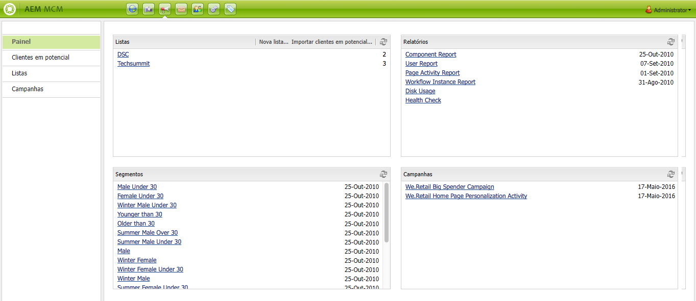

No MCM, é possível acessar:

* **[Painel](#dashboard)**
Isso é dividido em quatro painéis:

   * [Listas](#lists)

      Este painel mostra as listas que você já criou, juntamente com o número de leads nessa lista. Nesse painel, é possível criar uma nova lista diretamente ou importar leads para criar uma nova lista.

      Selecionar uma lista específica o levará ao [Listas](#lists) seção mostrando detalhes da lista.

   * [Segmentos](/help/sites-classic-ui-authoring/classic-personalization-campaigns.md#anoverviewofsegmentation)

      Este painel mostra os segmentos que você definiu. Os segmentos permitem caracterizar uma coleção de visitantes que compartilham certas características.

      Selecionar um segmento específico abrirá a página de definição de segmento.

   * [Relatórios](/help/sites-administering/reporting.md)\
      AEM fornece diferentes relatórios para ajudá-lo a analisar e monitorar o estado da sua instância. Este painel do MCM lista os relatórios.

      Selecionar um relatório abrirá a página do relatório.

   * [Campanhas](#campaigns)

      Esse painel lista suas experiências de campanha, como [boletins informativos](/help/sites-classic-ui-authoring/classic-personalization-campaigns.md#newsletters) e [teasers](/help/sites-classic-ui-authoring/classic-personalization-campaigns.md#teasers).

* **[Clientes em potencial](#leads)**

   Aqui você pode gerenciar seus leads. Você pode criar ou importar leads, editar detalhes específicos para leads individuais ou excluir quando não forem mais necessários. Também é possível colocar leads em grupos diferentes, chamados de Listas. **Observação:** O Adobe não planeja aprimorar mais esse recurso.

   Recomendação para [aproveitar o Adobe Campaign e a integração para AEM](/help/sites-administering/campaign.md).

* **[Listas](#lists)**

   Aqui você pode gerenciar suas listas (de leads).**Observação:** O Adobe não planeja aprimorar mais esse recurso.

   Recomendação para [aproveitar o Adobe Campaign e a integração para AEM](/help/sites-administering/campaign.md).

* **[Campanhas](#campaigns)**
Aqui você pode gerenciar suas marcas, campanhas e experiências.

## Painel {#dashboard}

O painel mostra quatro painéis que fornecem uma visão geral de suas listas (de leads), segmentos, relatórios e campanhas. O acesso à funcionalidade básica desses itens também está disponível aqui.

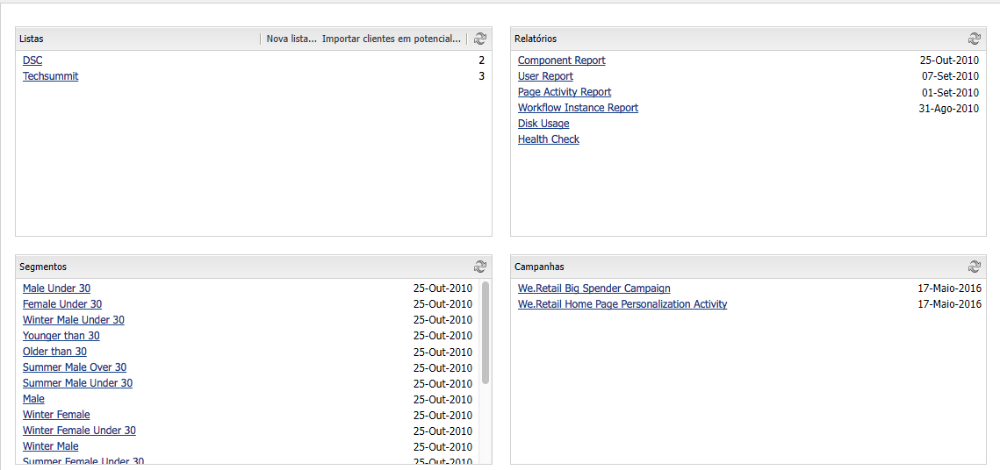

## Clientes em potencial {#leads}

>[!NOTE]
>
>O Adobe não planeja aprimorar mais esse recurso (Gerenciamento de leads).\
>A recomendação é aproveitar [Adobe Campaign e a integração ao AEM](/help/sites-administering/campaign.md).

No AEM MCM, é possível organizar e adicionar leads, inserindo-os manualmente ou importando uma lista separada por vírgulas; por exemplo, uma lista de mala direta. Outras maneiras de gerar leads são a partir de inscrições em informativos ou de inscrições em comunidades (se configuradas, elas podem acionar um fluxo de trabalho que multiplica leads). Geralmente, os leads são categorizados e colocados em uma lista, de modo que posteriormente você possa executar ações em toda a lista; por exemplo, envio de um email personalizado para uma determinada lista.

Em **Clientes potenciais** no painel esquerdo, é possível criar, importar, editar e excluir leads, bem como ativá-los ou desativá-los conforme necessário. Você pode adicionar um lead a uma lista ou ver a quais listas ele já pertence.

>[!NOTE]
>
>Consulte [Trabalhar com leads](/help/sites-classic-ui-authoring/classic-personalization-campaigns.md#workingwithleads) para obter informações detalhadas sobre tarefas específicas.

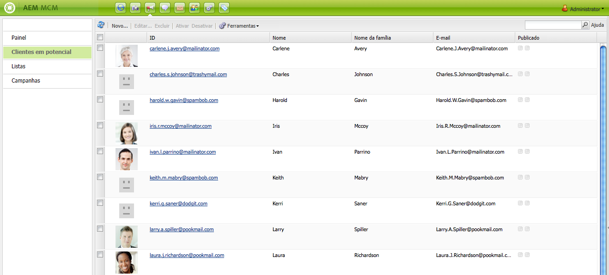

## Listas {#lists}

>[!NOTE]
>
>O Adobe não planeja aprimorar mais esse recurso (Gerenciamento de listas).\
>A recomendação é aproveitar [Adobe Campaign e a integração ao AEM](/help/sites-administering/campaign.md).

As listas permitem organizar seus leads em grupos. Com listas, você pode direcionar suas campanhas de marketing a um grupo seleto de pessoas; por exemplo, você pode enviar um boletim informativo direcionado para uma lista.

Em **Listas**, é possível gerenciar suas listas criando, importando, editando, mesclando e excluindo listas que você pode ativar ou desativar, conforme necessário. Você também pode exibir os leads nessa lista, ver se a lista é membro de outra lista ou exibir a descrição.

>[!NOTE]
>
>Consulte [Trabalhar com listas](/help/sites-classic-ui-authoring/classic-personalization-campaigns.md#workingwithlists) para obter informações detalhadas sobre tarefas específicas.

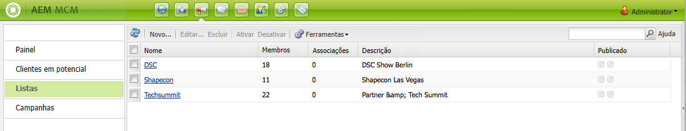

### Campanhas {#campaigns}

>[!NOTE]
>
>Consulte [Teasers e estratégias](/help/sites-classic-ui-authoring/classic-personalization-campaigns.md#workingwithlists), [Configuração da sua campanha](/help/sites-classic-ui-authoring/classic-personalization-campaigns.md#settingupyourcampaign) e [Informativos](/help/sites-classic-ui-authoring/classic-personalization-campaigns.md#newsletters) para obter informações detalhadas sobre tarefas específicas.

Para acessar as campanhas existentes, clique em MCM **Campanhas**.

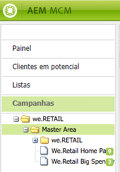

* **No painel esquerdo**:

   Há uma lista de todas as marcas e campanhas.

   Um único clique em uma marca irá:

   * expanda a lista para mostrar todas as campanhas relacionadas no painel esquerdo; essa lista também mostra o número de experiências que existem para cada campanha.
   * abra a visão geral da marca no painel direito.

* **No painel direito**:

   Os ícones são exibidos para cada marca (campanhas históricas não serão exibidas).

   Você pode clicar duas vezes neles para abrir a visão geral da marca.

#### Visão geral da marca {#brand-overview}

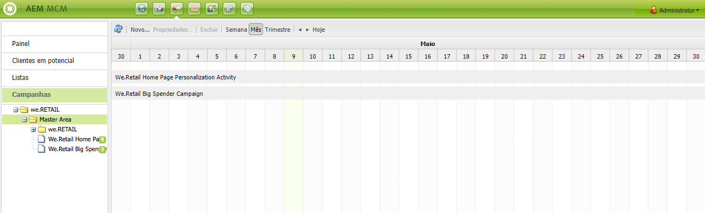

Aqui você pode:

* Veja o número de campanhas e experiências (número mostrado no painel esquerdo) que existem para essa marca.
* Crie um **Novo...** campanha para esta marca.

* Alterar o intervalo de tempo que está sendo exibido; select **Semana**, **Mês** ou **Trimestre**, use as setas para selecionar períodos específicos ou retornar para **Hoje**.

* Selecione uma campanha (no painel direito) para:

   * Edite o **Propriedades...**
   * **Excluir** a campanha.

* Abra a visão geral da campanha (clique duas vezes em uma campanha no painel direito ou clique uma vez no painel esquerdo).

#### Visão geral da campanha {#campaign-overview}

Para campanhas individuais, há duas exibições disponíveis:

1. **Exibição de calendário**

   Use o ícone :

   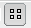

   Apresenta uma lista de todos os pontos de contato (cinza) com um período horizontal das experiências (verde) conectadas a esse ponto de contato:

   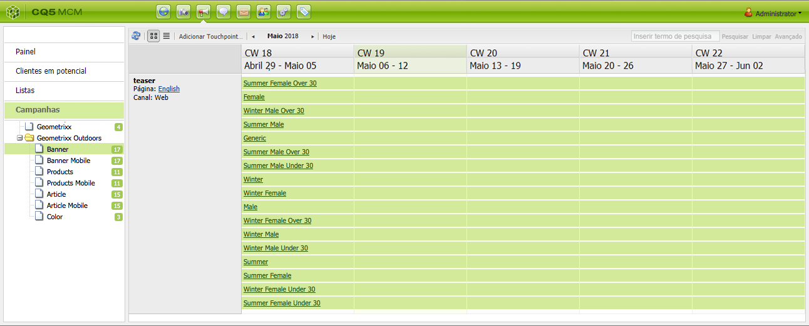

   Aqui você pode:

   * Altere o intervalo de tempo que você está visualizando usando as setas ou retorne para **Hoje**.
   * Use **Adicionar ponto de contato...** para adicionar um novo ponto de contato para uma experiência existente.
   * Clique em um teaser (no painel direito) para definir a variável **Hora de ligar** e **Hora de desligar**.

1. **Exibição de lista**

   Use o ícone :

   

   Isso lista todas as experiências (por exemplo, teasers e boletins informativos) para a campanha selecionada:

   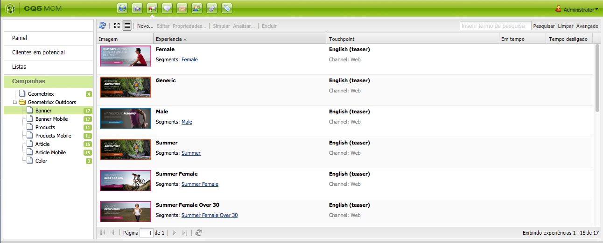

   Aqui você pode:

   * Crie um **Novo...** Experiência; por exemplo, ofertas do Adobe Target, teasers e boletins informativos.
   * **Editar** os detalhes de uma página de teaser ou boletim informativo específico (também é possível clicar duas vezes).
   * Defina as **Propriedades...** para uma página de teaser ou boletim informativo específico.
   * **Simulate** a aparência de uma experiência (página de teaser ou boletim informativo).

      Quando a página simulada estiver aberta, é possível abrir o sidekick para alternar para o modo de edição dessa página.

   * **Analisar...** as impressões geradas para uma página.
   * **Excluir** itens quando não forem mais necessários.
   * **Pesquisar** para o texto (o campo Título da experiência será pesquisado).
   * Use **Avançado** pesquise para aplicar filtros à pesquisa.

### Simulação das experiências da campanha {#simulating-your-campaign-experiences}

No MCM, clique em **Campanhas**. Certifique-se de que a exibição de lista está ativa, selecione a experiência necessária da campanha e clique em **Simulate**. O ponto de contato (página de teaser ou boletim informativo) será aberto para mostrar a experiência selecionada, como o visitante a verá.

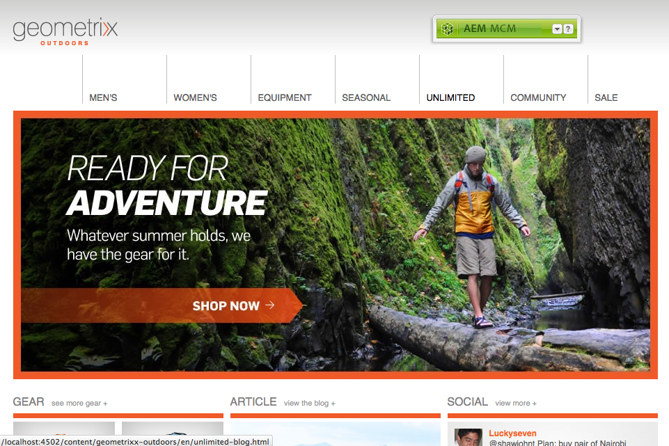

Aqui, também é possível abrir o sidekick (clique na seta pequena para baixo) para alterar o modo de edição e atualizar a página.

### Análise das experiências da campanha {#analyzing-your-campaign-experiences}

No MCM, clique em **Campanhas**. Certifique-se de que a exibição de lista está ativa, selecione a experiência necessária da campanha e selecione **Analisar...**. Um gráfico das impressões da página será exibido ao longo do tempo.

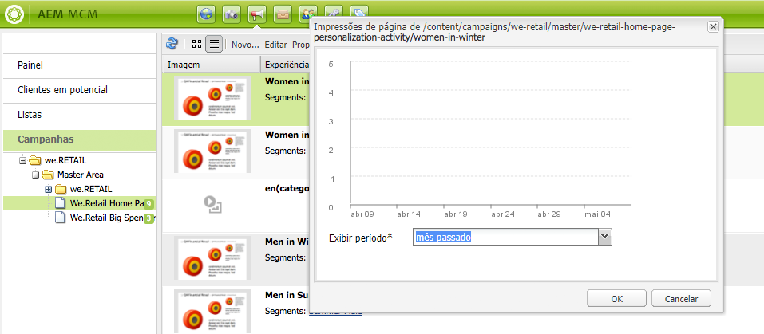
