# Configuração da sua campanha{#setting-up-your-campaign}

>[!CAUTION]
>
>AEM 6.4 chegou ao fim do suporte estendido e esta documentação não é mais atualizada. Para obter mais detalhes, consulte nossa [períodos de assistência técnica](https://helpx.adobe.com/br/support/programs/eol-matrix.html). Encontre as versões compatíveis [here](https://experienceleague.adobe.com/docs/).

Configurar uma nova campanha inclui as seguintes etapas (genéricas):

1. [Criar uma marca](#creating-a-new-brand) para manter suas campanhas.
1. Se necessário, é possível [definir as propriedades da nova marca](#defining-the-properties-for-your-new-brand).
1. [Criar uma campanha](#creating-a-new-campaign) possuir experiências; por exemplo, páginas de teaser ou um boletim informativo.
1. Se necessário, é possível [defina as propriedades da nova campanha](#defining-the-properties-for-your-new-campaign).

Em seguida, dependendo do tipo de experiência que você está criando, será necessário [criar uma experiência](#creating-a-new-experience). Os detalhes da experiência e as ações que seguem a criação dependem do tipo de experiência que você deseja criar:

* Se estiver criando um Teaser:

   1. [Criar uma experiência de teaser](/help/sites-classic-ui-authoring/classic-personalization-campaigns.md#creatingateaserexperience).
   1. [Adicionar conteúdo ao teaser](/help/sites-classic-ui-authoring/classic-personalization-campaigns.md#addingcontenttoyourteaser).
   1. [Criar um ponto de contato para o teaser](/help/sites-classic-ui-authoring/classic-personalization-campaigns.md#creatingatouchpointforyourteaser) (adicione o teaser a uma página de conteúdo).

* Se estiver criando um informativo:

   1. [Criar uma experiência de informativo](/help/sites-classic-ui-authoring/classic-personalization-campaigns.md#creatinganewsletterexperience).
   1. [Adicione conteúdo ao informativo.](/help/sites-classic-ui-authoring/classic-personalization-campaigns.md#addingcontenttonewsletters)
   1. [Personalize o informativo.](/help/sites-classic-ui-authoring/classic-personalization-campaigns.md#personalizingnewsletters)
   1. [Criar uma página de aterrissagem de informativo atraente](/help/sites-classic-ui-authoring/classic-personalization-campaigns.md#settingupanewsletterlandingpage).
   1. [Enviar informativo](/help/sites-classic-ui-authoring/classic-personalization-campaigns.md#sendingnewsletters) para assinantes ou leads.

* Se estiver criando uma oferta do Adobe Target (anteriormente Test&amp;Target):

   1. [Criar uma experiência de oferta do Adobe Target](/help/sites-classic-ui-authoring/classic-personalization-campaigns.md#creatingatesttargetofferexperience).
   1. [Fazer a integração com o Adobe Target](/help/sites-classic-ui-authoring/classic-personalization-campaigns.md#integratewithadobetesttarget)

>[!NOTE]
>
>Consulte [Segmentação](/help/sites-administering/campaign-segmentation.md) para obter instruções detalhadas sobre como definir seus segmentos.

## Criação de uma nova marca {#creating-a-new-brand}

Para criar uma nova marca:

1. Abra o **MCM** e selecione **Campanhas** no painel esquerdo.

1. Selecionar **Novo...** para inserir o **Título** e **Nome** e modelo a ser usado para sua nova marca:

   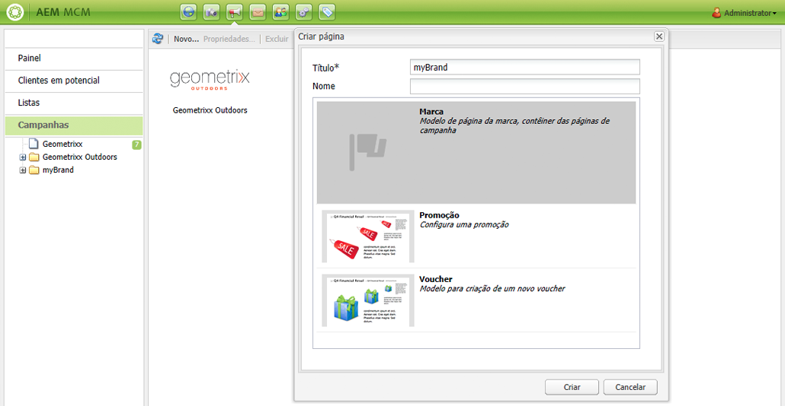

1. Clique em **Criar**. A nova marca será exibida no MCM (com um ícone padrão).

### Definição das propriedades para sua nova marca {#defining-the-properties-for-your-new-brand}

1. De **Campanhas** no painel esquerdo, selecione o ícone da nova marca no painel direito e clique em **Propriedades...**

   Você pode inserir um **Título**, **Descrição** e uma imagem a ser usada como ícone.

   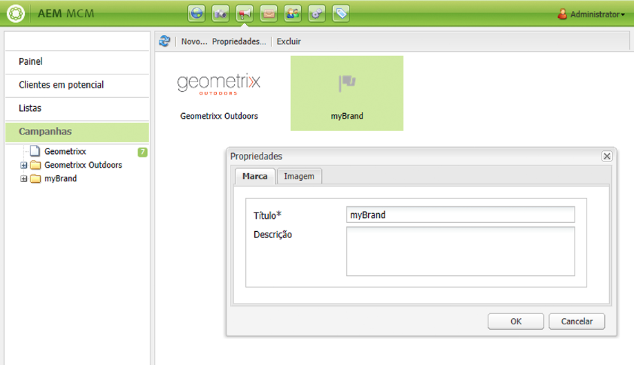

1. Clique em **OK** para salvar.

## Criação de uma nova campanha {#creating-a-new-campaign}

Para criar uma nova campanha:

1. De **Campanhas**, selecione a nova marca no painel esquerdo ou clique duas vezes no ícone no painel direito.

   A visão geral será exibida (em branco se a marca for nova).

1. Clique em **Novo...** e especifique o **Título**, **Nome** e que serão usadas para sua nova campanha.

   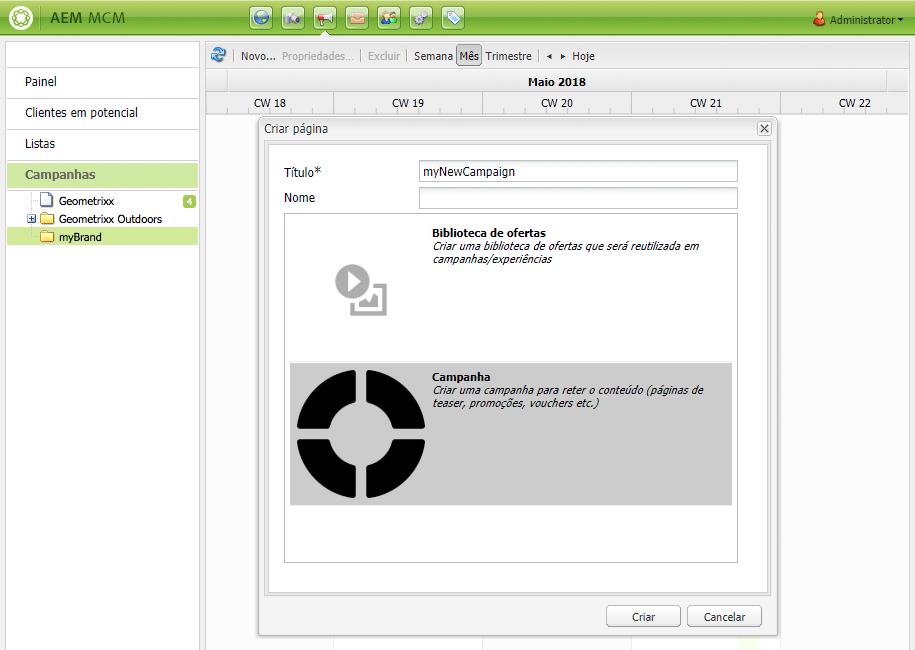

1. Clique em **Criar**. A nova campanha será exibida no MCM.

### Definir as propriedades da sua nova campanha {#defining-the-properties-for-your-new-campaign}

Configure as propriedades da campanha que controlam o comportamento:

* **Prioridade:** A prioridade dessa campanha em relação a outras campanhas. Quando várias campanhas estão ativadas simultaneamente, a campanha com a maior prioridade controla a experiência do visitante.
* **Hora de ligar e desligar:** Essas propriedades controlam o período de tempo em que a campanha controla a experiência do visitante. A propriedade Em tempo controla a hora em que a campanha começa a controlar a experiência. A propriedade Tempo desligado controla quando as campanhas param de controlar a experiência.
* **Imagem:** A imagem que representa a campanha no AEM.
* **Cloud Services:** As configurações de Cloud Service com as quais a campanha é integrada. (Consulte [Integração com o Adobe Marketing Cloud](/help/sites-administering/marketing-cloud.md).)

* **Adobe Target:** Propriedades que configuram campanhas integradas ao Adobe Target. (Consulte [Integração com o Adobe Target](/help/sites-administering/target.md).)

1. De **Campanhas**, selecione a marca. No painel direito, selecione sua campanha e clique em **Propriedades**.

   É possível inserir várias propriedades, incluindo um **Título**, **Descrição** e qualquer **Cloud Services** você quer.

   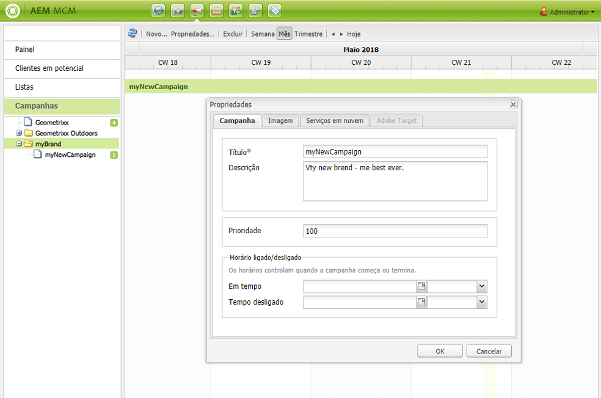

1. Clique em **OK** para salvar.

## Criar uma nova experiência {#creating-a-new-experience}

O procedimento para criar uma nova experiência depende do tipo de experiência:

* [Criação de um teaser](/help/sites-classic-ui-authoring/classic-personalization-campaigns.md#creatingateaser)
* [Criação de um informativo](/help/sites-classic-ui-authoring/classic-personalization-campaigns.md#creatinganewsletter)
* [Criação de uma oferta do Adobe Target](/help/sites-classic-ui-authoring/classic-personalization-campaigns.md#creatingatesttargetoffer)

>[!NOTE]
>
>Assim como nas versões anteriores, ainda é possível criar a experiência como uma página na **Sites** (e quaisquer páginas criadas em versões anteriores ainda são totalmente compatíveis).
>
>A prática recomendada é usar o MCM para criar experiências.

## Configurar sua nova experiência {#configuring-your-new-experience}

Agora que você criou o esqueleto básico para sua experiência, é necessário continuar com as seguintes ações, dependendo do tipo de experiência:

* [Teaser](/help/sites-classic-ui-authoring/classic-personalization-campaigns.md#teasers):

   * [Conecte a página de teaser aos segmentos do visitante.](/help/sites-classic-ui-authoring/classic-personalization-campaigns.md#applyingasegmenttoyourteaser)
   * [Criar um ponto de contato para o teaser](/help/sites-classic-ui-authoring/classic-personalization-campaigns.md#creatingatouchpointforyourteaser) (adicione o teaser a uma página de conteúdo).

* [informativo](/help/sites-classic-ui-authoring/classic-personalization-campaigns.md#newsletters):

   * [Adicione conteúdo ao informativo.](/help/sites-classic-ui-authoring/classic-personalization-campaigns.md#addingcontenttonewsletters)
   * [Personalize o informativo.](/help/sites-classic-ui-authoring/classic-personalization-campaigns.md#personalizingnewsletters)
   * [Enviar informativo](/help/sites-classic-ui-authoring/classic-personalization-campaigns.md#sendingnewsletters) para assinantes ou leads.
   * [Criar uma página de aterrissagem de informativo atraente](/help/sites-classic-ui-authoring/classic-personalization-campaigns.md#settingupanewsletterlandingpage).

* [Oferta do Adobe Target](/help/sites-classic-ui-authoring/classic-personalization-campaigns.md#testtargetoffers):

   * [Fazer a integração com o Adobe Target](/help/sites-administering/target.md)

### Adicionar um novo ponto de contato {#adding-a-new-touchpoint}

Se você tiver experiências existentes, é possível adicionar um ponto de contato diretamente da exibição Calendário do MCM:

1. Selecione a exibição de calendário para sua campanha.

1. Clique em **Adicionar ponto de contato...** para abrir a caixa de diálogo. Especifique a experiência que deseja adicionar:

   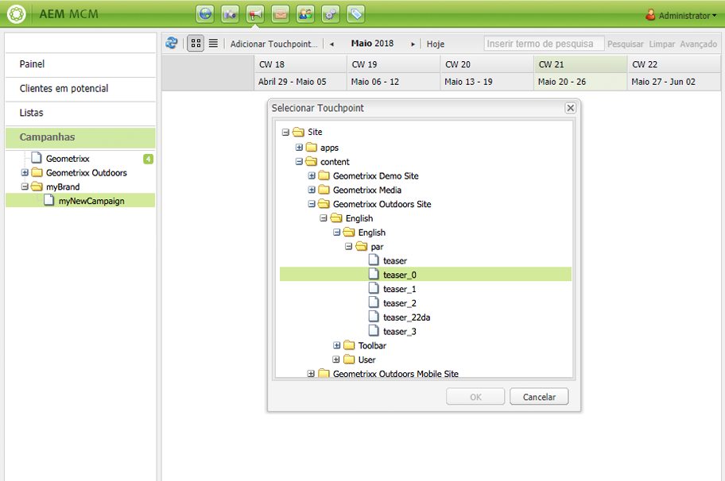

1. Clique em **OK** para salvar.

## Trabalhar com leads {#working-with-leads}

>[!NOTE]
>
>O Adobe não planeja aprimorar mais esse recurso (Gerenciamento de leads).\
>Recomendação para [aproveitar o Adobe Campaign e a integração para AEM](/help/sites-administering/campaign.md).

No AEM MCM, é possível organizar e adicionar leads, inserindo-os manualmente ou importando uma lista separada por vírgulas, por exemplo, uma lista de distribuição. Outras maneiras de gerar leads são a partir de inscrições em informativos ou de inscrições em comunidades (se configuradas, elas podem acionar um fluxo de trabalho que multiplica leads).

Geralmente, os leads são categorizados e colocados em uma lista, de modo que posteriormente você possa executar ações em toda a lista, por exemplo, enviar um email personalizado para uma determinada lista.

No Painel, você acessa todos os leads clicando em **Clientes potenciais** no painel esquerdo. Você também pode acessar leads do **Listas** painel.

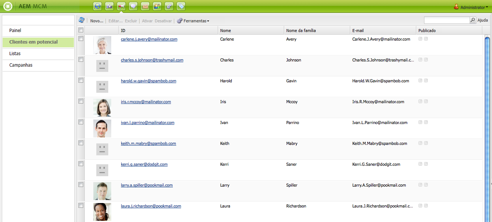

>[!NOTE]
>
>Para adicionar ou modificar os avatares dos usuários, abra a nuvem do fluxo de cliques (Ctrl+Alt+c), carregue o perfil e clique em **Editar**.

### Criação de novos leads {#creating-new-leads}

Depois de criar novos leads, certifique-se de [ativá-los](#activating-or-deactivating-leads) para que você possa acompanhar a atividade na instância de publicação e personalizar a experiência.

Para criar um novo lead manualmente:

1. Em AEM, navegue até o MCM. No Painel , clique em **Clientes potenciais**.
1. Clique em **Novo**. O **Criar novo** será aberta.

   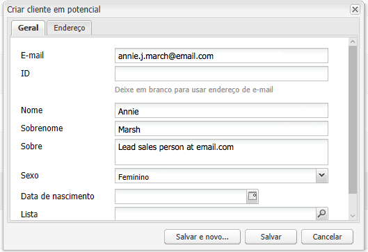

1. Insira informações nos campos, conforme apropriado. Clique no botão **Endereço** guia .

   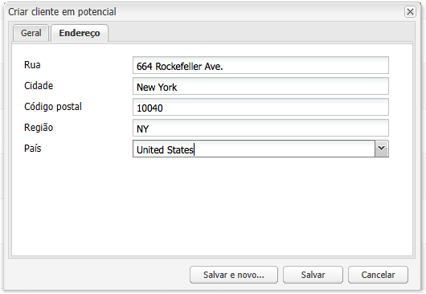

1. Insira as informações de endereço, conforme apropriado. Clique em **Salvar** para salvar o lead. Se precisar adicionar outros leads, clique em** Salvar e Novo**.

   O novo lead aparece no painel Leads. Ao clicar na entrada, todas as informações inseridas serão exibidas no painel direito. Depois de criar um lead, você pode adicioná-lo a uma lista.

   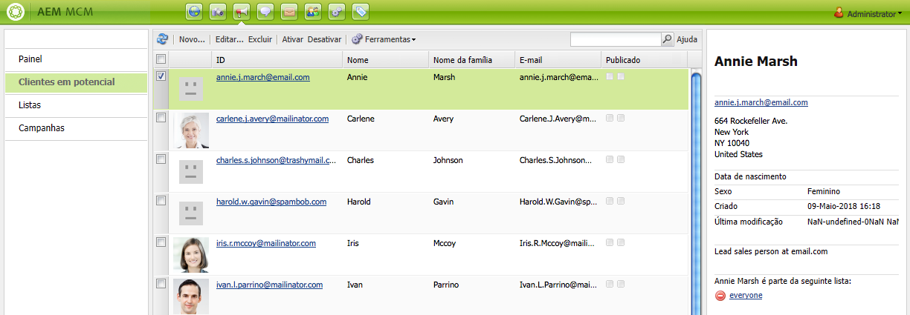

### Ativar ou desativar leads {#activating-or-deactivating-leads}

Ativar leads ajuda você a rastrear a atividade deles na instância de publicação e permite personalizar a experiência. Quando não quiser mais rastrear a atividade, é possível desativá-las.

Para ativar ou desativar leads:

1. No AEM, navegue até o MCM e clique em **Clientes potenciais**.

1. Selecione os leads que você deseja ativar ou desativar e clique em **Ativar** ou **Desativar**.

   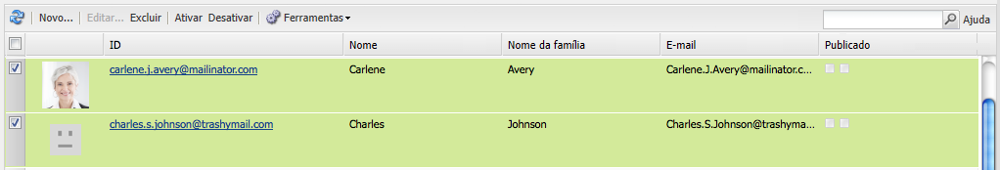

   Assim como em AEM páginas, o status de publicação é indicado na variável **Publicado** coluna.

   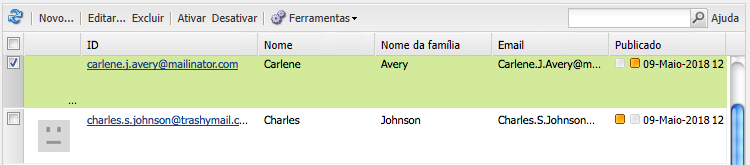

### Importação de novos leads {#importing-new-leads}

Ao importar novos leads, você pode adicioná-los automaticamente a uma lista existente ou criar uma nova lista para incluir esses leads.

Para importar leads de uma lista separada por vírgulas:

1. No AEM, navegue até o MCM e clique em **Clientes potenciais**.

   >[!NOTE]
   >
   >Como alternativa, você pode importar leads seguindo um destes procedimentos:
   >
   >* No Painel , clique em **Importar leads** no **Listas** painel
   >* Clique em **Listas** e na **Ferramentas** selecione **Importar leads**.

1. No **Ferramentas** selecione **Importar leads**.
1. Insira as informações conforme descrito em Dados de amostra. Os seguintes campos podem ser importados: email,familyName,givenName,gender,aboutMe,city,country,phoneNumber,postalCode,region,streetAddress

   >[!NOTE]
   >
   >A primeira linha na lista CSV são rótulos predefinidos que devem ser escritos exatamente como no exemplo:
   >
   >`email,givenName,familyName` - se escrito como `givenname`, por exemplo, o sistema não o reconhecerá.

   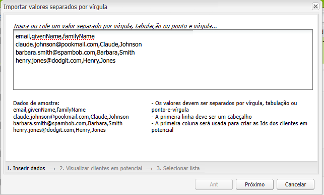

1. Clique em **Avançar**. Aqui, você visualiza os leads para garantir que eles sejam precisos.

   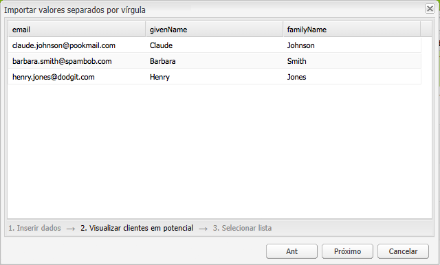

1. Clique em **Avançar**. Selecione a lista à qual você deseja que os leads pertençam. Se você não quiser que eles pertençam a uma lista, exclua as informações do campo . Por padrão, AEM cria um nome de lista que inclui a data e a hora. Clique em **Importar**.

   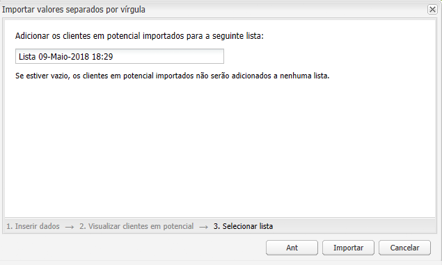

   O novo lead aparece no painel Leads. Se você clicar na entrada, todas as informações inseridas serão exibidas no painel direito. Depois de criar um lead, você pode adicioná-lo a uma lista.

### Adição de leads a listas {#adding-leads-to-lists}

Para adicionar leads a listas pré-existentes:

1. No MCM, clique em **Clientes potenciais** para visualizar todos os leads disponíveis.

1. Selecione os leads que você deseja adicionar a uma lista, marcando a caixa de seleção ao lado do lead. Você pode adicionar quantos leads quiser.

   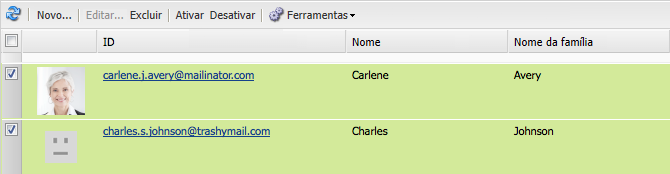

1. No **Ferramentas** selecione **Adicionar à Lista....** A janela **Adicionar à lista **é aberta.

   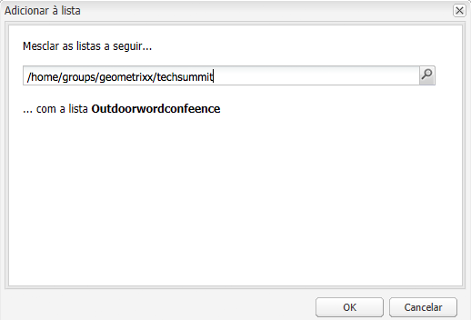

1. Selecione a lista à qual deseja adicionar os leads e clique em **OK**. Os leads são adicionados às listas apropriadas.

### Visualização de informações do lead {#viewing-lead-information}

Para exibir informações do lead, no MCM, clique na caixa de seleção ao lado do lead, e um painel direito será aberto com todas as informações do lead exibidas, incluindo a afiliação de lista.

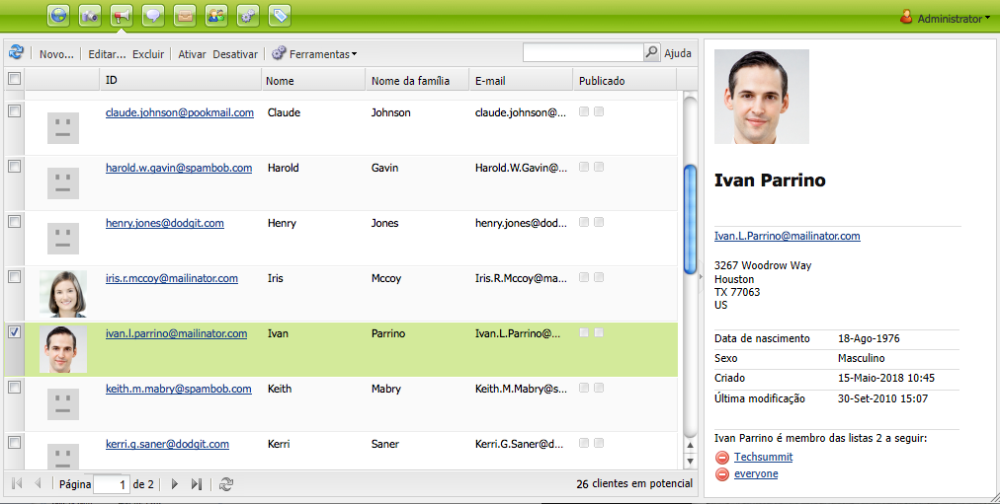

### Modificação de leads existentes {#modifying-existing-leads}

Para modificar informações de lead existentes:

1. No MCM, clique em **Clientes potenciais**. Na lista de leads, marque a caixa de seleção ao lado do lead que você deseja editar. Todas as informações do lead aparecem no painel direito.

   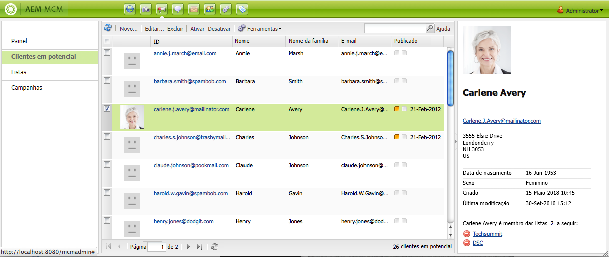

   >[!NOTE]
   >
   >Você só pode editar um lead por vez. Se você precisar modificar leads que fazem parte da mesma lista, é possível modificar a lista.

1. Clique em **Editar**. O **Editar lead** será aberta.

   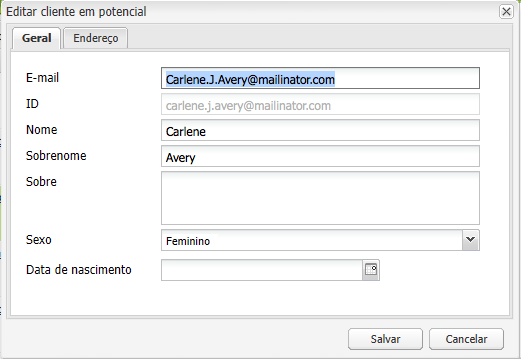

1. Faça as edições conforme necessário e clique em **Salvar** para salvar as alterações.

   >[!NOTE]
   >
   >Para alterar o avatar do lead, vá para o perfil do usuário. Você pode carregar o perfil na nuvem de sequência de cliques pressionando CTRL+ALT+c, clicando em **Carregar** e depois selecionando o perfil.

### Exclusão de leads existentes {#deleting-existing-leads}

Para excluir leads existentes no MCM, marque a caixa de seleção ao lado do lead e clique em **Excluir**. O lead é removido da lista de lead e de todas as listas associadas.

>[!NOTE]
>
>Antes de excluir, AEM confirma que você deseja excluir o lead existente. Depois de excluído, ele não poderá ser recuperado.

## Trabalhar com listas {#working-with-lists}

>[!NOTE]
>
>O Adobe não planeja aprimorar mais esse recurso (gerenciamento de listas).\
>Recomendação para [aproveitar o Adobe Campaign e a integração para AEM](/help/sites-administering/campaign.md).

As listas permitem organizar seus leads em grupos. Com as listas, você pode direcionar suas campanhas de marketing a um grupo seleto de pessoas, por exemplo, é possível enviar um boletim informativo direcionado a uma lista. As listas são visíveis no MCM, no Painel ou clicando em **Listas**. Ambos fornecem o nome da lista e o número de membros.

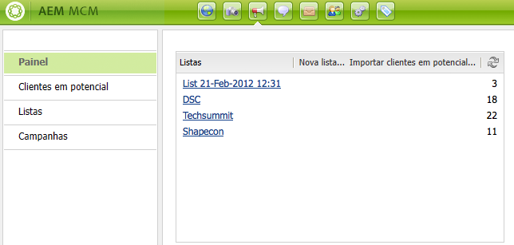

Se você clicar em **Listas**, você também pode visualizar se a lista é membro de outra lista e ver uma descrição.

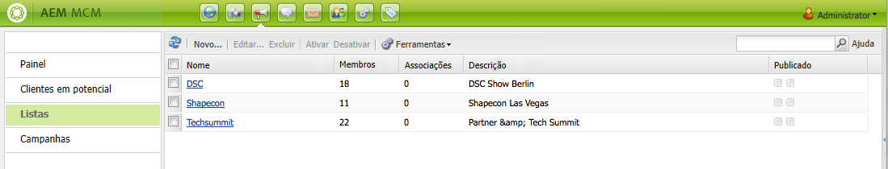

### Criação de novas listas {#creating-new-lists}

Para criar uma nova lista (grupo):

1. No painel MCM, clique em **Nova Lista ...** ou **Listas**, clique em **Novo** ... A janela Criar lista é aberta.

   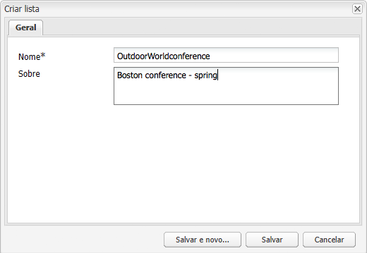

1. Insira um nome (obrigatório) e, se desejar, uma descrição e clique em **Salvar**. A lista é exibida no **Listas** painel.

   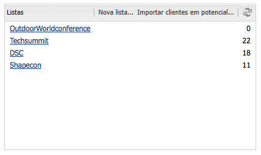

### Modificação de listas existentes {#modifying-existing-lists}

Para modificar uma lista existente:

1. No MCM, clique em **Listas**.

1. Na lista, marque a caixa de seleção ao lado da lista que você deseja editar e clique em **Editar**. O **Editar lista** será aberta.

   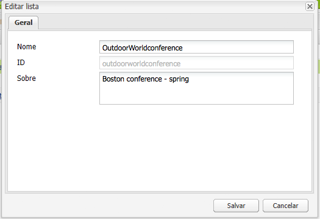

   >[!NOTE]
   >
   >Só é possível editar uma lista de cada vez.

1. Faça edições, conforme necessário, e clique em **Salvar** para salvar as alterações.

### Exclusão de listas existentes {#deleting-existing-lists}

Para excluir listas existentes, no MCM, marque a caixa de seleção ao lado da lista e clique em **Excluir**. A lista é removida. Os leads afiliados à lista não são removidos - somente a afiliação à lista é excluída.

>[!NOTE]
>
>Antes de excluir, AEM confirma que você deseja excluir as listas existentes. Depois de excluído, ele não poderá ser recuperado.

### Mesclagem de listas {#merging-lists}

É possível mesclar uma lista existente com outra lista. Ao fazer isso, a lista que está sendo mesclada se torna membro da outra lista. Ele ainda existe como uma entidade separada e não deve ser excluído.

Você pode mesclar listas se tiver a mesma conferência em dois locais diferentes e quiser mesclá-las em uma lista de participantes de todas as conferências.

Para mesclar listas existentes:

1. No MCM, clique em **Listas**.

1. Selecione a lista com a qual deseja mesclar outra lista, marcando a caixa de seleção ao lado dela.

1. No **Ferramentas** selecione **Mesclar Lista**.

   >[!NOTE]
   >
   >Só é possível mesclar uma lista por vez.

1. No **Mesclar Lista** selecione a lista com a qual deseja mesclar e clique em **OK**.

   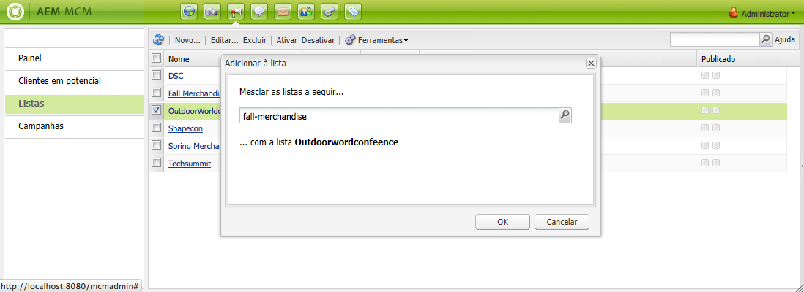

   A lista que você mesclou deve aumentar em um membro. Para ver se a lista foi mesclada, selecione a lista mesclada e na **Ferramentas** selecione **Mostrar leads**.

1. Repita a etapa até ter mesclado todas as listas desejadas.

   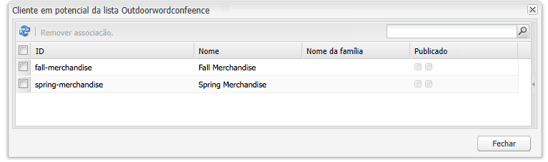

>[!NOTE]
>
>Remover uma lista mesclada de sua associação é idêntico à remoção de um lead de uma lista. Abra o **Listas** selecione a lista que inclui a lista mesclada e remova a associação clicando no círculo vermelho ao lado da lista.

### Exibição de leads em listas {#viewing-leads-in-lists}

A qualquer momento, você pode visualizar quais leads pertencem a uma lista específica navegando ou procurando membros.

Para exibir os leads que pertencem a uma lista:

1. No MCM, clique em **Listas**.

1. Marque a caixa de seleção ao lado da lista cujos membros você deseja visualizar.

1. No **Ferramentas** selecione **Mostrar leads**. AEM exibe os leads que são membros dessa lista. Você pode navegar pela lista ou procurar membros.

   >[!NOTE]
   >
   >Além disso, é possível excluir leads de uma lista, selecionando-os e clicando em **Remover associação**.

   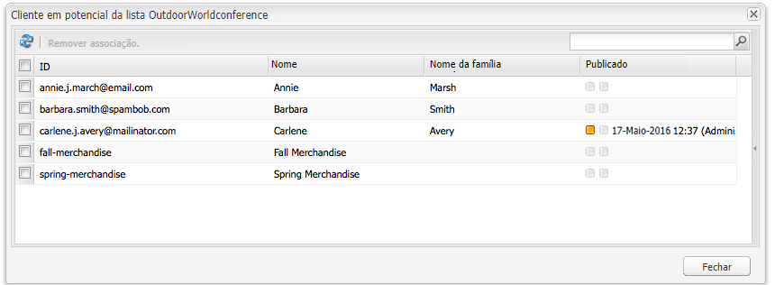

1. Clique em **Fechar** para retornar ao MCM.
