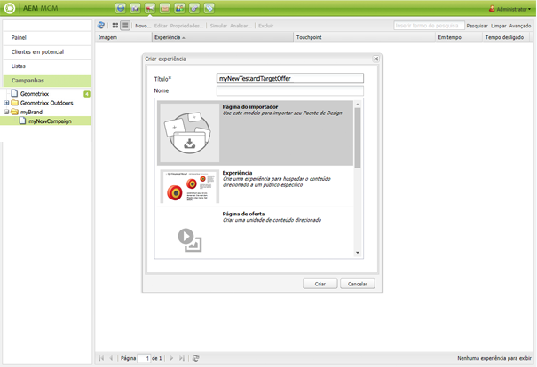

# Ofertas do Target{#target-offers}

>[!CAUTION]
>
>AEM 6.4 chegou ao fim do suporte estendido e esta documentação não é mais atualizada. Para obter mais detalhes, consulte nossa [períodos de assistência técnica](https://helpx.adobe.com/br/support/programs/eol-matrix.html). Encontre as versões compatíveis [here](https://experienceleague.adobe.com/docs/).

## Criação de uma experiência de oferta do Test&amp;Target {#creating-a-test-target-offer-experience}

1. Selecione sua nova campanha no painel esquerdo ou clique duas vezes no painel direito.
1. Selecione a exibição de lista usando o ícone :

   

1. Clique em **Novo ...**
1. É possível especificar a variável **Título**, **Nome** e tipo de experiência a criar; nesse caso, a oferta do Test&amp;Target.

   

1. Clique em **Criar**.

   >[!NOTE]
   >
   >As experiências do Test&amp;Target não estão listadas no MCM. Elas podem ser acessadas na **Sites** , em Campanhas.

## Integração com o Adobe Target {#integrating-with-adobe-target}

Consulte [Integrar com o Adobe](/help/sites-administering/target.md) [Target](/help/sites-administering/target.md) para obter detalhes completos.
