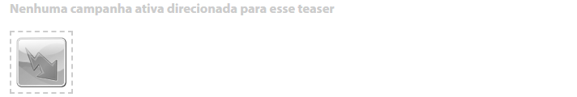
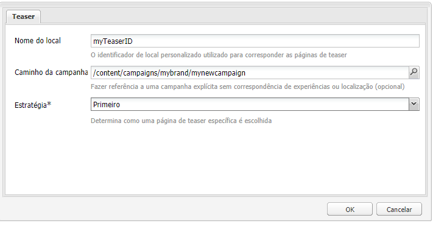
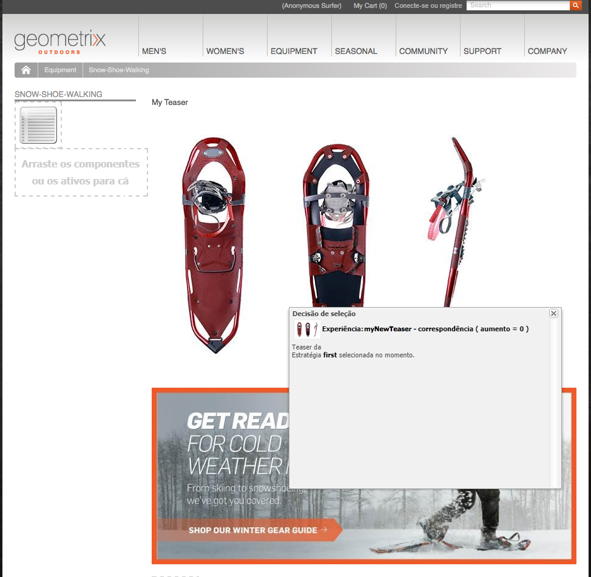
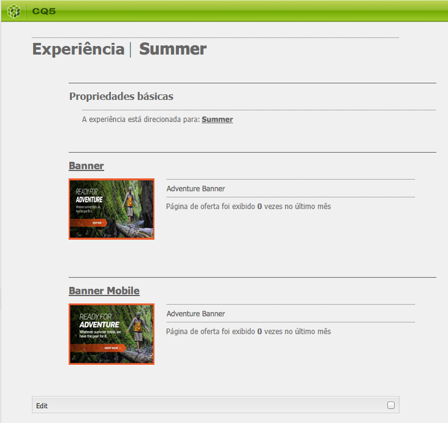

# Teasers e estratégias{#teasers-and-strategies}

>[!CAUTION]
>
>AEM 6.4 chegou ao fim do suporte estendido e esta documentação não é mais atualizada. Para obter mais detalhes, consulte nossa [períodos de assistência técnica](https://helpx.adobe.com/br/support/programs/eol-matrix.html). Encontre as versões compatíveis [here](https://experienceleague.adobe.com/docs/).

As campanhas geralmente usam teasers como um mecanismo para atrair um segmento específico da população de visitantes para conteúdo focado em seus interesses. Um ou mais teasers são definidos para uma campanha específica.

>[!NOTE]
>
>O componente Teaser foi descontinuado no AEM 6.2.

* **Páginas da marca** são armazenadas na seção Campanhas do site. Uma marca contém as campanhas individuais.

* **Páginas da campanha** são armazenadas na seção Campanhas do site. Cada campanha tem uma página individual, na qual as definições de teaser são mantidas. A página de contêiner, ou visão geral, também contém determinadas informações e estatísticas referentes às páginas de teaser individuais.

Os teasers no AEM são compostos por várias partes:

* **Páginas de Teaser** são armazenadas na página de campanha apropriada e contêm as definições dos parágrafos de teaser disponíveis para cada campanha específica. Essas definições são usadas ao exibir os parágrafos de teaser; incluindo variações de conteúdo, o segmento a ser usado para selecionar uma variação e um fator de reforço.
* O **Componente Teaser** O está disponível e permite criar uma instância do seu parágrafo de teaser específico em uma página de conteúdo. Você pode arrastar o componente de teaser do sidekick e especificar a definição do teaser para criar seu próprio parágrafo de teaser. **Observação:** O componente Teaser foi descontinuado no AEM 6.2.

* **Parágrafos de teaser** são instâncias reais do seu teaser em uma página de conteúdo. Eles atraem um segmento de visitantes para o conteúdo focado em seus interesses.
* As páginas que contêm o conteúdo da campanha focado em um segmento de visitante específico. Geralmente, os parágrafos de teaser levarão o visitante a essas páginas.

## Estratégias {#strategies}

Ao adicionar um parágrafo de teaser a uma página, é necessário definir a variável **Estratégia**.

Isso ocorre no caso de vários teasers estarem disponíveis para seleção, pois todos os segmentos atribuídos são resolvidos com sucesso. O **Estratégia** em seguida, especifica um critério extra usado para selecionar o teaser mostrado:

* **Pontuação da sequência de cliques** O é baseado nas tags e ocorrências de tag relacionadas mantidas no contexto de cliente do visitante (mostra a frequência com que um visitante clicou em páginas que contêm a respectiva tag). As taxas de ocorrência de tags definidas na página de teaser são comparadas.
* **Random**, para a seleção &quot;aleatória&quot;; usa o fator aleatório gerado para uma página, isso pode ser visto com a variável [contexto do cliente](/help/sites-administering/client-context.md).

* **First** na lista de segmentos resolvidos. A ordem é a dos teasers na página de contêiner da campanha.

O [Fator de reforço](/help/sites-administering/campaign-segmentation.md#boost-factor) do segmento também afeta a seleção. Esse é um fator de ponderação adicionado a uma definição de segmento para aumentar/diminuir a probabilidade relativa de sua seleção.

O processo e as interrelações dos vários critérios de seleção são ilustrados melhor com um exemplo (um método que também pode ser usado para garantir que seus teasers atingirão o público exigido).

Se os segmentos a seguir já tiverem sido criados e atribuídos ao respectivo Fator de reforço:

| Segmento | Fator de reforço |
|---|---|
| S1 | 0 |
| S2 | 0 |
| S3 | 10 |
| S4 | 30 |
| S5 | 0 |
| S6 | 100 |

E usamos as seguintes definições de teaser:

<table> 
 <tbody> 
  <tr> 
   <td>Campaign</td> 
   <td>Teaser</td> 
   <td>Segmentos atribuídos</td> 
   <td>Tags atribuídas </td> 
  </tr> 
  <tr> 
   <td>C1</td> 
   <td>T1</td> 
   <td>S1, S2</td> 
   <td>Negócios, Marketing</td> 
  </tr> 
  <tr> 
   <td>C1</td> 
   <td>T2 </td> 
   <td>S1</td> 
   <td>  </td> 
  </tr> 
  <tr> 
   <td>C1 </td> 
   <td>T3</td> 
   <td>S3, S4</td> 
   <td>  </td> 
  </tr> 
  <tr> 
   <td>C1 </td> 
   <td>T4</td> 
   <td>S2, S5</td> 
   <td>  </td> 
  </tr> 
  <tr> 
   <td>C1 </td> 
   <td>T5</td> 
   <td>S1, S2, S6</td> 
   <td>Marketing</td> 
  </tr> 
  <tr> 
   <td>C1 </td> 
   <td>T6</td> 
   <td>S6</td> 
   <td>Negócios  </td> 
  </tr> 
 </tbody> 
</table>

Em seguida, se aplicarmos isso a um visitante, onde:

* **S1**, **S2** e **S6** resolução com êxito

* a tag **marketing** tem 3 ocorrências
* a tag **empresa** tem 6 ocorrências

Podemos ver o resultado:

* sucesso de correspondência - qualquer um dos segmentos atribuídos ao teaser é resolvido com êxito para o visitante atual?
* fator de reforço - o maior fator de reforço de todos os segmentos aplicáveis
* pontuação de sequência de cliques - o total acumulado de todas as ocorrências de tag aplicáveis

que são calculadas antes da aplicação da estratégia adequada:

<table> 
 <tbody> 
  <tr> 
   <td>Campaign</td> 
   <td>Teaser</td> 
   <td>Segmentos atribuídos</td> 
   <td>Tags </td> 
   <td>Correspondência bem-sucedida?</td> 
   <td>Fator de reforço resultante</td> 
   <td>Pontuação de sequência de cliques resultante </td> 
  </tr> 
  <tr> 
   <td>C1</td> 
   <td>T1</td> 
   <td>S1, S2</td> 
   <td>Negócios, Marketing</td> 
   <td>Sim</td> 
   <td>0</td> 
   <td>9</td> 
  </tr> 
  <tr> 
   <td>C1</td> 
   <td>T2 </td> 
   <td>S1</td> 
   <td>  </td> 
   <td>Sim</td> 
   <td>0</td> 
   <td>  </td> 
  </tr> 
  <tr> 
   <td>C1 </td> 
   <td>T3</td> 
   <td>S3, S4</td> 
   <td>  </td> 
   <td>Não</td> 
   <td>  </td> 
   <td>  </td> 
  </tr> 
  <tr> 
   <td>C1 </td> 
   <td>T4</td> 
   <td>S2, S5</td> 
   <td>  </td> 
   <td>Sim  </td> 
   <td>0  </td> 
   <td>  </td> 
  </tr> 
  <tr> 
   <td>C1 </td> 
   <td>T5</td> 
   <td>S1, S2, S6</td> 
   <td>Marketing</td> 
   <td>Sim</td> 
   <td>100</td> 
   <td>3</td> 
  </tr> 
  <tr> 
   <td>C1 </td> 
   <td>T6</td> 
   <td>S6</td> 
   <td>Negócios</td> 
   <td>Sim</td> 
   <td>100</td> 
   <td>6 </td> 
  </tr> 
 </tbody> 
</table>

Esses valores são usados para determinar os teasers que o visitante verá, dependendo da variável **Estratégia** aplicada ao parágrafo do teaser:

<table> 
 <tbody> 
  <tr> 
   <td>Estratégia</td> 
   <td>Teaser resultante</td> 
   <td>Comentários</td> 
  </tr> 
  <tr> 
   <td>Primeiro</td> 
   <td>T5</td> 
   <td>Somente T5 e T6 são considerados, pois todos os seus segmentos resolvem <i>e</i> têm o maior fator de reforço. A lista retornada é pela ordem T5, T6; assim, T5 é selecionado e exibido.</td> 
  </tr> 
  <tr> 
   <td>Aleatório</td> 
   <td>T5 ou T6</td> 
   <td>Ambos os teasers têm segmentos que são resolvidos e o mesmo fator de reforço. Portanto, os dois teasers serão mostrados em proporção igual.</td> 
  </tr> 
  <tr> 
   <td>Pontuação da sequência de cliques</td> 
   <td>T6</td> 
   <td>
Segmentos para T1, T4, T5 e T6 são resolvidos para o visitante. Os fatores de reforço mais elevados de T5 e T6 excluem então T1 e T4. Por fim, a Pontuação de sequência de cliques mais alta de T6 resulta na seleção disso.
 </td> 
  </tr> 
 </tbody> 
</table>

>[!NOTE]
>
>Se, após as técnicas de resolução acima, vários teasers estiverem disponíveis para seleção, uma seleção interna (aleatória) selecionará um único teaser para exibição.
>
>Por exemplo, se a estratégia fosse Pontuação de sequência de cliques e T5 tivesse a mesma Pontuação de sequência de cliques que T6 (ou seja, 6 em vez de 3), a seleção interna (aleatória) seria usada para selecionar um desses dois.

Páginas/Parágrafos de Teaser são usados para direcionar segmentos de visitantes específicos para conteúdo focado em seus interesses. Eles podem apresentar uma variedade de opções para o visitante escolher ou mostrar apenas um parágrafo de teaser baseado no segmento do visitante específico; por exemplo, o parágrafo de teaser mostrado pode depender da idade do visitante.

Normalmente, uma página de teaser é uma ação temporária que durará por um período específico, até ser substituída pela próxima página de teaser.

Depois de criar sua marca e campanha, você pode criar e configurar sua experiência de teaser.

## Criação de um ponto de contato para o teaser {#creating-a-touchpoint-for-your-teaser}

>[!NOTE]
>
>O componente Teaser foi descontinuado no AEM 6.2.

1. Navegue até a página de conteúdo onde deseja colocar o parágrafo do teaser que direcionará para a página da campanha.
1. Adicione um **Teaser** componente (disponível no **Personalização** seção do sidekick) na posição desejada. Quando criado pela primeira vez, mostrará que o caminho da campanha ainda não foi configurado:

   

1. Edite o componente de teaser para adicionar o:

   * **Caminho da campanha**
Caminho para a página da campanha que contém a página de teaser individual; segmentos determinam exatamente qual teaser é exibido.
   * **[Estratégia](/help/sites-classic-ui-authoring/classic-personalization-campaigns.md#strategies)**
Método usado para seleção quando vários segmentos são resolvidos com êxito.
   

1. Clique em **OK** para salvar. Dependendo dos segmentos definidos no teaser e do perfil do usuário com o qual você está conectado no momento, o conteúdo apropriado será exibido:

   

1. Passe o mouse sobre o parágrafo do teaser para revelar o ícone de ponto de interrogação (canto inferior direito do componente). Clique aqui para visualizar os segmentos aplicados e se eles resolvem no momento.

   

## Visão geral do Teaser {#teaser-overview}

Além da visualização da campanha no MCM, a página da campanha também fornece informações sobre os teasers conectados a ela:

1. No **Sites** , abra a página da campanha; por exemplo:

   `http://localhost:4502/content/campaigns/geometrixx-outdoors/storefront/summer.html`

   Isso mostra uma visão geral das definições de teaser e das estatísticas de exibição:

   
