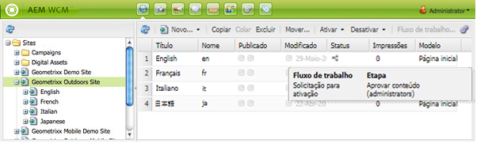

# Aplicação de fluxos de trabalho a páginas{#applying-workflows-to-pages}

>[!CAUTION]
>
>AEM 6.4 chegou ao fim do suporte estendido e esta documentação não é mais atualizada. Para obter mais detalhes, consulte nossa [períodos de assistência técnica](https://helpx.adobe.com/br/support/programs/eol-matrix.html). Encontre as versões compatíveis [here](https://experienceleague.adobe.com/docs/).

Ao aplicar o fluxo de trabalho, especifique as seguintes informações:

* O fluxo de trabalho a ser aplicado.

   É possível aplicar qualquer fluxo de trabalho (ao qual você tenha acesso, conforme atribuído pelo administrador do AEM).
* Opcionalmente:

   * Um comentário que fornece informações sobre por que você iniciou o fluxo de trabalho.
   * Um título que ajuda a identificar a instância do fluxo de trabalho na Caixa de entrada de um usuário.

>[!NOTE]
>
>Os administradores de AEM podem iniciar fluxos de trabalho usando [vários outros métodos](/help/sites-administering/workflows-starting.md).

## Aplicação de fluxos de trabalho {#applying-workflows}

Os fluxos de trabalho podem ser iniciados no console Sites ou, ao editar uma página, no Sidekick.

O **Status** na coluna **Sites** O console indica se um fluxo de trabalho foi aplicado a uma página:

### Iniciar um fluxo de trabalho pelo console Sites {#starting-a-workflow-from-the-websites-console}

1. Abra o console Sites . ([http://localhost:4502/siteadmin](http://localhost:4502/siteadmin))
1. Na árvore Sites, selecione o pai da página à qual deseja aplicar o fluxo de trabalho.
1. Na lista de páginas, selecione a página e clique em Fluxo de trabalho.
1. Na caixa de diálogo Iniciar fluxo de trabalho, selecione o fluxo de trabalho a ser aplicado. Opcionalmente, insira um comentário e um título. Em seguida, clique em Start.

### Iniciar um fluxo de trabalho usando o Sidekick {#starting-a-workflow-using-sidekick}

1. Abra o console Sites .
1. Abra a página desejada.
1. Selecione a guia Fluxo de trabalho no Sidekick.
1. Expanda o **Fluxo de trabalho** , permitindo que você selecione o **Fluxo de trabalho** e, opcionalmente, insira **Título do fluxo de trabalho** e **Comentário**.

   

1. Clique em **Iniciar fluxo de trabalho** para iniciar uma nova instância de workflow com as propriedades configuradas e a página atual como carga útil. Agora, o workflow está em execução.
