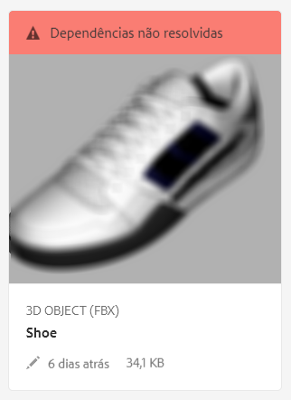
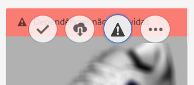

# Resolver dependências de arquivo{#resolving-file-dependencies}

As dependências do arquivo de modelo 3D principal, como os arquivos de mapa de textura, são resolvidas automaticamente sempre que possível. Essa funcionalidade é obtida fazendo o AEM pesquisar nas pastas de Ativos próximas por arquivos com os mesmos nomes encontrados no arquivo 3D. If one or more dependencies are unresolvable during the Creating preview processing stage, the asset&#39;s card displays the following red banner message in the [!UICONTROL Card View]:

**Para resolver dependências de arquivo**:

1. In the **[!UICONTROL Card View]**, hover the pointer over the **[!UICONTROL Unresolved Dependencies]** banner message on the card, then tap the exclamation point icon.

   

1. Na página de propriedades de metadados, toque na guia **[!UICONTROL Dependências]**.

   Os arquivos que o AEM não pôde resolver automaticamente são listados abaixo da coluna Caminhos originais, em vermelho.

1. Siga um ou mais destes procedimentos:

   * **[!UICONTROL Procure e selecione as dependências]**. (Essa opção pressupõe que você já fez upload dos arquivos de dependência.)

      1. Tap the **[!UICONTROL File Browse]** icon to the left of the red path.
      1. On the **[!UICONTROL Select Content]** page, navigate to the missing file, then tap on the file&#39;s card to select it.
      1. In the upper-left corner of the **[!UICONTROL Select Content]** page, tap **[!UICONTROL Close]** (X icon) to return to the **[!UICONTROL View Properties]** page.
   * **[!UICONTROL Faça upload das dependências]**. (Essa opção pressupõe que você ainda não fez upload dos arquivos ausentes.)

      1. Observe os caminhos e nomes de arquivos ausentes.
      1. Próximo do canto superior direito da página de propriedades, toque em **[!UICONTROL Fechar]**.

   After the files are uploaded return to **[!UICONTROL View Properties > Dependencies]** page. O ativo recém enviado por upload listado corretamente como um ativo referenciado.

   * **[!UICONTROL Ignorar as dependências]**.

      If a missing dependency is no longer needed, under the **[!UICONTROL Referenced Asset]** column, in the text field to the left of the missing file, type `n/a` so that AEM 3D ignores the file.

1. Near the upper-right corner of the **[!UICONTROL View Properties]** page, tap **[!UICONTROL Save]**.
1. Toque em **[!UICONTROL Fechar]****[!UICONTROL para voltar à exibição do cartão]**.

   O ativo é reprocessado automaticamente com as dependências recém resolvidas.

