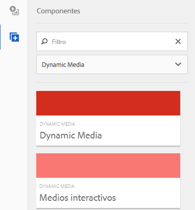
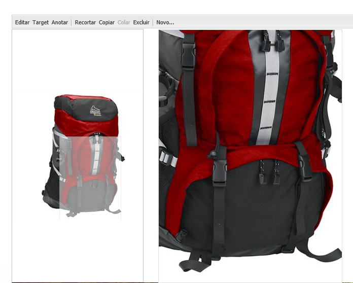
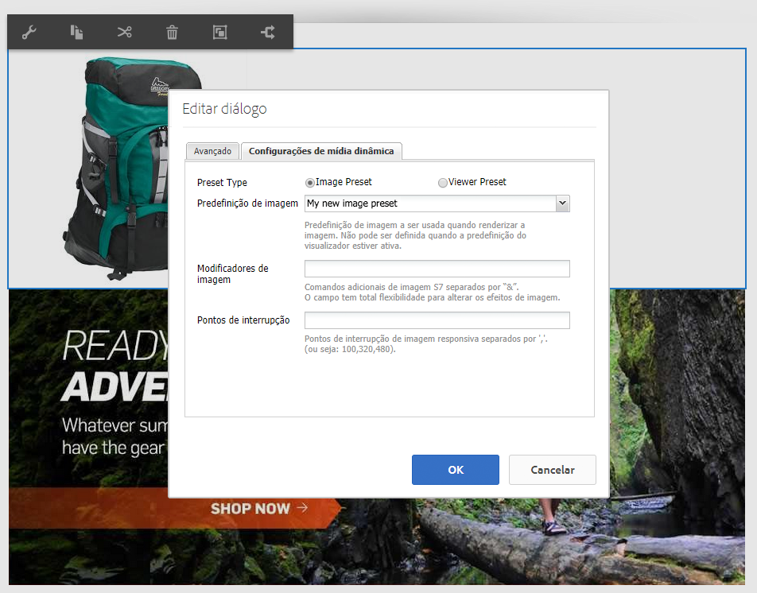
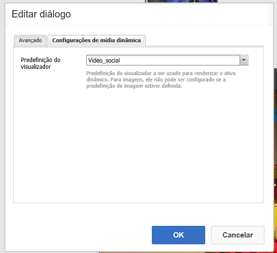

# Adição de ativos do Dynamic Media a páginas{#adding-dynamic-media-assets-to-pages}

>[!CAUTION]
>
>AEM 6.4 chegou ao fim do suporte estendido e esta documentação não é mais atualizada. Para obter mais detalhes, consulte nossa [períodos de assistência técnica](https://helpx.adobe.com/br/support/programs/eol-matrix.html). Encontre as versões compatíveis [here](https://experienceleague.adobe.com/docs/).

Para adicionar a funcionalidade do Dynamic Media aos ativos que você usa em seus sites, é possível adicionar o **[!UICONTROL Dynamic Media]** ou **[!UICONTROL Mídia interativa]** diretamente na página. Para fazer isso, insira [!UICONTROL Design] e ativar os componentes de mídia dinâmica. Em seguida, adicione esses componentes à página e adicionar ativos ao componente. A mídia dinâmica e os componentes de mídia interativa são inteligentes - eles sabem se você está adicionando uma imagem ou um vídeo e as opções disponíveis mudam de acordo.

Você adiciona ativos de mídia dinâmica diretamente à página se estiver usando o AEM como o WCM.

>[!NOTE]
>
>Mapas de imagens estão disponíveis para banners em carrossel.

## Adicionar um componente Dynamic Media a uma página {#adding-a-dynamic-media-component-to-a-page}

Adicionar a [!UICONTROL Dynamic Media] ou [!UICONTROL Mídia interativa] para uma página é o mesmo que adicionar um componente a qualquer página. O [!UICONTROL Dynamic Media] e [!UICONTROL Mídia interativa] os componentes são descritos detalhadamente nas seções a seguir.

Para adicionar um componente/visualizador do Dynamic Media a uma página:

1. Em AEM, abra a página à qual deseja adicionar o componente Dynamic Media.
1. Se nenhum componente Dynamic Media estiver disponível, clique na régua na [!UICONTROL Sidekick] para inserir **[!UICONTROL Design]** , clique em **[!UICONTROL Editar]** parsys e selecione **[!UICONTROL Dynamic Media]** para disponibilizar os componentes do Dynamic Media.

   >[!NOTE]
   >
   >Consulte [Configuração de componentes no modo de design](/help/sites-authoring/default-components-designmode.md) para obter mais informações.

1. Retornar para **[!UICONTROL Editar]** clicando no ícone de lápis no [!UICONTROL Sidekick].
1. Arraste o **[!UICONTROL Dynamic Media]** ou **[!UICONTROL Mídia interativa]** do **[!UICONTROL Outras]** no sidekick até a página no local desejado.
1. Clique em **[!UICONTROL Editar]** para abrir o componente.
1. [Editar o componente](#dynamic-media-component) conforme necessário e clique em **[!UICONTROL OK]** para salvar as alterações.

## Componentes do Dynamic Media {#dynamic-media-components}

[!UICONTROL Dynamic Media] e [!UICONTROL Mídia interativa] estão disponíveis no [!UICONTROL Sidekick] under **[!UICONTROL Dynamic Media]**. Você usa a variável **[!UICONTROL Mídia interativa]** componente para quaisquer ativos interativos, como vídeo interativo, imagens interativas ou conjuntos de carrossel. Para todos os outros componentes de mídia dinâmica, use a variável **[!UICONTROL Dynamic Media]** componente.

>[!NOTE]
>
>Esses componentes não estão disponíveis por padrão e precisam ser selecionados no modo Design antes de serem usados. [Depois de serem disponibilizados no modo Design](/help/sites-authoring/default-components-designmode.md), você pode adicionar os componentes à sua página como faria com qualquer outro componente AEM.

### Componente Dynamic Media {#dynamic-media-component}

O componente Dynamic Media é inteligente — dependendo de você adicionar uma imagem ou um vídeo, você terá várias opções. O componente suporta predefinições de imagens, visualizadores baseados em imagens, como conjuntos de imagens, conjuntos de rotação, conjuntos de mídia mista e vídeo. Além disso, o visualizador é responsivo. Ou seja, o tamanho da tela muda automaticamente com base no tamanho da tela. Todos os visualizadores são baseados em HTML5.

>[!NOTE]
>
>Ao adicionar o [!UICONTROL Dynamic Media] componente, e **[!UICONTROL Configurações do Dynamic Media]** estiver em branco ou não for possível adicionar um ativo corretamente, verifique o seguinte:
>
>* Você tem [Dynamic Media habilitado](/help/assets/config-dynamic.md). O Dynamic Media é desativado por padrão.
>* A imagem tem um arquivo tiff de pirâmide. As imagens importadas antes de a mídia dinâmica ser ativada não têm um arquivo tiff de pirâmide.
>

#### Ao trabalhar com imagens {#when-working-with-images}

O [!UICONTROL Dynamic Media] permite adicionar imagens dinâmicas, incluindo conjuntos de imagens, conjuntos de rotação e conjuntos de mídia mista. É possível ampliar, reduzir e, se aplicável, transformar uma imagem em um conjunto de rotação ou selecionar uma imagem de outro tipo de conjunto.

Você também pode configurar a predefinição do visualizador, a predefinição de imagem ou o formato de imagem diretamente no componente. Para tornar uma imagem responsiva, você pode definir os pontos de interrupção ou aplicar uma predefinição de imagem responsiva.

Você pode editar as seguintes configurações do Dynamic Media clicando em **[!UICONTROL Editar]** no componente e, em seguida, clicando no botão **[!UICONTROL Configurações do Dynamic Media]** guia .

>[!NOTE]
>
>Por padrão, o componente de imagem do Dynamic Media é adaptável. Se quiser torná-lo de um tamanho fixo, defina-o no componente no **[!UICONTROL Avançado]** com a guia **[!UICONTROL Largura]** e **[!UICONTROL Altura]** propriedades.

**[!UICONTROL Predefinição do visualizador]** - Selecione uma predefinição de visualizador existente no menu suspenso. Se a predefinição do visualizador que você está procurando não estiver visível, talvez seja necessário torná-la visível. Consulte [Gerenciar predefinições do visualizador](/help/assets/managing-viewer-presets.md). Não é possível selecionar uma predefinição do visualizador se você estiver usando uma predefinição de imagem e vice-versa.

Essa é a única opção disponível se você estiver visualizando conjuntos de imagens, conjuntos de rotação ou conjuntos de mídia mista. As predefinições do visualizador exibidas também são inteligentes - somente as predefinições do visualizador relevantes são exibidas.

**[!UICONTROL Predefinição de imagem]** - Selecione uma predefinição de imagem existente no menu suspenso. Se a predefinição de imagem que você está procurando não estiver visível, talvez seja necessário torná-la visível. Consulte [Gerenciar predefinições de imagens](/help/assets/managing-image-presets.md). Não é possível selecionar uma predefinição do visualizador se você estiver usando uma predefinição de imagem e vice-versa.

Essa opção não estará disponível se você estiver visualizando conjuntos de imagens, conjuntos de rotação ou conjuntos de mídia mista.

**[!UICONTROL Modificadores de imagem]** - Você pode alterar os efeitos da imagem fornecendo comandos de imagem adicionais. Estes são descritos em [Gerenciar predefinições de imagens](/help/assets/managing-viewer-presets.md) e [Referência de comando](https://experienceleague.adobe.com/docs/dynamic-media-developer-resources/image-serving-api/image-serving-api/http-protocol-reference/command-reference/c-command-reference.html).

Essa opção não estará disponível se você estiver visualizando conjuntos de imagens, conjuntos de rotação ou conjuntos de mídia mista.

**[!UICONTROL Pontos de interrupção]** - Se você estiver usando esse ativo em um site responsivo, precisará adicionar os pontos de interrupção da página. Os pontos de interrupção da imagem precisam ser separados por vírgulas (,). Essa opção funciona quando não há altura ou largura definida em uma predefinição de imagem.

Essa opção não estará disponível se você estiver visualizando conjuntos de imagens, conjuntos de rotação ou conjuntos de mídia mista.

Você pode editar o seguinte [!UICONTROL Configurações avançadas] clicando em **[!UICONTROL Editar]** no componente .

**[!UICONTROL Título]** - Altere o título da imagem.

**[!UICONTROL Texto alternativo]** - Adicione um título à imagem para os usuários que tenham os gráficos desativados.

Essa opção não estará disponível se você estiver visualizando conjuntos de imagens, conjuntos de rotação ou conjuntos de mídia mista.

**[!UICONTROL URL, Abrir em]** - É possível definir um ativo de para abrir um link. Defina as **[!UICONTROL URL]** e **[!UICONTROL Abrir em]** para indicar se deseja abri-la na mesma janela ou em uma nova janela.

Essa opção não estará disponível se você estiver visualizando conjuntos de imagens, conjuntos de rotação ou conjuntos de mídia mista.

**[!UICONTROL Largura e altura]** - Insira o valor em pixels se desejar que a imagem tenha um tamanho fixo. Deixar esses valores em branco torna o ativo adaptável.

#### Ao trabalhar com vídeo {#when-working-with-video}

Use o [!UICONTROL Dynamic Media] para adicionar vídeo dinâmico às suas páginas da Web. Ao editar o componente, você pode optar por usar uma predefinição de visualizador de vídeo predefinida para reproduzir o vídeo na página.

Você pode editar o seguinte [!UICONTROL Configurações do Dynamic Media] clicando em **[!UICONTROL Editar]** no componente .

>[!NOTE]
>
>Por padrão, o componente de vídeo do Dynamic Media é adaptável. Se quiser torná-lo de um tamanho fixo, defina-o no componente com a variável **[!UICONTROL Largura]** e **[!UICONTROL Altura]** no **[!UICONTROL Avançado]** guia .

**[!UICONTROL Predefinição do visualizador]** - Selecione uma predefinição de visualizador de vídeo existente no menu suspenso. Se a predefinição do visualizador que você está procurando não estiver visível, talvez seja necessário torná-la visível. Consulte [Gerenciar predefinições do visualizador](/help/assets/managing-viewer-presets.md).

Você pode editar o seguinte [!UICONTROL Avançado] clicando em **[!UICONTROL Editar]** no componente .

**[!UICONTROL Título]** - Altere o título do vídeo.

**[!UICONTROL Largura e altura]** - Insira o valor em pixels se desejar que o vídeo tenha um tamanho fixo. Deixar esses valores em branco o torna adaptável.

#### Como fornecer vídeo seguro {#how-to-delivery-secure-video}

No AEM 6.2, ao instalar [FP-13480](https://experience.adobe.com/#/downloads/content/software-distribution/en/aem.html?package=/content/software-distribution/en/details.html/content/dam/aem/public/adobe/packages/cq620/featurepack/cq-6.2.0-featurepack-13480), é possível controlar se um vídeo é entregue por uma conexão SSL segura (HTTPS) ou por uma conexão insegura (HTTP). Por padrão, o protocolo de entrega de vídeo é herdado automaticamente do protocolo da página da Web de incorporação. Se a página da Web for carregada por HTTPS, o vídeo também será entregue por HTTPS. E vice-versa, se a página da Web estiver em HTTP, o vídeo será entregue via HTTP. Na maioria dos casos, esse comportamento padrão é bom e não há necessidade de fazer alterações na configuração. No entanto, é possível substituir esse comportamento padrão ao anexar `VideoPlayer.ssl=on` ao final de um caminho de URL ou para a lista de outros parâmetros de configuração do visualizador em um trecho de código incorporado, para forçar a entrega segura de vídeo.

Para obter mais informações sobre a entrega segura de vídeo e o uso da variável `VideoPlayer.ssl` atributo de configuração no caminho do URL, consulte [Entrega segura de vídeo](https://experienceleague.adobe.com/docs/dynamic-media-developer-resources/library/viewers-aem-assets-dmc/video/c-html5-video-viewer-20-securevideodelivery.html) no Guia de referência de visualizadores. Além do visualizador de Vídeo, a entrega segura de vídeo está disponível para o visualizador de Mídia mista e o visualizador de Vídeo interativo.

### Componente Mídia interativa {#interactive-media-component}

O componente Mídia interativa é para os ativos que têm interatividade em pontos de acesso ou mapas de imagem. Se você tiver uma imagem interativa, um vídeo interativo ou um banner de carrossel, use o **[!UICONTROL Mídia interativa]** componente.

O [!UICONTROL Mídia interativa] componente é inteligente - dependendo de você adicionar uma imagem ou um vídeo, você terá várias opções. Além disso, o visualizador é responsivo. Ou seja, o tamanho da tela muda automaticamente com base no tamanho da tela. Todos os visualizadores são baseados em HTML5.

Você pode editar o seguinte **[!UICONTROL Geral]** clicando em **[!UICONTROL Editar]** no componente .

**[!UICONTROL Predefinição do visualizador]** - Selecione uma predefinição de visualizador existente no menu suspenso. Se a predefinição do visualizador que você está procurando não estiver visível, talvez seja necessário torná-la visível. As Predefinições do visualizador devem ser publicadas antes de serem usadas. Consulte Gerenciar predefinições do visualizador.

**[!UICONTROL Título]** - Altere o título do vídeo.

**[!UICONTROL Largura e altura]** - Insira o valor em pixels se desejar que o vídeo tenha um tamanho fixo. Deixar esses valores em branco o torna adaptável.

Você pode editar o seguinte **[!UICONTROL Adicionar ao carrinho]** clicando em **[!UICONTROL Editar]** no componente .

**[!UICONTROL Mostrar ativo do produto]** - Por padrão, esse valor é selecionado. O ativo do produto mostra uma imagem do produto, conforme definido no módulo Comércio. Limpe a marca de seleção para não mostrar o ativo do produto.

**[!UICONTROL Mostrar preço do produto]** - Por padrão, esse valor é selecionado. O preço do produto mostra o preço do item, conforme definido no módulo Comércio. Limpe a marca de seleção para não mostrar o preço do produto.

**[!UICONTROL Mostrar formulário do produto]** - Por padrão, esse valor não está selecionado. O Formulário de produto inclui quaisquer variantes de produto, como tamanho e cor. Limpe a marca de seleção para não mostrar as variantes do produto.
