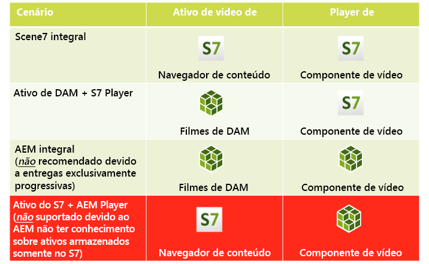
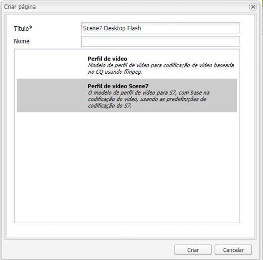
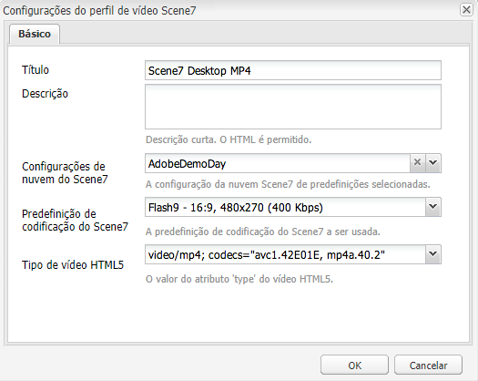

# Vídeo{#video}

>[!CAUTION]
>
>AEM 6.4 chegou ao fim do suporte estendido e esta documentação não é mais atualizada. Para obter mais detalhes, consulte nossa [períodos de assistência técnica](https://helpx.adobe.com/br/support/programs/eol-matrix.html). Encontre as versões compatíveis [here](https://experienceleague.adobe.com/docs/).

Os ativos fornecem gerenciamento centralizado de ativos de vídeo, onde você pode fazer upload de vídeos diretamente para os Ativos, a fim de codificar automaticamente para o Dynamic Media Classic, e acessar os vídeos do Dynamic Media Classic diretamente dos Ativos, para criação de página.

A integração de vídeo do Dynamic Media Classic estende o alcance do vídeo otimizado para todas as telas (detecção automática de dispositivo e de largura de banda).

* O componente de vídeo do Dynamic Media Classic (Scene7) executa automaticamente a detecção de dispositivo e de largura de banda para reproduzir o vídeo no formato adequado e com a qualidade certa em desktops, tablets e dispositivos móveis.
* Ativos - Você pode incluir conjuntos de vídeos adaptáveis em vez de somente ativos de vídeo individuais. Um conjunto de vídeos adaptáveis é um contêiner para todas as representações de vídeo necessárias para reproduzir o vídeo de forma contínua em várias telas. Um Conjunto de vídeos adaptáveis agrupa versões do mesmo vídeo codificadas em diferentes formatos e taxas de bits, como 400 kbps, 800 kbps e 1000 kbps. Você usa um Conjunto de vídeos adaptáveis, juntamente com o componente de vídeo do S7, para transmitir vídeo adaptável em várias telas, incluindo dispositivos móveis para desktop, iOS, Android, Blackberry e Windows. Consulte [Documentação do Scene7 sobre conjuntos de vídeos adaptáveis para obter mais informações](https://experienceleague.adobe.com/docs/dynamic-media-classic/using/setup/application-setup.html#video-presets-for-encoding-video-files).

## Sobre FFMPEG e Dynamic Media Classic {#about-ffmpeg-and-scene}

O processo de codificação de vídeo padrão é baseado no uso da integração baseada em FFMPEG com perfis de vídeo. Portanto, o fluxo de trabalho do Ativo de atualização DAM pronto para uso contém as duas etapas de fluxo de trabalho baseadas em FFMPEG a seguir:

* Miniaturas FFMPEG
* Codificação FFMPEG

Esteja ciente de que ativar e configurar a integração do Dynamic Media Classic não remove ou desativa automaticamente essas duas etapas do fluxo de trabalho de assimilação do ativo de atualização do DAM pronto para uso. Se você já utiliza a codificação de vídeo baseada em FFMPEG no AEM, é provável que tenha o FFMPEG instalado em seus ambientes de criação. Nesse caso, um novo vídeo assimilado usando Ativos seria codificado duas vezes: uma vez no codificador FFMPEG e uma vez na integração do Dynamic Media Classic.

Se você tiver a codificação de vídeo baseada em FFMPEG AEM configurada e o FFMPEG instalado, o Adobe recomenda remover os dois fluxos de trabalho FFMPEG dos fluxos de trabalho do Ativo de atualização do DAM.

### Formatos suportados {#supported-formats}

Os seguintes formatos são compatíveis com o componente Vídeo do Dynamic Media Classic:

* F4V H.264
* MP4 H.264

### Como decidir onde fazer upload de seu vídeo {#deciding-where-to-upload-your-video}

A decisão de onde fazer upload de seus ativos de vídeo depende do seguinte:

* Você precisa de um fluxo de trabalho para o ativo de vídeo?
* Você precisa de controle de versão para o ativo de vídeo?

Se a resposta for &quot;sim&quot; para qualquer uma dessas perguntas ou ambas, faça upload do vídeo diretamente no Adobe DAM. Se a resposta for &quot;não&quot; para ambas as perguntas, faça upload do vídeo diretamente no Dynamic Media Classic. O fluxo de trabalho de cada cenário é descrito na seção a seguir.

#### Se você estiver fazendo upload do vídeo diretamente no Adobe Assets {#if-you-are-uploading-your-video-directly-to-adobe-assets}

Se precisar de um fluxo de trabalho ou controle de versão para seus ativos, faça upload primeiro para os Ativos do Adobe. Este é o fluxo de trabalho recomendado:

1. Faça upload do ativo de vídeo para Ativos do Adobe e codifique e publique automaticamente no Dynamic Media Classic.
1. No AEM, acesse os ativos de vídeo no WCM no **[!UICONTROL Filmes]** do Localizador de conteúdo.
1. Crie com vídeo Dynamic Media Classic ou componente de vídeo de base.

#### Se você estiver fazendo upload do seu vídeo para o Dynamic Media Classic {#if-you-are-uploading-your-video-to-scene}

Se não precisar de um fluxo de trabalho ou controle de versão para seus ativos, faça upload dos ativos para a Dynamic Media Classic. Este é o fluxo de trabalho recomendado:

1. No Dynamic Media Classic, [configurar um upload e codificação agendados de FTP para o Dynamic Media Classic (automatizado pelo sistema)](https://experienceleague.adobe.com/docs/dynamic-media-classic/using/upload-publish/uploading-files.html#uploading-your-files).
1. No AEM, acesse os ativos de vídeo no WCM no **[!UICONTROL Dynamic Media Classic]** do Localizador de conteúdo.
1. Crie com o componente de vídeo do Dynamic Media Classic.

### Configuração da integração com o Dynamic Media Classic Video {#configuring-integration-with-scene-video}

**Para configurar predefinições universais**:

1. Em **[!UICONTROL Cloud Services]**, navegue até o **[!UICONTROL Dynamic Media Classic]** e clique em **[!UICONTROL Editar]**.
1. Selecione o **[!UICONTROL Vídeo]** guia .

   >[!NOTE]
   >
   >O **[!UICONTROL Vídeo]** não será exibida se a página não tiver uma configuração de nuvem. Consulte [Ativação do Dynamic Media Classic para WCM](#enablingscene7forwcm).

1. Selecione o perfil de codificação de vídeo adaptável, um perfil de codificação de vídeo pronto para uso ou um perfil de codificação de vídeo personalizado.

   >[!NOTE]
   >
   >Para obter mais informações sobre o que significam as predefinições de vídeo, consulte o [Documentação do Dynamic Media Classic](https://experienceleague.adobe.com/docs/dynamic-media-classic/using/setup/application-setup.html#video-presets-for-encoding-video-files).
   >
   >O Adobe recomenda selecionar ambos os conjuntos de vídeos adaptáveis ao configurar as predefinições universais ou selecionar o **[!UICONTROL Codificação de vídeo adaptável]** opção.

1. Os perfis de codificação selecionados são aplicados automaticamente a todos os vídeos carregados na pasta de destino do DAM CQ configurada para essa configuração de nuvem do Dynamic Media Classic. Você pode configurar várias configurações de nuvem do Dynamic Media Classic com diferentes pastas de destino para aplicar diferentes perfis de codificação, conforme necessário.

### Atualização das predefinições de codificação e do visualizador {#updating-viewer-and-encoding-presets}

Se você precisar atualizar as predefinições de codificação e do visualizador para vídeo no AEM porque elas foram atualizadas no Dynamic Media Classic, navegue até a configuração do Dynamic Media Classic na configuração da nuvem e clique em **Atualizar as predefinições de codificação e do visualizador**.

### Fazer upload do vídeo principal {#uploading-your-master-video}

Para carregar seu vídeo principal no Dynamic Media Classic do Adobe DAM:

1. Navegue até a pasta de destino DAM do CQ, onde você configurou sua configuração de nuvem com perfis de codificação do Dynamic Media Classic.
1. Clique em **[!UICONTROL Upload]** para fazer upload de vídeo principal. O upload e a codificação do vídeo são concluídos após a [!UICONTROL Ativo de atualização DAM] O fluxo de trabalho está concluído e **[!UICONTROL Publicar no Dynamic Media Classic]** tem uma marca de seleção.

   >[!NOTE]
   >
   >Pode levar algum tempo para que as miniaturas de vídeo sejam geradas.

   Arrastar o vídeo principal do DAM para os acessos do componente de vídeo *all* das representações de proxy codificadas no Dynamic Media Classic para entrega.

### Componente de vídeo básico versus Componente de vídeo do Dynamic Media Classic {#foundation-video-component-versus-scene-video-component}

Ao usar o AEM, você tem acesso ao componente Vídeo disponível no Sites e ao componente de vídeo do Dynamic Media Classic (Scene7). Estes componentes não são intercambiáveis.

O componente de vídeo do Dynamic Media Classic só funciona para vídeos do Dynamic Media Classic. O componente de base funciona com vídeos armazenados do AEM (usando ffmpeg) e vídeos do Dynamic Media Classic.

A matriz a seguir explica quando você deve usar qual componente:

>[!NOTE]
>
>Pronto para uso, o componente de vídeo do Dynamic Media Classic usa o perfil de vídeo universal. No entanto, você pode obter o reprodutor de vídeo baseado em HTML5 para uso pelo AEM. No Dynamic Media Classic, copie o código incorporado do reprodutor de vídeo pronto para uso do HTML5 e coloque-o na página de AEM.

## Componente de vídeo AEM {#aem-video-component}

Mesmo que o uso do componente de vídeo do Dynamic Media Classic seja recomendado para visualizar vídeos do Dynamic Media Classic, esta seção descreve o uso de vídeos do Dynamic Media Classic com o [!UICONTROL Componente de vídeo de base] em AEM, por uma questão de exaustividade.

### Comparação entre vídeo AEM e vídeo do Dynamic Media Classic {#aem-video-and-scene-video-comparison}

A tabela a seguir fornece uma comparação de alto nível dos recursos suportados entre o componente AEM Foundation Video e o componente Scene7 Video:

|  | Vídeo de base do AEM | Vídeo Dynamic Media Classic |
|---|---|---|
| Abordagem | HTML5 primeira abordagem. O Flash é usado somente para fallback que não seja de HTML5. | Flash na maioria dos desktops. HTML5 é utilizado para dispositivos móveis e comprimidos. |
| Entrega | Progressivo | Transmissão adaptável |
| Rastreamento | Sim | Sim |
| Extensibilidade | Sim | Sim (com o SDK do visualizador do Dynamic Media Classic) |
| Vídeo móvel | Sim | Sim |

### Configuração {#setting-up}

#### Criação de perfis de vídeo {#creating-video-profiles}

As várias codificações de vídeo são criadas de acordo com as predefinições de codificação do Dynamic Media Classic selecionadas na configuração de nuvem do Dynamic Media Classic. Para que o componente de vídeo de base use-os, um perfil de vídeo deve ser criado para cada predefinição de codificação do Dynamic Media Classic selecionada. Isso permite que o componente de vídeo selecione as execuções de DAM de acordo.

>[!NOTE]
>
>Os novos perfis de vídeo e as alterações neles devem ser ativados para publicação.

1. Em AEM, acesse **[!UICONTROL Ferramentas]**, em seguida selecione **[!UICONTROL Console de configuração]**. No Console de configuração, navegue até **[!UICONTROL Ferramentas]** > **[!UICONTROL Ativos]** > **[!UICONTROL Perfis de vídeo]** na árvore de navegação.
1. Crie um novo Perfil de vídeo do Dynamic Media Classic. No **[!UICONTROL Novo...]** selecione **[!UICONTROL Criar página]** e selecione o modelo Perfil de vídeo do Dynamic Media Classic . Dê um nome à nova página de perfil de vídeo e clique em **[!UICONTROL Criar]**.

   

1. Edite o novo perfil de vídeo. Selecione primeiro a configuração de nuvem. Em seguida, selecione a mesma predefinição de codificação selecionada na configuração de nuvem.

   

   | Propriedade | Descrição |
   |---|---|
   | Configuração da nuvem do Dynamic Media Classic (Scene7) | A configuração da nuvem a ser usada para as predefinições de codificação. |
   | Predefinição de codificação do Dynamic Media Classic (Scene7) | A predefinição de codificação com a qual mapear esse perfil de vídeo. |
   | Tipo de vídeo HTML5 | Essa propriedade permite definir o valor da propriedade type do elemento de fonte de vídeo HTML5. Essas informações não são fornecidas pelas predefinições de codificação do Dynamic Media Classic, mas são necessárias para renderizar corretamente os vídeos usando o elemento de vídeo HTML5. Uma lista de formatos comuns é fornecida, mas pode ser substituída para outros formatos. |

   Repita essa etapa para todas as predefinições de codificação selecionadas na configuração de nuvem que você deseja usar no componente de vídeo.

#### Configuração do design {#configuring-design}

O componente de vídeo de base deve saber quais perfis de vídeo usar para criar a lista de fontes de vídeo. Você deve abrir a caixa de diálogo de design dos componentes de vídeo e configurar o design dos componentes para usar os novos perfis de vídeo.

>[!NOTE]
>
>Se você usar o componente de vídeo de base em uma página móvel, talvez precise repetir essas etapas no design da página móvel.

>[!NOTE]
>
>As alterações feitas no design exigem a ativação do design para entrarem em vigor na publicação.

1. Abra a caixa de diálogo de design do componente de vídeo de base e altere para **[!UICONTROL Perfis]** guia . Em seguida, exclua os perfis prontos e adicione os novos perfis de vídeo do Dynamic Media Classic. A ordem da lista de perfis na caixa de diálogo de design também define a ordem do elemento de fontes de vídeo ao renderizar.
1. Para navegadores não compatíveis com o HTML5, o componente de vídeo permite configurar um fallback de flash. Abra a caixa de diálogo de design dos componentes de vídeo e altere para **[!UICONTROL Flash]** guia . Configure as configurações do flash player e atribua um perfil de fallback a ele.

#### Lista de verificação {#checklist}

1. Criar uma configuração de nuvem do Dynamic Media Classic (Scene7). Verifique se as predefinições de codificação de vídeo estão definidas e se o importador está em execução.
1. Crie um perfil de vídeo do Dynamic Media Classic para cada predefinição de codificação de vídeo selecionada na configuração de nuvem.
1. Os perfis de vídeo devem ser ativados.
1. Configure o design do componente de vídeo de base na sua página.
1. Ative o design depois de concluir as alterações de design.
