# Adicionar recursos do Dynamic Media Classic à sua página{#adding-scene-features-to-your-page}

[O Adobe Dynamic Media Classic](https://help.adobe.com/en_US/scene7/using/WS26AB0D9A-F51C-464e-88C8-580A5A82F810.html) é uma solução hospedada para gerenciar, aprimorar, publicar e fornecer ativos de mídia avançada para Web, dispositivos móveis, email e telas e impressão conectadas à Internet.

Você pode visualização ativos AEM publicados no Dynamic Media Classic em vários visualizadores:

* Zoom
* Flyout
* Vídeo
* Modelo de imagem
* Imagem

Você pode publicar ativos digitais diretamente do AEM para o Dynamic Media Classic e pode publicar ativos digitais do Dynamic Media Classic para AEM.

Esta seção descreve como publicar ativos digitais do AEM para o Dynamic Media Classic e vice-versa. Os visualizadores também são descritos detalhadamente. Para obter informações sobre como configurar AEM para o Dynamic Media Classic, consulte [Integração do Dynamic Media Classic com AEM](/help/sites-administering/scene7.md).

Consulte também [Adição de mapas de imagem](/help/assets/image-maps.md).

Para obter mais informações sobre como usar componentes de vídeo no AEM, consulte o seguinte:

* [Vídeo](/help/sites-classic-ui-authoring/manage-assets-classic-s7-video.md)

>[!NOTE]
>
>If Dynamic Media Classic assets do not display properly, make sure that Dynamic media is [disabled](/help/assets/config-dynamic.md#disabling-dynamic-media) and then refresh the page.

## Publicar manualmente no Dynamic Media Classic a partir de ativos {#manually-publishing-to-scene-from-assets}

Você pode publicar ativos digitais no Dynamic Media Classic no console Ativos na interface clássica ou diretamente do ativo.

>[!NOTE]
>
>AEM publica no Dynamic Media Classic de forma assíncrona. After you click **[!UICONTROL Publish]**, it may take several seconds for your asset to publish to Dynamic Media Classic.

### Publicação por meio do console Assets {#publishing-from-the-assets-console}

Para publicar no Dynamic Media Classic no console Ativos se os ativos estiverem em uma pasta de público alvo do Dynamic Media Classic:

1. In the AEM classic UI, click **[!UICONTROL Digital Assets]** to access the digital asset manager.

1. Select the asset (or assets) or folder from within the target folder you want to publish to Dynamic Media Classic and right-click and select **[!UICONTROL Publish to Dynamic Media Classic]**. Como alternativa, você pode selecionar **[!UICONTROL Publicar no Dynamic Media Classic]** no menu **[!UICONTROL Ferramentas] .

   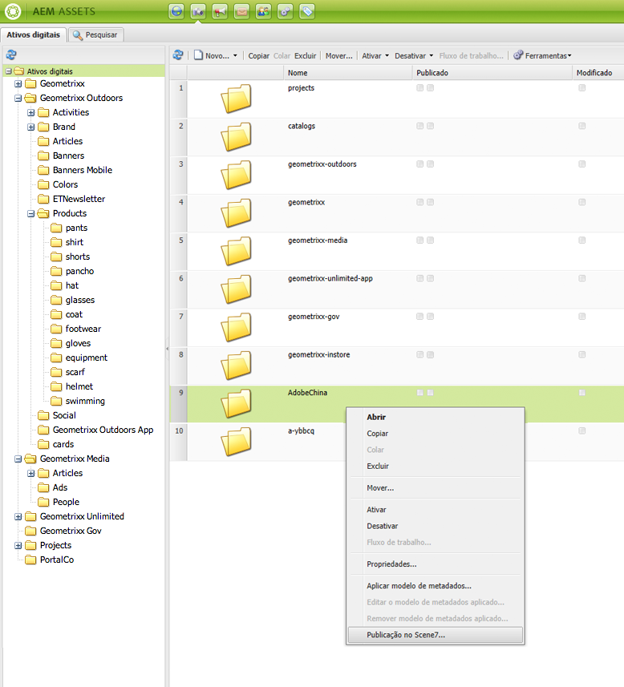

1. Vá para Dynamic Media Classic e confirme se os ativos estão disponíveis.

   >[!NOTE]
   >
   >If the assets are not in a Dynamic Media Classic synchronized folder, **[!UICONTROL Publish to Dynamic Media Classic]** in both menus is visible but disabled.

### Publicar a partir de um ativo {#publishing-from-an-asset}

Você pode publicar manualmente um ativo, contanto que ele esteja localizado dentro da pasta sincronizada do Dynamic Media Classic.

>[!NOTE]
>
>Se o ativo não estiver localizado na pasta sincronizada do Dynamic Media Classic, o link para **[!UICONTROL Publicar no Dynamic Media Classic]** não estará disponível.

**Para publicar no Dynamic Media Classic diretamente de um ativo** digital:

1. No AEM, clique em **[!UICONTROL Ativos digitais]** para acessar o gerenciador de ativos digitais.

1. Clique duas vezes para abrir um ativo.

1. No painel de detalhes do ativo, selecione **[!UICONTROL Publicar no Dynamic Media Classic]**.

   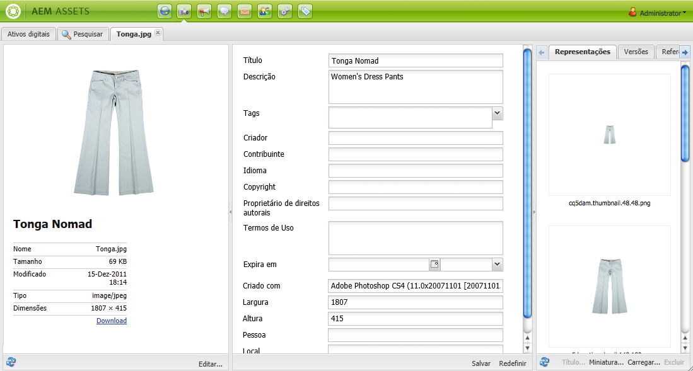

1. O link é alterado para **[!UICONTROL Publicando...]** e, em seguida, para **[!UICONTROL Publicado]**. Vá para Dynamic Media Classic e confirme se o ativo está disponível.

   >[!NOTE]
   >
   >If the asset does not publish properly to Dynamic Media Classic, the link changes to **[!UICONTROL Publishing Failed]**. Se o ativo já tiver sido publicado no Dynamic Media Classic, o link exibirá **[!UICONTROL Republicar no Dynamic Media Classic]**. A republicação permite fazer alterações em um ativo no AEM e republicá-los.

### Publishing assets from outside the CQ target folder {#publishing-assets-from-outside-the-cq-target-folder}

O Adobe recomenda que você publique ativos no Dynamic Media Classic somente a partir de ativos na pasta público alvo do Dynamic Media Classic. However, if you need to upload assets from a folder outside of the target folder, you can still do that by uploading them to an *ad-hoc* folder on Dynamic Media Classic.

Para fazer isso, configure a configuração da nuvem para a página onde o ativo será exibido. Em seguida, adicione um componente do Dynamic Media Classic à página e arraste e solte um ativo no componente. After the page properties are set for that page, a **[!UICONTROL Publish to Dynamic Media Classic]** link appears that when selected triggers uploading to Dynamic Media Classic.

>[!NOTE]
>
>Os ativos que estão na pasta ad-hoc não aparecem no navegador de conteúdo do Dynamic Media Classic.

**Para publicar ativos que residem fora da pasta de destino CQ**:

1. In AEM in the classic UI, click **[!UICONTROL Websites]** and navigate to the web page that you want to add a digital asset to that is not yet published to Dynamic Media Classic. (As regras usuais de herança de página se aplicam.)

1. In the sidekick, click the **[!UICONTROL Page]** icon, then click **[!UICONTROL Page Properties]**.

1. Clique em **[!UICONTROL Cloud Services]>[!UICONTROL Adicionar serviços]>[!UICONTROL Dynamic Media Classic (Scene7)]**.
1. Na lista suspensa Adobe Dynamic Media Classic, selecione a configuração desejada e clique em **[!UICONTROL OK]**.

   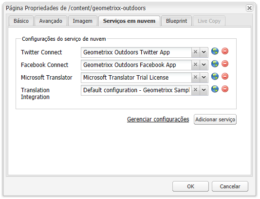

1. Na página da Web, adicione um componente do Dynamic Media Classic (Scene7) ao local desejado na página.
1. No localizador de conteúdo, arraste um ativo digital para o componente. Você verá um link para **[!UICONTROL Verificar o status]** de publicação do Dynamic Media Classic.

   >[!NOTE]
   >
   >If the digital asset is in the CQ target folder, then no link to **[!UICONTROL Check Dynamic Media Classic Publication Status]** appears. Os ativos são colocados no componente.

   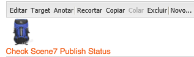

1. Clique em **[!UICONTROL Verificar status]** de publicação do Dynamic Media Classic. Se o ativo não for publicado, AEM o publicará no Dynamic Media Classic. Depois de enviado por upload, o ativo estará localizado na pasta ad-hoc. By default, the ad-hoc folder is located in the `name_of_the_company/CQ5_adhoc`. É possível [alterar essa configuração, se necessário](#configuringtheadhocfolder).

   >[!NOTE]
   >
   >Se o ativo não estiver em uma pasta sincronizada do Dynamic Media Classic e não houver nenhuma configuração de nuvem do Dynamic Media Classic associada à página atual, o upload falhará.

## Componentes do Dynamic Media Classic (Scene7) {#scene-components}

Os seguintes componentes do Dynamic Media Classic estão disponíveis no AEM:

* Zoom
* Flyout (Zoom)
* Modelo de imagem
* Imagem
* Vídeo

>[!NOTE]
>
>These components are not available by default and need to be selected in **[!UICONTROL Design]** mode before using.

After they are made available in **[!UICONTROL Design]** mode, you can add the components to your page like any other AEM component. Os ativos que ainda não foram publicados no Dynamic Media Classic são publicados no Dynamic Media Classic se estiverem em uma pasta sincronizada ou em uma página ou com uma configuração de nuvem do Dynamic Media Classic.

### Flash viewers end-of-life notice {#flash-viewers-end-of-life-notice}

A partir de 31 de janeiro de 2017, o Adobe Dynamic Media Classic encerrou oficialmente o suporte para a plataforma de visualização de Flash.

For more information about this important change, see [Flash viewer end-of-life FAQs](https://docs.adobe.com/content/docs/pt/aem/6-1/administer/integration/marketing-cloud/scene7/flash-eol.html).

### Adding a Dynamic Media Classic component to a page {#adding-a-scene-component-to-a-page}

Adicionar um componente do Dynamic Media Classic a uma página é o mesmo que adicionar um componente a qualquer página. Os componentes do Dynamic Media Classic são descritos detalhadamente nas seções a seguir.

**Para adicionar um componente/visualizador do Dynamic Media Classic a uma página na interface clássica**:

1. Em AEM, abra a página onde deseja adicionar o componente do Dynamic Media Classic.

1. If no Dynamic Media Classic components are available, click the ruler in the sidekick to enter **[!UICONTROL Design]** mode, click **[!UICONTROL Edit]** parsys, and select all the **[!UICONTROL Dynamic Media Classic]** components to make them available.

1. Return to **[!UICONTROL Edit]** mode by clicking the pencil in the sidekick.

1. Drag a component from the **[!UICONTROL Dynamic Media Classic]** group in the sidekick onto the page in the desired location.

1. Clique em **[!UICONTROL Editar]** para abrir o componente.

1. Edite o componente conforme necessário e clique em **[!UICONTROL OK]** para salvar as alterações.

### Adicionar experiência de exibição interativa a um site responsivo {#adding-interactive-viewing-experiences-to-a-responsive-website}

Design responsivo para seus ativos significa que eles se adaptam dependendo de onde são exibidos. Com um design responsivo, os mesmos ativos são exibidos eficientemente em vários dispositivos.

**Para adicionar uma experiência de exibição interativa a um site responsivo na interface do usuário clássica**:

1. Log in to AEM, and ensure that you have [configured Adobe Dynamic Media Classic Cloud Services](/help/sites-administering/scene7.md#configuring-scene-integration) and that Dynamic Media Classic components are available.

   >[!NOTE]
   >
   >Se os componentes do WCM do Dynamic Media Classic não estiverem disponíveis, ative-os no modo **[!UICONTROL Design] .

1. In a website with the Dynamic Media Classic components enabled, drag an **[!UICONTROL Image]** viewer to the page.
1. Edit the component and adjust the breakpoints in the **[!UICONTROL Dynamic Media Classic Settings]** tab.

   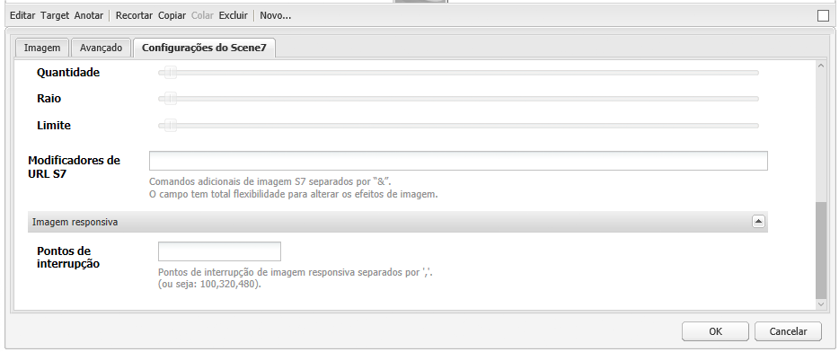

1. Verifique se os visualizadores estão sendo redimensionados de maneira adequada e de que todas as interações sejam otimizadas para desktop, tablet e dispositivo móvel.

### Configurações comuns a todos os componentes do Dynamic Media Classic {#settings-common-to-all-scene-components}

Embora as opções de configuração variem, as seguintes opções são comuns a todos os componentes do Dynamic Media Classic:

* **[!UICONTROL Referência de arquivo]**: navegue até um arquivo que deseje referenciar. A referência de arquivo mostra o URL do ativo e não necessariamente o URL completo do Dynamic Media Classic, incluindo os comandos e parâmetros do URL. Não é possível adicionar comandos e parâmetros de URL do Dynamic Media Classic neste campo. Eles devem ser adicionados por meio da funcionalidade correspondente no componente.
* **[!UICONTROL Largura]**: permite definir a largura.
* **[!UICONTROL Altura]**: permite definir a altura.

You set these configuration options by double-clicking a Dynamic Media Classic component, for example, when you open a **[!UICONTROL Zoom]** component:

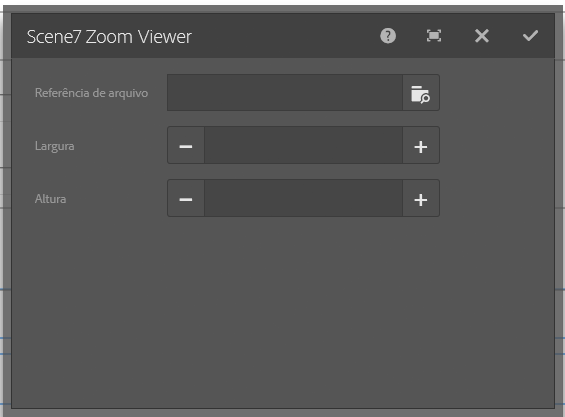

### Zoom {#zoom}

O componente de Zoom HTML5 exibe uma imagem maior quando você pressiona o botão +.

O ativo tem ferramentas de zoom na parte inferior. Clique em **[!UICONTROL +]** para ampliar. Clique em **[!UICONTROL -]** para reduzir. Clicking **[!UICONTROL x]** or the reset zoom arrow brings the image back to the original size it was imported as. Clique nas setas diagonais para abri-la em tela cheia. Clique em **[!UICONTROL Editar]** para configurar o componente. With this component, you can configure [settings common to all Dynamic Media Classic components](#settings-common-to-all-scene-components).

### Flyout {#flyout}

No componente do Flyout HTML5, o ativo é exibido como tela dividida; na parte à esquerda, o ativo no tamanho especificado; na parte à direita, a proporção de zoom é exibida. Clique em **[!UICONTROL Editar]** para configurar o componente. With this component, you can configure [settings common to all Dynamic Media Classic components](/help/sites-administering/scene7.md#settingscommontoalldynamicmediaclassiccomponents).

>[!NOTE]
>
>Se o seu componente do Flyout usa um tamanho personalizado, tal tamanho é usado e a configuração de componente é desabilitada.
>
>If your Flyout component uses the default size, as set in the [!UICONTROL Design] view, then the default size is used and the component stretches to accomodate the page layout size with responsive setup of the component enabled. Esteja ciente, no entanto, de que há uma limitação na configuração responsiva do componente. Ao usar o componente do Flyout com a configuração responsiva, você não deve usá-lo com a ampliação de página inteira. Caso contrário, o Flyout poderá se estender além da borda direita da página.

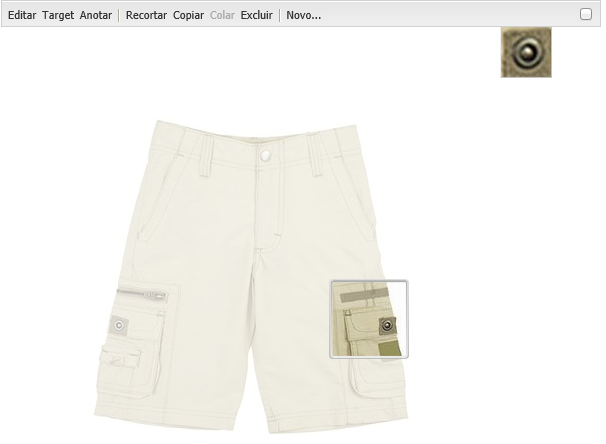

### Imagem {#image}

O componente de Imagem clássica do Dynamic Media permite que você adicione a funcionalidade do Dynamic Media Classic às suas imagens, como modificadores do Dynamic Media Classic, predefinições de imagem ou visualizador e nitidez. O componente de imagem do Dynamic Media Classic é semelhante a outros componentes de imagem em AEM com funcionalidade especial do Dynamic Media Classic. Neste exemplo, a imagem tem o modificador de URL do Dynamic Media Classic, `&op_invert=1` aplicado.

**[!UICONTROL Título, Texto]** alternativo - Na guia [!UICONTROL Avançado] , adicione um título à imagem e ao texto alternativo para os usuários que tiverem gráficos desativados.

**[!UICONTROL URL, Abrir]** - você pode definir um ativo de para abrir um link. Set the **[!UICONTROL URL]** and **[!UICONTROL Open in]** to indicate whether you want it to open in the same window or a new window.

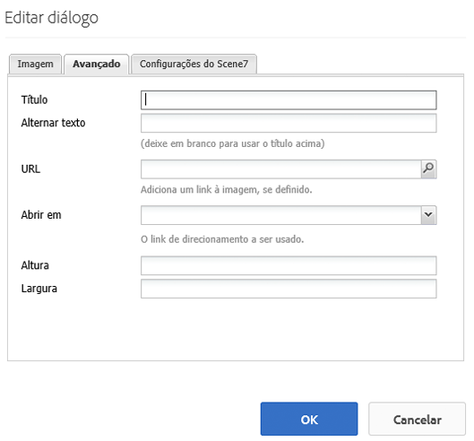

**[!UICONTROL Predefinição]** do visualizador - selecione uma predefinição do visualizador existente no menu suspenso. Se a predefinição de visualizador que você está procurando não estiver visível, pode ser necessário torná-la visível. Consulte [Gerenciar predefinições do visualizador](/help/assets/managing-viewer-presets.md). Não é possível selecionar uma predefinição de visualizador se você estiver usando uma predefinição de imagem e vice-versa.

**[!UICONTROL Configuração]** do Dynamic Media Classic - selecione a configuração do Dynamic Media Classic que deseja usar para buscar predefinições de imagens ativas do Scene7 Publishing System.

**[!UICONTROL Predefinição]** de imagem - selecione uma predefinição de imagem existente no menu suspenso. Se a predefinição de imagem que você está procurando não estiver visível, pode ser necessário torná-la visível. Consulte [Gerenciar predefinições de imagens](/help/assets/managing-image-presets.md). Não é possível selecionar uma predefinição de visualizador se você estiver usando uma predefinição de imagem e vice-versa.

**[!UICONTROL Formato]** de saída - Selecione o formato de saída da imagem, por exemplo jpeg. Dependendo do formato de saída selecionado, você pode ter opções de configuração adicionais. Consulte [Gerenciar predefinições de imagens](/help/assets/managing-image-presets.md).

**[!UICONTROL Nitidez]** - Selecione como deseja tornar a imagem nítida. O ajuste de nitidez é explicado em detalhes na Qualidade de imagem do [*Adobe Dynamic Media Classic e nas Práticas*](/help/assets/assets/s7_sharpening_images.pdf) recomendadas de ajuste de nitidez.

**[!UICONTROL Modificadores]** de URL - você pode alterar os efeitos de imagem fornecendo comandos de imagem adicionais do Dynamic Media Classic. These are described in [Managing Image Presets](/help/assets/managing-image-presets.md) and the [Command reference](https://docs.adobe.com/content/help/en/dynamic-media-developer-resources/image-serving-api/image-serving-api/http-protocol-reference/command-reference/c-command-reference.html).

**[!UICONTROL Pontos de interrupção]** - se o site estiver respondendo, você deseja ajustar os pontos de interrupção. Os pontos de interrupção devem ser separados por vírgulas `,`.

### Modelo de imagem {#image-template}

[Modelos](https://help.adobe.com/en_US/scene7/using/WS60B68844-9054-4099-BF69-3DC998A04D3C.html) de imagem do Dynamic Media Classic são conteúdo em camadas do Photoshop importado para o Dynamic Media Classic, onde o conteúdo e as propriedades foram parametrizados para variabilidade. O componente do **[!UICONTROL Modelo de imagem]** permite importar imagens e alterar dinamicamente o texto no AEM. Além disso, é possível configurar o componente do **[!UICONTROL Modelo de imagem]** para usar valores do contexto de cliente, de modo que cada usuário experiencie a imagem de uma maneira personalizada.

Clique em **[!UICONTROL Editar]** para configurar o componente. You can configure [settings common to all Dynamic Media Classic components](/help/sites-administering/scene7.md#settingscommontoalldynamicmediaclassicscomponents) as well as other settings described in this section.

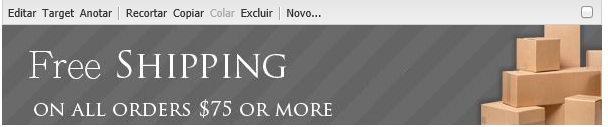

**[!UICONTROL Referência de arquivo, Largura, Altura]** - Consulte as configurações comuns a todos os componentes do Dynamic Media Classic.

>[!NOTE]
>
>Os parâmetros e comandos do URL do Dynamic Media Classic não podem ser adicionados diretamente ao URL de referência de arquivo. Eles podem ser definidos somente na interface do componente no painel **[!UICONTROL Parâmetro]**.

**[!UICONTROL Título, Texto]** alternativo Na guia Modelo [!UICONTROL de imagem do] Dynamic Media Classic, adicione um título à imagem e ao texto alternativo para os usuários que tiverem gráficos desativados.

**[!UICONTROL URL, Abrir]** Você pode definir um ativo de para abrir um link. Defina o **[!UICONTROL URL]** e, em **[!UICONTROL Abrir em]**, indique se você deseja que ele abra na mesma janela ou em uma nova.

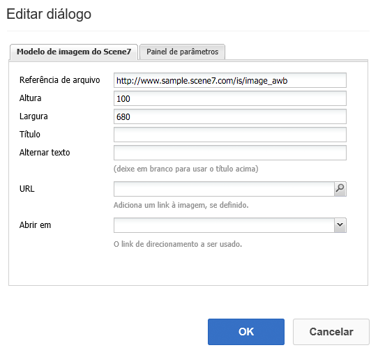

**[!UICONTROL Painel]** de parâmetros Ao importar uma imagem, os parâmetros são pré-preenchidos com informações da imagem. Caso nenhum conteúdo possa ser alterado dinamicamente, essa janela fica vazia.

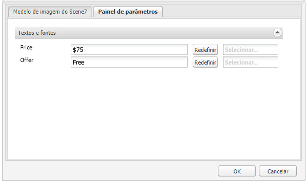

#### Alterar o texto dinamicamente {#changing-text-dynamically}

Para alterar o texto dinamicamente, insira o novo texto nos campos e clique em **[!UICONTROL OK]**. Neste exemplo, o **[!UICONTROL Preço]** agora é $50 e o frete é de 99 centavos de dólar.

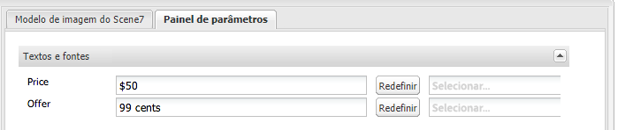

O texto na imagem é alterado. É possível redefinir o texto de volta para o valor original ao clicar em **[!UICONTROL Redefinir]** próximo ao campo.

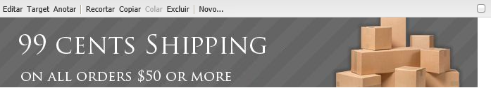

#### Alterar o texto para refletir o valor de contexto do cliente {#changing-text-to-reflect-the-value-of-a-client-context-value}

To link a field to a client context value, click **[!UICONTROL Select]** to open the client-context menu, select the client context, and click **[!UICONTROL OK]**. Neste exemplo, o nome é alterado com base na vinculação do Nome com o nome formatado no perfil.

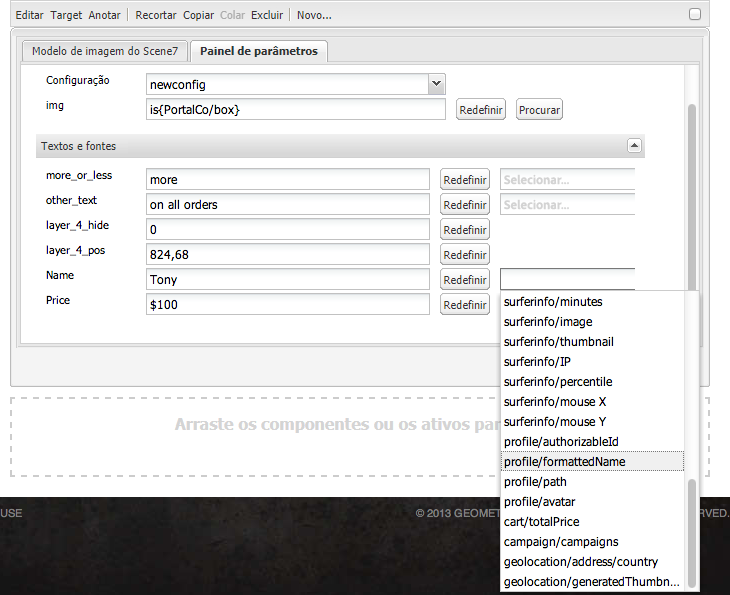

O texto reflete o nome do cliente conectado no momento. É possível redefinir o texto de volta para o valor original ao clicar em **[!UICONTROL Redefinir]** próximo ao campo.

#### Como tornar o modelo de imagem do Dynamic Media Classic um link {#making-the-scene-image-template-a-link}

**Para tornar o modelo de imagem do Dynamic Media Classic um link**:

1. On the page with the Dynamic Media Classic image template component, click **[!UICONTROL Edit]**.
1. No campo de **[!UICONTROL URL]**, insira o URL para qual os usuários são direcionados ao clicarem na imagem. No campo **[!UICONTROL Abrir em]**, selecione se deseja onde o destino seja aberto (uma nova janela ou na mesma).

   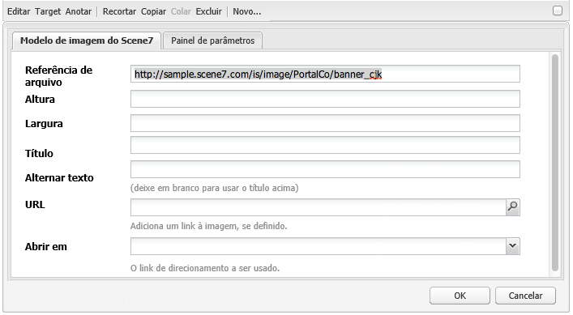

1. Clique em **[!UICONTROL OK]**.

### Componente de vídeo {#video-component}

The Dynamic Media Classic **[!UICONTROL Video]** component (available from the Dynamic Media Classic section of the sidekick) uses device and bandwidth detection to serve the right video to each screen. Este componente é um reprodutor de vídeo HTML5; é um visualizador único que pode ser usado em todos os canais.

Ele pode ser usado pra conjuntos de vídeos adaptáveis, um único vídeo MP4 ou um único vídeo F4V.

See [Video](/help/sites-classic-ui-authoring/manage-assets-classic-s7-video.md) for more information on how videos work with Dynamic Media Classic integration. In addition, see how [the **Dynamic Media Classic video** component compares to the foundation **video** component](/help/sites-classic-ui-authoring/manage-assets-classic-s7-video.md).

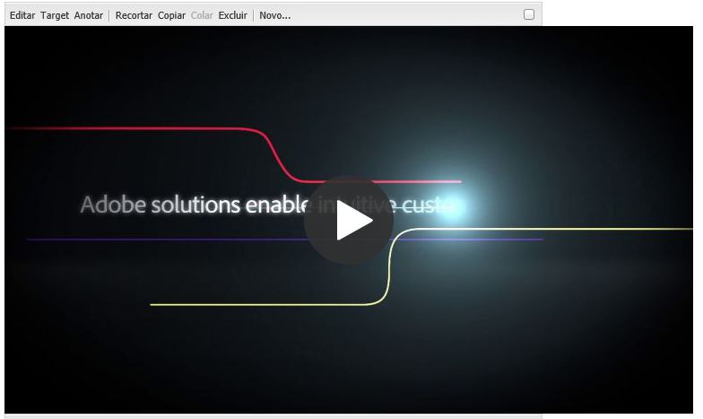

### Restrições conhecidas do componente de vídeo {#known-limitations-for-the-video-component}

O Adobe DAM e o WCM mostram se um vídeo principal é carregado por upload. Eles não mostram os ativos de proxy a seguir:

* Execuções codificadas do Dynamic Media Classic
* Conjuntos de vídeo adaptativos do Dynamic Media Classic

Ao usar um conjunto de vídeo adaptável com o componente de vídeo Dynamic Media Classic, você deve redimensionar o componente para ajustar às dimensões do vídeo.

## Navegador de conteúdo do Dynamic Media Classic {#scene-content-browser}

O navegador de conteúdo do Dynamic Media Classic permite que você visualização conteúdo do Dynamic Media Classic diretamente no AEM. To access the content browser, in the Content Finder, select **[!UICONTROL Dynamic Media Classic]** in the touch-optimized user interface or the **[!UICONTROL S7]** icon in the classic user interface. A funcionalidade é idêntica em ambas as interfaces do usuário.

Caso tenha diversas configurações, o AEM exibe, por padrão, a [configuração padrão](/help/sites-administering/scene7.md#configuring-a-default-configuration). Você pode selecionar configurações diferentes diretamente no navegador de conteúdo do Dynamic Media Classic no menu suspenso.

>[!NOTE]
>
>* Os ativos localizados na pasta ad-hoc não aparecem no navegador de conteúdo do Dynamic Media Classic.
>* Quando a Pré-visualização [segura está ativada](/help/sites-administering/scene7.md#configuring-the-state-published-unpublished-of-assets-pushed-to-scene), os ativos publicados e não publicados no Dynamic Media Classic aparecem no navegador de conteúdo do Dynamic Media Classic.
>* If you do not see **[!UICONTROL Dynamic Media Classic]** or the **[!UICONTROL S7]** icon as an option in the content browser, you need to [configure Dynamic Media Classic to work with AEM](/help/sites-administering/scene7.md).

   >
   >
* Para vídeo, o navegador de conteúdo do Dynamic Media Classic é compatível:
   >
   >
* Conjuntos de vídeos adaptáveis: contêiner de todas as representações de vídeo necessárias para uma reprodução perfeita em diversas telas
>* Vídeo MP4 único
>* Vídeo F4V único

### Pesquisar conteúdo na interface do usuário clássica {#browsing-content-in-the-classic-ui}

Navegue pelo conteúdo no Dynamic Media Classic clicando na guia **[!UICONTROL S7]** .

Você pode alterar a configuração que está acessando selecionando a configuração. As pastas mudam dependendo da configuração selecionada.

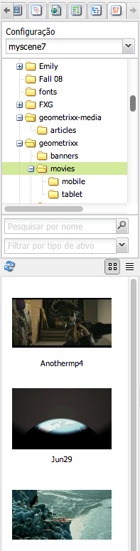

Da mesma maneira que você faz com o localizador de conteúdo do Assets, é possível pesquisar por ativos e filtrar resultados. Contudo, diferente do localizador do Assets, ao inserir uma palavra-chave na guia **[!UICONTROL S7]**, o nome de arquivo *começa com* a sequência de caracteres inserida, em vez de *conter* a palavra-chave no nome.

Por padrão, os ativos são exibidos por nome de arquivo. Além disso, é possível filtrar resultados por tipo de ativo.

>[!NOTE]
>
>Para vídeo, o navegador de conteúdo do Dynamic Media Classic do WCM é compatível:
>
>* Conjuntos de vídeos adaptáveis: contêiner de todas as representações de vídeo necessárias para uma reprodução perfeita em diversas telas
>* Vídeo MP4 único
>* Vídeo F4V único

>

### Procurando ativos do Dynamic Media Classic com o navegador de conteúdo {#searching-for-scene-assets-with-the-content-browser}

Pesquisar ativos do Dynamic Media Classic é semelhante a pesquisar AEM ativos, exceto que ao pesquisar, você está vendo uma visualização remota dos ativos no sistema do Dynamic Media Classic, em vez de importá-los diretamente para o AEM.

É possível usar a interface do usuário clássica ou a otimizada para toque para visualizar e pesquisar ativos. Dependendo da interface, a maneira como você pesquisa é levemente diferente.

Ao pesquisar em qualquer uma das interfaces de usuário, você pode filtrar pelos seguintes critérios (mostrados aqui na interface otimizada para toque):

**[!UICONTROL Digite palavras-chave]** - você pode pesquisar ativos por nome. Ao pesquisar, as palavras-chave inseridas corresponderão às palavras com as quais o nome de arquivo come. Por exemplo, digitar a palavra “nadar” pesquisaria todos os nomes de arquivo de ativo que comecem com as letras nessa ordem. Não se esqueça de clicar em Enter depois de digitar o termo para encontrar o ativo.

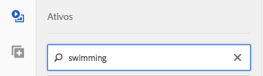

**[!UICONTROL Pasta/caminho]** - O nome da pasta que aparece é baseado na configuração selecionada. Para fazer uma busca detalhada, clique no ícone de pasta e selecione uma subpasta, em seguida clique na marca de seleção para selecioná-la.

Se você inserir uma palavra-chave e selecionar uma pasta, o AEM procura nessa pasta e em todas as subpastas. No entanto, se você não digitar nenhuma palavra-chave ao pesquisar, selecionar a pasta exibirá somente os ativos nessa pasta e não incluirá nenhuma subpasta.

Por padrão, o AEM procura na pasta selecionada e em todas as subpastas.

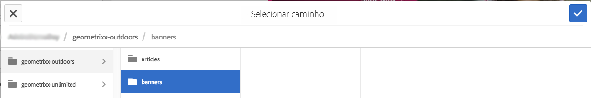

**[!UICONTROL Tipo de ativo]** Selecione Dynamic Media Classic para navegar pelo conteúdo do Dynamic Media Classic. Essa opção só estará disponível se você já tiver configurado o Dynamic Media Classic.

**[!UICONTROL Configuração]** Se você tiver mais de uma configuração do Dynamic Media Classic definida no [!UICONTROL Cloud Services], poderá selecioná-la aqui. Como resultado, a pasta será alterada com base na configuração escolhida.

**[!UICONTROL Tipo]** de ativo No navegador Dynamic Media Classic, você pode filtrar os resultados para incluir qualquer um dos seguintes: imagens, modelos, vídeos e conjuntos de vídeo adaptáveis. Se você não selecionar nenhum tipo de ativo, o AEM procura todos os tipos de ativo por padrão.

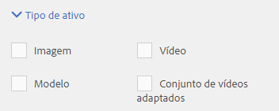

>[!NOTE]
>
>* Ao pesquisar por vídeo, você estará procurando uma única representação. Os resultados retornam a execução original (somente &amp;ast;.mp4) e a execução codificada.
>* Ao pesquisar um conjunto de vídeos adaptáveis, você está pesquisando a pasta e todas as subpastas, mas somente se tiver adicionado uma palavra-chave à pesquisa. Caso não tenha adicionado uma palavra-chave, o AEM não pesquisará nas subpastas.

>

**[!UICONTROL Status]** da publicação Você pode filtrar ativos com base no status da publicação: [!UICONTROL Publicado] ou [!UICONTROL Não publicado]. If you do not select any [!UICONTROL Publish status], AEM by default searches all publish statuses.

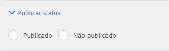

