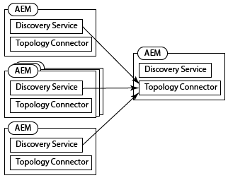

# Descarregamento de Tarefas{#offloading-jobs}

## Introdução {#introduction}

O descarregamento distribui tarefas de processamento, totalizando instâncias de Experience Manager em uma topologia. Com a descarga, você pode usar instâncias Experience Manager específicas para executar tipos específicos de processamento. O processamento especializado permite maximizar o uso dos recursos disponíveis do servidor.

A descarga é baseada nos recursos [Apache Sling Discovery](https://sling.apache.org/documentation/bundles/discovery-api-and-impl.html) e Sling JobManager. Para usar a descarga, você adiciona Experience Manager clusters a uma topologia e identifica os tópicos de trabalho que o cluster processa. Os clusters são compostos de uma ou mais instâncias de Experience Manager, de modo que uma única instância é considerada um cluster.

Para obter informações sobre como adicionar instâncias a uma topologia, consulte [Administração de topologias](/help/sites-deploying/offloading.md#administering-topologies).

### Distribuição de trabalho {#job-distribution}

O Sling JobManager e o JobConsumer permitem a criação de tarefas que são processadas em uma topologia:

* Gerenciador de tarefas: Um serviço que cria empregos para tópicos específicos.
* JobConsumer: Um serviço que executa tarefas de um ou mais tópicos. Vários serviços JobConsumer podem ser registrados para o mesmo tópico.

Quando o JobManager cria um trabalho, a estrutura Offloading seleciona um cluster Experience Manager na topologia para executar o trabalho:

* O cluster deve incluir uma ou mais instâncias que estejam executando um JobConsumer que esteja registrado para o tópico de trabalho.
* O tópico deve ser ativado para pelo menos uma instância no cluster.

Consulte [Configurando o Consumo de Tópico](/help/sites-deploying/offloading.md#configuring-topic-consumption) para obter informações sobre como refinar a distribuição de tarefas.

Quando a estrutura de Descarregamento seleciona um cluster para executar um trabalho e o cliente é composto por várias instâncias, a Distribuição do Sling determina qual instância no cluster executa o trabalho.

### Cargas da tarefa {#job-payloads}

A estrutura de Descarregamento oferece suporte a cargas de trabalho que associam tarefas a recursos no repositório. As cargas de trabalho são úteis quando as tarefas são criadas para recursos de processamento e a tarefa é descarregada para outro computador.

Após a criação de um trabalho, a carga fica somente garantida na instância que cria o trabalho. Ao descarregar o trabalho, os agentes de replicação garantem que a carga seja criada na instância que eventualmente consuma o trabalho. Quando a execução do trabalho é concluída, a replicação inversa faz com que a carga seja copiada de volta para a instância que criou o trabalho.

## Administração de topologias {#administering-topologies}

As topologias são Experience Manager clusters vagamente acoplados que estão participando da descarga. Um cluster consiste em uma ou mais instâncias do servidor Experience Manager (uma única instância é considerada um cluster).

Cada instância do Experience Manager executa os seguintes serviços relacionados à descarga:

* Serviço de descoberta: Envia solicitações para um Conector de topologia para unir a topologia.
* Conector de topologia: Recebe as solicitações de associação e aceita ou recusa cada solicitação.

O Serviço de Descoberta de todos os membros da topologia aponta para o Conector de Topologia em um dos membros. Nas seções a seguir, esse membro é conhecido como membro raiz.

Cada cluster na topologia contém uma instância reconhecida como líder. O líder do cluster interage com a topologia em nome dos outros membros do cluster. Quando o pontilhado deixa o cluster, um novo pontilhado do cluster é automaticamente escolhido.

### Exibição da Topologia {#viewing-the-topology}

Use o Navegador de topologia para explorar o estado da topologia em que a instância do Experience Manager está participando. O Navegador de topologia mostra os clusters e instâncias da topologia.

Para cada cluster, você vê uma lista de membros do cluster que indica a ordem em que cada membro se juntou ao cliente e qual membro é o Líder. A propriedade Current indica a instância que você está administrando no momento.

Para cada instância no cluster, você pode ver várias propriedades relacionadas à topologia:

* Uma lista de permissões de tópicos para o consumidor de emprego da instância.
* Os endpoints expostos para conexão com a topologia.
* Os tópicos da tarefa para os quais a instância está registrada para descarregamento.
* Os tópicos da tarefa que a instância processa.

1. Usando a interface de toque, clique na guia Ferramentas . ([http://localhost:4502/tools.html](http://localhost:4502/tools.html))
1. Na área Operações de Granite, clique em Descarregar navegador.
1. No painel de navegação, clique em Navegador de topologia.

   Os clusters que participam da topologia aparecem.

   

1. Clique em um cluster para ver uma lista das instâncias no cluster e sua ID, o status Atual e o status Líder.
1. Clique em uma ID de instância para ver as propriedades mais detalhadas.

Você também pode usar o Console da Web para exibir informações de topologia. O console fornece mais informações sobre os clusters de topologia:

* Qual instância é a instância local.
* Os serviços do Conector de Topologia que essa instância usa para se conectar à topologia (de saída) e aos serviços que se conectam a essa instância (de entrada).
* Altere o histórico das propriedades de topologia e instância.

Use o procedimento a seguir para abrir a página Gerenciamento de Topologia do Console da Web:

1. Abra o Console da Web em seu navegador. ([http://localhost:4502/system/console](http://localhost:4502/system/console))
1. Clique em Principal > Gerenciamento de topologia.

   

### Configurando a Associação de Topologia {#configuring-topology-membership}

O Apache Sling Resource-Based Discovery Service é executado em cada instância para controlar como as instâncias do Experience Manager interagem com uma topologia.

O Serviço de descoberta envia solicitações POST periódicas (heartbeats) para os serviços do Conector de topologia para estabelecer e manter conexões com a topologia. O serviço Topology Connector mantém uma lista de permissões de endereços IP ou nomes de host que têm permissão para ingressar na topologia:

* Para unir uma instância a uma topologia, especifique o URL do serviço Topology Connector do membro raiz.
* Para permitir que uma instância participe de uma topologia, adicione a instância à lista de permissões do serviço Topology Connector do membro raiz.

Use o Console da Web ou um nó sling:OsgiConfig para configurar as seguintes propriedades do serviço org.apache.sling.discovery.impt.Config :

<table> 
 <tbody> 
  <tr> 
   <th>Nome da Propriedade</th> 
   <th>Nome OSGi</th> 
   <th>Descrição</th> 
   <th>Valor padrão</th> 
  </tr> 
  <tr> 
   <td>Tempo limite do Heartbeat (segundos)</td> 
   <td>heartbeatTimeout</td> 
   <td>O tempo em segundos para aguardar uma resposta de pulsação antes que a instância de destino seja considerada indisponível. </td> 
   <td>20</td> 
  </tr> 
  <tr> 
   <td>Intervalo do Heartbeat (segundos)</td> 
   <td>heartbeatInterval</td> 
   <td>O tempo em segundos entre as pulsações.</td> 
   <td>15.</td> 
  </tr> 
  <tr> 
   <td>Atraso mínimo de evento (segundos)</td> 
   <td>minEventDelay</td> 
   <td>
Quando ocorre uma alteração na topologia, o tempo necessário para atrasar a alteração de estado de TOPOLOGY_CHANGING para TOPOLOGY_CHANGED. Cada alteração que ocorre quando o estado é TOPOLOGY_CHANGING aumenta o atraso por essa quantidade de tempo.
 
Esse atraso impede que os ouvintes sejam inundados por eventos. 
 
Para não usar atraso, especifique 0 ou um número negativo.
 </td> 
   <td>3</td> 
  </tr> 
  <tr> 
   <td>URLs do conector de topologia</td> 
   <td>topologyConnectorUrls</td> 
   <td>Os URLs dos serviços do Topology Connector para enviar mensagens de heartbeat.</td> 
   <td>http://localhost:4502/libs/sling/topology/connector</td> 
  </tr> 
  <tr> 
   <td>Lista de permissões do conector de topologia</td> 
   <td>topologyConnectorWhitelist</td> 
   <td>A lista de endereços IP ou nomes de host que o serviço local do Conector de Topologia permite na topologia. </td> 
   <td>
localhost
 
127.0.0.1
 </td> 
  </tr> 
  <tr> 
   <td>Nome do Descritor de Repositório</td> 
   <td>leaderElectionRepositoryDescriptor</td> 
   <td> </td> 
   <td>&lt;sem valor&gt;</td> 
  </tr> 
 </tbody> 
</table>

Use o procedimento a seguir para conectar uma instância do CQ ao membro raiz de uma topologia. O procedimento aponta a instância para o URL do Conector de Topologia do membro de topologia raiz. Execute esse procedimento em todos os membros da topologia.

1. Abra o Console da Web em seu navegador. ([http://localhost:4502/system/console](http://localhost:4502/system/console))
1. Clique em Principal > Gerenciamento de topologia.
1. Clique em Configurar serviço de descoberta.
1. Adicione um item à propriedade Topology Connector URLs e especifique o URL do serviço Topology Connector do membro de topologia raiz. O URL está no formato https://rootservername:4502/libs/sling/topology/connector.

Execute o procedimento a seguir no membro raiz da topologia. O procedimento adiciona os nomes dos outros membros da topologia à lista de permissões do Serviço de Descoberta.

1. Abra o Console da Web em seu navegador. ([http://localhost:4502/system/console](http://localhost:4502/system/console))
1. Clique em Principal > Gerenciamento de topologia.
1. Clique em Configurar serviço de descoberta.
1. Para cada membro da topologia, adicione um item à propriedade de lista de permissões Topology Connector e especifique o nome do host ou endereço IP do membro da topologia.

## Configuração do Consumo de Tópico {#configuring-topic-consumption}

Use o Navegador de descarga para configurar o consumo de tópico para as instâncias de Experience Manager na topologia. Para cada instância, é possível especificar os tópicos que ela consome. Por exemplo, para configurar sua topologia de forma que somente uma instância consuma tópicos de um tipo específico, desative o tópico em todas as instâncias, exceto uma.

As tarefas são instâncias de quantidade distribuída que têm o tópico associado habilitado usando a lógica de round robin.

1. Usando a interface de toque, clique na guia Ferramentas . ([http://localhost:4502/tools.html](http://localhost:4502/tools.html))
1. Na área Operações de Granite, clique em Descarregar navegador.
1. No painel de navegação, clique em Descarregar navegador.

   Os tópicos de descarregamento e as instâncias do servidor que podem consumir os tópicos são exibidos.

   

1. Para desativar o consumo de um tópico para uma instância, abaixo do nome superior, clique em Desativar ao lado da instância.
1. Para configurar todo o consumo de tópico para uma instância, clique no identificador de instância abaixo de qualquer tópico.

   

1. Clique em um dos seguintes botões ao lado de um tópico para configurar o comportamento de consumo para a instância e, em seguida, clique em Salvar:

   * Ativado: Essa instância consome trabalhos desse tópico.
   * Desativado: Essa instância não consome trabalhos desse tópico.
   * Exclusivo: Essa instância consome trabalhos somente desse tópico.

   **Observação:** ao selecionar Exclusivo para um tópico, todos os outros tópicos são automaticamente definidos como Desativado.

### Consumidores de trabalho instalados {#installed-job-consumers}

Várias implementações do JobConsumer são instaladas com o Experience Manager. Os tópicos para os quais esses JobConsumers estão registrados são exibidos no Navegador de Descarregamento. Os tópicos adicionais que aparecem são aqueles que JobConsumers personalizados registraram. A tabela a seguir descreve o JobConsumers padrão.

| Tópico da tarefa | PID do serviço | Descrição |
|---|---|---|
| / | org.apache.sling.event.impl.jobs.deprecated.EventAdminBridge | Instalado com o Apache Sling. Processa trabalhos que o administrador de eventos OSGi gera para compatibilidade com versões anteriores. |
| com/day/cq/replication/job/&amp;ast; | com.day.cq.replication.impl.AgentManagerImpl | Um agente de replicação que replica cargas de trabalho. |
| com/adobe/granite/workflow/offloading | com.adobe.granite.workflow.core.offloading.WorkflowOffloadingJobConsumer | Processa trabalhos que o fluxo de trabalho do DAM Update Asset Offloader gera. |

### Desativar e ativar tópicos para uma instância {#disabling-and-enabling-topics-for-an-instance}

O serviço Apache Sling Job Consumer Manager fornece propriedades de lista de permissões e lista de bloqueios de tópicos. Configure essas propriedades para ativar ou desativar o processamento de tópicos específicos em uma instância do Experience Manager.

**Observação:** se a instância pertencer a uma topologia, você também poderá usar o Navegador de descarga em qualquer computador na topologia para ativar ou desativar os tópicos.

A lógica que cria a lista de tópicos ativados primeiro permite todos os tópicos que estão na lista de permissões e depois remove os tópicos que estão na lista de bloqueios.Por padrão, todos os tópicos são ativados (o valor da lista de permissões é `*`) e nenhum tópico é desativado (a lista de bloqueios não tem valor).

Use o Console da Web ou um nó `sling:OsgiConfig` para configurar as seguintes propriedades. Para nós `sling:OsgiConfig`, o PID do serviço Gerenciador de Consumidores de Trabalho é org.apache.sling.event.impl.jobs.JobConsumerManager.

| Nome da propriedade no Console da Web | ID do OSGi | Descrição |
|---|---|---|
| Lista de permissões de tópico | job.consumermanager.whitelist | Uma lista de tópicos que o serviço local do JobManager processa. O valor padrão de &amp;ast; faz com que todos os tópicos sejam enviados para o serviço TopicConsumer registrado. |
| Lista Negra de Tópicos | job.consumermanager.blacklist | Uma lista de tópicos que o serviço local do JobManager não processa. |

## Criando Agentes De Replicação Para Descarregamento {#creating-replication-agents-for-offloading}

A estrutura de descarregamento usa a replicação para transportar recursos entre o autor e o trabalhador. A estrutura de descarregamento cria agentes de replicação automaticamente quando as instâncias se juntam à topologia. Os agentes são criados com valores padrão. Você deve alterar manualmente a senha usada pelos agentes para autenticação.

>[!CAUTION]
>
>Um problema conhecido com os agentes de replicação gerados automaticamente requer a criação manual de novos agentes de replicação. Siga o procedimento em [Problems Using the Automatically Generated Replication Agents](/help/sites-deploying/offloading.md#problems-using-the-automatically-generated-replication-agents) antes de criar os agentes para descarga.

Crie os agentes de replicação que transportam cargas de trabalho entre instâncias para descarregamento. A ilustração a seguir mostra os agentes necessários para descarregar do autor para uma instância de trabalho. O autor tem uma ID do Sling de 1 e a instância do trabalhador tem uma ID do Sling de 2:

Essa configuração requer os três agentes a seguir:

1. Um agente de saída na instância do autor que é replicado para a instância do trabalhador.
1. Um agente reverso na instância do autor que puxa da caixa de saída na instância do trabalhador.
1. Um agente de caixa de saída na instância do trabalhador.

Esse esquema de replicação é semelhante ao usado entre instâncias de autor e publicação. No entanto, para a situação de descarregamento, todas as instâncias envolvidas são instâncias de criação.

>[!NOTE]
>
>A estrutura Descarregamento usa a topologia para obter os endereços IP das instâncias de descarregamento. A estrutura então cria automaticamente os agentes de replicação com base nesses endereços IP. Se os endereços IP das instâncias de descarregamento forem alterados posteriormente, a alteração será propagada automaticamente na topologia depois que a instância for reiniciada. No entanto, a estrutura de Descarregamento não atualiza automaticamente os agentes de replicação para refletir os novos endereços IP. Para evitar essa situação, use endereços IP fixos para todas as instâncias na topologia.

### Como nomear os agentes de replicação para descarregar {#naming-the-replication-agents-for-offloading}

Use um formato específico para a propriedade ***Name*** dos agentes de replicação para que a estrutura de descarregamento use automaticamente o agente correto para instâncias de trabalho específicas.

**Nomear o agente de saída na instância do autor:**

`offloading_<slingid>`, onde  `<slingid>` é a ID do Sling da instância do trabalhador.

Exemplo: `offloading_f5c8494a-4220-49b8-b079-360a72f71559`

**Nomear o agente reverso na instância do autor:**

`offloading_reverse_<slingid>`, onde  `<slingid>` é a ID do Sling da instância do trabalhador.

Exemplo: `offloading_reverse_f5c8494a-4220-49b8-b079-360a72f71559`

**Nomear a caixa de saída na instância do trabalhador:**

`offloading_outbox`

### Criando o agente de saída {#creating-the-outgoing-agent}

1. Crie um **Agente de Replicação** no autor. (Consulte a documentação [para agentes de replicação](/help/sites-deploying/replication.md)). Especifique qualquer **Título**. O **Nome** deve seguir a convenção de nomenclatura.
1. Crie o agente usando as seguintes propriedades:

   | Propriedade | Valor |
   |---|---|
   | Configurações > Tipo de serialização | Padrão |
   | Transporte >URI de transporte | https://*`<ip of target instance>`*:*`<port>`*`/bin/receive?sling:authRequestLogin=1` |
   | Transporte > Transportar usuário | Usuário de replicação na instância de destino |
   | Transporte >Transporte de senha | Senha do usuário de replicação na instância de destino |
   | Estendido > Método HTTP | POST |
   | Triggers > Ignorar padrão | Verdadeiro |

### Criação do agente reverso {#creating-the-reverse-agent}

1. Crie um **Agente de Replicação Inverso** no autor. (Consulte a documentação [para agentes de replicação](/help/sites-deploying/replication.md).) Especifique qualquer **Título**. O **Nome** deve seguir a convenção de nomenclatura.
1. Crie o agente usando as seguintes propriedades:

   | Propriedade | Valor |
   |---|---|
   | Configurações > Tipo de serialização | Padrão |
   | Transporte >URI de transporte | https://*`<ip of target instance>`*:*`<port>`*`/bin/receive?sling:authRequestLogin=1` |
   | Transporte > Transportar usuário | Usuário de replicação na instância de destino |
   | Transporte >Transporte de senha | Senha do usuário de replicação na instância de destino |
   | Estendido > Método HTTP | GET |

### Criação do agente de caixa de saída {#creating-the-outbox-agent}

1. Crie um **Agente de Replicação** na instância do trabalhador. (Consulte a documentação [para agentes de replicação](/help/sites-deploying/replication.md).) Especifique qualquer **Título**. O **Nome** deve ser `offloading_outbox`.
1. Crie o agente usando as seguintes propriedades.

   | Propriedade | Valor |
   |---|---|
   | Configurações > Tipo de serialização | Padrão |
   | Transporte >URI de transporte | repo://var/replication/outbox |
   | Acionador > Ignorar padrão | Verdadeiro |

### Encontrar a ID do Sling {#finding-the-sling-id}

Obtenha a ID do Sling de uma instância do Experience Manager usando um dos seguintes métodos:

* Abra o Console da Web e, nas Configurações do Sling, encontre o valor da propriedade do Sling ID ([http://localhost:4502/system/console/status-slingsettings](http://localhost:4502/system/console/status-slingsettings)). Esse método é útil se a instância ainda não fizer parte da topologia.
* Use o navegador Topologia se a instância já fizer parte da topologia.

## Descarregamento do processamento de ativos DAM {#offloading-the-processing-of-dam-assets}

Configure as instâncias de uma topologia para que instâncias específicas executem o processamento em segundo plano de ativos que são adicionados ou atualizados no DAM.

Por padrão, o Experience Manager executa o fluxo de trabalho do Ativo de atualização do DAM quando um ativo do DAM é alterado ou um é adicionado ao DAM. Altere o comportamento padrão para que o Experience Manager execute o fluxo de trabalho DAM Update Asset Offloader . Esse workflow gera um trabalho do JobManager que tem um tópico de `com/adobe/granite/workflow/offloading`. Em seguida, configure a topologia para que a tarefa seja descarregada em um trabalhador dedicado.

>[!CAUTION]
>
>Nenhum workflow deve ser transitório quando usado com a descarga do workflow. Por exemplo, o fluxo de trabalho do Ativo de atualização do DAM não deve ser transitório quando usado para descarregamento de ativos. Para definir/desdefinir o sinalizador transitório em um workflow, consulte [Fluxos de trabalho transitórios](/help/assets/performance-tuning-guidelines.md#workflows).

O procedimento a seguir assume as seguintes características para a topologia de descarregamento:

* Uma ou mais instâncias do Experience Manager são instâncias de criação com as quais os usuários interagem para adicionar ou atualizar ativos do DAM.
* Os usuários não interagem diretamente com uma ou mais instâncias do Experience Manager que processam os ativos do DAM. Essas instâncias são dedicadas ao processamento em segundo plano de ativos do DAM.

1. Em cada instância do Experience Manager, configure o Serviço de descoberta para que ele aponte para o Conector de topologia raiz. (Consulte [Configurando a Associação de Topologia](#title4).)
1. Configure o Conector de Topografia raiz para que as instâncias de conexão estejam na lista de permissões.
1. Abra o Navegador de descarga e desative o tópico `com/adobe/granite/workflow/offloading` nas instâncias com as quais os usuários interagem para fazer upload ou alterar ativos do DAM.

   

1. Em cada instância com a qual os usuários interagem para fazer upload ou alterar ativos do DAM, configure inicializadores de fluxo de trabalho para usar o fluxo de trabalho de Descarregamento de ativo de atualização do DAM :

   1. Abra o console Fluxo de trabalho .
   1. Clique na guia Iniciador.
   1. Localize as duas configurações do Iniciador que executam o fluxo de trabalho do Ativo de atualização do DAM . Um tipo de evento de configuração do iniciador é Nó criado e o outro tipo é Nó modificado.
   1. Altere ambos os tipos de evento para que eles executem o fluxo de trabalho Descarregamento de ativo de atualização do DAM. (Para obter informações sobre as configurações do iniciador, consulte [Iniciando fluxos de trabalho quando nós alterarem](/help/sites-administering/workflows-starting.md).)

1. Nas instâncias que executam o processamento em segundo plano de ativos do DAM, desative os inicializadores do fluxo de trabalho que executam o fluxo de trabalho do Ativo de atualização do DAM .

## Leitura adicional {#further-reading}

Além dos detalhes apresentados nesta página, você também pode ler o seguinte:

* Para obter informações sobre como usar APIs do Java para criar tarefas e consumidores de trabalho, consulte [Criação e consumo de trabalhos para descarregamento](/help/sites-developing/dev-offloading.md).
* Para obter diretrizes gerais e práticas recomendadas para descarregamento de ativos, consulte [Diretrizes gerais e práticas recomendadas para descarregamento de ativos](/help/assets/assets-offloading-best-practices.md#general-guidance-and-best-practices-for-asset-offloading).
* Para saber como desabilitar a criação automática de agentes de descarregamento, consulte [Desativando o Gerenciamento Automático de Agentes](/help/assets/assets-offloading-best-practices.md#turning-off-automatic-agent-management).

