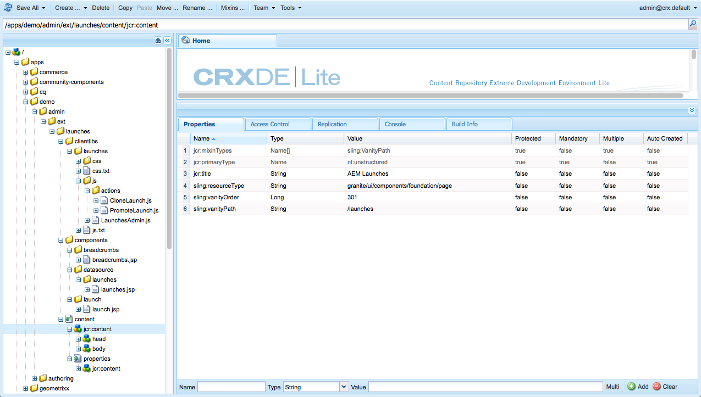

# Personalização dos consoles{#customizing-the-consoles}

>[!CAUTION]
>
>Este documento descreve como personalizar consoles na interface moderna e habilitada para toque e não se aplica à interface clássica.

AEM fornece vários mecanismos para permitir a personalização dos consoles (e a funcionalidade [de criação de](/help/sites-developing/customizing-page-authoring-touch.md)página) da sua instância de criação.

* Clientlibs

   Clientlibs permitem estender a implementação padrão para obter novas funcionalidades, reutilizando funções, objetos e métodos padrão. Ao personalizar, você pode criar sua própria clientlib em `/apps.` Por exemplo, ele pode manter o código necessário para seu componente personalizado.

* Sobreposições

   As sobreposições são baseadas em definições de nó e permitem que você sobreponha a funcionalidade padrão (em `/libs`) com sua própria funcionalidade personalizada (em `/apps`). Ao criar uma sobreposição, uma cópia 1:1 do original não é necessária, já que a fusão de recursos sling permite herança.

Eles podem ser usados de várias maneiras para estender seus consoles de AEM. Uma pequena seleção é abordada abaixo (em um nível alto).

>[!NOTE]
>
>Para obter mais informações, consulte:
>
>* Usar e criar [clientlibs](/help/sites-developing/clientlibs.md).
>* Uso e criação de [sobreposições](/help/sites-developing/overlays.md).
>* [Granite](https://helpx.adobe.com/experience-manager/6-4/sites/developing/using/reference-materials/granite-ui/api/index.html)

>
>
Este tópico também é abordado na sessão [AEM Gems](https://docs.adobe.com/content/ddc/en/gems.html) - personalização da interface [do usuário para AEM 6.0](https://docs.adobe.com/content/ddc/en/gems/user-interface-customization-for-aem-6.html).

>[!CAUTION]
>
>Você não ***deve*** alterar nada no `/libs` caminho.
>
>Isso ocorre porque o conteúdo do é substituído na próxima vez que você atualizar sua instância (e pode muito bem ser substituído quando você aplicar uma correção ou um pacote de recursos). `/libs`
>
>O método recomendado para configuração e outras alterações é:
>
>1. Recriar o item desejado (isto é, como ele existe em `/libs`) em `/apps`
   >
   >
1. Faça quaisquer alterações em `/apps`

>

Por exemplo, os seguintes locais na `/libs` estrutura podem ser sobrepostos:

* consoles (quaisquer consoles com base nas páginas da interface do usuário do Granite); por exemplo:

   * `/libs/wcm/core/content`

<!-- Needs a review by Engineering -->
<!--
* secondary (inner) rails; for example:

    * `/libs/wcm/core/content/search`

* toolbar(s) (dependent on console; for example sites):

    * default 

      `/libs/wcm/core/content/sites/jcr:content/body/content/header/items/default`

    * selection mode

      `/libs/wcm/core/content/sites/jcr:content/body/content/header/items/selection`

* help menu options (dependent on console; for example sites):

    * `/libs/wcm/core/content/sites/jcr:content/body/help`

* information shown on the card view (dependent on console; for example sites):

    * `/libs/wcm/core/content/sites/jcr:content/body/content/content/items/childpages`

-->
>[!NOTE]
>
>Consulte o artigo da Base de conhecimento, [Solução de problemas AEM problemas](https://helpx.adobe.com/experience-manager/kb/troubleshooting-aem-touchui-issues.html)da interface do usuário, para obter mais dicas e ferramentas.

<!-- Needs a review by Engineering -->
<!--
## Code Samples {#code-samples}

Various packages have been made available on Github. These provide code samples related to the tasks covered on this page.

### aem-admin-extension-new-console {#aem-admin-extension-new-console}

`aem-admin-extension-new-console` is a sample package showing how to [create a new AEM 6 console](#create-a-custom-console). This package provides a UI for managing [Launches](/help/sites-authoring/launches.md) and adds a link in the navigation:

CODE ON GITHUB

You can find the code of this page on GitHub

* [Open aem-admin-extension-new-console project on GitHub](https://github.com/Adobe-Marketing-Cloud/aem-admin-extension-new-console)
* Download the project as [a ZIP file](https://github.com/Adobe-Marketing-Cloud/aem-admin-extension-new-console/archive/master.zip)

### aem-admin-extension-customize-sites {#aem-admin-extension-customize-sites}

`aem-admin-extension-customize-sites` is a sample package showing how to customize an existing AEM 6 admin console. This package provides updates to Sites administration:

CODE ON GITHUB

You can find the code of this page on GitHub

* [Open aem-admin-extension-customize-sites project on GitHub](https://github.com/Adobe-Marketing-Cloud/aem-admin-extension-customize-sites)
* Download the project as [a ZIP file](https://github.com/Adobe-Marketing-Cloud/aem-admin-extension-customize-sites/archive/master.zip)
-->

<!-- Needs a review by Engineering -->
<!--
## Create a Custom Console {#create-a-custom-console}

1. You can create a custom console with related actions; for example, Launches at the top level (below Sites):

   This involves:

    * creating the root space definition of your new console ``; for example:

        * `/apps/<yourProject>/admin/ext/launches`

    * this can contain (according to requirements):

        * the corresponding [clientlibs](/help/sites-developing/clientlibs.md) for custom actions and `less`/ `css` definitions

            * `/apps/<yourProject>/admin/ext/launches/clientlibs`

        * components that need to be redefined/adjusted; for example, the breadcrumbs, datasource and the launch

            * `/apps/<yourProject>/admin/ext/launches/components`

        * the Granite UI page resource:

            * `/apps/<yourProject>/admin/ext/launches/content/jcr:content`

              property: `sling:resourceType`

        * the page definition of the console

            * `/apps/<yourProject>/admin/ext/launches/content/jcr:content/head`
            * `/apps/<yourProject>/admin/ext/launches/content/jcr:content/body`

   

   To use the new console (for example in the [rail for navigation](#add-new-navigation-option-to-rail)) an ID is used, so that it can be explicitly referenced. The ID is used to connect the console and its navigation definition. The ID is defined in the `rail` node of the page; for example, for the Sites console:

    * the rail node is: 

      `/libs/wcm/core/content/sites/jcr:content/body/rail`

        * here the `currentId` property is defined: 

          `currentId` = `cq-sites`

   For the Launches console example:

    * the node is:

        * `/apps/<yourProject>/admin/ext/launches/content/jcr:content/body/rail`

    * with the following properties:

        * `currentId` = `cq-launches`
        * `sling:resourceType` = `granite/ui/components/endor/navcolumns`
        * `srcPath` = `cq/core/content/nav`
-->

## Personalização da Visualização padrão para um console {#customizing-the-default-view-for-a-console}

Você pode personalizar a visualização padrão (coluna, cartão, lista) para um console:

1. É possível reordenar as visualizações sobrepondo a entrada necessária de abaixo:

   `/libs/wcm/core/content/sites/jcr:content/views`

   A primeira entrada será o padrão.

   Os nós disponíveis correlacionam-se às opções de visualização disponíveis:

   * `column`
   * `card`
   * `list`

1. Por exemplo, em uma sobreposição para lista:

   `/apps/wcm/core/content/sites/jcr:content/views/list`

   Defina a seguinte propriedade:

   * **Nome**: `sling:orderBefore`
   * **Tipo**: `String`
   * **Valor**: `column`

<!-- Needs a review by Engineering -->
<!--
`aem-admin-extension-customize-sites` is a sample package showing how to customize an existing AEM 6 admin console. This package provides updates to Sites administration:

CODE ON GITHUB

You can find the code of this page on GitHub

* [Open aem-admin-extension-customize-sites project on GitHub](https://github.com/Adobe-Marketing-Cloud/aem-admin-extension-customize-sites)
* Download the project as [a ZIP file](https://github.com/Adobe-Marketing-Cloud/aem-admin-extension-customize-sites/archive/master.zip)
-->

<!-- Needs a review by Engineering -->
<!--
### Add New Navigation Option to Rail {#add-new-navigation-option-to-rail}

1. You can add a navigation entry in the rail (for example, a [custom console](#create-a-custom-console) such as Launches).

   To do this, you create an overlay of:

   `/libs/cq/core/content/nav`

   In the `/apps` overlay:

   `/apps/cq/core/content/nav`

   Create the new nodes and properties:

   

    * Extend navigation:

        * `/apps/cq/core/content/nav/launches`

    * Specify location in the tree:

        * property: `sling:orderBefore`

    * To create the connection, the `id` property references (i.e. must be the same as) the `currentID` property [for the appropriate console](#create-a-custom-console):

        * property: `id`
        * value: same as for your console (e.g. `cq-launches`) 

          for example: the same value as the `currentId` property on:

          `/apps/<yourProject>/admin/ext/launches/content/jcr:content/body/rail`
-->

## Adicionar nova ação à barra de ferramentas {#add-new-action-to-the-toolbar}

1. Você pode criar seus próprios componentes e incluir as bibliotecas do cliente correspondentes para ações personalizadas. Por exemplo, uma ação **Promover ao Twitter** em:

   `/apps/wcm/core/clientlibs/sites/js/twitter.js`

   Isso pode ser conectado a um item da barra de ferramentas no console:

   `/apps/<yourProject>/admin/ext/launches`

   Por exemplo, no modo de seleção:

   `content/jcr:content/body/content/header/items/selection/items/twitter`

## Restringir uma ação da barra de ferramentas a um grupo específico {#restrict-a-toolbar-action-to-a-specific-group}

1. É possível usar uma condição de renderização personalizada para sobrepor a ação padrão e impor condições específicas que devem ser cumpridas antes de ser renderizada.

   Por exemplo, crie um componente para controlar as condições de renderização de acordo com o grupo:

   `/apps/myapp/components/renderconditions/group`

1. Para aplicá-los à ação Criar site no console Sites:

   `/libs/wcm/core/content/sites`

   Crie a sobreposição:

   `/apps/wcm/core/content/sites`

1. Em seguida, adicione a condição de renderização para a ação:

   `jcr:content/body/content/header/items/default/items/create/items/createsite/rendercondition`

   Usando as propriedades neste nó, é possível definir o `groups` permitido para executar a ação específica; por exemplo, `administrators`

<!-- Needs a review by Engineering -->
<!--
## Remove Access to Navigation Option on Rail {#remove-access-to-navigation-option-on-rail}

1. You can rename a navigation entry in the rail by overlaying the required entry from under:

   `/libs/cq/core/content/nav`

   The nodes available correlate to the navigation options in the rail:

    * `projects`
    * `sites`
    * `assets`
    * `apps`
    * `forms`
    * `screens`
    * `personalization`
    * `commerce`
    * `tools`
    * `communities`

1. For example, on a overlay at:

   `/apps/cq/core/content/nav/sites`

   Define the following property:

    * **Name**: `sling:hideResource`
    * **Type**: `String` 
    * **Value**: `true`

`aem-admin-extension-customize-sites` is a sample package showing how to customize an existing AEM 6 admin console. This package provides updates to Sites administration:

CODE ON GITHUB

You can find the code of this page on GitHub

* [Open aem-admin-extension-new-console project on GitHub](https://github.com/Adobe-Marketing-Cloud/aem-admin-extension-new-console)
* Download the project as [a ZIP file](https://github.com/Adobe-Marketing-Cloud/aem-admin-extension-new-console/archive/master.zip)
-->

<!-- Needs a review by Engineering -->
<!--
## Restrict Access to Navigation Option on Rail {#restrict-access-to-navigation-option-on-rail}

You can restrict access to a navigation option using ACLs:

1. Open the [user and/or group management](/help/sites-administering/security.md) and select the user/group you want to restrict access for.

   >[!NOTE]
   >
   >Avoid assigning/restricting permissions on a user-by-user basis. It is [recommended to use groups](/help/sites-administering/security.md#best-practices).

1. Remove access [permissions](/help/sites-administering/security.md#permissions) to the appropriate node(s) under `/libs/cq/core/content/nav/sites`. These correlate to the navigation options in the rail:

    * `projects`
    * `sites`
    * `assets`
    * `apps`
    * `forms`
    * `screens`
    * `personalization`
    * `commerce`
    * `tools`
    * `communities`
-->

## Personalização de colunas na Visualização da Lista {#customizing-columns-in-the-list-view}

>[!NOTE]
>
>Esse recurso é otimizado para colunas de campos de texto; para outros tipos de dados é possível sobrepor `cq/gui/components/siteadmin/admin/listview/columns/analyticscolumnrenderer` em `/apps`.

<!-- Needs a review by Engineering -->
<!--
CODE ON GITHUB

You can find the code of this page on GitHub

* [Open aem-sites-extension-listview-columns project on GitHub](https://github.com/Adobe-Marketing-Cloud/aem-sites-extension-listview-columns)
* Download the project as [a ZIP file](https://github.com/Adobe-Marketing-Cloud/aem-sites-extension-listview-columns/archive/master.zip)
-->

Para personalizar as colunas na visualização da lista:

1. Sobreponha a lista das colunas disponíveis.

   * No nó:

      `/apps/wcm/core/content/common/availablecolumns`

   * Adicione suas novas colunas ou remova as existentes.
   Consulte [Usando sobreposições (e a Fusão de recursos Sling)](/help/sites-developing/overlays.md) para obter mais informações.

1. Opcionalmente:

   * Se desejar conectar dados adicionais, você precisa gravar um ` [PageInforProvider](https://helpx.adobe.com/experience-manager/6-4/sites/developing/using/reference-materials/javadoc/com/day/cq/wcm/api/PageInfoProvider.html)` com um

      `pageInfoProviderType` propriedade.
   Por exemplo, consulte a classe/grupo anexado (do GitHub) abaixo.

1. Agora é possível selecionar a coluna no configurador de coluna da visualização de lista.

## Filtrar recursos {#filtering-resources}

Ao usar um console, um caso de uso comum é quando o usuário deve selecionar entre os recursos (por exemplo, páginas, componentes, ativos etc.). Isso pode assumir a forma de uma lista, por exemplo, a partir da qual o autor deve escolher um item.

Para manter a lista em um tamanho razoável e também relevante para o caso de uso, um filtro pode ser implementado na forma de um predicado personalizado. Consulte [este artigo](/help/sites-developing/customizing-page-authoring-touch.md#filtering-resources) para obter detalhes.
