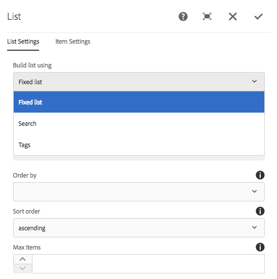

# Uso de Ocultar Condições{#using-hide-conditions}

As condições de ocultação podem ser usadas para determinar se um recurso de componente é renderizado ou não. Um exemplo disso seria quando um autor de modelo configura o componente principal [componente de lista](https://helpx.adobe.com/experience-manager/core-components/using/list.html) no [editor de modelo](/help/sites-authoring/templates.md) e decide desativar as opções para criar a lista com base em páginas secundárias. Desativar essa opção na caixa de diálogo de design define uma propriedade para que, quando o componente de lista for renderizado, a condição de ocultação seja avaliada e a opção para mostrar páginas secundárias não seja exibida.

## Visão geral {#overview}

As caixas de diálogo podem tornar-se muito complexas, com várias opções para o utilizador, que só podem utilizar uma fração das opções que lhe estão à disposição. Isso pode levar a experiências esmagadoras da interface do usuário para os usuários.

Ao usar condições de ocultação, administradores, desenvolvedores e superusuários têm uma maneira de ocultar recursos com base em um conjunto de regras. Esse recurso permite que eles decidam quais recursos devem ser exibidos quando um autor edita o conteúdo.

>[!NOTE]
>
>Ocultar um recurso com base em uma expressão não substitui as permissões de ACL. O conteúdo permanece editável, mas simplesmente não é exibido.

## Detalhes de implementação e uso {#implementation-and-usage-details}

`com.adobe.granite.ui.components.FilteringResourceWrapper` é responsável pela filtragem dos recursos com base na existência e no valor da  `granite:hide` propriedade, localizada no campo a ser filtrado. A implementação de `/libs/cq/gui/components/authoring/dialog/dialog.jsp` inclui uma instância de `FilteringResourceWrapper.`

A implementação utiliza a API Granite [ELResolver](https://helpx.adobe.com/experience-manager/6-4/sites/developing/using/reference-materials/granite-ui/api/jcr_root/libs/granite/ui/docs/server/el.html) e adiciona uma variável personalizada `cqDesign` através do ExpressionCustomizer.

Estes são alguns exemplos de condições de ocultação em um nó de design localizado em `etc/design` ou como uma Política de conteúdo.

```
${cqDesign.myProperty}
${!cqDesign.myProperty}
${cqDesign.myProperty == 'someText'}
${cqDesign.myProperty != 'someText'}
${cqDesign.myProperty == true}
${cqDesign.myProperty == true}
${cqDesign.property1 == 'someText' && cqDesign.property2 || cqDesign.property3 != 1 || header.myHeader}
```

Ao definir sua expressão de ocultar, lembre-se:

* Para ser válido, o escopo no qual a propriedade é encontrada deve ser expresso (por exemplo, `cqDesign.myProperty`).
* Os valores são somente leitura.
* As funções (se necessário) devem ser limitadas a um determinado conjunto fornecido pelo serviço.

## Exemplo {#example}

Exemplos de condições de ocultação podem ser encontrados em todo o AEM e os [componentes principais](https://docs.adobe.com/content/help/pt-BR/experience-manager-core-components/using/introduction.html) em particular. Por exemplo, considere o [componente principal da lista](https://helpx.adobe.com/experience-manager/core-components/using/list.html).

[Usando o editor](/help/sites-authoring/templates.md) de modelo, o autor do modelo pode definir na caixa de diálogo de design quais opções do componente de lista estão disponíveis para o autor da página. Opções como permitir que a lista seja uma lista estática, uma lista de páginas secundárias, uma lista de páginas marcadas etc. pode ser ativado ou desativado.

Se um autor de modelo optar por desativar a opção de páginas secundárias, uma propriedade de design será definida e uma condição de ocultação será avaliada em relação a ela, o que faz com que a opção não seja renderizada para o autor da página.

1. Por padrão, o autor da página pode usar o componente principal da lista para criar uma lista usando páginas secundárias escolhendo a opção **Páginas secundárias**.

   

1. Na caixa de diálogo de design do componente principal da lista, o autor do modelo pode escolher a opção **Desativar filhos** para impedir que a opção de gerar uma lista com base em páginas secundárias seja mostrada ao autor da página.

   

1. Um nó de política é criado em `/conf/we-retail/settings/wcm/policies/weretail/components/content/lis`t com uma propriedade `disableChildren` definida como `true`.
1. A condição de ocultação é definida como o valor de uma propriedade `granite:hid`e no nó de propriedade de diálogo `/conf/we-retail/settings/wcm/policies/weretail/components/content/list`

   

1. O valor de `disableChildren` é extraído da configuração de design e a expressão `${cdDesign.disableChildren}` é avaliada como `false`, o que significa que a opção não será renderizada como parte do componente.

   Você pode visualização a expressão de ocultação como o valor da propriedade `granite:hide` [no GitHub aqui](https://github.com/Adobe-Marketing-Cloud/aem-core-wcm-components/blob/master/content/src/content/jcr_root/apps/core/wcm/components/list/v1/list/_cq_dialog/.content.xml#L40).

1. A opção **Páginas secundárias** não é mais renderizada para o autor da página ao usar o componente de lista.

   

