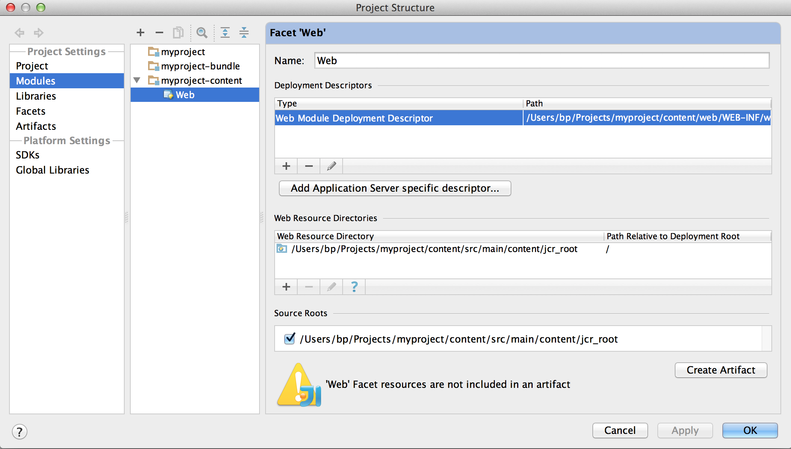

# Como desenvolver projetos AEM usando o IntelliJ IDEA{#how-to-develop-aem-projects-using-intellij-idea}

## Visão geral {#overview}

Para começar a desenvolver AEM IntelliJ, são necessárias as etapas a seguir.

Cada uma delas é explicada mais detalhadamente no restante deste Como.

* Instalar o IntelliJ
* Configure seu projeto AEM com base no Maven
* Preparar suporte JSP para IntelliJ no Maven POM
* Importar o projeto Maven para o IntelliJ

>[!NOTE]
>
>Este guia é baseado no IntelliJ IDEA Ultimate Edition 12.1.4 e AEM 5.6.1.

### Instale o IntelliJ IDEA {#install-intellij-idea}

Baixe o IntelliJ IDEA [da página Downloads do JetBrains](https://www.jetbrains.com/idea/download/index.html).

Em seguida, siga as instruções de instalação nessa página.

### Configure seu projeto AEM com base no Maven {#set-up-your-aem-project-based-on-maven}

Em seguida, configure seu projeto usando o Maven, conforme descrito em [Como criar projetos AEM usando o Apache Maven](/help/sites-developing/ht-projects-maven.md).

Para o start de trabalhar com projetos AEM no IntelliJ IDEA, a configuração básica na [Introdução em 5 minutos](https://maven.apache.org/guides/getting-started/maven-in-five-minutes.html) é suficiente.

### Preparar suporte JSP para IntelliJ IDEA {#prepare-jsp-support-for-intellij-idea}

A IntelliJ IDEA também pode fornecer suporte ao trabalho com a JSP, por exemplo,

* conclusão automática de bibliotecas de tags
* sensibilização para os objetos definidos por `<cq:defineObjects />` e `<sling:defineObjects />`

Para que isso funcione, siga as instruções em [Como trabalhar com JSPs](/help/sites-developing/ht-projects-maven.md#how-to-work-with-jsps) em projetos de criação de [orientações AEM usando o Apache Maven](/help/sites-developing/ht-projects-maven.md).

### Importar o projeto Maven {#import-the-maven-project}

1. Abrir a caixa de diálogo **Importar** no IntelliJ IDEA por

   * selecionando **Importar projeto** na tela de boas-vindas se você ainda não tiver um projeto aberto
   * selecionando **Arquivo -> Importar projeto** no menu principal

1. Na caixa de diálogo Importar, selecione o arquivo POM do seu projeto.

   

1. Continue com as configurações padrão, conforme mostrado na caixa de diálogo abaixo.

   

1. Continue pelas seguintes caixas de diálogo clicando em **Avançar** e em **Concluir**.
1. Agora você está configurado para desenvolvimento AEM usando o IntelliJ IDEA

   

### Depuração de JSPs com IntelliJ IDEA {#debugging-jsps-with-intellij-idea}

As etapas a seguir são necessárias para depurar JSPs com IntelliJ IDEA

* Configurar um Web Facet no projeto
* Instale o plug-in de suporte JSR45
* Configurar um Perfil de depuração
* Configurar AEM para o modo de depuração

#### Configurar um Web Facet no projeto {#set-up-a-web-facet-in-the-project}

O IntelliJ IDEA precisa entender onde encontrar os JSPs para depuração. Como a IDEA não pode interpretar as `content-package-maven-plugin` configurações, isso precisa ser configurado manualmente.

1. Ir para **Arquivo -> Estrutura do Projeto**
1. Selecione o módulo **Conteúdo**
1. Clique **+** acima da lista dos módulos e selecione **Web**
1. Como o Diretório de recursos da Web, selecione o `content/src/main/content/jcr_root subdirectory` do seu projeto como mostrado na captura de tela abaixo.



#### Instale o plug-in de suporte JSR45 {#install-the-jsr-support-plugin}

1. Vá para o painel **Plug-ins** nas configurações do IntelliJ IDEA
1. Navegue até o Plug-in **JSR45 Integration** e marque a caixa de seleção ao lado dele
1. Clique em **Aplicar**
1. Reinicie o IntelliJ IDEA quando solicitado


#### Configurar um Perfil de depuração {#configure-a-debug-profile}

1. Ir para **Executar -> Editar configurações**
1. Pressione as teclas **+** e selecione **JSR45 Remote**
1. Na caixa de diálogo de configuração, selecione **Configurar** ao lado do Servidor **** de aplicativos e configure um servidor Genérico
1. Defina a página do start como um URL apropriado se quiser abrir um navegador quando você start a depuração
1. Remova todas as tarefas **Antes de iniciar** o se você usar a sincronização automática vlt ou configurar as tarefas Maven apropriadas se você não
1. No painel **Inicialização/Conexão** , ajuste a porta, se necessário
1. Copie os argumentos da linha de comando que o IntelliJ IDEA propõe

 

#### Configurar AEM para o modo de depuração {#configure-aem-for-debug-mode}

O último passo necessário é o start do AEM com as opções de JVM propostas pela IntelliJ IDEA.

Você pode fazer isso iniciando o arquivo jar AEM diretamente e adicionando essas opções, por exemplo, com a seguinte linha de comando:

`java -Xdebug -Xrunjdwp:transport=dt_socket,address=58242,suspend=n,server=y -Xmx1024m -XX:MaxPermSize=256M -jar cq-quickstart-5.6.1.jar`

Também é possível adicionar essas opções ao script do start, conforme mostrado `crx-quickstart/bin/start` abaixo.

```shell
# ...

# default JVM options
if [ -z "$CQ_JVM_OPTS" ]; then
 CQ_JVM_OPTS='-server -Xmx1024m -XX:MaxPermSize=256M -Djava.awt.headless=true'
fi

CQ_JVM_OPTS="$CQ_JVM_OPTS -Xdebug -Xrunjdwp:transport=dt_socket,address=58242,suspend=n,server=y"

# ...
```

#### Depuração de Start {#start-debugging}

Agora, todos os usuários estão configurados para depurar seus JSPs no AEM.

1. Selecione **Executar -> Depurar -> Seu Perfil de Depuração**
1. Definir pontos de interrupção no código do componente
1. Acessar uma página no seu navegador


### Depuração de pacotes com o IntelliJ IDEA {#debugging-bundles-with-intellij-idea}

O código em pacotes pode ser depurado usando uma conexão de depuração remota genérica padrão. Você pode seguir a documentação do [Jetbrain em depuração](https://www.jetbrains.com/idea/webhelp/run-debug-configuration-remote.html)remota.
