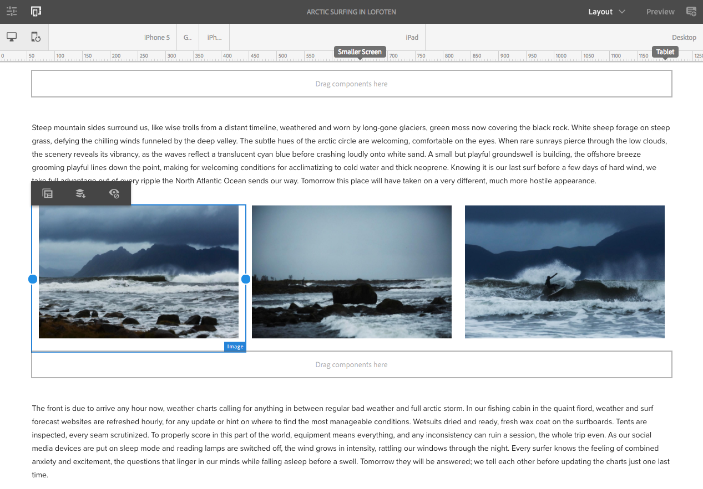

# Tentando um layout responsivo no We.Retail{#trying-out-responsive-layout-in-we-retail}

Todas as páginas We.Retail usam o componente Container Layout para implementar um design responsivo. O container de layout fornece um sistema de parágrafo que permite posicionar componentes dentro de uma grade responsiva. Esta grade pode reorganizar o layout de acordo com o dispositivo/tamanho e formato da janela. The component is used in conjunction with the **Layout** mode in the page editor, which allows you to create and edit your responsive layout dependent on device.

## Tentando sair {#trying-it-out}

1. Edite a página Surfe no Ártico na seção Experiências do ramo de idioma principal.

   http://localhost:4502/editor.html/content/we-retail/language-masters/en/experience/arctic-surfing-in-lofoten.html

1. Alterne para a **Pré-visualização** para ver a página como ela seria renderizada para um visitante do site. Role para baixo até o conteúdo do artigo Espírito da *Aloha no norte da Noruega*.

   

1. Redimensione a janela do navegador e observe que o layout se adapta dinamicamente ao redimensionamento.

   

1. Alternar para o modo Layout. A barra de ferramentas do emulador é exibida automaticamente, permitindo que você planeje seu layout por dispositivo de destino.

   Selecionar um componente exibe opções flutuantes e ocultas no menu de edição, juntamente com alças de redimensionamento do componente.

   

1. Agarrar e arrastar a alça de redimensionamento do componente mostra automaticamente a grade de layout para ajudá-lo com o redimensionamento.

   

## Informações adicionais {#further-information}

Para obter mais informações, consulte o Layout  responsivo do documento de criação ou o documento administrador [Configurando o Container de layout e o Modo](/help/sites-administering/configuring-responsive-layout.md) de layout para obter detalhes técnicos completos.
