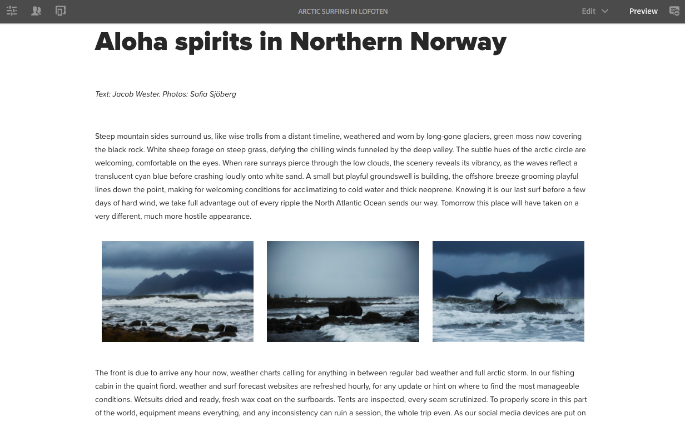

# Tentando um layout responsivo no We.Retail{#trying-out-responsive-layout-in-we-retail}

>[!CAUTION]
>
>AEM 6.4 chegou ao fim do suporte estendido e esta documentação não é mais atualizada. Para obter mais detalhes, consulte nossa [períodos de assistência técnica](https://helpx.adobe.com/br/support/programs/eol-matrix.html). Encontre as versões compatíveis [here](https://experienceleague.adobe.com/docs/).

Todas as páginas We.Retail usam o componente Contêiner de layout para implementar um design responsivo. O contêiner de layout fornece um sistema de parágrafo que permite posicionar os componentes dentro de uma grade responsiva. Essa grade pode reorganizar o layout de acordo com o dispositivo/tamanho e formato da janela. O componente é usado junto com a variável **Layout** no editor de páginas, que permite criar e editar seu layout responsivo dependendo do dispositivo.

## Tentando {#trying-it-out}

1. Edite a página Navegação no Ártico na seção Experiências do ramo de idioma principal.

   http://localhost:4502/editor.html/content/we-retail/language-masters/en/experience/arctic-surfing-in-lofoten.html

1. Mudar para **Visualizar** para ver a página da forma que seria renderizada para um visitante do site. Role para baixo até o conteúdo do artigo *Aloha espíritos no noroeste da Noruega*.

   

1. Redimensione a janela do navegador e observe o layout se adaptando dinamicamente ao redimensionamento.

   

1. Alterne para o modo Layout . A barra de ferramentas do emulador é exibida automaticamente, permitindo que você planeje o layout por dispositivo de destino.

   Selecionar um componente exibe opções flutuantes e de ocultação no menu de edição junto com alças de redimensionamento para o componente.

   

1. Agarrar e arrastar a alça de redimensionamento do componente mostra automaticamente a grade de layout para ajudá-lo com o redimensionamento.

   

## Informações adicionais {#further-information}

Para obter mais informações, consulte o documento de criação [Layout responsivo](/help/sites-authoring/responsive-layout.md) ou o documento do administrador [Configuração do contêiner de layout e modo de layout](/help/sites-administering/configuring-responsive-layout.md) para obter detalhes técnicos completos.
