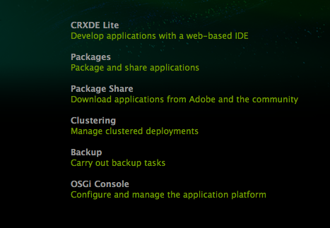

# Criar um site de recursos completos (JSP){#create-a-fully-featured-website-jsp}

>[!CAUTION]
>
>Este artigo descreve como criar um site usando JSP e baseado na interface clássica. A Adobe recomenda aproveitar as tecnologias AEM mais recentes para seus sites, conforme descrito detalhadamente no artigo [Introdução ao desenvolvimento do AEM Sites](/help/sites-developing/getting-started.md).

Este tutorial permite que você crie um site completo com o Adobe Experience Manager (AEM). O site será baseado em um site genérico e direcionado principalmente para desenvolvedores da Web. Todo o desenvolvimento ocorrerá dentro de um ambiente do autor.

Este tutorial descreve como:

1. Instale o AEM.
1. CRXDE Lite de acesso (o ambiente de desenvolvimento).
1. Configure a estrutura do projeto no CRXDE Lite.
1. Crie o modelo, o componente e os scripts usados como a base para a criação de páginas de conteúdo.
1. Crie a página raiz do seu site e, em seguida, as páginas de conteúdo.
1. Crie os seguintes componentes para uso em suas páginas:

   * **[!UICONTROL Navegação superior]**
   * **[!UICONTROL Listar secundários]**
   * **[!UICONTROL Logotipo]**
   * **[!UICONTROL Imagem]**
   * **[!UICONTROL Imagem de texto]**
   * **[!UICONTROL Pesquisar]**

1. Inclua vários componentes da fundação.

Depois de executar todas as etapas, suas páginas terão a seguinte aparência:


**Download do resultado final**

Para acompanhar o tutorial em vez de realizar os exercícios, baixe o site-1.0.zip. Este arquivo é um pacote de conteúdo AEM que contém os resultados deste tutorial. Use o [Package Manager](/help/sites-administering/package-manager.md) para instalar o pacote na instância do autor.

>[!NOTE]
>A instalação deste pacote substituirá todos os recursos na instância de criação que você criou usando este tutorial.

Pacote de conteúdo do site

[Obter arquivo](assets/website-1_0.zip)

## Installing Adobe Experience Manager {#installing-adobe-experience-manager}

Para instalar uma instância AEM para desenvolver seu site, siga as instruções para configurar um ambiente de [implantação com instâncias](/help/sites-deploying/deploy.md#author-and-publish-installs)de autor e publicação ou execute uma instalação [](/help/sites-deploying/deploy.md#default-local-install)genérica. A instalação genérica envolve baixar o arquivo JAR AEM Quickstart, colocar o arquivo license.properties no mesmo diretório do arquivo JAR e clicar no duplo no arquivo JAR.

Depois de instalar o AEM, acesse o ambiente de desenvolvimento do CRXDE Lite clicando no link CRXDE Lite na página de Boas-vindas:



>[!NOTE]
>
>O URL do CRXDE Lite para uma instância de criação de AEM instalada localmente usando a porta padrão é [http://localhost:4502/crx/de/](http://localhost:4502/crx/de/).

## Configuração da estrutura do projeto no CRXDE Lite {#setting-up-the-project-structure-in-crxde-lite}

Use a CRXDE Lite para criar a estrutura do aplicativo mywebsite no repositório:

1. Na árvore no lado esquerdo do CRXDE Lite, clique com o botão direito do mouse na **`/apps`** pasta e clique em **[!UICONTROL Criar > Criar pasta]**. Na caixa de diálogo **Criar pasta** , digite `mywebsite` o nome da pasta e clique em **[!UICONTROL OK**.
1. Clique com o botão direito do mouse na `/apps/mywebsite` pasta e clique em **[!UICONTROL Criar > Criar pasta]**. Na caixa de diálogo **[!UICONTROL Criar pasta]** , digite `components` o nome da pasta e clique em **[!UICONTROL OK]**.
1. Clique com o botão direito do mouse na `/apps/mywebsite` pasta e clique em **[!UICONTROL Criar > Criar pasta]**. Na caixa de diálogo **[!UICONTROL Criar pasta]** , digite `templates` o nome da pasta e clique em **[!UICONTROL OK]**.

   A estrutura da árvore deve ficar parecida com isto:

   

1. Clique em **[!UICONTROL Salvar tudo]**.

## Configuração do design {#setting-up-the-design}

Nesta seção, você cria o design para seu aplicativo usando a ferramenta Designer. O design fornece CSS e recursos de imagem para seu site.

>[!NOTE]
>
>Clique no link a seguir para baixar ``mywebsite.zip``. O arquivo contém os arquivos static.css e de imagem para seu design.

Amostra de imagens e arquivos static.css

[Obter arquivo](assets/mywebsite.zip)

1. Na página AEM Boas-vindas, clique em **[!UICONTROL Ferramentas]**. ([http://localhost:4502/libs/cq/core/content/welcome.html](http://localhost:4502/libs/cq/core/content/welcome.html))

   

1. Na árvore de pastas, selecione a pasta **[!UICONTROL Designs]** e clique em **[!UICONTROL Nova > Nova página]**. Digite `mywebsite` como o título e clique em **[!UICONTROL Criar]**.

1. Se o item do site não aparecer na tabela, atualize a árvore ou a tabela.

1. [Usando o acesso WebDAV](/help/sites-administering/webdav-access.md) ao URL em http://localhost:4502, copie o arquivo de amostra `static.css` e a `images` pasta do arquivo mywebsite.zip baixado para a `/etc/designs/mywebsite` pasta.

   

## Criação do modelo, componente e script da página de conteúdo {#creating-the-contentpage-template-component-and-script}

Nesta seção, você cria o seguinte:

* O modelo de página de conteúdo que será usado para criar páginas de conteúdo no site de exemplo
* O componente de página de conteúdo que será usado para renderizar páginas de conteúdo
* O script da página de conteúdo

### Criando o modelo de página de conteúdo {#creating-the-contentpage-template}

Crie um modelo para usar como base das páginas da Web do site.

Um modelo define o conteúdo padrão de uma nova página. Sites complexos podem usar vários modelos para criar os diferentes tipos de páginas no site. Neste exercício, todas as páginas são baseadas em um modelo simples.

1. Na árvore de pastas do CRXDE Lite, clique com o botão direito do mouse `/apps/mywebsite/templates` e clique em **[!UICONTROL Criar > Criar modelo]**.

1. Na caixa de diálogo Criar modelo, digite os seguintes valores e clique em **[!UICONTROL Avançar]**:

   * **[!UICONTROL Rótulo]**: contentpage
   * **[!UICONTROL Título]**: Modelo de página de conteúdo do meu site
   * **[!UICONTROL Descrição]**: Este é meu modelo de página de conteúdo do site
   * **[!UICONTROL Tipo]** de recurso: mywebsite/components/contentpage

   Use o valor padrão para a propriedade Classificação.

   

   O tipo de recurso identifica o componente que renderiza a página. Nesse caso, todas as páginas criadas usando o modelo de página de conteúdo são renderizadas pelo `mywebsite/components/contentpage` componente.

1. Para especificar os caminhos das páginas que podem usar esse modelo, clique no botão de adição e digite `/content(/.*)?` na caixa de texto que aparece. Em seguida, clique em **[!UICONTROL Avançar]**.

   

   O valor da propriedade path permitida é uma expressão *regular.* As páginas que têm um caminho que corresponde à expressão podem usar o modelo. Nesse caso, a expressão normal corresponde ao caminho da `/content` pasta e de todas as subpáginas.

   Quando um autor cria uma página abaixo `/content`, o modelo de página de **[!UICONTROL conteúdo]** aparece em uma lista de modelos disponíveis para uso.

1. Clique em **[!UICONTROL Avançar]** nos painéis Pais **** permitidos e Filhos **** permitidos e clique em **[!UICONTROL OK]**. No CRXDE Lite, clique em **[!UICONTROL Salvar tudo]**.

   

#### Criação do componente Contentpage {#creating-the-contentpage-component}

Crie o *componente* que define o conteúdo e renderiza as páginas que usam o modelo de página de conteúdo. O local do componente deve corresponder ao valor da propriedade Tipo de recurso do modelo de página de conteúdo.

1. No CRXDE Lite, clique com o botão direito do mouse `/apps/mywebsite/components` e clique em **[!UICONTROL Criar > Componente]**.
1. Na caixa de diálogo **[!UICONTROL Criar componente]** , digite os seguintes valores de propriedade:

   * **[!UICONTROL Rótulo]**: contentpage
   * **[!UICONTROL Título]**: Componente da página de conteúdo do meu site
   * **[!UICONTROL Descrição]**: Este é o componente da página de conteúdo do meu site

   

   O local do novo componente é `/apps/mywebsite/components/contentpage`. Esse caminho corresponde ao tipo de recurso do modelo de página de conteúdo (menos a parte inicial `/apps/` do caminho).

   Essa correspondência conecta o modelo ao componente e é essencial para o funcionamento correto do site.

1. Clique em **[!UICONTROL Avançar]** até que o painel Filhos **** permitidos da caixa de diálogo seja exibido e clique em **[!UICONTROL OK]**. No CRXDE Lite, clique em **[!UICONTROL Salvar tudo]**.

   A estrutura agora é a seguinte:

   

#### Desenvolvimento do script do componente Contentpage {#developing-the-contentpage-component-script}

Adicione o código ao script contentpage.jsp para definir o conteúdo da página.

1. No CRXDE Lite, abra o arquivo `contentpage.jsp` no `/apps/mywebsite/components/contentpage`. O arquivo contém o seguinte código por padrão:

   ```java
   <%--
   
     My Website Content Page Component component.
   
     This is My Website Content Page Component.
   
   --%><%
   %><%@include file="/libs/foundation/global.jsp"%><%
   %><%@page session="false" %><%
   %><%
       /* TODO add you code here */
   %>
   ```

1. Copie o seguinte código e cole-o em contentpage.jsp após o código padrão:

   ```java
   <%@ page language="java" contentType="text/html; charset=ISO-8859-1"
       pageEncoding="ISO-8859-1"%>
   <!DOCTYPE html PUBLIC "-//W3C//DTD HTML 4.01 Transitional//EN" 
   "https://www.w3.org/TR/html4/loose.dtd">
   <html>
   <head>
   <meta http-equiv="Content-Type" content="text/html; charset=ISO-8859-1">
   <title>My title</title>
   </head>
   <body>
   <div>My body</div>
   </body>
   </html>
   ```

1. Clique em **[!UICONTROL Salvar tudo]** para salvar as alterações.

### Criar sua página do site e páginas de conteúdo {#creating-your-website-page-and-content-pages}

Nesta seção, você cria as seguintes páginas que usam o modelo de página de conteúdo: Meu site, inglês, produtos, serviços e clientes.

1. Na página de Boas-vindas do AEM ([http://localhost:4502/libs/cq/core/content/welcome.html](http://localhost:4502/libs/cq/core/content/welcome.html)), clique em Sites.

   

1. Na árvore de pastas, selecione a pasta **[!UICONTROL Sites]** e clique em **[!UICONTROL Nova > Nova página]**.
1. Na janela **[!UICONTROL Criar página]** , digite o seguinte:

   * **[!UICONTROL Título]**: `My Website`
   * **[!UICONTROL Nome]**: `mywebsite`
   * Selecionar o modelo de página de conteúdo do **[!UICONTROL meu site]**

   

1. Clique em **[!UICONTROL Criar]**. Na árvore de pastas, selecione a `/Websites/My Website` página e clique em **[!UICONTROL Nova > Nova página]**.
1. Na caixa de diálogo **[!UICONTROL Criar página]** , digite os seguintes valores de propriedade e clique em Criar:

   * **[!UICONTROL Título]**: Inglês
   * **[!UICONTROL Nome]**: en
   * Selecionar o modelo de página de conteúdo do **[!UICONTROL meu site]**

1. Na árvore de pastas, selecione a `/Websites/My Website/English` página e clique em **[!UICONTROL Nova > Nova página]**.
1. Na caixa de diálogo **[!UICONTROL Criar página]** , digite os seguintes valores de propriedade e clique em **[!UICONTROL Criar]**:

   * **[!UICONTROL Título]**: Produtos
   * Selecionar o modelo de página de conteúdo do **[!UICONTROL meu site]**

1. Na árvore de pastas, selecione a `/Websites/My Website/English` página e clique em **[!UICONTROL Nova > Nova página]**.
1. Na caixa de diálogo **[!UICONTROL Criar página]** , digite os seguintes valores de propriedade e clique em **[!UICONTROL Criar]**:

   * **Título**: Serviços
   * Selecionar o modelo de página de conteúdo do **[!UICONTROL meu site]**

1. Na árvore de pastas, selecione a `/Websites/My Website/English` página e clique em **[!UICONTROL Nova > Nova página]**.
1. Na caixa de diálogo **[!UICONTROL Criar página]** , digite os seguintes valores de propriedade e clique em **[!UICONTROL Criar]**:

   * **Título**: Clientes
   * Selecionar o modelo de página de conteúdo do **[!UICONTROL meu site]**

   Sua estrutura tem a seguinte aparência:

   

1. Para vincular suas páginas ao design do site, no CRXDE Lite, selecione o `/content/mywebsite/en/jcr:content` nó. Na guia **[!UICONTROL Propriedades]** , digite os seguintes valores para uma nova propriedade e clique em Adicionar:

   * **[!UICONTROL Nome]**: cq:designPath
   * **[!UICONTROL Tipo]**: String
   * **[!UICONTROL Valor]**: /etc/designs/mywebsite

   

1. Em uma nova guia ou janela do navegador da Web, abra [http://localhost:4502/content/mywebsite/en/products.html](http://localhost:4502/content/mywebsite/en/products.html) para ver a página Produtos:

   

### Aprimoramento do script Contentpage {#enhancing-the-contentpage-script}

Esta seção descreve como aprimorar o script de página de conteúdo usando os scripts de componentes de base AEM e escrevendo seus próprios scripts.

A página **[!UICONTROL Produtos]** terá a seguinte aparência:


#### Uso de scripts de página do Foundation {#using-the-foundation-page-scripts}

Neste exercício, você configura seu componente pagecontent para que seu supertipo seja o componente Página AEM. Como os componentes herdam os recursos de seu supertipo, seu conteúdo de página herda os scripts e as propriedades do componente Página.

Por exemplo, no código JSP do componente, é possível fazer referência aos scripts que o componente de supertipo fornece como se fossem incluídos no componente.

1. No CRXDE Lite, adicione uma propriedade ao `/apps/mywebsite/components/contentpage` nó.

   1. Select the `/apps/mywebsite/components/contentpage` node.
   1. Na parte inferior da guia Propriedades, digite os seguintes valores de propriedade e clique em Adicionar:

      * **[!UICONTROL Nome]**: sling:resourceSuperType
      * **[!UICONTROL Tipo]**: String
      * **[!UICONTROL Valor]**: fundação/componentes/página
   1. Clique em **[!UICONTROL Salvar tudo]**.


1. Abra o `contentpage.jsp` arquivo em `/apps/mywebsite/components/contentpage` e substitua o código existente pelo seguinte código:

   ```xml
   <%@include file="/libs/foundation/global.jsp"%><%
   %><%@page session="false" contentType="text/html; charset=utf-8" %><%
   %><!DOCTYPE HTML PUBLIC "-//W3C//DTD HTML 4.01//EN" "https://www.w3.org/TR/html4/strict.dtd">
   <html>
   <cq:include script="head.jsp"/>
   <cq:include script="body.jsp"/>
   </html>
   ```

1. Salve as alterações.
1. No seu navegador, recarregue a página **[!UICONTROL Produtos]** . A sua aparência é a seguinte:

   

   Abra a fonte da página para ver os elementos javascript e HTML que os scripts head.jsp e body.jsp geraram. O trecho de script a seguir abre o Sidekick quando você abre a página:

   ```java
   CQ.WCM.launchSidekick("/content/mywebsite/en/products",
               {propsDialog: "/libs/foundation/components/page/dialog",
                  locked: false locked: false
                }); 
   ```

#### Usar seus próprios scripts {#using-your-own-scripts}

Nesta seção, você cria vários scripts que geram cada um uma parte do corpo da página. Em seguida, você cria o arquivo body.jsp no componente pagecontent para substituir o body.jsp do componente Página AEM. No arquivo body.jsp, você inclui os scripts que geram as diferentes partes do corpo da página.

**Dica:** Quando um componente inclui um arquivo que tem o mesmo nome e o mesmo local relativo de um arquivo no supertipo do componente, ele é chamado de *sobreposição*.

1. No CRXDE Lite, crie o arquivo `left.jsp` em `/apps/mywebsite/components/contentpage`:

   1. Clique com o botão direito do mouse no nó `/apps/mywebsite/components/contentpage`, em seguida, selecione **[!UICONTROL Criar]** e **[!UICONTROL Criar arquivo]**.
   1. Na janela, digite `left.jsp` como o*** Name** e clique em **[!UICONTROL OK]**.

1. Edite o arquivo `left.jsp` para remover o conteúdo existente e substitua pelo seguinte código:

   ```java
   <%@include file="/libs/foundation/global.jsp"%><%
   %><div class="left">
   <div>logo</div>
   <div>newslist</div>
   <div>search</div>
   </div>
   ```

1. Salve as alterações.
1. No CRXDE Lite, crie o arquivo `center.jsp` em `/apps/mywebsite/components/contentpage`:

   1. Clique com o botão direito do mouse no nó `/apps/mywebsite/components/contentpage`, selecione **[!UICONTROL Criar]** e, em seguida, **[!UICONTROL Criar arquivo]**.
   1. Na caixa de diálogo, digite `center.jsp` como **[!UICONTROL Nome]** e clique em **[!UICONTROL OK]**.

1. Edite o arquivo `center.jsp` para remover o conteúdo existente e substitua-o pelo seguinte código:

   ```java
   <%@include file="/libs/foundation/global.jsp"%><%
   %><div class="center">
   <div>trail</div>
   <div>title</div>
   <div>parsys</div>
   </div>
   ```

1. Salve as alterações.
1. No CRXDE Lite, crie o arquivo `right.jsp` em `/apps/mywebsite/components/contentpage`:

   1. Clique com o botão direito do mouse no nó `/apps/mywebsite/components/contentpage`, selecione **[!UICONTROL Criar]** e, em seguida, **[!UICONTROL Criar arquivo]**.
   1. Na caixa de diálogo, digite `right.jsp` como **[!UICONTROL Nome]** e clique em **[!UICONTROL OK]**.

1. Edite o arquivo `right.jsp` para remover o conteúdo existente e substitua pelo seguinte código:

   ```java
   <%@include file="/libs/foundation/global.jsp"%><%
   %><div class="right">
   <div>iparsys</div>
   </div>
   ```

1. Salve as alterações.
1. No CRXDE Lite, crie o arquivo `body.jsp` em `/apps/mywebsite/components/contentpage`:
1. Edite o arquivo `body.jsp` para remover o conteúdo existente e substitua pelo seguinte código:

   ```java
   <%@include file="/libs/foundation/global.jsp"%><%
   %><body>
   <div id="CQ">
   <div class="topnav">topnav</div>
   <div class="content">
   <cq:include script="left.jsp" />
   <cq:include script="center.jsp" />
   <cq:include script="right.jsp" />
   </div>
   <div class="footer">
   <div class="toolbar">toolbar</div>
   </div>
   </div>
   </body>
   ```

1. Salve as alterações.
1. No seu navegador, recarregue a página **[!UICONTROL Produtos]** . A sua aparência é a seguinte:

   

### Criação do componente de navegação superior {#creating-the-top-navigation-component}

Nesta seção, você cria um componente que exibe links para todas as páginas de nível superior do site para facilitar a navegação. Esse conteúdo de componente aparece na parte superior de todas as páginas criadas usando o modelo de página de conteúdo.

Na primeira versão do componente de navegação superior (topnav), os itens de navegação são apenas links de texto. Na segunda versão, você implementa o topnav com links de navegação de imagem.

Sua navegação superior terá a seguinte aparência:


#### Criação do componente de navegação superior {#creating-the-top-navigation-component-1}

1. No CRXDE Lite, clique com o botão direito do mouse `/apps/mywebsite/components`, selecione **[!UICONTROL Criar]** e, em seguida, **[!UICONTROL Criar componente]**.
1. Na janela **[!UICONTROL Criar componente]** , digite o seguinte:

   * **[!UICONTROL Rótulo]**: `topnav`
   * **[!UICONTROL Título]**: `My Top Navigation Component`
   * **[!UICONTROL Descrição]**: `This is My Top Navigation Component`

1. Clique em **[!UICONTROL Avançar]** até chegar à última janela onde você clicar em **[!UICONTROL OK]**. Salve as alterações.

#### Criação do script de navegação superior com links textuais {#creating-the-top-navigation-script-with-textual-links}

Adicione o script de renderização ao topnav para gerar links de texto para páginas secundárias:

1. No CRXDE Lite, abra o arquivo `topnav.jsp` em `/apps/mywebsite/components/topnav`.
1. Substitua o código que está lá copiando e colando o seguinte código:

   ```xml
   <%@include file="/libs/foundation/global.jsp"%><% 
   %><%@ page import="java.util.Iterator,
           com.day.text.Text, 
           com.day.cq.wcm.api.PageFilter, com.day.cq.wcm.api.Page" %><% 
       /* get starting point of navigation */
       Page navRootPage = currentPage.getAbsoluteParent(2); 
       if (navRootPage == null && currentPage != null) { 
       navRootPage = currentPage; 
       }
       if (navRootPage != null) { 
           Iterator<Page> children = navRootPage.listChildren(new PageFilter(request));
           while (children.hasNext()) { 
               Page child = children.next(); 
               %><a href="<%= child.getPath() %>.html"><%=child.getTitle() %></a><% 
           } 
       } 
   %> 
   ```

#### Incluindo a navegação superior no componente Contentpage {#including-top-navigation-in-the-contentpage-component}

Para incluir o topnav no componente de página de conteúdo:

1. No CRXDE Lite, abra o `body.jsp` item abaixo `/apps/mywebsite/components/contentpage`e substitua:

   ```xml
   <div class="topnav">topnav</div>
   ```

   com:

   ```xml
   <cq:include path="topnav" resourceType="mywebsite/components/topnav" />
   ```

1. Salve as alterações.
1. Em seu navegador, recarregue a página **[!UICONTROL Produtos]** . A navegação superior é exibida da seguinte maneira:

   

#### Aprimoramento de páginas com legendas {#enhancing-pages-with-subtitles}

O componente **[!UICONTROL Página]** define as propriedades que permitem fornecer legendas para as páginas. Adicione legendas que fornecem informações sobre o conteúdo da página.

1. No navegador, abra a página **[!UICONTROL Produtos]** .
1. Na guia **[!UICONTROL Página]** do Sidekick, clique em Propriedades **** da página.
1. Na guia **[!UICONTROL Básico]** da caixa de diálogo, expanda **[!UICONTROL Mais títulos e Descrição]** e, para a propriedade **[!UICONTROL Subtitle]** , digite `what we do`. Clique em **[!UICONTROL OK]**.
1. Repita as etapas anteriores para adicionar o subtítulo **sobre nossos serviços** à página **[!UICONTROL Serviços]** .
1. Repita as etapas anteriores para adicionar o subtítulo **da confiança obtida** à página **[!UICONTROL Clientes]** .

   **Dica:** No CRXDE Lite, selecione o nó /content/mywebsite/en/products/jcr:content para ver se a propriedade subtitle foi adicionada.

#### Aprimorar a navegação superior usando links de imagem {#enhance-top-navigation-by-using-image-links}

Aprimore o script de renderização do componente de topnav para usar links de imagem em vez de hipertexto para os controles de navegação. A imagem inclui o título e o subtítulo do público alvo do link.

Este exercício demonstra o processamento [da solicitação](/help/sites-developing/the-basics.md#sling-request-processing)Sling. O script topnav.jsp é modificado para chamar um script que gera dinamicamente imagens para usar nos links de navegação da página. Neste exercício, o Sling analisa o URL dos arquivos de origem da imagem para determinar o script a ser usado para renderizar as imagens.

Por exemplo, a fonte do link de imagem para a página Produtos pode ser http://localhost:4502/content/mywebsite/en/products.navimage.png. O Sling analisa esse URL para determinar o tipo de recurso e o script a ser usado para renderizar o recurso:

1. O Sling determina o caminho do recurso a ser `/content/mwebysite/en/products.png.`
1. Sling corresponde a este caminho com o `/content/mywebsite/en/products` nó.
1. O Sling determina o `sling:resourceType` do nó a ser `mywebsite/components/contentpage`.

1. Sling encontra o script neste componente que melhor corresponde ao seletor de URL ( `navimage`) e extensão de nome de arquivo ( `png`).

Neste exercício, o Sling corresponde esses URLs ao script /apps/mywebsite/components/contentpage/navimage.png.java que você cria.

1. No CRXDE Lite, abra a `topnav.jsp` seção `/apps/mywebsite/components/topnav.`Localize o conteúdo do elemento âncora (linha 14):

   ```xml
   <%=child.getTitle() %>
   ```

1. Substitua o conteúdo da âncora pelo seguinte código:

   ```xml
   " src="<%= child.getPath() %>.navimage.png">
   ```

1. Salve as alterações.
1. Clique com o botão direito do mouse no `/apps/mywebsite/components/contentpage` nó e clique em **[!UICONTROL Criar > Criar arquivo]**.
1. Na janela **[!UICONTROL Criar arquivo]** , como **[!UICONTROL Nome]**, digite `navimage.png.java`.

   A extensão do nome do arquivo .java indica ao Sling que o suporte Java a scripts Apache deve ser usado para compilar o script e criar um servlet.

1. Copie o seguinte código para `navimage.png.java.`O código estende a classe AbstractImageServlet:

   * [AbstractImageServlet](https://helpx.adobe.com/experience-manager/6-4/sites/developing/using/reference-materials/javadoc/com/day/cq/wcm/commons/AbstractImageServlet.html) cria um objeto ImageContext que armazena as propriedades do recurso atual.
   * A página pai do recurso é extraída do objeto ImageContext. O título e o subtítulo da página são obtidos.
   * [O ImageHelper](https://helpx.adobe.com/experience-manager/6-4/sites/developing/using/reference-materials/javadoc/com/day/cq/commons/ImageHelper.html) é usado para gerar a imagem do arquivo navimage_bg.jpg do design do site, o título da página e o subtítulo da página.

   ```java
   package apps.mywebsite.components.contentpage;
   
   import java.awt.Color; 
   import java.awt.Paint; 
   import java.awt.geom.Rectangle2D; 
   
   import java.io.IOException;
   import javax.jcr.RepositoryException; 
   
   import com.day.cq.wcm.api.Page; 
   import com.day.cq.wcm.api.PageManager; 
   import com.day.cq.wcm.api.components.Component; 
   import com.day.cq.wcm.api.designer.Designer;
   
   import com.day.cq.commons.SlingRepositoryException; 
   import com.day.cq.wcm.commons.WCMUtils; 
   import com.day.cq.wcm.commons.AbstractImageServlet; 
   import com.day.cq.commons.ImageHelper; 
   
   import com.day.image.Font; 
   import com.day.image.Layer; 
   
   import org.apache.sling.api.SlingHttpServletRequest; 
   import org.apache.sling.api.SlingHttpServletResponse; 
   import org.apache.sling.api.resource.Resource; 
   import org.apache.sling.api.servlets.SlingSafeMethodsServlet; 
   
   /**
     * Renders the navigation image
     */ 
   public class navimage_png extends AbstractImageServlet {
   
         protected Layer createLayer(ImageContext ctx)
                throws RepositoryException, IOException {
            PageManager pageManager = ctx.resolver.adaptTo(PageManager.class);
            Page currentPage = pageManager.getContainingPage(ctx.resource);
   
            /* constants for image appearance */
            int scale = 6;
            int paddingX = 24;
            int paddingY = 24;
            Color bgColor = new Color(0x004a565c, true);
   
            /* obtain the page title */
            String title = currentPage.getTitle();
            if (title == null) {
                title = currentPage.getName();
            }
   
            /* format the title text */
            title = title.toUpperCase();
            Paint titleColor = Color.WHITE;
            Font titleFont = new Font("Myriad Pro", 10 * scale, Font.BOLD);
            int titleBase = 10 * scale;
   
            /* obtain and format the page subtitle */
            String subtitle = currentPage.getProperties().get("subtitle", "");
            Paint subtitleColor = new Color(0xffa9afb1, true);
            Font subTitleFont = new Font("Tahoma", 7);
            int subTitleBase = 20;
   
            /* create a layer that contains the background image from the mywebsite design */
            Designer dg = ctx.resolver.adaptTo(Designer.class);
            String imgPath = new String(dg.getDesignPath(currentPage)+"/images/navimage_bg.jpg");
            Layer bg = ImageHelper.createLayer(ctx.resolver.resolve(imgPath));
   
            /* draw the title text (4 times bigger) */
            Rectangle2D titleExtent = titleFont.getTextExtent(0, 0, 0, 0, title, Font.ALIGN_LEFT, 0, 0);
            Rectangle2D subtitleExtent = subTitleFont.getTextExtent(0, 0, 0, 0, subtitle, Font.ALIGN_LEFT, 0, 0);
   
            /* ensure subtitleExtent is wide enough */
            if ( subtitle.length() > 0 ) {
                int titleWidth = (int)titleExtent.getWidth() / scale;
                if ( subtitleExtent.getWidth() > titleWidth && subtitleExtent.getWidth() + 2 * paddingX >
    bg.getWidth() ) {
                    int charWidth = (int)subtitleExtent.getWidth() / subtitle.length();
                    int maxWidth = (bg.getWidth() > titleWidth + 2  * paddingX ? bg.getWidth() - 2 * paddingX : titleWidth);
                    int len = (maxWidth - ( 2 * charWidth) ) / charWidth;
                    subtitle = subtitle.substring(0, len) + "...";
                    subtitleExtent = subTitleFont.getTextExtent(0, 0, 0, 0, subtitle, Font.ALIGN_LEFT, 0, 0);
                }
            }
            int width = Math.max((int) titleExtent.getWidth(), (int) subtitleExtent.getWidth());
           /* create the text layer */
            Layer text = new Layer(width, (int) titleExtent.getHeight() + 40, new Color(0x01ffffff, true));
            text.setPaint(titleColor);
            text.drawText(0, titleBase, 0, 0, title, titleFont, Font.ALIGN_LEFT | Font.ALIGN_BASE, 0, 0);
            text.resize(text.getWidth() / scale, text.getHeight() / scale);
            text.setX(0);
            text.setY(0);
   
            if (subtitle.length() > 0) {
                /* draw the subtitle normal sized */
                text.setPaint(subtitleColor);
                text.drawText(0, subTitleBase, 0, 0, subtitle, subTitleFont, Font.ALIGN_LEFT | Font.ALIGN_BASE, 0, 0); 
            }
   
            /* merge the image and text layers */
            text.setY(paddingY);
            text.setX(paddingX);
            text.setBackgroundColor(bgColor);
   
            int bgWidth = bg.getWidth();
            if ( text.getWidth() + 2 * paddingX > bgWidth ) {
                bgWidth = text.getWidth() + 2 * paddingX;
                bg.resize(bgWidth, bg.getHeight());
            }
            bg.merge(text);
   
            return bg;
        }
    }
   ```

1. Salve as alterações.
1. No seu navegador, recarregue a página **[!UICONTROL Produtos]** . A navegação superior agora é exibida da seguinte maneira:

   

### Criação do componente Filhos da Lista {#creating-the-list-children-component}

Crie o componente listchild que gera uma lista de links de página que incluem o título, a descrição e a data das páginas (por exemplo, páginas de produtos). Os links públicos alvos as páginas secundárias da página atual ou de uma página raiz especificada na caixa de diálogo do componente.


#### Criação de páginas de produtos {#creating-product-pages}

Crie duas páginas localizadas abaixo da página **[!UICONTROL Produtos]** . Para cada página, que descreve dois produtos específicos, você define um título, uma descrição e uma data.

1. Na árvore de pastas da página **[!UICONTROL Sites]** , selecione o item **[!UICONTROL Sites/Meu site/Inglês/Produtos]** e clique em **[!UICONTROL Novo > Nova página]**.
1. Na caixa de diálogo, digite os seguintes valores de propriedade e clique em **[!UICONTROL Criar]**:

   * **[!UICONTROL Título]**: Produto 1.
   * **[!UICONTROL Nome]**: product1.
   * Selecionar Modelo de Página de Conteúdo do **[!UICONTROL Meu Site]**

1. Crie outra página abaixo de Produtos usando os seguintes valores de propriedade:

   * **[!UICONTROL Título]**: Produto 2
   * **[!UICONTROL Nome]**: product2
   * Selecionar Modelo de Página de Conteúdo do **[!UICONTROL Meu Site]**

1. No CRXDE Lite, defina uma descrição e uma data para a página do Produto 1:

   1. Select the `/content/mywebsite/en/products/product1/jcr:content` node.
   1. Na guia **[!UICONTROL Propriedades]** , digite os seguintes valores:

      * **[!UICONTROL Nome]**: `jcr:description`
      * **[!UICONTROL Tipo]**: `String`
      * **[!UICONTROL Valor]**: `This is a description of the Product 1!.`
   1. Clique em **[!UICONTROL Adicionar]**.
   1. Na guia **[!UICONTROL Propriedades]** , crie outra propriedade usando os seguintes valores:

      * **[!UICONTROL Nome]**: date
      * **[!UICONTROL Tipo]**: String
      * **[!UICONTROL Valor]**: 14/02/2008
      * Clique em **[!UICONTROL Adicionar]**.
   1. Clique em **[!UICONTROL Salvar tudo]**.


1. No CRXDE Lite, defina uma descrição e uma data para a página do Produto 2:

   1. Select the `/content/mywebsite/en/products/product2/jcr:content` node.
   1. Na guia **[!UICONTROL Propriedades]** , digite os seguintes valores:

      * **[!UICONTROL Nome]**: jcr:description
      * **[!UICONTROL Tipo]**: String
      * **[!UICONTROL Valor]**: Esta é uma descrição do Produto 2!
   1. Clique em **[!UICONTROL Adicionar]**.
   1. Nas mesmas caixas de texto, substitua os valores anteriores pelos seguintes valores:

      * **[!UICONTROL Nome]**: date
      * **[!UICONTROL Tipo]**: String
      * **[!UICONTROL Valor]**: 11/05/2012
      * Clique em **[!UICONTROL Adicionar]**.
   1. Clique em **[!UICONTROL Salvar tudo]**.


#### Criação do componente Filhos da Lista {#creating-the-list-children-component-1}

Para criar o componente listchild:

1. No CRXDE Lite, clique com o botão direito do mouse `/apps/mywebsite/components`, selecione **[!UICONTROL Criar]** e, em seguida, **[!UICONTROL Criar componente]**.
1. Na caixa de diálogo, digite os seguintes valores de propriedade e clique em **[!UICONTROL Avançar]**:

   * **[!UICONTROL Rótulo]**: ouça crianças.
   * **[!UICONTROL Título]**: Componente Meus Listdren.
   * **[!UICONTROL Descrição]**: Este é o Componente Meus Listdren.

1. Continue clicando em **[!UICONTROL Avançar]** até que o painel Filhos **** permitidos seja exibido e clique em **[!UICONTROL OK]**.

#### Criando o script filho da Lista {#creating-the-list-children-script}

Desenvolva o script para o componente listchild.

1. No CRXDE Lite, abra o arquivo `listchildren.jsp` em `/apps/mywebsite/components/listchildren`.
1. Substitua o código padrão pelo seguinte código:

   ```xml
   <%@include file="/libs/foundation/global.jsp"%><%
   %><%@ page import="java.util.Iterator,
            com.day.cq.wcm.api.PageFilter"%><%
        /* Create a new Page object using the path of the current page */ 
         String listroot = properties.get("listroot", currentPage.getPath());
        Page rootPage = pageManager.getPage(listroot);
        /* iterate through the child pages and gather properties */
        if (rootPage != null) {
            Iterator<Page> children = rootPage.listChildren(new PageFilter(request));
            while (children.hasNext()) {
                Page child = children.next();
                String title = child.getTitle() == null ? child.getName() : child.getTitle();
                String date = child.getProperties().get("date","");
                %><div class="item">
                <a href="<%= child.getPath() %>.html"><b><%= title %></b></a>
                <span><%= date %></span><br>
                <%= child.getProperties().get("jcr:description","") %><br>
                </div><%
            }
        }
    %>
   ```

1. Salve as alterações.

#### Criando a caixa de diálogo Filhos da Lista {#creating-the-list-children-dialog}

Crie a caixa de diálogo usada para configurar as propriedades do componente listchild.

1. Crie o nó de diálogo sob o componente listchild:

   1. No CRXDE Lite, clique com o botão direito do mouse no `/apps/mywebsite/components/listchildren`nó e clique em **[!UICONTROL Criar > Criar caixa de diálogo]**.
   1. Na caixa de diálogo, insira os seguintes valores de propriedade e clique em OK

      * **[!UICONTROL Rótulo]**: `dialog`
      * **[!UICONTROL Título]**: `Edit Component` e clique em **[!UICONTROL OK]**.

   

   Com as seguintes propriedades:

   

1. Select the `/apps/mywebsite/components/listchildren/dialog/items/items/tab1` node.
1. Na guia **[!UICONTROL Propriedades]** , altere o valor da propriedade de **[!UICONTROL título]** para `List Children`

   

1. Selecione o nó **tab1** e clique em **[!UICONTROL Criar > Criar nó]**, insira os seguintes valores de propriedade e clique em **[!UICONTROL OK]**:

   * **[!UICONTROL Nome]**: items
   * **[!UICONTROL Tipo]**: cq:WidgetCollection

   

1. Crie um nó abaixo do nó items usando os seguintes valores de propriedade:

   * **[!UICONTROL Nome]**: listroot
   * **[!UICONTROL Tipo]**: cq:Widget

   

1. Adicione propriedades para o nó listroot para configurá-lo como um campo de texto. Cada linha na tabela a seguir representa uma propriedade. Quando terminar, clique em **[!UICONTROL Salvar tudo]**.

   | Nome | Tipo | Valor |
   |---|---|---|
   | fieldLabel | Sequência de caracteres | Caminho da raiz da lista |
   | name | Sequência de caracteres | ./listroot |
   | xtype | Sequência de caracteres | textfield |

   

#### Incluindo filhos de Lista no componente Contentpage {#including-list-children-in-the-contentpage-component}

Para incluir o componente listchild no componente de página de conteúdo, proceda da seguinte maneira:

1. No CRXDE Lite, abra o arquivo `left.jsp` em `/apps/mywebsite/components/contentpage` e localize o seguinte código (linha 4):

   ```xml
   <div>newslist</div>
   ```

1. Substitua esse código pelo seguinte código:

   ```xml
   <cq:include path="newslist" resourceType="mywebsite/components/listchildren" />
   ```

1. Salve as alterações.

#### Exibição de filhos de Lista em uma página {#viewing-list-children-in-a-page}

Para ver a operação completa deste componente, você pode visualização na página Produtos:

* quando a página pai (&quot;Caminho da raiz da lista&quot;) não estiver definida.
* quando a página pai (&quot;Caminho da raiz da lista&quot;) é definida.

1. No seu navegador, recarregue a página **[!UICONTROL Produtos]** . O componente listdren é exibido da seguinte forma:

   

1. 

1. Como Caminho da raiz da lista, digite: `/content/mywebsite/en`. Clique em **[!UICONTROL OK]**. O componente listchild na sua página agora é exibido da seguinte maneira:

   

### Criação do componente de logotipo {#creating-the-logo-component}

Crie um componente que exibe o logotipo da empresa e fornece um link para o home page do site. O componente contém uma caixa de diálogo de modo de design para que os valores de propriedade sejam armazenados no design do site (/etc/designs/mywebsite):

* Os valores de propriedade se aplicam a todas as instâncias do componente que são adicionadas às páginas que usam o design.
* As propriedades podem ser configuradas usando qualquer instância do componente que esteja em uma página que use o design.

A caixa de diálogo do modo de design contém propriedades para definir a imagem e o caminho do link. O componente de logotipo será colocado no lado superior esquerdo de todas as páginas do site.

A sua aparência será a seguinte:


>[!NOTE]
>
>A Adobe Experience Manager fornece um componente de logotipo mais completo ( `/libs/foundation/components/logo`).

#### Criação do nó do componente de logotipo {#creating-the-logo-component-node}

Para criar o componente de logotipo, siga as etapas:

1. No CRXDE Lite, clique com o botão direito do mouse em /apps/mywebsite/components, selecione **[!UICONTROL Criar]** e, em seguida, **[!UICONTROL Criar componente]**.
1. Na caixa de diálogo Criar componente, digite os seguintes valores de propriedade e clique em Avançar:

   * **[!UICONTROL Rótulo]**: `logo`.
   * **[!UICONTROL Título]**: `My Logo Component`.
   * **[!UICONTROL Descrição]**: `This is My Logo Component`.

1. Clique em Avançar até acessar o painel final da caixa de diálogo e clique em **[!UICONTROL OK]**.

#### Criação do script do logotipo {#creating-the-logo-script}

Esta seção descreve como criar o script para exibir a imagem do logotipo com um link para a página inicial.

1. No CRXDE Lite, abra o arquivo `logo.jsp` em `/apps/mywebsite/components/logo`.
1. O código a seguir cria o link para o home page do site e adiciona uma referência à imagem do logotipo. Copie o código para `logo.jsp`:

   ```xml
   <%@include file="/libs/foundation/global.jsp"%><%
   %><%@ page import="com.day.text.Text,
                      com.day.cq.wcm.foundation.Image,
                      com.day.cq.commons.Doctype" %><%
       /* obtain the path for home */
       long absParent = currentStyle.get("absParent", 2L);
       String home = Text.getAbsoluteParent(currentPage.getPath(), (int) absParent);
       /* obtain the image */
       Resource res = currentStyle.getDefiningResource("imageReference");
       if (res == null) {
           res = currentStyle.getDefiningResource("image");
       }
       /* if no image use text link, otherwise draw the image */
       %>
   <a href="<%= home %>.html"><%
       if (res == null) {
           %>Home<%
       } else {
           Image img = new Image(res);
           img.setItemName(Image.NN_FILE, "image");
           img.setItemName(Image.PN_REFERENCE, "imageReference");
           img.setSelector("img");
           img.setDoctype(Doctype.fromRequest(request));
           img.setAlt("Home");
           img.draw(out);
       }
       %></a>
   ```

1. Salve as alterações.

#### Criação da caixa de diálogo Design do logotipo {#creating-the-logo-design-dialog}

Crie a caixa de diálogo para configurar seu componente de logotipo no modo Design. Os nós de diálogo do modo de design devem ser nomeados `design_dialog`.

1. Crie o nó de diálogo sob o componente de logotipo:

   1. Clique com o botão direito do mouse no `/apps/mywebsite/components/logo` nó e clique em **[!UICONTROL Criar > Criar caixa de diálogo]**.
   1. Digite os seguintes valores de propriedade e clique em **[!UICONTROL OK]**:

      * **[!UICONTROL Rótulo]** `design_dialog`
      * **[!UICONTROL Título]** `Logo (Design)`

1. Clique com o botão direito do mouse no nó tab1 na ramificação design_dialog e clique em Excluir. Clique em **[!UICONTROL Salvar tudo]**.
1. No `design_dialog/items/items`nó, crie um novo nó com o nome `img` do tipo `cq:Widget`. Adicione as seguintes propriedades e clique em **[!UICONTROL Salvar tudo]**:

   | Nome | Tipo | Valor |
   |---|---|---|
   | fileNameParameter | Sequência de caracteres | ./imageName |
   | fileReferenceParameter | Sequência de caracteres | ./imageReference |
   | name | Sequência de caracteres | ./imagem |
   | título | Sequência de caracteres | Imagem |
   | xtype | Sequência de caracteres | html5smartimage |

   

#### Criação do script de renderização do logotipo {#creating-the-logo-render-script}

Crie o script que recupera a imagem do logotipo e a grava na página.

1. Clique com o botão direito do mouse no nó do componente de logotipo e clique em **[!UICONTROL Criar > Criar arquivo]** para criar o arquivo de script img.GET.java.
1. Abra o arquivo, copie o seguinte código no arquivo e clique em **[!UICONTROL Salvar tudo]**:

```java
package apps.mywebsite.components.logo;

import java.io.IOException;
import java.io.InputStream;

import javax.jcr.RepositoryException;
import javax.jcr.Property;
import javax.servlet.http.HttpServletResponse;

import com.day.cq.wcm.foundation.Image;
import com.day.cq.wcm.commons.RequestHelper;
import com.day.cq.wcm.commons.WCMUtils;
import com.day.cq.wcm.commons.AbstractImageServlet;
import com.day.cq.commons.SlingRepositoryException;
import com.day.image.Layer;
import org.apache.commons.io.IOUtils;
import org.apache.sling.api.SlingHttpServletRequest;
import org.apache.sling.api.SlingHttpServletResponse;
import org.apache.sling.api.resource.Resource;
import org.apache.sling.api.resource.ValueMap;
import org.apache.sling.api.servlets.SlingSafeMethodsServlet;

/**
 * Renders an image
 */
public class img_GET extends AbstractImageServlet {

    protected Layer createLayer(ImageContext c)
            throws RepositoryException, IOException {
        /* don't create the layer yet. handle everything later */
        return null;
    }

    protected void writeLayer(SlingHttpServletRequest req,
                              SlingHttpServletResponse resp,
                              ImageContext c, Layer layer)
            throws IOException, RepositoryException {

        Image image = new Image(c.resource);
        image.setItemName(Image.NN_FILE, "image");
        image.setItemName(Image.PN_REFERENCE, "imageReference");
        if (!image.hasContent()) {
            resp.sendError(HttpServletResponse.SC_NOT_FOUND);
            return;
        }
        /* get pure layer */
        layer = image.getLayer(false, false, false);

        /* do not re-encode layer, just spool */
        Property data = image.getData();
        InputStream in = data.getStream();
        resp.setContentLength((int) data.getLength());
        String contentType = image.getMimeType();
        if (contentType.equals("application/octet-stream")) {
            contentType=c.requestImageType;
        }
        resp.setContentType(contentType);
        IOUtils.copy(in, resp.getOutputStream());
        in.close();

        resp.flushBuffer();
    }
}
```

#### Adicionar o componente de logotipo ao componente Contentpage {#adding-the-logo-component-to-the-contentpage-component}

1. No CRXDE Lite, abra a `left.jsp` parte abaixo `/apps/mywebsite/components/contentpage file` e localize a seguinte linha de código:

   ```xml
   <div>logo</div>
   ```

1. Substitua esse código pela seguinte linha de código:

   ```xml
   <cq:include path="logo" resourceType="mywebsite/components/logo" />
   ```

1. Salve as alterações.
1. No seu navegador, recarregue a página **[!UICONTROL Produtos]** . O logotipo tem a seguinte aparência, embora atualmente ele mostre apenas o link subjacente:

   

#### Configuração da imagem de logotipo em uma página {#setting-the-logo-image-in-a-page}

Esta seção descreve como definir uma imagem como seu logotipo usando a caixa de diálogo do modo de design.

1. Com a página **[!UICONTROL Produtos]** aberta em seu navegador, clique no botão **[!UICONTROL Design]** na parte inferior do Sidekick para entrar no modo **[!UICONTROL Design]** .

   

1. Na barra Design de logotipo, clique em **[!UICONTROL Editar]** para usar a caixa de diálogo para editar as configurações do componente de logotipo.
1. Na caixa de diálogo, clique no painel da guia **[!UICONTROL Imagem]** , procure a `logo.png` imagem que você extraiu do `mywebsite.zip` arquivo e clique em **[!UICONTROL OK]**.

   

1. Clique no triângulo na barra de título do Sidekick para retornar ao modo **[!UICONTROL Editar]** .

   

1. No CRXDE Lite, vá para o seguinte nó para ver os valores de propriedade armazenados:

   `/etc/designs/mywebsite/jcr:content/contentpage/logo`

### Incluindo o componente de navegação estrutural {#including-the-breadcrumb-component}

Nesta seção, você inclui o componente de navegação estrutural (trilha), que é um dos componentes da fundação.

1. No CRXDE Lite, procure `/apps/mywebsite/components/contentpage`, abra o arquivo `center.jsp` e substitua:

   ```java
   <div>trail</div>
   ```

   com:

   ```xml
   <cq:include path="trail" resourceType="foundation/components/breadcrumb" />
   ```

1. Salve as alterações.
1. Em seu navegador, recarregue a página **[!UICONTROL Produtos 1]** . O componente de trilha tem a seguinte aparência:

   

### Incluindo o componente Título {#including-the-title-component}

Nesta seção, você inclui o componente de título, que é um dos componentes básicos.

1. No CRXDE Lite, procure `/apps/mywebsite/components/contentpage`, abra o arquivo `center.jsp` e substitua:

   ```xml
   <div>title</div>
   ```

   com:

   ```xml
   <cq:include path="title" resourceType="foundation/components/title" />
   ```

1. Salve as alterações.
1. No seu navegador, recarregue a página **[!UICONTROL Produtos]** . O componente de título tem a seguinte aparência:

   

>[!Nnota]
>É possível definir um Título diferente e o Tipo/Tamanho no modo **[!UICONTROL Editar]** .

### Inclusão do componente Sistema de parágrafo {#including-the-paragraph-system-component}

O sistema de parágrafo (parsys) é uma parte significativa de um site, pois gerencia uma lista de parágrafos. Ela permite que os autores adicionem componentes de parágrafo à página e fornece estrutura.

Adicione o componente parsys (um dos componentes da fundação) ao seu componente de página de conteúdo.

1. No CRXDE Lite, navegue até `/apps/mywebsite/components/contentpage`, abra o arquivo `center.jsp` e localize a seguinte linha de código:

   ```xml
   <div>parsys</div>
   ```

1. Substitua essa linha de código pelo seguinte código e salve as alterações:

   ```xml
   <cq:include path="par" resourceType="foundation/components/parsys" />
   ```

1. No seu navegador, atualize a página **[!UICONTROL Produtos]** . Ele agora tem o componente parsys, que é visto da seguinte maneira:

   

### Criação do componente de imagem {#creating-the-image-component}

Crie um componente que exibe uma imagem no sistema de parágrafo. Para economizar tempo, o componente de imagem é criado como uma cópia do componente de logotipo com algumas alterações de propriedade.

>[!NOTE]
>
>A Adobe Experience Manager fornece um componente de imagem mais completo ( `/libs/foundation/components/image`).

#### Criação do componente de imagem {#creating-the-image-component-1}

1. Clique com o botão direito do mouse no `/apps/mywebsite/components/logo` nó e clique em **[!UICONTROL Copiar]**.
1. Clique com o botão direito do mouse no `/apps/mywebsite/components` nó e clique em **[!UICONTROL Colar]**.
1. Clique com o botão direito do mouse no `Copy of logo` nó, clique em **[!UICONTROL Renomear]**, exclua o texto existente e digite `image`.

1. Selecione o nó do `image` componente e altere os seguintes valores de propriedade:

   * `jcr:title:` Meu componente de imagem.
   * `jcr:description`: Este é o meu componente de imagem.

1. Adicione uma propriedade ao `image` nó com os seguintes valores de propriedade:

   * **[!UICONTROL Nome]**: componentGroup
   * **[!UICONTROL Tipo]**: String
   * **[!UICONTROL Valor]**: MyWebsite

1. Abaixo do `image` nó, renomeie o `design_dialog` nó como `dialog`.

1. Rename `logo.jsp` to `image.jsp.`

1. Abra img.GET.java e altere o pacote para `apps.mywebsite.components.image`.


#### Criação do script de imagem {#creating-the-image-script}

Esta seção descreve como criar o script de imagem.

1. Abrir `/apps/mywebsite/components/image/` `image.jsp`
1. Substitua o código existente pelo seguinte código e salve as alterações:

   ```xml
   <%@include file="/libs/foundation/global.jsp"%><%
   %><%@ page import="com.day.cq.commons.Doctype,
                       com.day.cq.wcm.foundation.Image,
                       com.day.cq.wcm.api.components.DropTarget,
                       com.day.cq.wcm.api.components.EditConfig,
                       com.day.cq.wcm.commons.WCMUtils" %><%
    /* global.jsp provides access to the current resource through the resource object */
           Image img = new Image(resource);
           img.setItemName(Image.NN_FILE, "image");
           img.setItemName(Image.PN_REFERENCE, "imageReference");
           img.setSelector("img");
           img.setDoctype(Doctype.fromRequest(request));
           img.setAlt("Home");
           img.draw(out); %>
   ```

1. Salve as alterações.

#### Criação do nó Image cq:editConfig {#creating-the-image-cq-editconfig-node}

O tipo de `cq:editConfig` nó permite que você configure determinados comportamentos de componentes ao editar suas propriedades.

Nesta seção, você usa um nó cq:editConfig para permitir que você arraste ativos do Localizador de conteúdo para o componente de imagem.

1. No CRXDE Lite, no nó /apps/mywebsite/components/image, crie um novo nó da seguinte maneira:

   * **[!UICONTROL Nome]**: cq:editConfig.
   * **[!UICONTROL Tipo]**: cq:EditConfig.

1. No nó cq:editConfig, crie um novo nó da seguinte maneira:

   * **[!UICONTROL Nome]**: cq:dropTargets.
   * **[!UICONTROL Tipo]**: cq:DropTargetConfig.

1. No nó cq:dropTargets, crie um novo nó como segue:

   * **[!UICONTROL Nome]**: image.
   * **[!UICONTROL Tipo]**: nt: não estruturado.

1. No CRXDE, defina as propriedades da seguinte maneira:

| Nome | Tipo | Valor |
|---|---|---|
| accept | Sequência de caracteres | image/(gif | jpeg | png) |
| grupos | Sequência de caracteres | media |
| propertyName | Sequência de caracteres | ./imageReference |


#### Adicionar o ícone {#adding-the-icon}

Nesta seção, você adiciona o ícone para aparecer ao lado do componente de imagem quando ele estiver listado no Sidekick:

1. No CRXDE Lite, clique com o botão direito do mouse no arquivo `/libs/foundation/components/image/icon.png` e selecione **[!UICONTROL Copiar]**.
1. Clique com o botão direito do mouse no nó `/apps/mywebsite/components/image` , clique em **[!UICONTROL Colar]** e, em seguida, clique em **[!UICONTROL Salvar tudo]**.

#### Uso do componente de imagem {#using-the-image-component}

Nesta seção, você vai visualização a página **[!UICONTROL Produtos]** e adicionar o componente de imagem ao sistema de parágrafo.

1. No seu navegador, recarregue a página **[!UICONTROL Produtos]** .
1. No Sidekick, clique no ícone do modo **** Design.
1. Clique no botão **[!UICONTROL Editar]** para editar a caixa de diálogo de design de par.
1. Na caixa de diálogo, é mostrada uma lista de componentes **** permitidos; navegue até **[!UICONTROL Meu site]**, selecione o componente **** Minha imagem e clique em **[!UICONTROL OK]**.
1. Retorne ao modo **** Editar.
1. Clique com o Duplo no quadro parsys (em **[!UICONTROL Arraste componentes ou ativos aqui]**). Os seletores **[!UICONTROL Inserir novo componente]** e **[!UICONTROL Sidekick]** têm a seguinte aparência:

   

### Incluindo o componente da barra de ferramentas {#including-the-toolbar-component}

Nesta seção, você inclui o componente da barra de ferramentas, que é um dos componentes básicos.

Você tem várias opções, tanto no modo de edição quanto no modo de design.

1. No CRXDE Lite, navegue até `/apps/mywebsite/components/contentpage`, abra o `body.jsp` arquivo e localize o seguinte código:

   ```java
   <div class="toolbar">toolbar</div>
   ```

1. Substitua esse código pelo seguinte código e salve as alterações.

   ```java
   <cq:include path="toolbar" resourceType="foundation/components/toolbar"/>
   ```

1. Na árvore de pastas da página Sites AEM, selecione `Websites/My Website/English`, em seguida, clique em **[!UICONTROL Nova > Nova página]**. Especifique os seguintes valores de propriedade e clique em Criar:

   * **[!UICONTROL Título]**: Barra de ferramentas
   * Selecionar Modelo de Página de Conteúdo do **[!UICONTROL Meu Site]**

1. Na lista das páginas, clique com o botão direito do mouse na página **[!UICONTROL Barra]** de ferramentas e clique em **[!UICONTROL Propriedades]**. Selecione **[!UICONTROL Ocultar na navegação]** e clique em **[!UICONTROL OK]**.

   A opção **[!UICONTROL Ocultar na navegação]** impede que a página seja exibida em componentes de navegação, como topnav e listchild.

1. Em **[!UICONTROL Barra de ferramentas]**, crie as seguintes páginas:

   * Contatos
   * Feedback
   * Logon
   * Pesquisar  

1. No seu navegador, recarregue a página **[!UICONTROL Produtos]** . A sua aparência é a seguinte:

   

### Criação do componente de pesquisa {#creating-the-search-component}

Nesta seção, você cria o componente para pesquisar por conteúdo no site. Esse componente de pesquisa pode ser colocado no sistema de parágrafo de qualquer página (por exemplo, em uma página de resultados de pesquisa especializada).

Sua caixa de entrada de pesquisa será exibida da seguinte forma na página **[!UICONTROL Inglês]** :


#### Criação do componente de pesquisa {#creating-the-search-component-1}

1. No CRXDE Lite, clique com o botão direito do mouse `/apps/mywebsite/components`, selecione **[!UICONTROL Criar]** e, em seguida, **[!UICONTROL Criar componente]**.
1. Use a caixa de diálogo para configurar o componente:

   1. Um primeiro painel, especifique os seguintes valores de propriedade:

      * **[!UICONTROL Rótulo]**: pesquisa
      * **[!UICONTROL Título]**: Meu componente de pesquisa
      * **[!UICONTROL Descrição]**: Este é o meu componente de pesquisa
      * **[!UICONTROL Grupo]**: MyWebsite
   1. Clique em **[!UICONTROL Avançar]** e, em seguida, clique em **[!UICONTROL Avançar]** novamente.
   1. No painel **[!UICONTROL Allowed Parents** (Pais permitidos UICONTROL), clique no botão **[!UICONTROL +]** e digite `*/parsys`.
   1. Click **[!UICONTROL Next]** and then click **[!UICONTROL OK]**.


1. Clique em **[!UICONTROL Salvar tudo]**.
1. Copie os seguintes nós e cole-os no `apps/mywebsite/components/search` nó:

   * `/libs/foundation/components/search/dialog`
   * `` `/libs/foundation/components/search/i18n`
   * `/libs/foundation/components/search/icon.png`

1. Clique em **[!UICONTROL Salvar tudo]**.

#### Criação do script de pesquisa {#creating-the-search-script}

Esta seção descreve como criar o script de pesquisa:

1. Open the `/apps/mywebsite/components/search/search.jsp` file.
1. Copie o seguinte código para `search.jsp`:

   ```java
   <%@ page import="com.day.cq.wcm.foundation.Search,com.day.cq.tagging.TagManager" %>
   <%@include file="/libs/foundation/global.jsp" %><%
   %><cq:setContentBundle/><%
       Search search = new Search(slingRequest);
   
       String searchIn = (String) properties.get("searchIn");
       String requestSearchPath = request.getParameter("path");
       if (searchIn != null) {
           /* only allow the "path" request parameter to be used if it
            is within the searchIn path configured */
           if (requestSearchPath != null && requestSearchPath.startsWith(searchIn)) {
               search.setSearchIn(requestSearchPath);
           } else {
               search.setSearchIn(searchIn);
           }
       } else if (requestSearchPath != null) {
           search.setSearchIn(requestSearchPath);
       }
   
       pageContext.setAttribute("search", search);
       TagManager tm = resourceResolver.adaptTo(TagManager.class);
   %><c:set var="trends" value="${search.trends}"/><%
   %><center>
     <form action="${currentPage.path}.html">
       <input size="41" maxlength="2048" name="q" value="${fn:escapeXml(search.query)}"/>
       <input value="<fmt:message key="searchButtonText"/>" type="submit" />
     </form>
   </center>
   <br/>
   <c:set var="result" value="${search.result}"/>
   <c:choose>
     <c:when test="${empty result && empty search.query}">
     </c:when>
     <c:when test="${empty result.hits}">
       <c:if test="${result.spellcheck != null}">
         <p><fmt:message key="spellcheckText"/> <a href="<c:url value="${currentPage.path}.html"><c:param name="q" value="${result.spellcheck}"/></c:url>"><b><c:out value="${result.spellcheck}"/></b></a></p>
       </c:if>
       <fmt:message key="noResultsText">
         <fmt:param value="${fn:escapeXml(search.query)}"/>
       </fmt:message>
     </c:when>
     <c:otherwise>
       <p class="searchmeta">Results ${result.startIndex + 1} - ${result.startIndex + fn:length(result.hits)} of ${result.totalMatches} for <b>${fn:escapeXml(search.query)}</b>. (${result.executionTime} seconds)</p>
      <br/>
   
     <div class="searchresults"> 
       <div class="results">
         <c:forEach var="hit" items="${result.hits}" varStatus="status">
           <div class="hit">
           <a href="${hit.URL}">${hit.title}</a>
           <div class="excerpt">${hit.excerpt}</div>
          <div class="hiturl"> ${hit.URL}<c:if test="${!empty hit.properties['cq:lastModified']}"> - <c:catch><fmt:formatDate value="${hit.properties['cq:lastModified'].time}" dateStyle="medium"/></c:catch></c:if> - <a href="${hit.similarURL}"><fmt:message key="similarPagesText"/></a>
           </div></div>
         </c:forEach>
       </div>
         <br/>
   
        <div class="searchRight">
             <c:if test="${fn:length(trends.queries) > 0}">
                 <p><fmt:message key="searchTrendsText"/></p>
                 <div class="searchTrends">
                     <c:forEach var="query" items="${trends.queries}">
                         <a href="<c:url value="${currentPage.path}.html"><c:param name="q" value="${query.query}"/></c:url>"><span style="font-size:${query.size}px"><c:out value="${query.query}"/></span></a>
                     </c:forEach>
                 </div>
             </c:if> 
             <c:if test="${result.facets.languages.containsHit}">
                 <p>Languages</p>
                 <c:forEach var="bucket" items="${result.facets.languages.buckets}">
                     <c:set var="bucketValue" value="${bucket.value}"/>
                     <c:set var="label" value='<%= new java.util.Locale((String) pageContext.getAttribute("bucketValue")).getDisplayLanguage(request.getLocale()) %>'/>
                     <c:choose>
                         <c:when test="${param.language != null}">${label} (${bucket.count}) - <a href="<cq:requestURL><cq:removeParam name="language"/></cq:requestURL>">remove filter</a></c:when>
                         <c:otherwise><a title="filter results" href="<cq:requestURL><cq:addParam name="language" value="${bucket.value}"/></cq:requestURL>">${label} (${bucket.count})</a></c:otherwise>
                     </c:choose><br/>
                 </c:forEach>
             </c:if> 
             <c:if test="${result.facets.tags.containsHit}">
                 <p>Tags</p>
                 <c:forEach var="bucket" items="${result.facets.tags.buckets}">
                     <c:set var="bucketValue" value="${bucket.value}"/>
                     <c:set var="tag" value="<%= tm.resolve((String) pageContext.getAttribute("bucketValue")) %>"/>
                     <c:if test="${tag != null}">
                         <c:set var="label" value="${tag.title}"/>
                         <c:choose>
                             <c:when test="<%= request.getParameter("tag") != null && java.util.Arrays.asList(request.getParameterValues("tag")).contains(pageContext.getAttribute("bucketValue")) %>">${label} (${bucket.count}) - <a href="<cq:requestURL><cq:removeParam name="tag" value="${bucket.value}"/></cq:requestURL>">remove filter</a></c:when>
                             <c:otherwise><a title="filter results" href="<cq:requestURL><cq:addParam name="tag" value="${bucket.value}"/></cq:requestURL>">${label} (${bucket.count})</a></c:otherwise>
                         </c:choose><br/>
                     </c:if>
                 </c:forEach>
             </c:if> 
             <c:if test="${result.facets.mimeTypes.containsHit}">
                 <jsp:useBean id="fileTypes" class="com.day.cq.wcm.foundation.FileTypes"/>
                 <p>File types</p>
                 <c:forEach var="bucket" items="${result.facets.mimeTypes.buckets}">
                     <c:set var="bucketValue" value="${bucket.value}"/>
                     <c:set var="label" value="${fileTypes[bucket.value]}"/>
                     <c:choose>
                         <c:when test="<%= request.getParameter("mimeType") != null && java.util.Arrays.asList(request.getParameterValues("mimeType")).contains(pageContext.getAttribute("bucketValue")) %>">${label} (${bucket.count}) - <a href="<cq:requestURL><cq:removeParam name="mimeType" value="${bucket.value}"/></cq:requestURL>">remove filter</a></c:when>
                         <c:otherwise><a title="filter results" href="<cq:requestURL><cq:addParam name="mimeType" value="${bucket.value}"/></cq:requestURL>">${label} (${bucket.count})</a></c:otherwise>
                     </c:choose><br/>
                 </c:forEach>
             </c:if>
             <c:if test="${result.facets.lastModified.containsHit}">
                 <p>Last Modified</p>
                 <c:forEach var="bucket" items="${result.facets.lastModified.buckets}">
                     <c:choose>
                         <c:when test="${param.from == bucket.from && param.to == bucket.to}">${bucket.value} (${bucket.count}) - <a href="<cq:requestURL><cq:removeParam name="from"/><cq:removeParam name="to"/></cq:requestURL>">remove filter</a></c:when>
                         <c:otherwise><a title="filter results" href="<cq:requestURL><cq:removeParam name="from"/><cq:removeParam name="to"/><c:if test="${bucket.from != null}"><cq:addParam name="from" value="${bucket.from}"/></c:if><c:if test="${bucket.to != null}"><cq:addParam name="to" value="${bucket.to}"/></c:if></cq:requestURL>">${bucket.value} (${bucket.count})</a></c:otherwise>
                     </c:choose><br/>
                 </c:forEach>
             </c:if>
   
         <c:if test="${fn:length(search.relatedQueries) > 0}">
   
          <br/><br/><div class="related">
           <fmt:message key="relatedSearchesText"/>
           <c:forEach var="rq" items="${search.relatedQueries}">
               <a href="${currentPage.path}.html?q=${rq}"><c:out value="${rq}"/></a>
           </c:forEach></div>
         </c:if>
         </div> 
   
         <c:if test="${fn:length(result.resultPages) > 1}">
           <div class="pagination"> 
               <fmt:message key="resultPagesText"/>
           <c:if test="${result.previousPage != null}">
             <a href="${result.previousPage.URL}"><fmt:message key="previousText"/></a>
           </c:if>
           <c:forEach var="page" items="${result.resultPages}">
             <c:choose>
               <c:when test="${page.currentPage}">${page.index + 1}</c:when>
               <c:otherwise>
                 <a href="${page.URL}">${page.index + 1}</a>
               </c:otherwise>
             </c:choose>
           </c:forEach>
           <c:if test="${result.nextPage != null}">
             <a href="${result.nextPage.URL}"><fmt:message key="nextText"/></a>
           </c:if>
           </div>
         </c:if>
         </div>
   
     </c:otherwise>
   </c:choose>
   ```

1. Salve as alterações.

#### Inclusão de uma caixa de pesquisa no componente Contentpage {#including-a-search-box-in-the-contentpage-component}

Para incluir uma caixa de entrada de pesquisa na seção esquerda da sua página de conteúdo, proceda da seguinte forma:

1. No CRXDE Lite, abra o arquivo `left.jsp` em `/apps/mywebsite/components/contentpage` e localize o seguinte código (linha 2):

   ```xml
   %><div class="left">
   ```

1. Insira o seguinte código *antes* dessa linha:

   ```java
   %><%@ page import="com.day.text.Text"%><%
   %><% String docroot = currentDesign.getPath(); 
   String home = Text.getAbsoluteParent(currentPage.getPath(), 2);%><%
   ```

1. Localize a seguinte linha de código:

   ```xml
   <div>search</div>
   ```

1. Substitua esse código pelo seguinte código e salve as alterações.

   ```java
   <div class="form_1">
        <form class="geo" action="<%= home %>/toolbar/search.html" id="form" >
             <p>
                  <input class="geo" type="text" name="q"><br> 
                  <a href="<%= home %>/toolbar/search.html" class="link_1">advanced search</a> 
             </p>
        </form>
   </div>
   ```

1. No seu navegador, recarregue a página **[!UICONTROL Produtos]** . O componente de pesquisa tem a seguinte aparência:

   

#### Inclusão do componente de pesquisa na página de pesquisa {#including-the-search-component-in-the-search-page}

Nesta seção, você adiciona seu componente de pesquisa ao sistema de parágrafo.

1. No seu navegador, abra a página **Pesquisar** .
1. No Sidekick, clique no ícone do modo **[!UICONTROL Design]** .
1. No bloco Design de par (abaixo do título Pesquisar), clique em **[!UICONTROL Editar]**.
1. Na caixa de diálogo, role para baixo até o grupo **[!UICONTROL Meus sites]** , selecione **[!UICONTROL Meu componente]** de pesquisa e clique em **[!UICONTROL OK]**.
1. No Sidekick, clique no triângulo para retornar ao modo **[!UICONTROL Editar]** .
1. Arraste o componente **[!UICONTROL Minha pesquisa]** do Sidekick para o quadro parsys. A sua aparência é a seguinte:

   

1. Navegue até a página **[!UICONTROL Produtos]** . Procure clientes na caixa de entrada e pressione **[!UICONTROL Enter]**. Você é redirecionado para a página **[!UICONTROL Pesquisar]** . Mudar para o modo **[!UICONTROL Pré-visualização]** : a saída está em um formato semelhante ao seguinte:

   

### Incluindo o componente Iparsys {#including-the-iparsys-component}

Nesta seção, você inclui o componente Sistema de parágrafo de herança (iparsys), que é um dos componentes básicos. Esse componente permite que você crie uma estrutura de parágrafos em uma página pai e que as páginas secundárias herdem os parágrafos.

Para esse componente, você pode definir vários parâmetros no modo de edição e no modo de design.

1. No CRXDE Lite, navegue até `/apps/mywebsite/components/contentpage`, abra o arquivo `right.jsp` e substitua:

   ```java
   <div>iparsys</div>
   ```

   com:

   ```java
   <cq:include path="rightpar" resourceType="foundation/components/iparsys" />
   ```

1. Salve as alterações.
1. No seu navegador, recarregue a página **[!UICONTROL Produtos]** . A página inteira tem a seguinte aparência:

   

