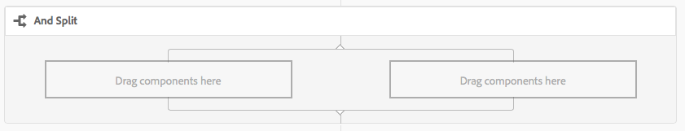

# Referência da Etapa do Fluxo de Trabalho{#workflow-step-reference}

Os modelos de fluxo de trabalho consistem em uma série de etapas de vários tipos. De acordo com o tipo, essas etapas podem ser configuradas e estendidas com parâmetros e scripts para fornecer a funcionalidade e o controle necessários.

>[!NOTE]
>
>Esta seção aborda as etapas padrão do Fluxo de trabalho.
>
>Para ver as etapas específicas do módulo, consulte também:
>
>* [Referência da etapa do AEM Forms Workflow](/help/forms/using/aem-forms-workflow-step-reference.md)
>* [Processando ativos usando manipuladores de mídia e fluxos de trabalho](/help/assets/media-handlers.md)

>


## Propriedades da etapa {#step-properties}

Cada componente de etapa tem uma caixa de diálogo Propriedades **[!UICONTROL da]** etapa que permite definir e editar as propriedades necessárias.

### Propriedades da etapa - guia Comum {#step-properties-common-tab}

Uma combinação das seguintes propriedades está disponível para a maioria dos componentes da etapa do fluxo de trabalho, na guia **[!UICONTROL Comum]** da caixa de diálogo de propriedades:

* **[!UICONTROL Título]**

   O título da etapa.

* **[!UICONTROL Descrição]**

   Uma descrição da etapa.

* **[!UICONTROL Estágio do fluxo de trabalho]**

   Um seletor suspenso para aplicar um [Palco](/help/sites-developing/workflows.md#workflow-stages) à etapa.

* **[!UICONTROL Tempo limite]**

   O período após o qual a etapa será &quot;atingida&quot;.

   Você pode selecionar entre: **[!UICONTROL Desligado]**, **[!UICONTROL Imediato]**, **[!UICONTROL 1h]**, **[!UICONTROL 6h]**, **[!UICONTROL 12h]**, **** 24h.

* **[!UICONTROL Tempo limite do Handler]**

   O manipulador que controlará o fluxo de trabalho quando a etapa expirar; por exemplo:

   `Auto Advancer`

* **[!UICONTROL Handler avançado]**

   Selecione essa opção para avançar automaticamente o fluxo de trabalho para a próxima etapa após a execução. Se não estiver selecionado, o script de implementação deve lidar com a evolução do fluxo de trabalho.

#### Propriedades da etapa - guia Usuário/grupo {#step-properties-user-group-tab}

As seguintes propriedades estão disponíveis para vários componentes de etapa do fluxo de trabalho, na guia **[!UICONTROL Usuário/Grupo]** da caixa de diálogo de propriedades:

* **[!UICONTROL Notificar usuário via e-mail]**

   * Você pode notificar os participantes enviando-lhes um email quando o fluxo de trabalho chegar à etapa.
   * Se ativado, um email será enviado para o usuário definido pela propriedade **[!UICONTROL Usuário/Grupo]** ou para cada membro do grupo, se um grupo for definido.

* **[!UICONTROL Usuário/Grupo]**

   * Uma caixa de seleção suspensa permitirá que você navegue e selecione um usuário ou grupo.
   * Se você atribuir a etapa a um usuário específico, somente esse usuário poderá executar uma ação na etapa.
   * Se você atribuir a etapa a um grupo inteiro, então quando o fluxo de trabalho atingir essa etapa, todos os usuários desse grupo terão a ação em sua Caixa de entrada **[!UICONTROL de fluxo de trabalho]**.
   * Consulte [Participação em Workflows](/help/sites-authoring/workflows-participating.md) para obter mais informações.

## E dividir {#and-split}

A divisão **[!UICONTROL AND]** cria uma divisão no fluxo de trabalho, após a qual ambas as ramificações estarão ativas. Você adiciona etapas de fluxo de trabalho a cada ramificação, conforme necessário. Essa etapa permite que você introduza vários caminhos de processamento no fluxo de trabalho. Por exemplo, você pode permitir que determinadas etapas de revisão ocorram em paralelo, economizando tempo.



### E dividir - Configuração {#and-split-configuration}

* Edite as propriedades **[!UICONTROL E dividir]** :

   * **[!UICONTROL Nome]** da divisão: Atribuir uma denominação para fins explicativos.
   * Selecionar o número de ramificações necessárias; 2, 3, 4 ou 5.

* Adicione as etapas do fluxo de trabalho às ramificações, conforme necessário.

   

## Etapa do contêiner {#container-step}

Uma etapa do **[!UICONTROL Container]** start outro modelo de fluxo de trabalho que é executado como um fluxo de trabalho filho.

Esse **[!UICONTROL Container]** permite reutilizar modelos de fluxo de trabalho para implementar sequências comuns de etapas. Por exemplo, um modelo de fluxo de trabalho de tradução poderia ser usado em vários workflows de edição.


### Etapa do container - Configuração {#container-step-configuration}

Para configurar a etapa, edite e use as seguintes guias:

* [**[!UICONTROL Comum]**](#step-properties-common-tab)
* **[!UICONTROL Container]**

   * **[!UICONTROL Sub fluxo de trabalho]**: Selecione o fluxo de trabalho a ser start.

## Etapa Ir para {#goto-step}

A Etapa **** Ir para permite especificar a próxima etapa no modelo de fluxo de trabalho a ser executada, dependendo do resultado de um ECMAScript:

* `true`: A Etapa **[!UICONTROL Ir para]** é concluída e o motor de workflow executa a etapa especificada.

* `false`: A Etapa **[!UICONTROL Ir para]** é concluída e a lógica normal do roteamento determina a próxima etapa a ser executada.

A Etapa **** Ir para permite que você implemente estruturas de roteamento avançadas em seus modelos de fluxo de trabalho. Por exemplo, para implementar um loop, a Etapa **** Ir para pode ser definida para executar uma etapa anterior no fluxo de trabalho, com o script avaliando uma condição de loop.

### Etapa Ir para - Configuração {#goto-step-configuration}

Para configurar a etapa, edite e use as seguintes guias:

* [**[!UICONTROL Comum]**](#step-properties-common-tab)
* **[!UICONTROL Processo]**

   * **[!UICONTROL A etapa a ser acessada]**: Selecione a etapa a ser executada.
   * **[!UICONTROL Caminho]** do script: O caminho para o ECMAScript que determina se a Etapa **[!UICONTROL Ir para será executada]**.
   * **[!UICONTROL Script]**: O ECMAScript que determina se a Etapa **[!UICONTROL Ir para será executada]**.

>[!CAUTION]
>
>Especifique o Caminho **[!UICONTROL do]** Script ou o **[!UICONTROL Script]**. Ambas as opções não podem ser usadas ao mesmo tempo. Se você especificar valores para ambas as propriedades, a etapa usará o Caminho **** de script.

#### Simulação de um Loop for {#simulating-a-for-loop}

A simulação de um loop for requer a manutenção de uma contagem do número de iterações de loop que ocorreram:

* A contagem geralmente representa um índice de itens que são acionados no fluxo de trabalho.
* A contagem é avaliada como o critério de saída do loop.

Por exemplo, para implementar um fluxo de trabalho que executa uma ação em vários nós JCR, você pode usar um contador de loop como índice para os nós. Para persistir na contagem, armazene um `integer` valor no mapa de dados da instância do fluxo de trabalho. Use o script da Etapa **** Ir para incrementar a contagem, bem como para comparar a contagem com os critérios de saída.

```
function check(){
   var count=0;
   var keyname="loopcount"
   try{
      if (workflowData.getMetaDataMap().containsKey(keyname)){ 
        log.info("goto script: found loopcount key");
        count= parseInt(workflowData.getMetaDataMap().get(keyname))+1;
      } 
 
     workflowData.getMetaDataMap().put(keyname,count);
 
     }catch(err) {
         log.info(err.message);
         return false;
    }
   if (parseInt(count) <7){
       return true;
   } else {
      return false;
   }
}
```

## OU dividir {#or-split}

A divisão **[!UICONTROL OU]** cria uma divisão no fluxo de trabalho, após a qual apenas uma ramificação estará ativa. Esta etapa permite que você introduza caminhos de processamento condicional no seu fluxo de trabalho. Você adiciona etapas de fluxo de trabalho a cada ramificação, conforme necessário.

>[!NOTE]
>
>Para obter informações adicionais sobre como criar uma divisão OR, consulte: [https://helpx.adobe.com/experience-manager/using/aem64_workflow_servlet.html](https://helpx.adobe.com/experience-manager/using/aem64_workflow_servlet.html)


### OU Dividir - Configuração {#or-split-configuration}

* Edite as propriedades **[!UICONTROL OU Dividir]** :

   * **[!UICONTROL Comum]**

      * Selecionar o número de ramificações necessárias; 2, 3, 4 ou 5.
   * **[!UICONTROL Ramificação :*x*>]**

      * **[!UICONTROL Caminho]** do script: O caminho para um arquivo que contém o script.
      * **[!UICONTROL Script]**: Adicione o script na caixa.
      * **[!UICONTROL Rota]** padrão: A ramificação padrão é seguida quando várias ramificações são avaliadas como true. Você pode especificar somente uma ramificação como padrão.

   >[!NOTE]
   >
   >Há uma guia separada para cada ramificação:
   >
   >* O script de cada ramificação é avaliado um de cada vez.
   >* Os ramos são avaliados da esquerda para a direita.
   >* O primeiro script avaliado como true é executado.
   >* Se nenhuma ramificação for avaliada como true, o fluxo de trabalho não avançará.


   >[!CAUTION]
   >
   >Especifique o Caminho **[!UICONTROL do]** Script ou o **[!UICONTROL Script]**. Ambas as opções não podem ser usadas ao mesmo tempo. Se você especificar valores para ambas as propriedades, a etapa usará o Caminho **** de script.

   >[!NOTE]
   >
   >Consulte [Definição de uma regra para uma divisão](/help/sites-developing/workflows-models.md#example-defining-a-rule-for-an-or-split)OR.

* Adicione as etapas do fluxo de trabalho às ramificações, conforme necessário.

## Etapas e opções do participante {#participant-steps-and-choosers}

### Etapa do participante {#participant-step}

Uma Etapa **[!UICONTROL de]** participante permite que você atribua propriedade para uma ação específica. O fluxo de trabalho só continuará quando o usuário tiver confirmado manualmente a etapa. Isso é usado quando você deseja que alguém execute uma ação no fluxo de trabalho; por exemplo, uma etapa de revisão.

Embora não esteja diretamente relacionada, a autorização do utilizador deve ser considerada ao atribuir uma ação; o usuário deve ter acesso à página que é a carga do fluxo de trabalho.

#### Etapa do participante - Configuração {#participant-step-configuration}

Para configurar a etapa, edite e use as seguintes guias:

* [**[!UICONTROL Comum]**](#step-properties-common-tab)
* [**[!UICONTROL Usuário/Grupo]**](#step-properties-user-group-tab)

>[!NOTE]
>
>O iniciador do fluxo de trabalho é sempre notificado quando:
>
>* O fluxo de trabalho está concluído (concluído).
>* O fluxo de trabalho é abortado (encerrado).

>


>[!NOTE]
>
>Algumas propriedades precisam ser configuradas para habilitar notificações por email. Você também pode personalizar o modelo de e-mail ou adicionar um modelo de e-mail para um novo idioma. See [Configuring Email Notification](/help/sites-administering/notification.md) to configure email notifications in AEM.

### Etapa do participante do diálogo {#dialog-participant-step}

Use uma Etapa **[!UICONTROL Participante da]** caixa de diálogo para coletar informações do usuário ao qual o item de trabalho foi atribuído. Essa etapa é útil para coletar pequenas quantidades de dados que são usadas posteriormente no fluxo de trabalho.

Ao concluir a etapa, a caixa de diálogo **[!UICONTROL Concluir item]** de trabalho contém os campos que você define na caixa de diálogo. Os dados coletados nos campos são armazenados nos nós da carga do fluxo de trabalho. As etapas subsequentes do fluxo de trabalho podem ler o valor do repositório.

Para configurar a etapa, especifique o grupo ou usuário ao qual o item de trabalho será atribuído e o caminho para a caixa de diálogo.

#### Etapa do participante da caixa de diálogo - Configuração {#dialog-participant-step-configuration}

Para configurar a etapa, edite e use as seguintes guias:

* [**[!UICONTROL Comum]**](#step-properties-common-tab)
* [**[!UICONTROL Usuário/Grupo]**](#step-properties-user-group-tab)
* **[!UICONTROL Caixa de diálogo]**

   * **Caminho[!UICONTROL da caixa de diálogo**]: O caminho para o nó de diálogo da [caixa de diálogo criada](#dialog-participant-step-creating-a-dialog).

#### Etapa do participante da caixa de diálogo - Criar uma caixa de diálogo{#dialog-participant-step-creating-a-dialog}

Para criar uma caixa de diálogo:

* Decida onde os dados resultantes serão [armazenados na carga](#dialog-participant-step-storing-data-in-the-payload).
* [Definir a caixa de diálogo; isso inclui a definição dos campos usados para coletar (e salvar) os dados](#dialog-participant-step-dialog-definition).

#### Etapa do participante da caixa de diálogo - Armazenamento de dados na carga {#dialog-participant-step-storing-data-in-the-payload}

Você pode armazenar dados de widget na carga do fluxo de trabalho ou nos metadados do item de trabalho. O formato da `name` propriedade do nó do widget determina onde os dados são armazenados.

* **[!UICONTROL Armazenar dados com a carga]**

   * Para armazenar dados de widget como uma propriedade da carga do fluxo de trabalho, use o seguinte formato para o valor da propriedade name do nó do widget:

      `./jcr:content/nodename`

   * Os dados são armazenados na `nodename` propriedade do nó de carga. Se o nó não contiver essa propriedade, a propriedade será criada.
   * Quando armazenado com a carga, os usos subsequentes da caixa de diálogo com a mesma carga sobrescreve o valor da propriedade.

* **[!UICONTROL Armazenar dados com o item de trabalho]**

   * Para armazenar dados de widget como uma propriedade dos metadados de item de trabalho, use o seguinte formato para o valor da propriedade name:

      `nodename`

   * Os dados são armazenados na `nodename` propriedade do item de trabalho `metadata`. Os dados são preservados se a caixa de diálogo for usada subsequentemente com a mesma carga.

#### Etapa do participante da caixa de diálogo - Definição da caixa de diálogo {#dialog-participant-step-dialog-definition}

1. **[!UICONTROL Estrutura de diálogo]**

   As caixas de diálogo para Etapas do participante da caixa de diálogo são semelhantes às caixas de diálogo criadas para componentes de criação. São armazenados em:

   `/apps/myapp/workflow/dialogs`

   As caixas de diálogo para a interface de usuário padrão e habilitada para toque têm a seguinte estrutura de nó:

   ```xml
   newComponent (cq:Component)
     |- cq:dialog (nt:unstructured)
       |- content 
         |- layout 
           |- items 
             |- column 
               |- items 
                 |- component0
                 |- component1
                 |- ...
   ```

   >[!NOTE]
   >
   >Para obter mais informações, consulte [Criação e configuração de uma caixa de diálogo](/help/sites-developing/developing-components.md#creating-and-configuring-a-dialog).

1. **[!UICONTROL Propriedade do caminho de diálogo]**

   A Etapa **[!UICONTROL Participante da]** caixa de diálogo tem a propriedade Caminho **[!UICONTROL da]** caixa de diálogo (juntamente com as propriedades de uma Etapa [](#participant-step)Participante). O valor da propriedade Caminho **[!UICONTROL da]** caixa de diálogo é o caminho para o `dialog` nó da caixa de diálogo.

   Por exemplo, a caixa de diálogo está contida em um componente chamado `EmailWatch` que está armazenado no nó:

   `/apps/myapp/workflows/dialogs`

   Para a interface habilitada para toque, o seguinte valor é usado para a propriedade Caminho **[!UICONTROL da]** caixa de diálogo:

   `/apps/myapp/workflow/dialogs/EmailWatch/cq:dialog`

   

1. **Exemplo de definição de caixa de diálogo**

   O trecho de código XML a seguir representa uma caixa de diálogo que armazena um `String` valor no `watchEmail` nó do conteúdo da carga. O nó de título representa o componente [TextField](https://helpx.adobe.com/experience-manager/6-4/sites/developing/using/reference-materials/granite-ui/api/jcr_root/libs/granite/ui/components/coral/foundation/form/textfield/index.html) :

   ```xml
   jcr:primaryType="nt:unstructured" 
       jcr:title="Watcher Email Address Dialog" 
       sling:resourceType="cq/gui/components/authoring/dialog">
       <content jcr:primaryType="nt:unstructured"
           sling:resourceType="granite/ui/components/foundation/container">
           <layout jcr:primaryType="nt:unstructured" 
               margin="false" 
               sling:resourceType="granite/ui/components/foundation/layouts/fixedcolumns"
           />
           <items jcr:primaryType="nt:unstructured">
               <column jcr:primaryType="nt:unstructured"
                   sling:resourceType="granite/ui/components/foundation/container">
                   <items jcr:primaryType="nt:unstructured">
                       <title jcr:primaryType="nt:unstructured" 
                           fieldLabel="Notification Email Address" 
                           name="./jcr:content/watchEmails"
                           sling:resourceType="granite/ui/components/foundation/form/textfield"
                       />
                   </items>
               </column>
           </items>
       </content>
   </cq:dialog>
   ```

   Esse exemplo resultará em uma caixa de diálogo, como:

   

### Etapa dinâmica do participante {#dynamic-participant-step}

O componente Etapa **[!UICONTROL dinâmica do participante é semelhante à Etapa]** do **** participante com a diferença de que o participante é selecionado automaticamente em tempo de execução.

Para configurar a etapa, selecione um Seletor **[!UICONTROL de]** participantes que identifique o participante ao qual atribuir o item de trabalho, juntamente com uma caixa de diálogo.

#### Etapa dinâmica do participante - Configuração {#dynamic-participant-step-configuration}

Para configurar a etapa, edite e use as seguintes guias:

* [**[!UICONTROL Comum]**](#step-properties-common-tab)
* **[!UICONTROL Seletor de participantes]**

   * **[!UICONTROL Seletor]** de participantes: O nome do seletor de [participantes criado](#dynamic-participant-step-developing-the-participant-chooser).
   * **[!UICONTROL Argumentos]**: Quaisquer argumentos necessários.
   * **[!UICONTROL Email]**: Se uma notificação por email deve ser enviada ao usuário.

* **[!UICONTROL Caixa de diálogo]**

   * **[!UICONTROL Caminho]** da caixa de diálogo: O caminho para o nó de diálogo da [caixa de diálogo criada (como na Etapa **Participante da** caixa de diálogo)](#dialog-participant-step-creating-a-dialog).

#### Etapa dinâmica do participante - Desenvolvimento do seletor de participantes {#dynamic-participant-step-developing-the-participant-chooser}

Crie o seletor de participantes. Portanto, você pode usar qualquer lógica ou critério de seleção. Por exemplo, o selecionador de participantes pode selecionar o usuário (dentro de um grupo) que tem menos itens de trabalho. Você pode criar qualquer número de selecionadores de participantes para usar com diferentes instâncias do componente Etapa **do participante** dinâmico em seus modelos de fluxo de trabalho.

Crie um serviço OSGi ou um ECMAScript que selecione um usuário ao qual atribuir o item de trabalho.

* **[!UICONTROL ECMAscript]**

   Os scripts devem incluir uma função chamada getParticipant que retorna uma ID de usuário como um `String` valor. Armazene seus scripts personalizados em, por exemplo, a `/apps/myapp/workflow/scripts` pasta ou uma subpasta.

   Um script de amostra é incluído em uma instância AEM padrão:

   `/libs/workflow/scripts/initiator-participant-chooser.ecma`

   >[!CAUTION]
   >
   >Você não *deve* alterar nada no `/libs` caminho.
   >
   >
   >Isso ocorre porque o conteúdo do é substituído na próxima vez que você atualizar sua instância (e pode ser substituído quando você aplicar uma correção ou um pacote de recursos). `/libs`

   Este script seleciona o iniciador do fluxo de trabalho como participante:

   ```
   function getParticipant() {
       return workItem.getWorkflow().getInitiator();
   }
   ```

   >[!NOTE]
   >
   >O componente Seletor **[!UICONTROL de Participantes do Iniciador de]** Fluxo de Trabalho estende a Etapa **[!UICONTROL de Participante]** Dinâmico e usa esse script como a implementação da etapa.

* **[!UICONTROL Serviço OSGi]**

   Os serviços devem implementar a interface [com.day.cq.workflow.exec.ParticipantStepChooser](https://helpx.adobe.com/experience-manager/6-4/sites/developing/using/reference-materials/javadoc/com/day/cq/workflow/exec/ParticipantStepChooser.html) . A interface define os seguintes membros:

   * `SERVICE_PROPERTY_LABEL` campo: Use esse campo para especificar o nome do seletor de participantes. O nome aparece em uma lista de selecionadores de participantes disponíveis nas propriedades Etapa **** dinâmica do participante.
   * `getParticipant` método: Retorna a ID Principal dinamicamente resolvida como um `String` valor.

   >[!CAUTION]
   >
   >O `getParticipant` método retorna a ID Principal dinamicamente resolvida. Isso pode ser uma ID de grupo ou de usuário.
   >
   >
   >No entanto, uma ID de grupo só pode ser usada para uma Etapa **[!UICONTROL de]** participante, quando uma lista de participantes for retornada. Para uma Etapa **[!UICONTROL de participante]** dinâmico, uma lista vazia é retornada e não pode ser usada para delegação.

   Para disponibilizar sua implementação para os componentes Etapa **[!UICONTROL do participante]** dinâmico, adicione sua classe Java a um pacote OSGi que exporta o serviço e implante o pacote no servidor AEM.

   >[!NOTE]
   >
   >**[!UICONTROL O Seletor]** de Participantes Aleatórios é um serviço de exemplo que seleciona um usuário aleatório ( `com.day.cq.workflow.impl.process.RandomParticipantChooser`). A amostra do componente de etapa do Seletor **[!UICONTROL de Participantes]** Aleatórios estende a Etapa **[!UICONTROL de Participantes]** Dinâmicos e usa esse serviço como a implementação da etapa.

#### Etapa dinâmica do participante - Exemplo de serviço do seletor de participantes {#dynamic-participant-step-example-participant-chooser-service}

A classe Java a seguir implementa a `ParticipantStepChooser` interface. A classe retorna o nome do participante que iniciou o fluxo de trabalho. O código usa a mesma lógica que o script de amostra ( `initator-participant-chooser.ecma`) usa.

A `@Property` anotação define o valor do `SERVICE_PROPERTY_LABEL` campo como `Workflow Initiator Participant Chooser`.

```java
package com.adobe.example;

import org.apache.felix.scr.annotations.Component;
import org.apache.felix.scr.annotations.Properties;
import org.apache.felix.scr.annotations.Property;
import org.apache.felix.scr.annotations.Service;
import org.osgi.framework.Constants;
import org.slf4j.Logger;
import org.slf4j.LoggerFactory;

import com.adobe.granite.workflow.WorkflowException;
import com.adobe.granite.workflow.WorkflowSession;
import com.adobe.granite.workflow.exec.ParticipantStepChooser;
import com.adobe.granite.workflow.exec.WorkItem;
import com.adobe.granite.workflow.metadata.MetaDataMap;

@Component
@Service
@Properties({
        @Property(name = Constants.SERVICE_DESCRIPTION, value = "An example implementation of a dynamic participant chooser."),
        @Property(name = ParticipantStepChooser.SERVICE_PROPERTY_LABEL, value = "Workflow Initiator Participant Chooser (service)") })
public class InitiatorParticipantChooser implements ParticipantStepChooser {

 private Logger logger = LoggerFactory.getLogger(this.getClass());

 public String getParticipant(WorkItem arg0, WorkflowSession arg1,
   MetaDataMap arg2) throws WorkflowException {

  String initiator = arg0.getWorkflow().getInitiator();
  logger.info("Assigning Dynamic Participant Step work item to {}",initiator);

  return initiator;
 }
}
```

Na caixa de diálogo de propriedades Etapa **[!UICONTROL dinâmica do participante, a lista Seletor]** de **[!UICONTROL participantes inclui o item]** `Workflow Initiator Participant Chooser (script)`, que representa esse serviço.

&quot;Quando o modelo de fluxo de trabalho é iniciado, o registro indica a ID do usuário que iniciou o fluxo de trabalho e quem recebeu o item de trabalho. Neste exemplo, o `admin` usuário iniciou o fluxo de trabalho.

`13.09.2015 15:48:53.037 *INFO* [10.176.129.223 [1347565733037] POST /etc/workflow/instances HTTP/1.1] com.adobe.example.InitiatorParticipantChooser Assigning Dynamic Participant Step work item to admin`

### Etapa de participante do formulário {#form-participant-step}

A Etapa **[!UICONTROL Participante do]** formulário apresenta um formulário quando o item de trabalho é aberto. Quando o usuário preenche e envia o formulário, os dados do campo são armazenados nos nós da carga do fluxo de trabalho.

Para configurar a etapa, especifique o grupo ou usuário ao qual o item de trabalho será atribuído e o caminho para o formulário.

>[!CAUTION]
>
>Esta seção trata da seção [Forms de Componentes básicos para criação](/help/sites-authoring/default-components-foundation.md#form)de página.

#### Etapa do participante do formulário - Configuração {#form-participant-step-configuration}

Para configurar a etapa, edite e use as seguintes guias:

* [**[!UICONTROL Comum]**](#step-properties-common-tab)
* [**[!UICONTROL Usuário/Grupo]**](#step-properties-user-group-tab)
* **[!UICONTROL Formulário]**

   * **[!UICONTROL Caminho]** do formulário: O caminho para o [formulário criado](#form-participant-step-creating-the-form).

#### Etapa do participante do formulário - Criação do formulário {#form-participant-step-creating-the-form}

Crie um formulário para uso com uma Etapa **[!UICONTROL de participante de]** formulário como normal. No entanto, os formulários para uma Etapa do participante do formulário devem ter as seguintes configurações:

* O **[!UICONTROL Start do componente Form]** deve ter a propriedade Tipo **[!UICONTROL de]** ação definida como `Edit Workflow Controlled Resource(s)`.

* O **[!UICONTROL Start do componente Form]** deve ter um valor para a `Form Identifier` propriedade.

* Os componentes do formulário devem ter a propriedade Nome **do** elemento definida como o caminho do nó onde os dados do campo são armazenados. O caminho deve localizar um nó no conteúdo de carga do fluxo de trabalho. O valor usa o seguinte formato:

   `./jcr:content/path_to_node`

* O formulário deve incluir um componente Botões de envio de **[!UICONTROL fluxo de trabalho]** . Você não configura nenhuma propriedade do componente.

Os requisitos do seu fluxo de trabalho determinam onde você deve armazenar dados de campo. Por exemplo, dados de campo podem ser usados para configurar as propriedades do conteúdo da página. O seguinte valor de uma propriedade Nome **[!UICONTROL de]** elemento armazena dados de campo como o valor da `redirectTarget` propriedade do `jcr:content` nó:

`./jcr:content/redirectTarget`

No exemplo a seguir, os dados de campo são usados como conteúdo de um componente de **[!UICONTROL Texto]** na página de carga:

`./jcr:content/par/text_3/text`

&quot;O primeiro exemplo pode ser usado para qualquer página que o `cq:Page` componente renderizar. O segundo exemplo só pode ser usado quando a página de carga inclui um componente de **Texto** que tem uma ID de `text_3`.

O formulário pode ser localizado em qualquer lugar no repositório, no entanto, os usuários do fluxo de trabalho devem estar autorizados a ler o formulário.

### Seletor de participante aleatório {#random-participant-chooser}

A etapa Seletor de participantes **[!UICONTROL aleatórios]** é um seletor de participantes que atribui o item de trabalho gerado a um usuário que é selecionado aleatoriamente em uma lista.


#### Seletor de participantes aleatórios - Configuração {#random-participant-chooser-configuration}

Para configurar a etapa, edite e use as seguintes guias:

* [**[!UICONTROL Comum]**](#step-properties-common-tab)
* **[!UICONTROL Argumentos]**

   * **[!UICONTROL Participantes]**: Especifica a lista de usuários disponíveis para seleção. Para adicionar um usuário à lista, clique em **[!UICONTROL Adicionar item]** e digite o caminho inicial do nó do usuário ou a ID do usuário. A ordem dos usuários não afeta a probabilidade de serem atribuídos a um item de trabalho.

### Seletor do participante iniciador do fluxo de trabalho {#workflow-initiator-participant-chooser}

A etapa do Seletor **[!UICONTROL de Participantes do Iniciador de]** Fluxo de Trabalho é um selecionador de participantes que atribui o item de trabalho gerado ao usuário que iniciou o fluxo de trabalho. Não há propriedades para configurar além das propriedades **[!UICONTROL Comuns]** .

#### Workflow Initiator Participant Chooser - Configuration {#workflow-initiator-participant-chooser-configuration}

Para configurar a etapa, edite usando as seguintes guias:

* [**[!UICONTROL Comum]**](#step-properties-common-tab)

## Etapa do processo {#process-step}

Uma Etapa **[!UICONTROL do]** processo executa um ECMAScript ou chama um serviço OSGi para executar processamento automático.


### Etapa do processo - Configuração {#process-step-configuration}

Para configurar a etapa, edite e use as seguintes guias:

* [**[!UICONTROL Comum]**](#step-properties-common-tab)
* **[!UICONTROL Processo]**

   * **[!UICONTROL Processo]**: A implementação do processo a ser executada. Use o menu suspenso para selecionar o serviço ECMAScript ou OSGi. Para obter informações sobre:

      * Os serviços ECMAScripts e OSGi padrão, consulte Processos [incorporados para etapas](/help/sites-developing/workflows-process-ref.md)do processo.
      * Criação de ECMAScripts para uma etapa **[!UICONTROL do Processo]** , consulte [Implementação de uma Etapa do Processo com um ECMAScript](/help/sites-developing/workflows-customizing-extending.md#using-ecmascript).
      * Criação de serviços OSGi para uma etapa do **[!UICONTROL Processo]** , consulte [Implementação de uma etapa do processo com uma classe](/help/sites-developing/workflows-customizing-extending.md#implementing-a-process-step-with-a-java-class)Java.
   * **[!UICONTROL Avanço]** do manipulador: Selecione essa opção para avançar automaticamente o fluxo de trabalho para a próxima etapa após a execução. Se não estiver selecionado, o script de implementação deve lidar com a evolução do fluxo de trabalho.
   * **[!UICONTROL Argumentos]**: Argumentos a serem passados para o processo.


